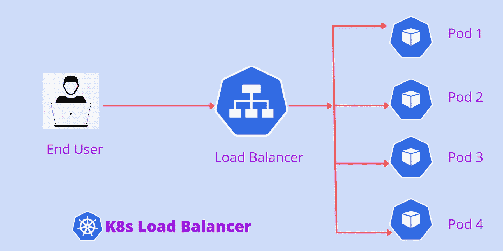

# 使用负载平衡器服务从外部访问 Kubernetes 集群中的应用程序

> 原文：<https://medium.com/codex/access-application-externally-in-kubernetes-cluster-using-load-balancer-service-d1b7858d51?source=collection_archive---------2----------------------->

## 了解如何创建 Pod 以及如何使用 Kubernetes 集群创建负载平衡器服务。并从外部访问应用程序。

K8s 负载平衡器

我们可以将 Docker 映像部署到 **Kubernetes** 集群。集装箱在库本内特斯的一个豆荚里运行…