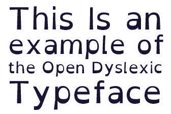
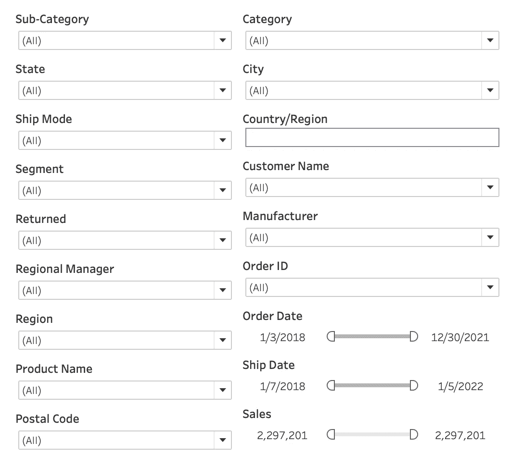
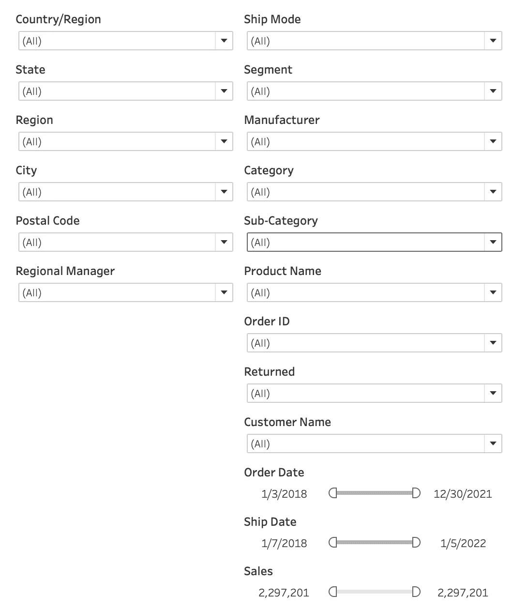
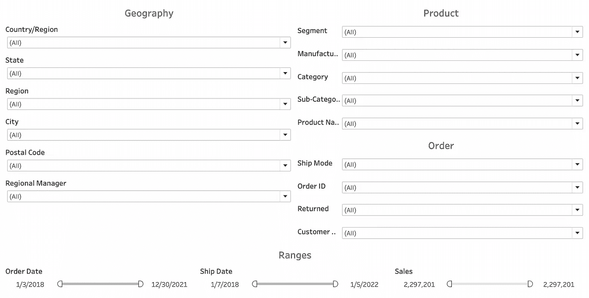
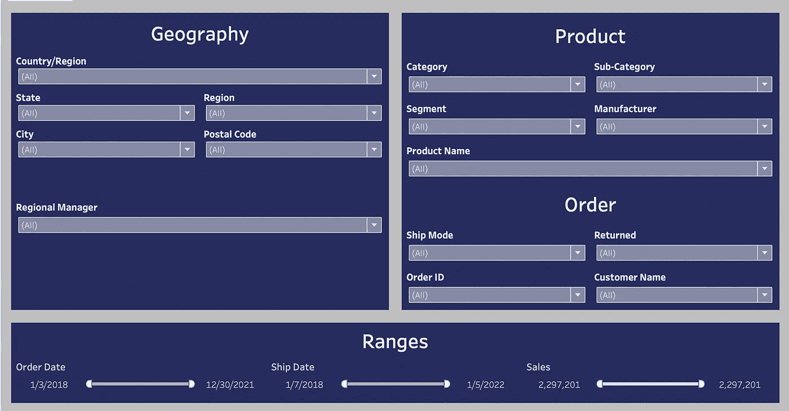
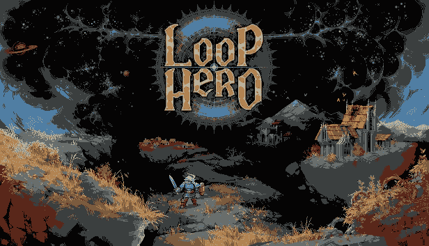
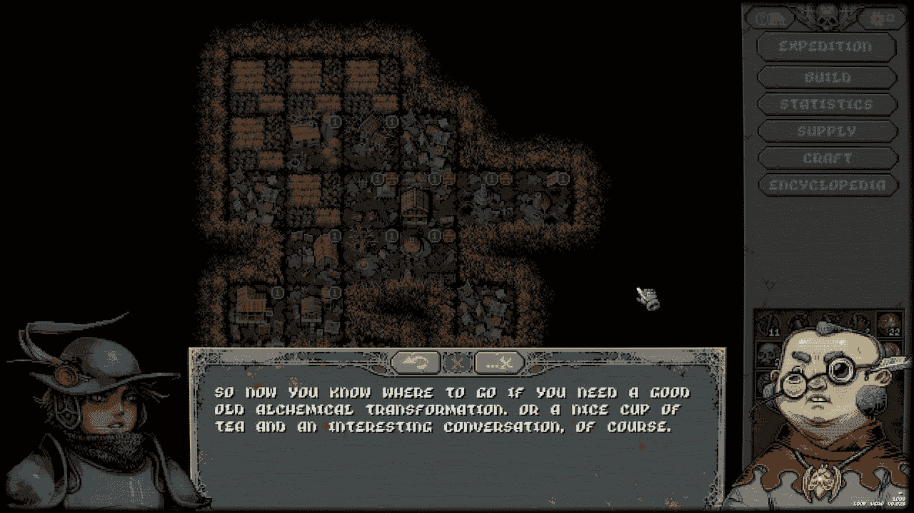
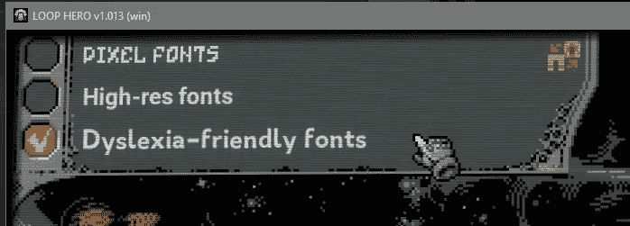

# 可访问性、字体和阅读障碍

> 原文：<https://medium.com/codex/accessibility-fonts-and-dyslexia-3cc495795127?source=collection_archive---------23----------------------->

昨天我在推特上滚动，看到我的几个 Tableau 开发者朋友在讨论字体选择和阅读障碍。总的来说，一个开发人员想发布一个有 24 个过滤器的登陆页面，一个有阅读障碍的客户表达了使用上的困难。我决定这是一个插话提供帮助的好机会……并写一个快速博客来记录一些最佳实践，供其他人参考。

在继续之前，有一些快速的警告:

1.  我没有被诊断为诵读困难。我一直怀疑我有，我有多动症的诊断，他们有很高的共病率(意味着他们经常一起出现)。接受测试相当昂贵，鉴于我适应周围世界的能力，考虑到成本，正式的诊断没有太大价值。
2.  阅读障碍和其他神经分歧状况是谱系障碍，这意味着，与病理性障碍不同，患有相同疾病的人可能会经历非常不同的挑战。简而言之，没有单一的、统一的诵读困难症、ADHD 或 ASD 体验，而是无数的具有共同主线的变体。
3.  我不是无障碍专家。我将谈谈我的个人经验和其他专业人士的一些资源，但我也认识到，为适应一个群体而做出的改变可能会引起另一个群体的冲突。因此，一个很好的经验法则是将可访问性作为一个特性来构建，而不是事后的想法或权宜之计——稍后会详细介绍。

# 阅读障碍基础

难语症较少出现在颠倒单词(狗对上帝)的问题中，更多的是一种处理书面语言的一般冲突。原因还不是很清楚，但是许多患有诵读困难症的人都有共同的经历:

*   交换相似形状的字母(d 对 b)
*   当单词以同一个字母开始和结束时，它们会碰到一起(“简单史诗”变成了“简单史诗”)
*   单词似乎在页面上移动(看看这个极端阅读障碍的例子)
*   列表、数字、序列和其他信息阵列会变得容易混淆和混乱
*   混乱的方向(左右、上下、前后)
*   无序阅读单词，跳过段落，重读同一个句子，一般阅读记忆

# 阅读障碍友好字体

马上，圣衬线字体是一个伟大的方式来帮助那些有阅读障碍的人！衬线是赋予字体风格的轻微笔触或曲线。你最有可能在 Medium 的正文字体中读到这篇文章，这是一种衬线字体。不过这部分的页眉是 Medium 的 san serif 字体(意思是没有 serif)。只要字体不太拥挤，San 衬线可以在字母之间创造更多的视觉分离。草书对于诵读困难者来说是一种众所周知的具有挑战性的风格，印刷中 serfis 的加入唤起了草书字体风格的历史。这里有一个来自 Adobe 的例子:

左边是 San Serif 字体，右边是 Serif 字体

幸运的是，几乎每个应用程序都有很棒的 san serif 字体。[此链接](https://www.extensis.com/blog/whats-the-best-font-for-people-with-dyslexia)有一些很棒的选项，但以下是一些最常见的:

*   Helvetica
*   韦尔达纳
*   天线
*   世纪哥特式
*   前面有突出的护架
*   投石机

几乎所有这些在所有主要的操作系统、浏览器和应用程序中都非常普遍。你可以做得更进一步，使用来自[开放阅读障碍](https://opendyslexic.org/)的开源阅读障碍字体:

字母内部的移动产生了一个重底轻顶，极大地提高了可读性。一会儿我将展示一个在实际应用中使用这种字体的例子。

# 阅读障碍友好设计

信息学，或者说信息设计的研究，关注的是用视觉来展示和交流数据的最佳方式。信息学原理通常服务于日常用户的最佳利益，也解决可访问性问题。让我们从我创建的过滤器墙开始:

在信息设计中，我建议的第一步是将“相似”的东西归入相同的空间。在本例中，我对控制相似元素的过滤器进行了分组。我还通过使一根比另一根长，在两根柱子之间创造了一些视觉分离:

接下来，我为信息创建了一些标题和部分:

最后，我进一步组织了一切，创建了一些“卡片”来增加视觉分离，加粗了标题，并用颜色来增加可见性:

我还可以做更多的事情来让用户感觉更好，改善显示“All”的各种下拉菜单的视觉单调感:

*   几个下拉菜单是特定元素的单一选择(单选按钮的良好用例)
*   国家可以变成一个六边形地图
*   高基数字段可以成为通配符文本搜索
*   滑块可能应该改变成不同的风格
*   可以在整个仪表板上增加字体大小

# 无障碍支持作为一项功能

前一节介绍了如何为阅读障碍做好设计，但是可能会有这样的情况，无障碍设计迫使你做出破坏或压迫你的产品的设计选择。再说一次，我不是无障碍设计方面的专家，但是去年我第一次体验到了一个为阅读障碍者提供支持功能的产品！2021 年初，我拿起了俄罗斯制造的复古风格像素艺术游戏 Loop Hero。

当我第一次开始游戏时，我注意到我在阅读游戏中的字体时有一段可怕的时间:

幸运的是，循环英雄有一个阅读障碍友好的游戏内字体切换。

这是我第一次体验应用内服务切换到可读字体，改善了我的体验。该功能不会影响其他用户的游戏体验，虽然它打破了经典复古风格游戏的沉浸感，但它极大地提高了我享受游戏的能力。这个看似很小的功能不仅让我觉得被看到了，被欣赏了，还极大地提高了我享受游戏的能力。

# 为所有人设计

当我们为他人构建解决方案时，不管使用什么平台或工具，作为创建者和开发者，我们有责任确保我们支持尽可能多的人。尽最大努力确保可访问性融入我们的设计流程，确保更多的人被包含、看到、欣赏和支持。

我希望这能帮助你下次开始一个新的设计，并对一些阅读障碍友好的设计选择有所启发。