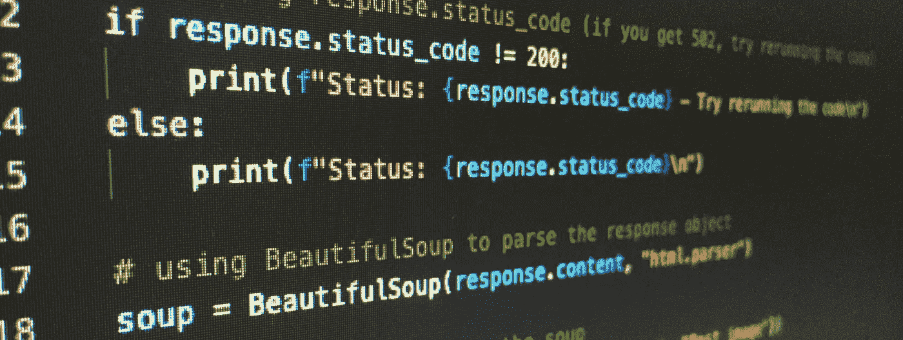

# 在一行代码中实现 99.8%以上的性能提升

> 原文：<https://medium.com/codex/achieve-performance-improvements-of-99-8-in-1-line-of-code-ffe44bdbf743?source=collection_archive---------23----------------------->

## 这就是你一直在寻找的文章



Artturi Jalli 在 [Unsplash](https://unsplash.com/s/photos/code-python?utm_source=unsplash&utm_medium=referral&utm_content=creditCopyText) 上拍摄的照片

对于循环来说，是你的首选编码方案吗？你有运行时间慢和长代码块吗？你知道有一个更好的方法，但你没有时间去学习或思考它吗？

> “不修不成器”可以长期有效。

但是如果我告诉你至少有一个更好的方法，而且这个方法非常简单，你不能错过它，那会怎么样？

# 请继续阅读。

*告诫*:我第一个承认自己是初学者+编码者；因此，如果下面的内容让你畏缩，那么这篇文章可能不适合你。但我认为有很多人和我一样，特别是随着大规模转向技术，特别是随着女性承担技术角色的势头。我在谷歌上搜索了很长时间，试图找到一种更快捷的方式来解决我的问题——我希望用这个**非常有价值的**花絮来帮助处于我这个位置的人！

我最初是这样处理这个问题的:

```
df.shape
```

>> (30000 , 150)

不是很大的数据帧，但也不小。仅足以导致以下代码块的运行时间变慢:

```
#create a new column for encoding with dtype 'str'
df['X'] = 'str'# populate new column X based off of values in column Y
for i in range(len(df.Y)):
    if (df.Y.iloc[i] == 1) | (df.Y.iloc[i] == 2) | (df.Y.iloc[i] == 3):
        df[‘X’].iloc[i] = ‘str1'
    elif (df.Y.iloc[i] == 4) | (df.Y.iloc[i] == 5) | (df.Y.iloc[i] == 6):
        df[‘X’].iloc[i] = ‘str2'
    else:
        df[‘X’].iloc[i] = ‘str3'
```

这总共用了 216 秒来执行。这听起来可能不多，但在这个笔记本中，有许多代码块要执行，许多迭代要调试，许多反馈和改进周期。因此，每一秒都很重要，特别是在那天晚些时候，我的计算机开始变慢，这是迄今为止执行最慢的代码块。

# 🚀矢量化运算

然后我就开窍了💡用此[方法](https://pandas.pydata.org/pandas-docs/stable/reference/api/pandas.DataFrame.loc.html)代替:

## 💥df.loc[(df['col'] ==条件)，'要更改的列'] =更改💥

```
#create a new column for encoding with dtype 'str'
df['X'] = 'str'# populate new column X based off of values in column Y
df.loc[(df['Y'] == 1) | (df['Y'] == 2)| (df['Y'] == 3), 'X'] = 'str1'
df.loc[(df['Y'] == 4) | (df['Y'] == 5)| (df['Y'] == 6), 'X'] = 'str2'
df.loc[(df['X'] != 'str1') | (df['X'] != 'str2'), 'X'] = 'str3'
```

这总共花费了 0.307 秒来执行。那就是性能提升了 **99.86%** ！我的意思是，我意识到我以前用的是超级笨拙的方式，但是如果没有人告诉我这些…

> 我怎样才能变得更好？

# 限制

*“‘***过早优化是万恶之源。”**程序员可能会错误地预测他们的代码中哪里会出现瓶颈，花费数小时试图完全矢量化一个操作，这将导致运行时相对无足轻重的改进。

到处撒点 for-loops 没什么不好。通常，在更高的抽象层次上考虑优化整个脚本的流程和结构会更有成效。”— [看马，没有 For 循环:用 NumPy 进行数组编程](https://realpython.com/numpy-array-programming/)

# 外卖食品

对我来说，这里有两个教训:

1.  矢量操作是在 python/pandas 中的数据帧中执行数据操作的更好方式，以便在 for 循环中执行 if/then/else 方法。
2.  **行动起来！**更资深的数据科学家和开发人员/编码人员——不要想当然地认为指导的小时刻可以提高初级人员的表现，以及这对他们意味着什么。如果你有知识和诀窍，分享它们吧！💜