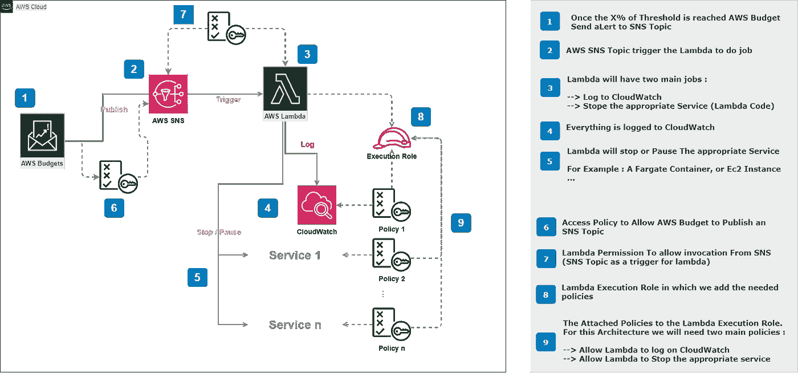
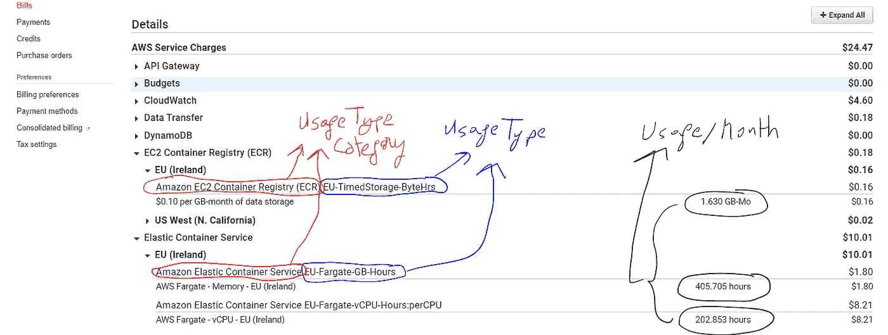

# ACO 架构:AWS 自动成本优化的 5 个技巧

> 原文：<https://medium.com/codex/aco-architecture-5-tips-to-auto-costoptimization-on-aws-67f026e3abcc?source=collection_archive---------18----------------------->

## 第 1 部分:ACO 架构

AACO—AWS 上的成本优化

我记得我在 AWS 的第一笔账单是 2016 年的 5 美元，我知道我有一年的免费期😠，我很震惊，因为我确定我只使用了免费服务中包含的服务。

然而，当我研究我的账单时，我发现我选择了**开发者支持**，并且不包括在免费层中😛。

> 结论:无知是昂贵的😲

AWS 上的预算是一个如此重要的方面，一个**架构师**必须负责。我们总是可以建议一个好看的架构，将微服务绑定到具有托管服务的无服务器等…💪

但是如果到了月底账单太高，我们就有问题了😅

架构良好的 AWS 基于五大支柱:卓越运营、安全性、可靠性、性能效率和**成本优化**。

我们将在这个故事中讨论第五个。

更多关于我的故事

 [## 纳乌法勒·GAFA-中等

### 作为一名软件架构师或全栈开发人员(有开发背景的人)，我总是害怕…

naoufal-gafa.medium.com](https://naoufal-gafa.medium.com/) 

# 成本优化

成本优化支柱侧重于避免不必要的成本。关键主题包括了解和控制资金的支出，选择最合适的资源类型，分析一段时间内的支出，以及在不超支的情况下进行扩展以满足业务需求。

AWS 已经制定了一份[白皮书](https://docs.aws.amazon.com/wellarchitected/latest/cost-optimization-pillar/cost-optimization.html)，对成本优化的最佳实践进行了分组，以帮助公司，但我会像往常一样让它变得简单，我会向您展示一些在您的不同服务中通过使用 **AWS 预算**、 **SNS 和 Lambda 实现 **ACO 架构(自动成本优化)**进行成本优化的技巧。**

> 如果你有一个**个人 AWS 账户**，这个提示会很有效。
> 
> 如果你属于 AWS 组织或者你是一家公司，它们是 FinOps 的其他高级工具

# 实现 ACO 架构的 5 个技巧:

ACO 架构基于一个简单的反射:

> **如果我的花费预算达到我的阈值的 X%,我将停止、暂停或其他适当的服务**👌**。**

你有两个选择:

*   **成本预算**:基于具体金额。(例如 20 美元)
*   **使用预算**:基于**服务使用**。(例如 Ec2 数据传输、ECS Fargat vCPU 小时数)

在这个故事中，我将关注**使用预算**

## I -抽象建筑:

抽象 ACO 架构

> **总结一下这个架构:**
> 
> 我**创建**一个**预算**在我**为我的**使用服务**定义**一个**阈值**到**发送**一个**提醒**到一个**特定的 SNS 主题**这将**触发**一个 **Lambda** 到——停止、暂停或者任何你想要的——**指定服务**。

## II - 5 实施技巧:

1.  参考您的 **M-1** (上月…)账单，了解您需要哪些服务来优化成本。
2.  从相关服务中提取**使用类型类别**、**使用类型**和**使用**，如下图所示(M-1 的**账单)。**“我们将在下一个故事中使用它”****
3.  创建**预算**并定义阈值——基于您的**使用类型&每月使用量**
4.  **向一个 **SNS 主题**发送预算提醒**，如果花费的预算达到**定义的阈值**的一个 **X%** 时，触发一个**λ**到**停止/暂停**你的**特定服务**
5.  将适当的**策略&权限**分配给 **Lambda & SNS 主题**

M-1 的账单

# 结论

如您所见，自动成本优化的基本实现并不复杂。您可以在您的个人项目中应用这种架构，以避免花费大量资金。

在下一篇文章中，我将通过制作一个 **Terraform 文件**来用 AWS 服务**“ECS Fargate 容器”**实现这个**抽象 ACO 架构**，您可以简单地根据自己的需要进行调整和使用。

对于那些还不知道如何用 Terraform 和 DevOps 自动化 AWS 架构的人，你可以参考我之前的故事:

 [## AWS S3M 模式:适用于 10 岁儿童的 Terraform 和 DevOps

### 第 2 部分:地形和开发

levelup.gitconnected.com](https://levelup.gitconnected.com/aws-s3m-pattern-terraform-devops-for-a-10-years-child-dac4610017ff) 

谢谢你阅读我的故事🙏

如果你喜欢，就分享吧😜如果您有任何意见，或者有什么不清楚的地方，请在我的 [Fb 页面](https://www.facebook.com/neogafa)、 [Twitter](https://twitter.com/NaoufalGafa) 或通过[我的网站](https://www.elgafa.com/)发表评论或联系我