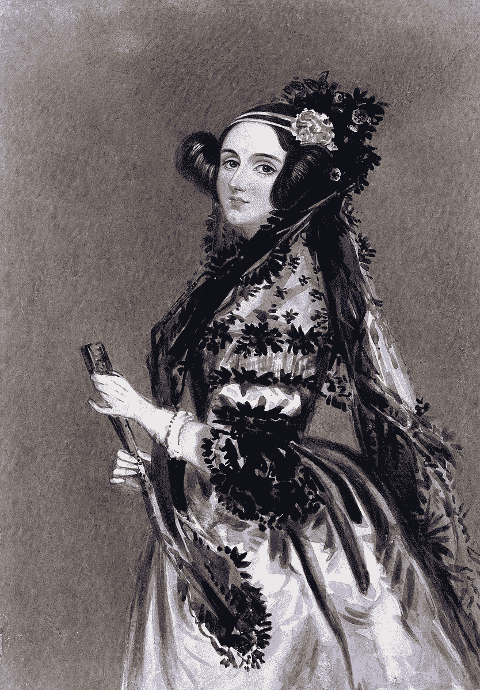

# 阿达·洛芙莱斯:世界上第一个程序员

> 原文：<https://medium.com/codex/ada-lovelace-the-worlds-first-programmer-31e5b2333db9?source=collection_archive---------4----------------------->

阿达·洛芙莱斯肖像|鸣谢:科学博物馆团体收藏

世界上第一个程序员阿达·洛芙莱斯生活在第一台数字计算机出现前的大约一个世纪。由英国人研制的世界上第一台电子计算机“巨像”出现在第二次世界大战期间。它帮助英国战时密码破译员破译了德国军队的高级信息。ENIAC(电子数字积分器和计算机)，由美国人开发，用于战时帮助，于 1946 年完成。第一台专用电子计算机阿塔纳索夫-贝里计算机(ABC)的生产比另外两台稍早一些。ABC 的发展发生在 1937-1942 年间，该过程因战争而中断。直到 1942 年，有一个小型的 ABC 原型，以二进制形式存储数据，并执行加法和减法。在此之前的一个世纪，阿达·洛芙莱斯已经做出了卓越的贡献。

阿达·洛芙莱斯出生于 1815 年，是一名数学家，他致力于研究被认为是世界上第一台计算机的分析引擎(查尔斯·巴贝奇的发明)。问题是，他们从未完成这个项目。但是，因为她的笔记描述了分析引擎的创新性潜在发展，她赢得了世界上第一个程序员的称号。她提到了一些想法，比如如何给机器编程来计算伯努利数。以及它如何在没有个人参与的情况下执行各种动作。她的同龄人都很尊敬她，她的创造力，以及她当时表达创新想法的能力。让我们进一步了解她:

# 阿达·洛芙莱斯简史

她原名奥古斯塔·爱达·拜伦和拜伦夫人，在一个不稳定的家庭环境中长大。她的母亲学习高等数学(在那个时代，这对女性来说很不寻常)。她的父亲拜伦是英国著名的浪漫主义诗人和讽刺作家(你可能知道他是《唐璜》的作者)。她的父母在她出生后不久就分居了，她的父亲离开了英国，她的母亲在 Ada 的教育中优先考虑数学。她很早就接受了私人教育，然后开始自学。她最亲密的导师之一是伦敦大学奥古斯都·德·摩根分校的第一位数学教授。

她的教育培养了她的分析能力，因为她的母亲想把她从父亲的创造性遗产中赶走。尽管如此，阿达·洛芙莱斯决定也追求文学和写作等主题，很快就对这些产生了热情。她广泛的兴趣和技能让她结交了各种各样的人，从科学家(如查尔斯·惠斯通)到作家(如 T2)查尔斯·狄更斯(T3)。由于她通过融合创造性和分析性的世界来挑战刻板印象，许多人将她的工作视为“诗意的科学”。换句话说，她是“第一个将计算机器的数学能力与运用想象力的符号逻辑的诗意可能性结合起来的人”([来源](https://www.themarginalian.org/2022/08/31/ada-lovelace-trinity/))。大约在 19 世纪 30 年代，她遇到了她未来的导师和同事，第一台自动数字计算机的发明者[查尔斯·巴贝奇](https://www.britannica.com/biography/Charles-Babbage)。

在合作开发分析引擎的同时，阿达·洛芙莱斯继续追求她对创新的热情。巴贝奇和其他著名的发明家都很崇拜她，也很欣赏她在数学世界之外的各种能力。除了学习诗歌和写作，她还喜欢弹竖琴和骑马。在一封写给迈克尔·法拉第的信中，巴贝奇将阿达描述为“那个对最抽象的科学施了魔法的女巫，她用一种几乎没有男性智力(至少在我们自己的国家)能够施加的力量抓住了它”([来源](https://www.sciencedirect.com/science/article/pii/S2666389920301598))。

# 那么，是什么让她成为世界第一程序员呢？

在去都灵推销分析引擎的途中，巴贝奇遇到了数学家 Luigi Federico Menabrea。他确信这台机器应该得到更多的关注，于是在一份瑞士学术期刊上发表了一篇 8000 字的论文。然后，阿达·洛芙莱斯把这篇论文翻译成英语。在翻译的同时，她还花时间添加了自己的注释。她版本的论文变大了三倍，包含了许多其他的想法和想法。在她的笔记中，她轻松地阐述了分析引擎的潜在发展，例如，提到机器可能会创作音乐。她创新的想象力和清晰表达想法的能力帮助她观察到“任何能够操纵数字的机器也能操纵符号”([来源](https://www.sciencedirect.com/science/article/pii/S2666389920301598))。

Ada 通过让她创新的想象力自由驰骋并轻松表达她的想法而得到了同龄人的认可。她预言“通用计算机的出现比它们被制造出来早了将近一百年。”([来源](https://pubsonline.informs.org/do/10.1287/LYTX.2017.01.06/full/))。正如佐伊·菲尔波特在[2016 年 tedx 布加勒斯特演讲](https://www.youtube.com/watch?v=1QQ3gWmd20s)中提到的，阿达意识到像分析引擎这样的机器将能够“成为人类想象力的工具”。遗憾的是，他们从未完成分析引擎的工作。该项目因查尔斯·巴贝奇去世(79 岁)而停止。由于艾达的早逝(37 岁)，他也在没有艾达的情况下工作了一段时间。但是，他们的贡献是计算机科学发展的关键时刻。毕竟，她的设想开启了关于机器的对话，这些机器可以计算结果，而不需要“首先由人类的头脑和双手来计算”。

# 最后的想法

阿达是一个鼓舞人心的人，他的思想和工作都超越了他们的时代。她的成就显示了当一个人专注于发展他们的创造力和分析能力时所释放的潜力。混合这两个不同但互补的世界，可以让人创新。如果你对她的笔记感到好奇，可以浏览一下查尔斯·巴贝奇发明的分析引擎的 [*草图……以及译者*](https://books.google.ro/books/about/Sketch_of_the_Analytical_Engine_invented.html?id=hPRmnQEACAAJ&redir_esc=y) 的笔记。为了庆祝她的成就，大约在七十年代末和八十年代初，美国国防部开发了一种用于大规模编程的计算机语言，称为 Ada。而且，你还可以[将它用于你的项目](https://hackaday.com/2019/09/10/why-ada-is-the-language-you-want-to-be-programming-your-systems-with/)。

她也有一个庆祝她的国际日——在十月的第二个星期二。而且，如果你想了解更多关于她的信息(并且你已经浏览了所有的共享资源)，请查看《纽约客》的这篇文章。也有几个播客在一集里报道了她的故事，比如《我们时代的或者《荒谬历史的。在这里，你可以找到牛津大学提到阿达·洛芙莱斯的播客列表。如果你想再看一集 TEDx，请看看这一集，Linda Liukas 在 TEDxCERN 谈论编程的诗意。