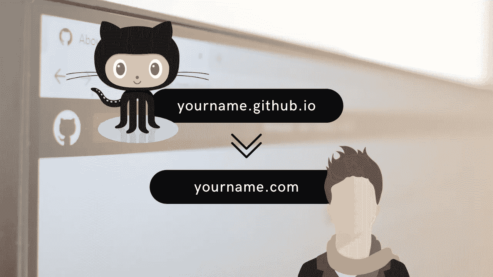

# 将自定义域添加到您的 GitHub Pages 个人网站

> 原文：<https://medium.com/codex/add-a-custom-domain-to-your-github-pages-personal-website-53ab40e7c7d0?source=collection_archive---------16----------------------->

## [法典](http://medium.com/codex)

## 使用 GitHub 页面和自定义域名免费托管您的网站

最近我开始写个人博客，因为我没有赚到钱，所以我不想为此付费。就这么简单。