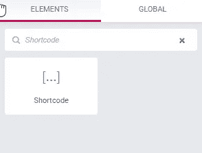
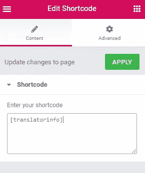
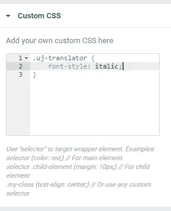

# 添加任何 WordPress 数据到元素或短代码

> 原文：<https://medium.com/codex/add-any-wordpress-data-to-elementor-with-shortcodes-f14c3a7f3081?source=collection_archive---------7----------------------->

## 试图向 Elementor 模板添加一段动态元数据？我将解释如何使用 WordPress shortcodes 快速简单地做到这一点。


图片:Scanrail / PIXTA

我是一个最近皈依 [Elementor](https://elementor.com/?ref=11725) ( *免责声明:Elementor 的链接是附属链接；如果你注册了一个计划，我就能赚到佣金。当我最初开始用它来构建登陆页面时，我很快意识到它是设计整个 WordPress 站点的一个极好的工具。我的大部分网站现在都是用 Elementor 运行的。*

然而，Elementor 也不是没有局限性。例如，您可以添加到单个帖子页面的数据可能有些有限。幸运的是，使用 WordPress shortcodes 和 Elementor shortcode 小部件，您可以快速方便地向 Elementor 页面添加几乎任何您需要的数据。

# 问题:添加特征图像标题和翻译数据

最近，当我为[的《看不见的日本》](https://unseenjapan.com/)创建了一个新的单独的帖子页面时，我意识到我认为很重要的两个东西不见了。第一个是特色图片标题。我用“看不见的日本”上的说明来识别特写图片的来源。这很重要，表明我们对使用的库存图像进行了适当的许可。然而，它也很重要，因为该网站委托定制艺术的一些文章。特写标题可以让我们给予插图画家适当的信任，并链接到他们的社交媒体账户。


我想在 Elementor 页面中添加动态数据的另一个原因是为了翻译。UJ 偶尔翻译日文作品。在这种情况下，它会将作者列为原作者——但我也想叫出译者，并认可他们的努力。


# 带短码的动态数据

幸运的是，添加这些并不需要太多的工作。诀窍是使用 [WordPress 短代码](https://codex.wordpress.org/Shortcode)。

WordPress 的死忠们知道短代码基本上是宏——一组括号之间的代码，传递零个或多个动态参数。短代码可以很容易地给 WordPress 的内容添加动态功能。

[Elementor 通常用在文章正文中，它也支持一个短代码小部件](https://docs.elementor.com/article/72-shortcode/?ref=11725)。这意味着我们可以将动态数据定义为短代码，并轻松地将它们添加到 Elementor 设计中！

# 定义短代码

让我们来看看实际情况。请随意在您自己的网站上尝试一下。

首先，让我们定义我们的第一个短代码——特色图片标题短代码。为此，我们将在 functions.php 文件中放置以下代码。(记住:如果您使用的是别人创建的模板，请先创建一个子主题。)

```
function site_get_feature_image_attribution() {
	return "<span class='uj-fi-attr'>" . get_post(get_post_thumbnail_id())->post_excerpt . "</span>";
}add_shortcode('fi_attr', 'site_get_feature_image_attribution');
```

这段代码非常简单。功能站点`_get_feature_image_attribution()`返回特色图片标题。如果代码看起来有点奇怪，请记住这是因为 **WordPress 将特征图片作为帖子存储在数据库**中。特写图片的标题存储为文章的摘录属性——因此调用了`get_post`和`post_excerpt`。

函数`add_shortcode()`为我们定义了短码。这里有两个参数:我们将在 Elementor 模板中使用的短代码的名称和我们刚刚定义的函数的名称。这告诉 WordPress 执行代码来评估短代码。

我们的第二个短代码稍微复杂一点，但是不多。对于翻译的帖子，我在帖子上定义了一个名为 translator_user 的自定义元数据元素。shortcode 检查 translator_user 是否在 post 上定义。如果是，它返回作者的名字和一个到他们作者页面的链接。

```
function site_get_translator_info() {
	$translator = get_post_meta( get_the_ID(), 'translator_user', true );
	if ($translator != "") {
		$userdata = get_user_by("login", $translator);
		return "<span class='uj-translator'>Translator: <a href='/author/" . $translator . "'>" . $userdata->display_name . "</a></span>";
	} 
}add_shortcode('translatorinfo', 'site_get_translator_info');
```

您会注意到，我将这两个元素包装在一个定义了 CSS 类的 span 中。这将让我将样式应用到 Elementor 中的元素。

# 向元素或模板添加短代码

现在是简单的部分:向模板添加短代码。在 Elementor 编辑器中，在 Elements 中搜索“shortcode”。



将其拖放到所需的位置。然后，在**编辑短代码**中，添加短代码的名称。确保包括括号。然后，点击**应用**按钮。



Elementor 将刷新页面，您现在应该可以看到您的短代码。

# 应用样式

要对短代码返回的文本应用样式，在编辑短代码中，转到**高级- >自定义 CSS** 。Elementor 提供了一个迷你 CSS 编辑器，允许您将样式应用到当前元素。在这种情况下，我们将类 **uj-translator** 设置为斜体。



就这样吧！只需一点点定制的 PHP 代码，我们就可以在 Elementor 中为网站的所有帖子添加新的元数据。这是一个非常有用的技巧，可以用来在你的帖子上呈现各种动态和有条件的内容，创建丰富的体验，添加到 Elementor 的开箱即用的模板化设计中。

还不是元素或用户？[报名免费上手](https://elementor.com/?ref=11725)自己试试！我保证——它会改变你使用 WordPress 的方式。

教学技术是我的爱好。如果您需要 API 文档、白皮书或案例研究的技术培训师或技术作者， [*联系我*](https://jayandrewallen.me) *！*