# 从 KIE 执行服务器添加数据以编写控制板

> 原文：<https://medium.com/codex/add-data-from-kie-execution-server-for-authoring-dashboards-25a374da8a19?source=collection_archive---------17----------------------->

[DashBuilder](https://blog.kie.org/2021/04/dashbuilder-an-apache-licensed-business-reporting-and-monitoring-tool.html) 是一个独立的工具，也集成到了 Business Central 中，由数据集编辑器和内容管理器页面使用，以方便创建指示关键绩效指标(KPI)、度量和其他与业务或特定流程相关的关键数据点的仪表板和报告。如果您是第一次使用，可以参考 [DashBuilder 入门指南](https://blog.kie.org/2021/05/dashbuilder-getting-started-guide.html)开始使用。参考[这篇文章](https://blog.kie.org/2021/05/add-csv-datasets-for-authoring-dashboards.html)配置 CSV 数据集，参考[这篇文章](https://blog.kie.org/2021/05/add-prometheus-datasets-for-authoring-dashboards.html)配置 Prometheus 数据集以在 DashBuilder 上创作仪表板。

在[上一篇文章](https://blog.kie.org/2021/07/add-sql-datasource-for-authoring-dashboards.html)中，我们向您展示了在 DashBuilder 中添加 SQL 数据集以创作仪表板的过程。

在构建仪表板时，您可以将仪表板配置为在 DashBuilder 中使用来自各种来源的数据集，如 Bean、CSV、SQL、Prometheus、Elastic Search、Kafka 和 Execution server。在本帖中，您将了解如何从 KIE 执行服务器为您的仪表板添加和配置数据。

# 关于 KIE 执行服务器

KIE 执行服务器是一个独立的、开箱即用的组件，可用于通过 REST、JMS 或 Java 客户端应用程序可用的接口实例化和执行规则。作为 web 可部署 WAR 文件创建，该引擎可以部署在任何 web 容器上。参考 [Jboss 官方文档](https://docs.jboss.org/drools/release/6.2.0.Final/drools-docs/html/ch19.html)了解更多关于 KIE 执行服务器的信息。

# 在 DashBuilder 上添加和配置来自 KIE 执行服务器的数据

有两种方法可以将数据从 KIE 执行服务器添加到 DashBuilder 中。

## 使用 jBPM 服务器

[jBPM](https://www.jbpm.org/) 服务器具有完整的设置和配置，由业务中心和 KIE 执行服务器的功能组成。您可以在这里配置您的执行服务器，同时创作仪表板。

1.  前往[jbpm.org](https://www.jbpm.org/)，按照右边卡片上的说明下载并运行 jBPM 服务器。在浏览器上进入[http://localhost:8080/business-central](http://localhost:8080/business-central)。你会看到下面的屏幕。

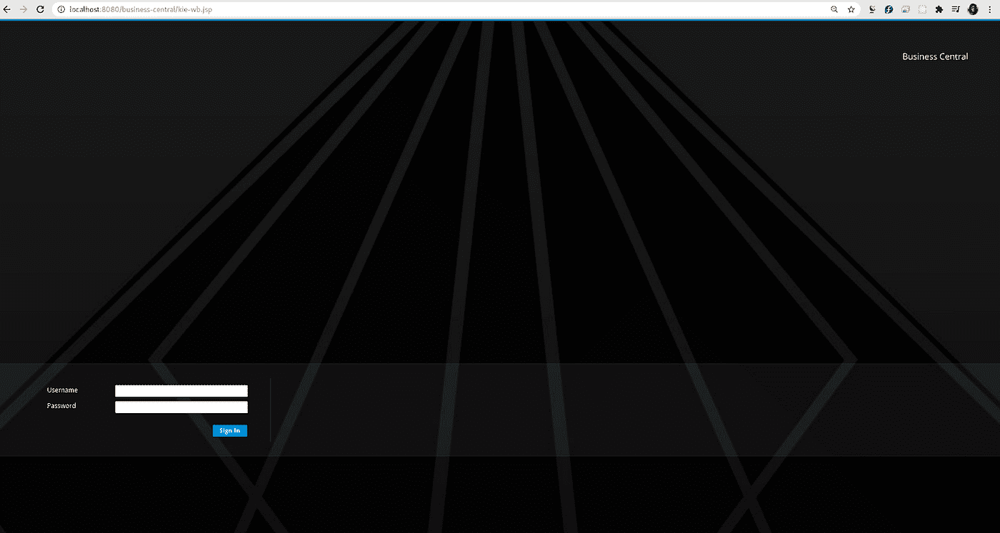

商务中心主页

2.在用户名和密码字段中使用“wbadmin”凭据登录。按照以下视频中的说明添加 IT 订单示例项目。您也可以选择创建自己的项目或导入项目。这里有一个视频，供大家参考。

jBPM 入门::IT 订单案例

3.前往 [jBPM 入门页面](https://www.jbpm.org/learn/gettingStarted.html)尝试更多示例或切换到另一个数据库。部署并验证项目后，单击导航栏上的齿轮图标并选择“数据集”。现在，您可以单击“数据集资源管理器”侧边栏顶部的“新建数据集”按钮(该侧边栏负责显示您添加和配置的所有数据集，以便以后由页面和仪表板使用)或数据集创作主页上的“新建数据集”超链接。

4.您现在可以看到一个熟悉的“数据集创建向导”页面，其中列出了所有数据集提供者。选择“执行服务器”。

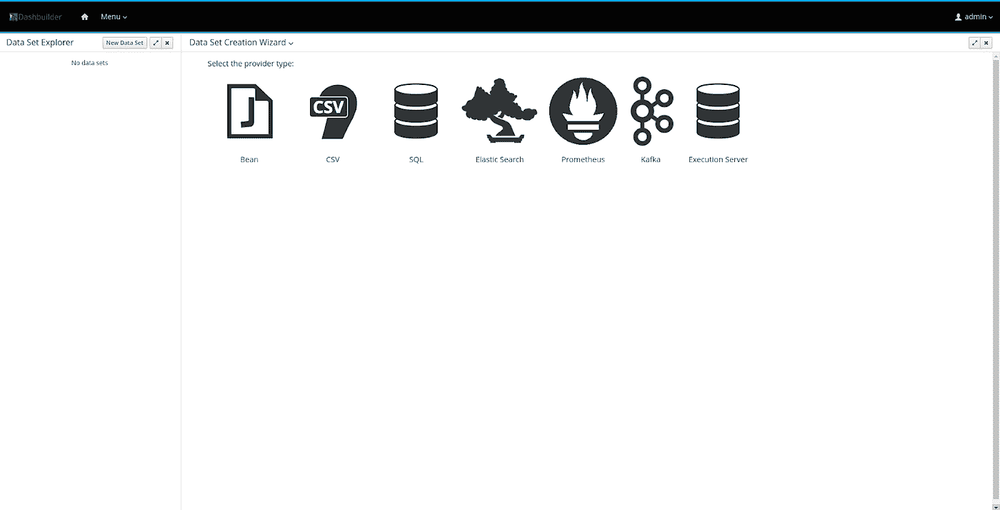

数据集创建向导页

5.现在，您将看到下面的屏幕，从 KIE 执行服务器添加数据。添加一个名称。在服务器配置下拉列表中，选择 sample-server，并在查询目标下拉列表中选择“PROCESS ”,然后添加查询，如下面的屏幕截图所示。请参考 jBPM 引擎持久性的数据模型，以了解更多关于可以用于查询的其他表的信息。参考[这篇文章](https://blog.kie.org/2021/01/queries-for-building-kie-server-dashboards.html)了解更多关于构建 KIE 服务器仪表板的查询。

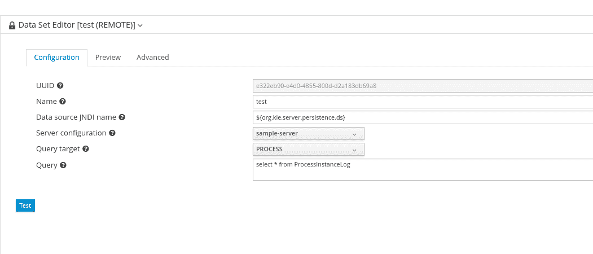

执行服务器数据集编辑器(配置选项卡)

如果您对字段的作用感到困惑，请将鼠标悬停在字段旁边的问号图标或与其相邻的文本框上。单击“测试”预览数据集。

注意:如果您第二次尝试测试一个查询，您可能会得到`com.google.gwt.core.client.JavaScriptException: (TypeError) : Cannot read property ‘getTimezoneOffset’ of undefined`。测试完查询后，删除数据集并开始一个新的数据集。

6.您现在位于预览选项卡上。现在，您可以查看数据列，并在数据集上方的选项卡中添加过滤器。您也可以通过取消选中左侧提供的列旁边的复选框来编辑类型或删除不需要的列。如果预览不是您所期望的，您可以通过单击它切换回 Configuration 选项卡并进行更改。如果您对预览感到满意，请单击“下一步”按钮。

7.在保存模式中输入所需的注释，然后单击保存按钮。

您的数据集已被添加和配置。现在，您将返回到数据集创作主页。现在，您可以在左侧窗格中看到一个数据集。当您添加多个数据集时，您可以在左侧窗格中看到所有数据集的列表。这是完整流程的屏幕记录。

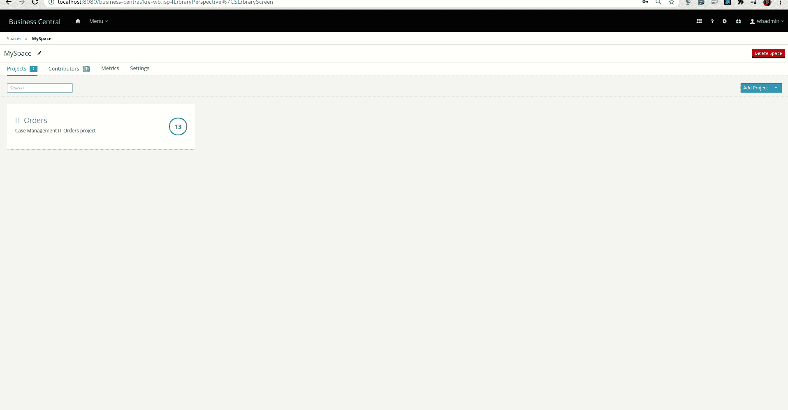

从 KIE 执行服务器添加数据

现在，您可以单击导航栏上的下拉菜单，并选择 Content Manager 来创建页面和仪表板。拖动组件后，确保在“Displayer Editor”的“Data”部分使用正确的类型对列进行了良好的配置。

## 利用野火和 KIE 服务器大战

1.  要开始，您必须配置 KIE 服务器在 WildFly 服务器上运行。对于这个例子，我使用了 wildly 19 . 0 . 0。[下载 WildFly](https://www.wildfly.org/downloads/) 和 [KIE 服务器大战](https://www.drools.org/download/download.html)部署在 WildFly 服务器上。解压 WildFly zip，打开 WildFly 解压文件夹内的一个终端(姑且称之为 WILDFLY_HOME)。将 WAR 文件(例如 kie-server-7 . 15 . 0 . final-ee7 . WAR)复制到 WildFly 的 *deployments* 文件夹中。为了方便起见，您可以将其重命名为“ **kie-server.war** ”。使用 standalone-full.xml 概要文件启动 WildFly。转到“/bin”并使用`./standalone.sh -c standalone-full.xml` 或 s `udo sh standalone.sh -c standalone-full.xml`运行“standalone.sh”。您现在可以找到运行在“localhost:9990”中的 WildFly 服务器，并看到提示添加用户的以下屏幕。

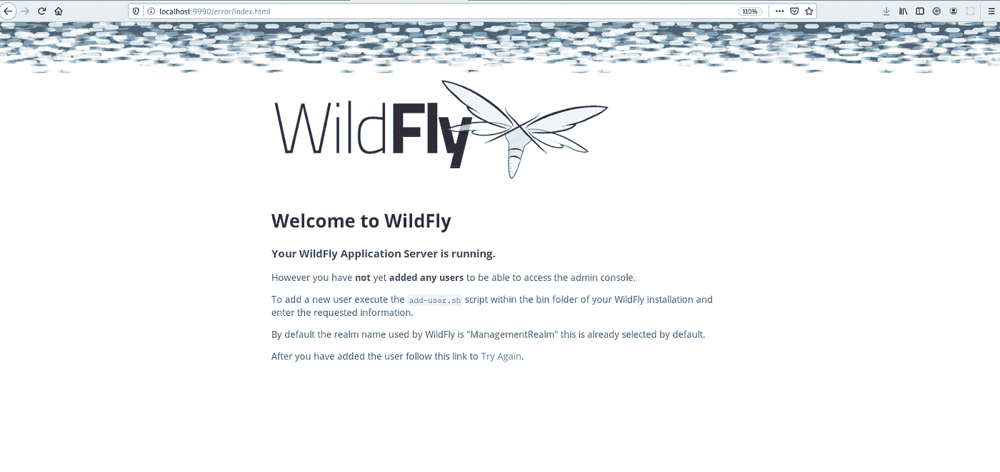

2.打开另一个终端，运行`./bin/add-user.sh -a -u kieserver -p password1! -g admin,kie-server`。这是您的终端的外观:

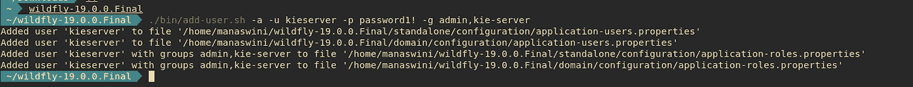

添加 ApplicationRealm 用户

这是可用于向 ApplicationRealm 添加用户的命令。对于管理领域，打开另一个终端并运行`./bin/add-user.sh`，通过选择选项“a”并添加用户名和密码来添加管理领域用户，然后按照终端上闪烁的说明添加“admin”组。添加用户后，终端应该是这样的。

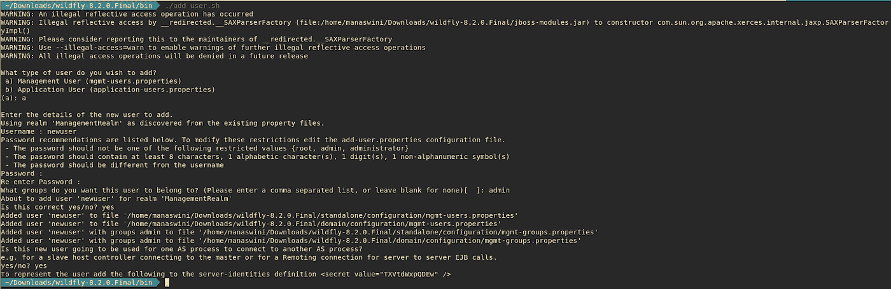

添加管理领域用户

注意:您必须添加一个 ManagementRealm 用户来登录 WildFly，ApplicationRealm 用户是您需要登录 WildFly 中部署的应用程序的用户，如本例中的 DashBuilder 和 KIE 服务器。

3.单击浏览器上的“重试”链接，并使用您在管理领域的终端中配置的相同凭据登录。您现在将能够看到 HAL 管理控制台屏幕。

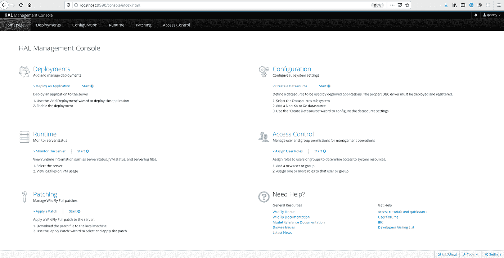

HAL 管理控制台

4.现在，单击“部署”下的“开始”链接，您可以看到 KIE 服务器部署。您可以点击“上下文根”的链接以访问 KIE 服务器，您必须进入[http://127 . 0 . 0 . 1:8080/kie-server-7 . 57 . 0 . final-ee8/services/rest/server/](http://127.0.0.1:8080/kie-server-7.57.0.Final-ee8/services/rest/server/)，现在您需要输入您之前配置的用户名和密码，以“kie-server”访问。一旦登录成功，您现在可以看到下面的 XML 页面。

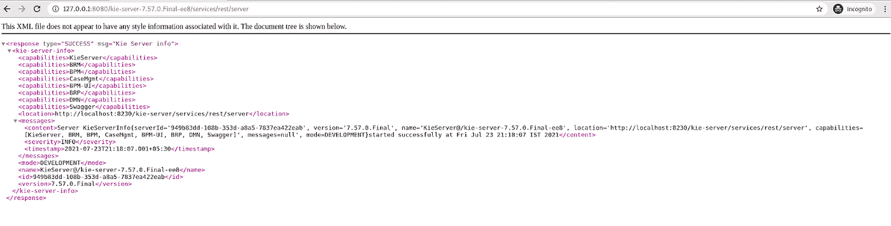

KIE 服务器成功 XML 页面

这里有一段屏幕录音供你参考:

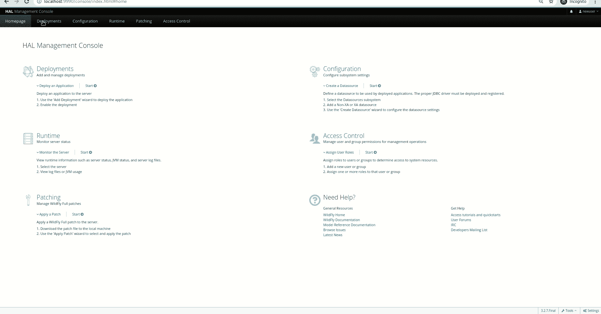

访问 KIE 服务器 XML 页面

5.从 jBPM 获得 KIE 模块。在“使用 JBPM 服务器”一节的步骤 2 中，我们导入了“IT 订单”项目。我们将需要在我们的本地系统这个项目。点击右上角的齿轮图标，转到 Artifacts 并下载 JAR 和 POM 文件，否则您可以在同一个页面中配置 SSH 密钥(就像您使用 GitHub 一样)，然后转到**Projects->MySpace->IT _ Orders->Settings**，复制 SSH 链接并将其克隆到您的本地系统中。有时，SSH 可能会有问题，所以有另一种方法。去藏起来”。niogit”文件夹中的 JBPM_HOME 或根文件夹。你可以看到一个“MySpace”文件夹，里面有一个“IT_Orders.git”，你可以克隆这个。使用`git clone IT_Orders.git`在相同的文件位置 git 文件。一旦它被克隆，在新创建的“IT_Orders”文件夹中打开一个终端并运行一个`mvn clean install`。既然我们在本地 Maven 存储库中有了所需的 KIE 模块，我们可以使用它创建一个 KIE 容器。

注意:

1.  的”。niogit "文件夹可能被隐藏，请确保您可以看到所有隐藏的文件夹，以便您可以访问它们。
2.  你必须交替使用 jBPM 和 WildFly，而不是同时使用。
3.  我们需要在我们的本地 Maven 存储库中有 KIE 模块，以便 KIE 服务器可以访问它，并且我们可以使用它创建一个容器。
4.  有时候你可能会碰到`“dashbuilder-webapp-7.56.0.Final”.”org.uberfire.server.locale.GWTLocaleHeaderFilter”: java.lang.OutOfMemoryError: Metaspace`，打开这个文件: *bin/standalone.conf* 寻找这些属性，增加到 512m/1024m-XX:MetaspaceSize = 512m-XX:MaxMetaspaceSize = 512m，这是修改后的样子:

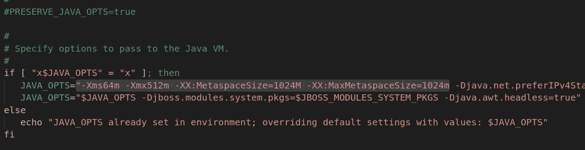

调整了 *bin/standalone.conf* 中的元空间大小

6.您的 KIE 服务器正在运行。您现在可以转到`[http://127 . 0 . 0 . 1:8080/kie-server-7 . 57 . 0 . final-ee8/docs/](http://127.0.0.1:8080/kie-server-7.57.0.Final-ee8/docs/)`查看 Swagger 文档并访问 kie 服务器的 REST 端点。通过转到“KIE 服务器和 KIE 容器部分”并执行“PUT[/server/containers/{ container id }](http://127.0.0.1:8080/kie-server-7.57.0.Final-ee8/docs/#/KIE%20Server%20and%20KIE%20containers/createContainer)”来创建一个容器，您现在可以看到一个 200 Ok 响应。

**示例 PUT 请求 URL 和 JSON 请求主体数据**

[http://localhost:8080/kie-server/services/rest/server/containers/{ container id }](http://localhost:8080/kie-server/services/rest/server/containers/MyContainer/release-id)

```
{"container-id":"MyProject","release-id":{"group-id":"itorders","artifact-id":"itorders","version":"1.0.0-SNAPSHOT"}}
```

您需要使用适当的 group-id、artifact-id 和 version，就像您之前克隆的 IT_Orders 项目中的 pom.xml 一样(在我们的例子中，对 group-id 和 version-id 使用“itorders ”,对 version 使用“1.0.0-SNAPSHOT”。

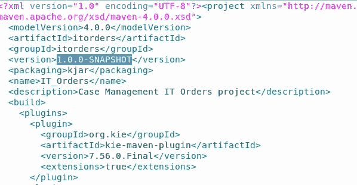

IT_Orders pom.xml

您的容器现在已经创建好了。您现在可以执行“GET[/server/containers/{ container id }](http://127.0.0.1:8080/kie-server-7.57.0.Final-ee8/docs/#/KIE%20Server%20and%20KIE%20containers/getContainerInfo)”来获取关于 KIE 服务器的信息。下面是上面的 GET 请求作为响应发送的一个例子。

```
{
  "type": "SUCCESS",
  "msg": "List of created containers",
  "result": {
    "kie-containers": {
      "kie-container": [
        {
          "container-id": "itorders_1.0.0-SNAPSHOT",
          "release-id": {
            "group-id": "itorders",
            "artifact-id": "itorders",
            "version": "1.0.0-SNAPSHOT"
          },
          "resolved-release-id": {
            "group-id": "itorders",
            "artifact-id": "itorders",
            "version": "1.0.0-SNAPSHOT"
          },
          "status": "STARTED",
          "scanner": {
            "status": "DISPOSED",
            "poll-interval": null
          },
          "config-items": [],
          "container-alias": "itorders"
        }
      ]
    }
  }
}
```

请参考[资源页面](https://www.jbpm.org/api-docs/kie-server/paths.html)了解更多关于端点及其用途的信息。您还可以通过 Swagger 文档了解更多信息，该文档本身就相当详细。如果您不喜欢 Swagger，可以随意使用自己的命令行界面或 Postman。确保运行“GET /server”来获取关于 KIE 服务器的信息。这个请求的端点是 REST API 的基本 URL。你不必担心精确的 curl 命令。一旦您点击请求的“Execute ”,您也会得到相应的 curl 命令。如果您遇到请求错误，请查看返回的错误代码消息，并相应地调整您的请求。下面是截图，供大家参考。

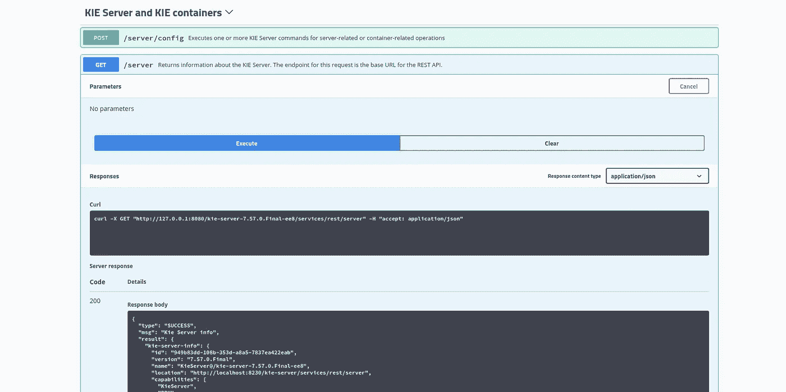

让相应的 curl 命令在终端或 Postman 中运行

7.转到 Swagger 文档中的流程实例部分，执行“GET[/server/containers/{ container id }/processes](http://127.0.0.1:8080/kie-server-7.57.0.Final-ee8/docs/#/Process%20instances/getProcessesByDeploymentId)，以获得您将用来创建流程实例的流程。复制要创建实例的流程。使用复制的 processId 和 containerId 在同一节的开头执行“POST[/server/containers/{ container id }/processes/{ processId }/instances](http://127.0.0.1:8080/kie-server-7.57.0.Final-ee8/docs/#/Process%20instances/startProcess)”来创建一个实例。主体是一个 JSON 对象。您可以创建多个实例。

8.成功创建流程实例后，以 root 身份打开*wildly _ HOME/standalone/configuration/standalone-full . XML*，添加以下系统属性以让 DashBuilder 访问服务器，并重启 wildly 服务器。现在，您将能够在 DashBuilder 中访问数据集。`serverTemplates`属性是专门为 DashBuilder 配置的，它确保填充了 DashBuilder 中执行服务器的数据集创建向导中的远程服务器模板字段的下拉列表。

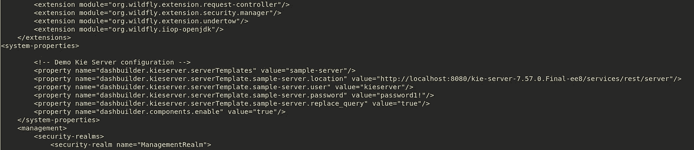

将系统属性添加到 standalone-full.xml

使用 DashBuilder 运行时，您可能还需要将以下属性添加到中:

```
dashbuilder.kieserver.serverTemplate.{SERVER_TEMPLATE}.location dashbuilder.kieserver.serverTemplate.{SERVER_TEMPLATE}.user dashbuilder.kieserver.serverTemplate.{SERVER_TEMPLATE}.password dashbuilder.kieserver.serverTemplate.{SERVER_TEMPLATE}.token
```

令牌系统属性是一个备选属性，当 KIE 服务器配置为使用令牌而不是用户/密码时，可以使用该属性。还有一个系统属性可以让 DashBuilder 在 KIE 服务器上创建查询。如果为真，则数据库在 KIE 服务器上创建查询:

`dashbuilder.kieserver.serverTemplate.{SERVER_TEMPLATE}.replace_query`

注意:

*   每次你对 *standalone-full.xml* 做任何修改时，你都必须重新启动 WildFly 服务器。
*   确保 serverTemplate.location 与您用来访问 KIE REST API 的 URL 相同。kie-server 名称很有可能是错误的。在这种情况下，在尝试使用所有正确的值访问 DashBuilder 中的数据时，您可能会收到 405 Method Not Allowed 错误。

9.现在，您可以在 DashBuilder 中访问已配置的数据集。转到“部署”选项卡，单击“上下文根”的链接。使用您在开始时创建的具有“kieserver”访问权限的 ApplicationRealm 用户凭据登录 DashBuilder(与您登录 KIE 服务器所需的权限相同)。你会看到类似下面屏幕的主页。

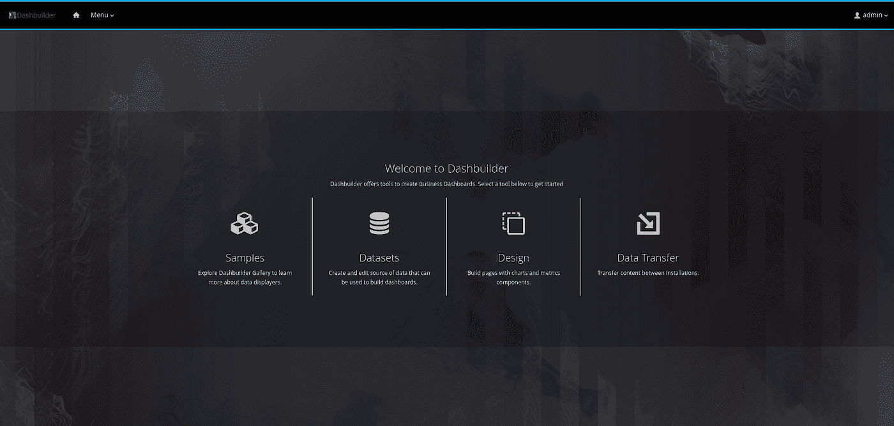

DashBuilder 主页

10.要添加数据集，请从菜单中选择数据集。或者，您也可以单击导航栏上 DashBuilder 徽标旁边左上角的“菜单”下拉菜单。您现在会看到两个标题，“DashBuilder”和“Administration”。点击“管理”下的“数据集”。您将看到数据集创作主页，其中包含添加数据集、创建显示程序和新仪表板的说明。单击“新数据集”超链接，重复本文“使用 jBPM 服务器”一节中的步骤 4–7，添加数据集并创建仪表板。

# 结论

在这篇文章的帮助下，您将能够添加和配置来自 KIE 执行服务器的数据，供您的仪表板使用。请随意添加您对遇到问题的评论，以便我们进一步改进和更新本指南。在接下来的文章中，我们将添加其余数据集提供者的演练，敬请关注！