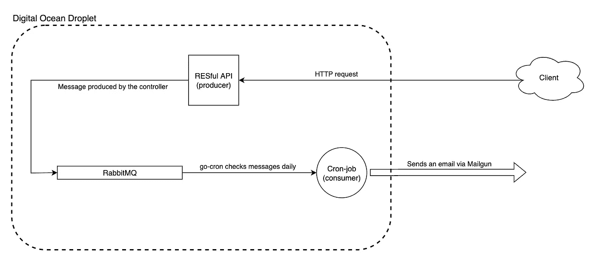

# 将 RabbitMQ 和 gocron 添加到您的数字海洋液滴中[第 1 部分]

> 原文：<https://medium.com/codex/add-rabbitmq-and-gocron-to-your-digitalocean-droplet-part-1-a191856ae06f?source=collection_archive---------10----------------------->

## 在您的 DigitalOcean droplet 上设置您自己的消息队列和 cron-job。

帕特尔王子在 [Unsplash](https://unsplash.com?utm_source=medium&utm_medium=referral) 上的照片

2022 年的现代网络应用程序将使用数十种第三方服务。这些服务极大地简化了应用程序开发，使得 web 开发变得几乎太容易了。

这对于分布式系统来说更加明显。使用云提供商的不同服务可以让您专注于开发对业务更重要的核心组件。

例如，您可以使用“队列即服务”解决方案，而不是在 Linux 服务器上配置消息代理。您想运行计划任务吗？不要费心在服务器上设置 cron workers，只需使用“功能即服务”的解决方案。

如果您在高流量环境中工作，无法容忍停机，那么使用这些第三方解决方案是完全合理的。与其自己动手解决，不如将责任委托给第三方服务。

# 所以何必呢？

在本文中，我将介绍一个 VPS(虚拟专用服务器)配置。本文的主要焦点是队列( **rabbitMQ** )和 cron-jobs( **gocron** )。

我写这篇文章有两个主要原因。如果你是出于同样的好奇而来，无论你的水平如何，这篇文章都适合你。

1.  能够欣赏过去的事情是如何进行的。
2.  培养对队列和 cron-worker 如何在 web 服务器中实现的实际理解。

你会听到业内资深人士的故事。想象你开始在一家新公司工作。您被指派设置或维护部署在本地服务器上的应用程序。配置庞大。也许在同一台机器上运行着多个 RDBMSes。有 cron-workers 通宵运行来处理一些任务。事情很容易变得太复杂。

由 [Chad Kirchoff](https://unsplash.com/@cakirchoff?utm_source=medium&utm_medium=referral) 在 [Unsplash](https://unsplash.com?utm_source=medium&utm_medium=referral) 上拍照

第二，我认为在一个你不了解不同组成部分如何在较低层次运作的环境中运作是非常困难的。这让我想起了电影《极速车王》。传奇的汽车设计师兼机械师肯·迈尔斯也是一名伟大的赛车手。你可能听说过许多其他赛车手也是优秀的机械师(例如迈克尔·舒马赫)。

# 为什么选择数字海洋？

对于这个练习，我决定使用 DigitalOcean droplet 来代替流行的 AWS EC2(或类似的替代品)。DO 液滴真的很好设置。我也发现 DO Dashboard 非常直观。

您可以将他们最基本的计划与最新的 Ubuntu 发行版结合使用，并部署到最近的数据中心。如果你陷入困境，你可以在他们的博客上找到非常好的文章。

# 假设

为了让这个练习更具交互性，我决定部署一个 RESTful API 来处理触发入队过程的 HTTP 请求。该应用程序在后台作为`systemd`服务运行，如果服务器重启，它也会重启。你可以在这里找到这个应用[的回购。注意，这个应用程序使用了 **Postgresql** ，这需要额外的配置。如果您想使用这个应用程序，您可能想简化它或编写自己的代码。](https://github.com/asungur/simple_api_postgres)

构建 RESTful API 不是本练习的强制步骤，我也不会介绍如何构建它或者如何将这个应用程序部署到我们的 VPS。

我们会让事情变得简单而愚蠢。我们将在消息和电子邮件中使用硬编码的值。本练习的目的是复制工作流，而不是结果。

# 最终 VPS 配置

部署在我们的虚拟专用服务器上的最终工作流

在下一章，**第 1 部分**中，我们将设置 RabbitMQ，并将 **enqueue** 功能添加到我们的应用程序中。

在我们确认我们的队列保存了由我们的应用程序排队的消息之后，我们将继续到**第 2 部分**。在这里，我们将构建一个 Go 应用程序，它将消息从队列中取出。我们将保持应用程序作为`systemd`服务运行。

消费者应用程序将使用时钟功能(使用`gocron`库),每天(或每小时，取决于你的选择)检查消息队列，并发送电子邮件。对于电子邮件交付，我们将使用 Mailgun 的 Go 客户端库。

第二章见👋

# 资源

*   [数字海洋博客:初始服务器设置](https://www.digitalocean.com/community/tutorials/initial-server-setup-with-ubuntu-20-04)
*   [如何在 Ubuntu 上安装 PostgreSQL](https://www.digitalocean.com/community/tutorials/how-to-install-postgresql-on-ubuntu-20-04-quickstart)
*   [极速车王(2019)](https://www.imdb.com/title/tt1950186/)
*   [反思克朗-亚当·威金斯](http://adam.herokuapp.com/past/2010/4/13/rethinking_cron/)
*   [克朗 vs 发条——亚当·威金斯](http://adam.herokuapp.com/past/2010/6/30/replace_cron_with_clockwork/)
*   [RabbitMQ 教程一](https://www.rabbitmq.com/tutorials/tutorial-one-go.html)