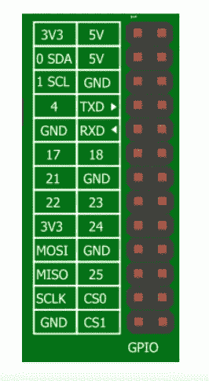

# 将横幅和图片添加到 Github 存储库中

> 原文：<https://medium.com/codex/adding-banners-and-images-to-your-github-repository-23301eb4bfc4?source=collection_archive---------2----------------------->

安妮·斯普拉特在 [Unsplash](https://unsplash.com?utm_source=medium&utm_medium=referral) 上的照片

## [抄本](http://medium.com/codex)

我添加到 github 自述文件中的一个有用的图表示例

有时候，开发者关系项目是为了给公司提供的现有内容增加营销吸引力。有时他们是用图表来阐明一个概念。提高的一个好方法是…