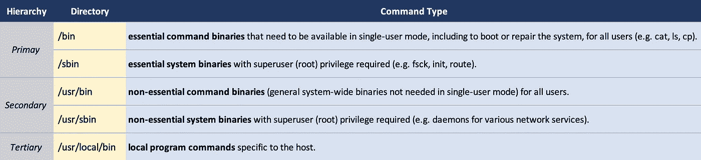

# 向 PATH 变量添加可执行程序命令

> 原文：<https://medium.com/codex/adding-executable-program-commands-to-the-path-variable-5e45f1bdf6ce?source=collection_archive---------0----------------------->

## PATH 环境变量

## 了解 PATH 变量并添加要在终端中使用的命令


# 路径变量

您的计算机(Mac 或 Linux，或基于 Unix 的系统)有一个名为`PATH`的环境变量，它包含一组包含可执行程序的可执行程序目录。

可执行程序基本上是您可以在 shell 中使用的命令。

这些包括基本的引导阶段或早期阶段所需的二进制文件，以及其他通用的系统级命令。

根据文件系统分层标准(FHS)，这些命令在系统中的分层位置如下:



除了系统级二进制文件之外，可执行程序还可以包括主机特定的程序命令。

当您通过互联网在 Mac 上安装程序或应用程序时，该应用程序将可以使用 GUI 执行，通常来自`/Application`目录。

然而，为了使用命令行命令运行应用程序，应用程序的可执行文件必须保存到`PATH`变量中。换句话说，您必须将应用程序的可执行程序文件的目录添加到`PATH`变量中，以便使用可执行文件的名称作为从 shell 运行它的命令。

当你通过一个包管理器安装一个应用，比如*家酿*，它被符号链接到`/usr/local/bin`，通常包含在`PATH`里。

对于其他直接程序安装，您的工作是将原始可执行文件直接保存到`PATH`变量，或者将可执行文件符号链接到一个单独的`bin`文件夹，该文件夹将包含在`PATH`中。

***让我们看看如何将这些本地应用程序命令添加到*** `***PATH***` ***变量中，以便我们可以在 shell 中使用它们的命令。***

# 添加到路径

在您的`zsh` shell 概要文件(`.zshrc`)中，您可以添加以下内容:

```
*export PATH="/path/to/app/executable/file/directory:$PATH"*
```

> *或*

```
*path+="/path/to/app/executable/file/directory"*
```

## 导出路径=

```
export PATH="/path/to/app/executable/file/directory:$PATH
```

> 该语法将`/path/to/app/executable/file/directory`添加到现有的`PATH`变量的前面。

*   `export`命令允许所有子进程继承标记的变量。
*   `$PATH`是指`PATH`变量值
*   将路径`/path/to/app/executable/file/directory`分配给带有尾随`:$PATH`的`PATH`变量，实质上是将路径添加到带有分隔符`:`的现有`PATH`值的前面
*   您也可以使用
    `export PATH="$PATH:/path/to/app/executable/file/directory"`将路径附加到现有的`PATH`(添加到末尾)

## 路径+=

```
path+="/path/to/app/executable/file/directory"
```

> `path`是另一个绑定到`PATH`变量的变量，但它是一个数组。`PATH`和`path`是捆绑在一起的，所以改变其中一个就会改变另一个。

*   然而，变量的值语法是不同的:

```
>> echo $PATH
/usr/local/bin:/usr/bin:/bin:/usr/sbin:/sbin:/path/to/app/......>> echo $path
/usr/local/bin /usr/bin /bin /usr/sbin /sbin /path/to/app/......
```

*   注意`PATH`由`:`分隔，而`path`由空格分隔。
*   通过在`path`赋值前使用`typeset -U path`命令，可以强制`path`变量只有唯一值。这将通过防止添加重复的目录名来保持`path`值的干净。

这里，路径`/path/to/app/executable/file/directory`很可能是从`/Applications`目录开始的应用程序`bin`目录。

*   例如，对于 Visual Studio 代码，路径是:

```
/Applications/Visual Studio Code.app/Contents/Resources/app/bin
```

*   因此，您应该设置:

```
export PATH="/Applications/Visual Studio Code.app/Contents/Resources/app/bin:$PATH"
```

这允许您使用' **code** '命令(这是可执行文件的名称)从命令行运行 Visual Studio 代码。

# 将可执行程序文件符号链接到个人的`bin`目录

您可以将可执行程序文件符号链接到一个单独的文件夹，并将该文件夹添加到`PATH`，而不是将每个可执行程序文件单独添加到`PATH`。

*   这个单独的文件夹可以是您的主目录`~/bin`中的`bin`文件夹。
*   您必须在您的主目录中创建它:

```
*>> mkdir ~/bin*
```

您可以使用`ln`命令对可执行文件进行符号链接。

*   `ln`是创建新目录条目(链接文件)的实用程序，其模式与原始文件相同。该链接“指向”原始副本。链接如何“指向”原始文件是*硬链接*和*符号链接*的区别。
*   默认情况下,`ln`创建硬链接，对原始文件的任何更改实际上都独立于链接的文件。
*   使用`-s`标志创建一个符号链接(symlink)，它是一个软拷贝，允许在对链接文件执行操作时使用引用文件。

```
*>> ln -s "/Applications/Visual Studio Code.app/Contents/Resources/app/bin/code" ~/bin*
```

如果你已经将`~/bin`目录添加到`PATH`变量中，你只需要将任何你想要添加命令的可执行程序符号链接到`~/bin`目录中。

> 这将使`PATH`的组织更加清晰，也更容易看到`PATH`中包含了哪些可执行程序。

# 参考资料:

*   [https://en.wikipedia.org/wiki/Filesystem_Hierarchy_Standard](https://en.wikipedia.org/wiki/Filesystem_Hierarchy_Standard)
*   [https://askubuntu . com/questions/308045/differences-between-bin-usr-bin-usr-sbin-usr-local-bin-usr-local](https://askubuntu.com/questions/308045/differences-between-bin-sbin-usr-bin-usr-sbin-usr-local-bin-usr-local)
*   [https://stack overflow . com/questions/11530090/adding-a-new-entry-to-the-path-variable-in-zsh](https://stackoverflow.com/questions/11530090/adding-a-new-entry-to-the-path-variable-in-zsh)
*   `man ln`