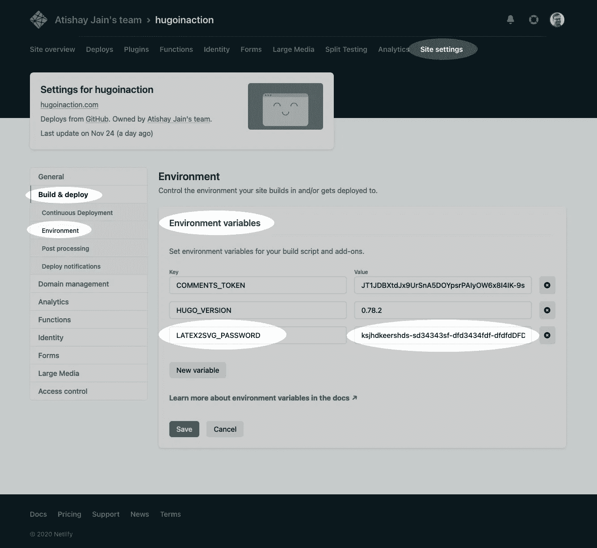

# 向我们的网站添加 LaTeX 渲染，第 1 部分

> 原文：<https://medium.com/codex/adding-latex-rendering-to-our-website-part-1-cedd84a24baa?source=collection_archive---------13----------------------->

## 文章

## 从[雨果在行动](https://www.manning.com/books/hugo-in-action?utm_source=medium&utm_medium=organic&utm_campaign=book_jain_hugo_9_24_19)由阿蒂沙·贾因

这篇文章是关于给一个用 Hugo 构建的静态网站添加 LaTeX 渲染的。

在[manning.com](https://www.manning.com/?utm_source=medium&utm_medium=organic&utm_campaign=book_jain_hugo_9_24_19)结账时，将 **fccjain** 输入折扣代码框，即可享受[T3【雨果在行动 的六折优惠。](https://www.manning.com/books/hugo-in-action?utm_source=medium&utm_medium=organic&utm_campaign=book_jain_hugo_9_24_19)

Acme 公司致力于数字造型。形状与几何是相互联系的，我们需要进入数学符号库来更好地表达和理解形状。LaTeX 是科学论文中表示数学符号最常用的方式。在撰写本文时，Hugo 本身并不支持 LaTeX 渲染。

一个名为 math jax(https://www.mathjax.org/)的 JavaScript 库支持在 web 浏览器中呈现基于 LaTeX 的数学符号。这个库相当受欢迎，它被互联网上大多数需要数学符号的网站所使用。该库在网页上扫描基于 LaTeX 的数学表达式，并用等效的 SVG 再现替换它们。虽然直接使用 MathJax 是在我们的网站上获得数学符号的最简单的解决方案，但它也有一些缺点。

*   MathJax 相当大。尽管它会进行代码分割，并试图获得最小的有效负载来呈现所需的内容，但它仍然是一个额外的 JavaScript，需要下载并在每个客户的机器上运行。
*   MathJax 没有给我们的网站增加任何交互性。输出是静态图像，在浏览器中这样做没有什么好处。在服务器上渲染数学比增加额外的跳跃来下载这个库，然后执行计算和更新图像更高效和更快。
*   客户端上的 MathJax 不是缓存友好的。因为它需要按需完成所有的工作，所以我们不能为我们的数学符号预先生成图像并保存它们。

如果我们能够将数学渲染移动到服务器，并在页面加载甚至网站重建时缓存结果，这将是一种卓越的用户体验。因为 Hugo 不直接与 MathJax 接口，所以我们需要通过使用外部 API 来扩展 Hugo 来执行这项任务。首先，我们创建一个云函数并托管它。该函数采用 LaTeX 表达式并返回相应的 SVG 图像。接下来，我们在网站编译期间从 Hugo 调用它，并将搜索结果放在我们的网站中。

## **子进程 vs API**

理论上，将与项目相关的额外代码作为子流程运行更容易，这已经成为与其他工具交互的首选机制。Hugo 通过命令行调用像 AsciiDoc 这样的外部助手以及像 PostCSS 这样的工具，但是该特性不能用于一般用途。子进程有一个不好的习惯，那就是获得启动它们的父进程的完全凭证和控制权。这意味着任何恶意软件都可以很容易地隐藏在模块或一些示例源代码中，如果通过子进程运行，会对系统造成巨大的破坏。

通过 HTTP 访问的 API 由于运行在不同的机器上而被沙箱化。这使得 Hugo 生态系统更加安全。虽然你需要小心运行`npm install`以确保你不会碰到恶意软件，但是运行 Hugo 命令不太可能对你的机器造成任何损害。Hugo 不能在`public`目录之外写东西，这使得一切都很安全。另外，创建 API 促进了跨多个系统的重用，因为这些 API 形成了松散耦合的微服务，不仅可以在编译时使用，也可以在运行时使用。

## **编写代码渲染 LaTeX**

因为 MathJax 是用 JavaScript 编写的，所以我们使用 node.js 与它接口。我们首先安装 MathJax 的 node.js 版本，作为我们网站的依赖项。这可以通过在`package.hugo.json`中添加`mathjax`作为依赖项来实现。注意，我们使用`dependency`而不是`package.hugo.json`中的`devDependency`属性，因为实时生产代码需要依赖关系。对于本文，我们使用 MathJax 的 3.1.2 版本。

```
// package.hugo.json
 {
  "dependencies": {
    "mathjax": "3.1.2"
  }
 }
```

接下来我们需要通过 hugo 重新生成 package.json，然后将其作为依赖项安装。

```
hugo mod npm pack
 npm install
```

这将下载 MathJax 作为我们网站的依赖项。接下来，我们创建一个 tex2svg 文件夹，其中包含将 LaTeX 转换为 svg 的代码。这包括初始化 MathJax，将 LaTeX 字符串和可用于执行 SVG 转换的参数作为输入，然后将输出作为字符串返回。我们将 API 代码保存到一个名为`api`的文件夹中，该文件夹下有一个名为 tex2svg 的子文件夹，它公开了这个函数。在这个文件中，我们有一个名为 index.js 的文件，它将这个文件公开为一个云函数。

对于这个方法，我们使用 AWS Lambda 和 Netlify 函数使用的`exports.handler = async function(event, context){}`格式。这个函数有两个参数，事件和上下文。`event`是包含以下属性的对象:

*   path:请求的路径(例如/latex2svg)
*   httpMethod:传入请求的方法名(GET、POST、PUT 等。)
*   头:传入的请求头(例如{ ' Content-Type ':' application/JSON ' })
*   queryStringParameters:查询字符串参数(例如{tex: '\frac{1}{2}'})
*   body:请求负载的 JSON 字符串。(GET 请求中为空)
*   isBase64Encoded:一个布尔标志，指示适用的请求有效负载是否以 Base64 格式编码。

这个脚本的代码在本文的参考资料([https://github.com/hugoinaction/·胡戈因 action/tree/ch11-resources/2](https://github.com/hugoinaction/%20hugoinaction/tree/ch11-resources/2))中共享。

**清单 1。将 LaTeX 转换为 SVG 的云函数的源代码。**

```
// api/latex2svg.js
 const MathjaxModule = require("mathjax");  ❶
 let MathJax = null;
 module.exports = {
  /**
   * Function to handle calls to the API endpoint of the cloud function.
   */
  async handler(event, context) {
    if (!event.queryStringParameters || !event.queryStringParameters.tex) { ❷
      return {
        statusCode: 400,
        headers: {'Content-Type': 'application/json'},
        body: JSON.stringify({
          error: "The required `tex` parameter not supplied.",
        })
      }
    }
    if (!MathJax) { ❸
      MathJax = await MathjaxModule.init({
        loader: { load: ['input/tex', 'output/svg'] }
      });
    }

    const svg = MathJax.tex2svg(event.queryStringParameters.tex, { ❹
        display: event.queryStringParameters.display,
        em: event.queryStringParameters.em,
        ex: event.queryStringParameters.ex,
        containerWidth:  event.queryStringParameters.containerWidth,
        lineWidth: event.queryStringParameters.lineWidth,
        scale: event.queryStringParameters.scale
      });
    return {    ❺
      statusCode: 200,
      headers: {'Content-Type': 'application/json'},
      body: JSON.stringify({
        data: MathJax.startup.adaptor.outerHTML(svg)
      })
    };
  },
 }
```

❶ **导入 MathJax 依赖项**

❷ **确保 tex 参数可用。**

❸ **仅在需要时初始化 MathJax。它将输入作为 LaTeX 并输出 SVG**

❹ **将查询字符串中的所有参数传递给 MathJax**

❺以 JSON 的形式返回 200 个结果。

我们有意输出 JSON 字符串而不是原始 SVG，以便通过 GetJSON 在 Hugo 中将它作为 JSON 对象，并在需要时能够对它进行后期处理。如果需要，我们可以在响应 JSON 中将附加信息传递给 Hugo。

这些代码现在可以部署到 FAAS 解决方案中，如 AWS Lambda 或 Netlify 函数，以便在任何地方使用。对于 PAAS 解决方案，我们需要做更多的工作。

## **添加一个 HTTP 服务器来调用这个函数**

虽然我们有将 LaTeX 转换成 SVG 的代码，但是我们还没有在本地测试它。FAAS 提供商提供诸如 Netlify Dev、AWS SAM 或 Firebase function emulator 等工具，在本地运行云功能，以进行验证和单元测试。对于本文，我们不使用专门的工具，而是编写一些启动器代码来与这个函数交互。这段代码还允许我们与平台 a 服务解决方案(在我们的例子中是 Heroku)进行交互，该解决方案不需要函数，而是需要一个完整的 node.js 程序来运行。

我们在项目的根目录下创建一个新的文件 api.js(在 api 文件夹中创建它使 Netlify 把它当作一个函数),它有一个简单的基于 node.js 的 HTTP 服务器，响应 HTTP 请求并调用这个方法。([https://github . com/hugoin action/hugoin action/tree/ch11-resources/3](https://github.com/hugoinaction/hugoinaction/tree/ch11-resources/3))。

**清单 2。创建一个基于 node.js 的 HTTP 服务器，它可以将请求路由到正确的函数，以便在 PAAS 解决方案中进行处理**

```
const http = require('http');
 const querystring = require('querystring');
 const latex2svg = require('./api/latex2svg');
 const port = process.env.PORT || 3000;   ❶
 const server = http.createServer().listen(port);
 server.on('request', async function (req, res) {    ❷
    const url = new URL(req.url, `http://${req.headers.host}`);
    const queryStringParameters = url.search &&
 querystring.parse(url.search.slice(1));
    const request = {    ❸
      queryStringParameters,
      path: url.pathname,
      httpMethod: req.method,
      headers: req.headers,
      body: req.body
    }
    let response = {  ❹
      statusCode: 404,
      headers: { 'Content-Type': 'application/json'},
      body: JSON.stringify({error: "Page not found"})
    }
    try {
      switch (url.pathname) {    ❺
        case '/latex2svg':
          response = await latex2svg.handler(request);
          break;
      }
    } catch(e) {                 ❻
      response.statusCode = 500;
      response.body = JSON.stringify(e);
    }
    res.writeHead(response.statusCode, response.headers);  ❼
    res.end(response.body);
 })
```

❶ **从环境变量中询问端口或者默认为 3000。**

❷ **设置一个 HTTP 服务器。**

❸ **创建一个与 AWS Lambda 兼容的请求对象。**

❹ **创建默认响应。**

❺ **制造出一款轻型路由器**

❻ **优雅地处理异常**

❼ **向客户端发回响应**

我们可以通过调用项目根目录下的`node api`来运行这段代码。我们可以导航到 http://localhost:3000/latex 2 SVG？tex=%5Cfrac%7Ba%7D%7Bb%7D 来获取`\frac{a}{b}` LaTeX 字符串的内联版本的 JSON 输出。我们可以添加`&display=true`来获得显示版本。

此时，我们应该更新 package.json 的“main”条目，使其指向`api.js`，从而允许在 JavaScript 生态系统中作为有效项目运行。我们还在编写`npm start`时添加了一个启动脚本来启动我们的 API 服务器。我们需要通过更新`package.hugo.json`和运行`hugo mod npm pack`的相同路线。

```
// package.hugo.json
 {
  "main": "api.js",
  "scripts": {
    "start": "node api.js"
  }
 }
```


图一。LaTeX 到 SVG 转换 API 的 JSON 响应。

## **增加一些安全性以防止未经授权的访问**

如果我们通过启动器脚本或直接发布我们的函数，我们会因为开放一个整个互联网都可以访问的未经认证的端点而增加风险。如果其他人在没有向我们付费的情况下使用它，这可能会产生巨大的成本。虽然我们无法在不添加身份验证系统或防火墙的情况下阻止我们的端点，但我们可以让任何没有密码的人无法使用它。轻量级安全解决方案可以通过在构建系统和 API 提供程序中嵌入密码来添加，并通过这两个地方的环境变量来公开它。因为我们的密码不进入客户端，所以它是安全的，只要我们使用好的密码，并且我们的服务提供商是安全的，简单的密码认证机制就可以工作。

在 latex2svg.js 内部，在检查`tex`查询参数之前，我们应该检查`password`查询参数，如果没有提供，则返回 unauthorized。

**清单 3。向我们的 API 添加密码以防止未经授权的访问**

```
// api/latex2svg.js
 ...
 async handler(event, context) {
  if (!event.queryStringParameters ||
      !process.env.LATEX2SVG_PASSWORD ||    ❶
      event.queryStringParameters.password !== process.env.LATEX2SVG_PASSWORD) {   
    return {
      statusCode: 401,        ❷
      headers: {'Content-Type': 'application/json'},
      body: JSON.stringify({
        error: "Access Denied.",
      })
    }
  }
  ...
 }
```

❶ **不允许空白 LATEX2SVG_PASSWORD**

❷:如果密码错误，我们会使用 HTTP 401。如果密码正确，而用户仍然没有访问权限，则 HTTP 403 是正确的错误代码。

对于本地测试，我们可以通过系统上的环境变量公开 LATEX2SVG_PASSWORD，因为我们配置云提供商将它传递给 Hugo 和我们的函数。

## **部署网络功能**

因为我们已经以 Netlify 理解的方式构建了这个函数，所以不需要做很多工作就可以将它部署到 Netlify。我们需要做的第一步是告诉 Netlify functions 文件夹的位置。要为网络功能设置文件夹，请转到**站点设置** > **功能** > **部署设置**并点击**编辑设置**。


图二。用于指定网站源代码所在文件夹位置的网络功能设置。

接下来指定`api`并点击保存。


图 3。在部署设置中指定网络功能的目录

我们还需要在构建环境中添加 LATEX2SVG_PASSWORD 变量。步骤是转到**站点设置** > **构建&部署** > **环境** > **环境变量**。点击**编辑变量** > **新建变量**。为 LATEX2SVG_PASSWORD 添加一个复杂的密码，然后单击 Save。该密码仅需要在部署后测试网络功能。你不需要记住这个密码。



图 4。存储密码以限制对我们功能的未授权访问。环境变量是防止密码进入我们代码库的好方法。

接下来，我们可以将代码推送到 Netlify 来测试 Netlify 函数。代码上线后，我们可以调用`https://<endpoint>/.netlify/functions/latex2svg?tex=%5Cfrac%7Ba%7D%7Bb%7D&password=<password>`来获得与之前本地运行时相同的响应。

我们还可以在 Netlify 网站的 functions 选项卡中看到我们的函数，从这里我们可以获得调试日志，以了解每次调用时发生了什么。任何抛出的错误也会被报告。我们可以将`console.log`语句放在我们的 JavaScript 代码中，并在这个摘要页面中查看我们所做的所有日志记录。


图 5。访问网络功能的日志。Netlify 中的“功能”选项卡提供了对 Netlify 功能的访问，这些功能可用于查看我们网站中所有活动的功能以及与其相关的调试错误。


图 6。Netlify 中的每个功能都有详细的日志。

**代码检查点:**现场直播[https://ch11-1.hugoinaction.com](https://ch11-1.hugoinaction.com/)。源代码在[https://github.com/hugoinaction/hugoinaction/tree/ch11-1](https://github.com/hugoinaction/hugoinaction/tree/ch11-1)

请继续关注第二部，我们将在那里部署到 Heroku。

本文到此为止。如果你想了解这本书的更多内容，可以在曼宁的 liveBook 平台上查看[这里](https://livebook.manning.com/book/hugo-in-action?origin=product-look-inside&utm_source=medium&utm_medium=organic&utm_campaign=book_jain_hugo_9_24_19)。