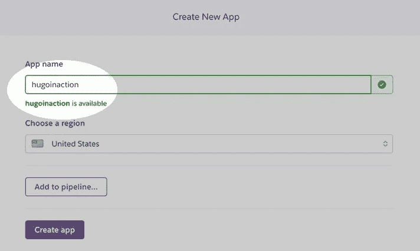
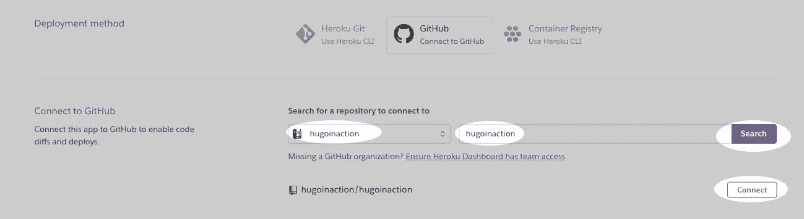
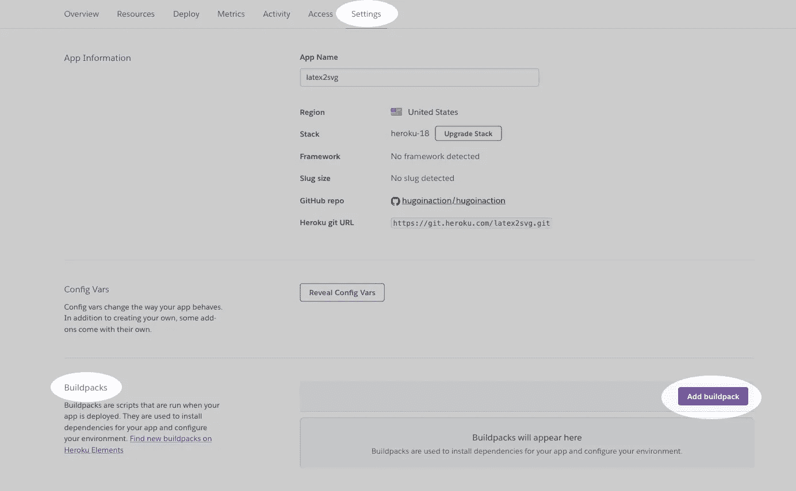
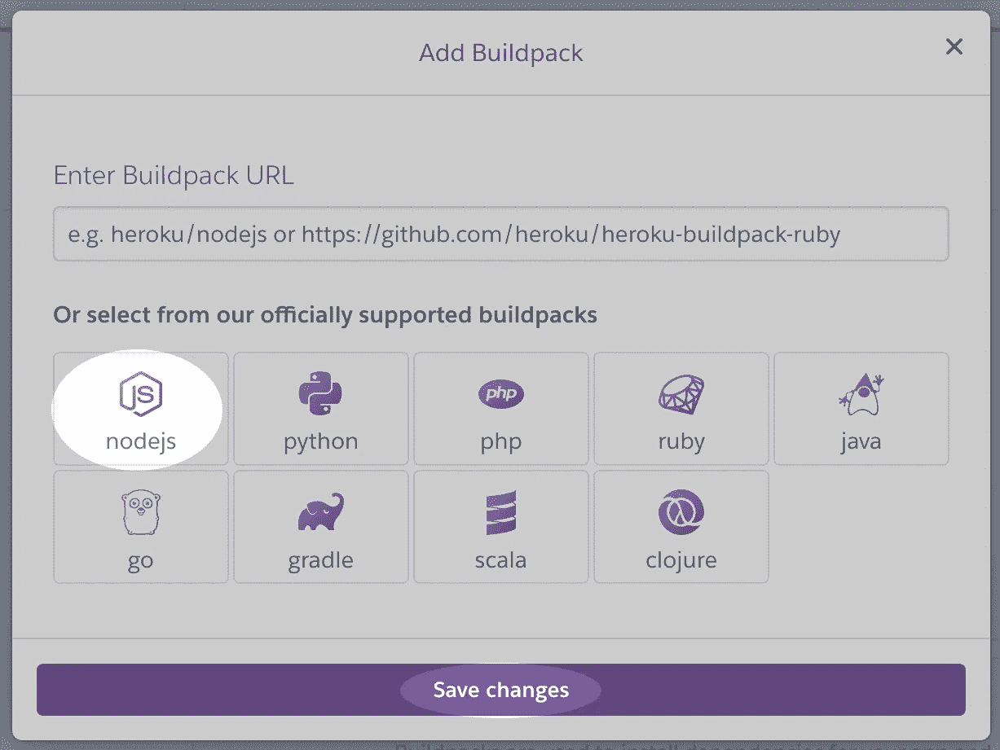
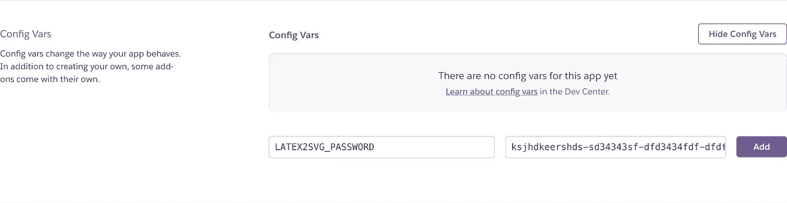
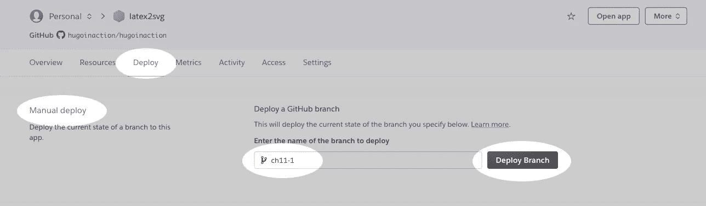
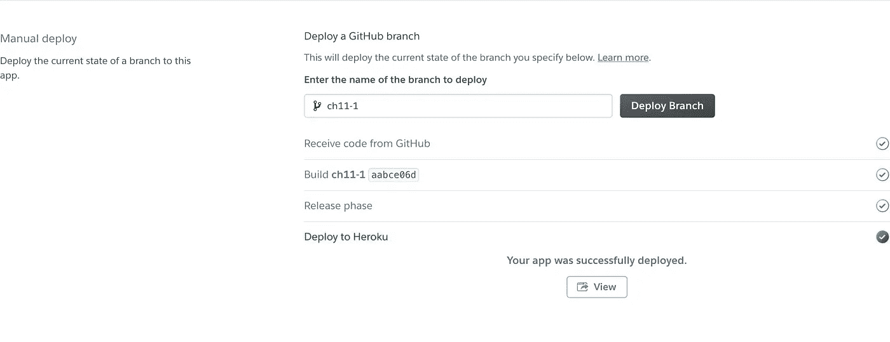
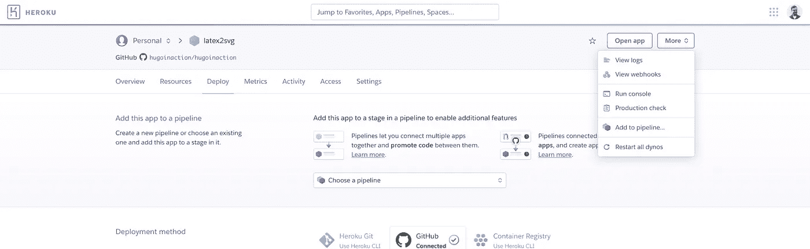
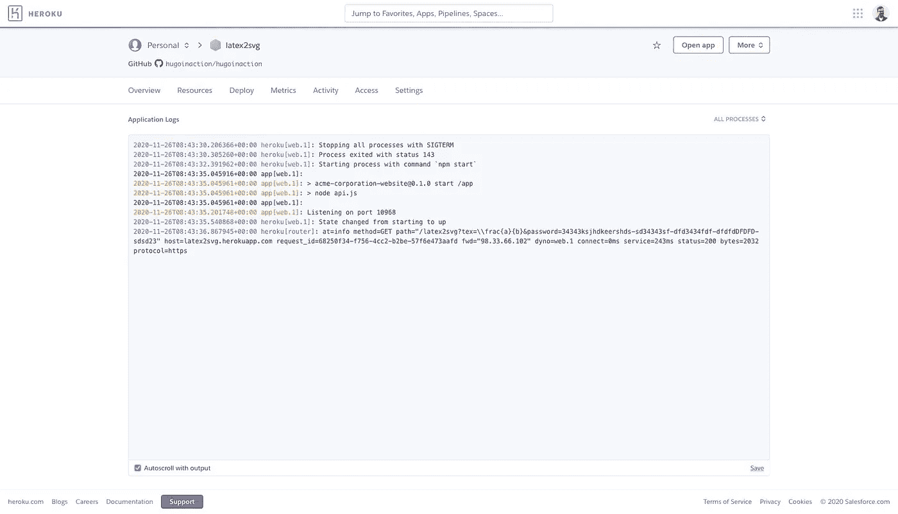

# 向我们的网站添加 LaTeX 渲染，第 2 部分

> 原文：<https://medium.com/codex/adding-latex-rendering-to-our-website-part-2-55f6a14b79e7?source=collection_archive---------19----------------------->

## 文章

## *出自* [*雨果在行动*](https://www.manning.com/books/hugo-in-action?utm_source=medium&utm_medium=organic&utm_campaign=book_jain_hugo_9_24_19) *出自阿提亚·贾恩*

*这篇文章是关于给一个用 Hugo 构建的静态网站添加 LaTeX 渲染的。*

在[manning.com](https://www.manning.com/books/hugo-in-action?utm_source=medium&utm_medium=organic&utm_campaign=book_jain_hugo_9_24_19)结账时，将 **fccjain** 输入折扣代码框，即可享受 40%的折扣[Hugo in Action](https://www.manning.com/books/hugo-in-action?utm_source=medium&utm_medium=organic&utm_campaign=book_jain_hugo_9_24_19)*。*

*关于这篇文章的介绍，请看第一部分。*

## ***部署到 Heroku***

*如果您没有使用 Netlify，您需要选择一个供应商来托管 API。许多云供应商都支持 PAAS 和联邦航空局的模式，我们可以自由决定采用什么方法来部署我们的网站。因为 Netlify 使用 FAAS 解决方案，所以我们演示 PAAS 解决方案。Heroku 被用作 PAAS 平台，尽管我们很少使用它的特性，因此代码应该可以在我们选择的任何 PAAS 平台上运行。*

*Heroku 集成了 Node.js 生态系统和 GitHub，使我们的部署工作变得简单。Heroku 还为我们的代码提供了持续的集成和部署，而无需我们在 GitHub 操作中编写任何东西，这使得我们的工作更加容易。配置完成后，我们需要将代码推送到 GitHub，让它在 Heroku 中运行。*

*   *一旦你注册进入 Heroku，你将登陆[https://dashboard.heroku.com/apps](https://dashboard.heroku.com/apps)，在那里你可以点击**新建** > **创建新应用**。*

**

*图 7。在 Heroku 中创建新的应用程序来托管我们的 API*

*   *接下来，我们需要给这个应用取一个名字。应用名称在 Heroku 中是唯一的。latex2svg 已为本文保留。*

**

*图 8。在 Heroku 中为应用程序命名*

*   *我们现在可以决定整合的模式。直接的 GitHub 集成是最简单的，我们在用例中使用它。要连接到 GitHub，可以转到**部署** > **部署方法** > **GitHub** ，然后点击**连接到 GitHub***

**

*图 9。连接 Heroku 和 GitHub*

*   *提供凭证后，我们可以搜索要连接到 Heroku 的存储库，选择正确的存储库，然后单击 connect。*

**

*图 10。从 GitHub 到 Heroku 查找并连接正确的存储库*

*   *在触发部署之前，我们需要转到**设置**选项卡，并在**构建包**部分选择 node.js。因为我们同时拥有`go.sum`和`package.json`，Heroku 可能会感到困惑。*

**

*图 11。Heroku 的设置选项卡包含 Buildpacks，这是 Heroku 编程平台的配置。*

*我们的 API 需要 node.js 构建包。*

**

*图 12。Heroku 支持多种平台来部署我们的应用程序。Node.js 就是其中之一，它是启动和运行我们的 MathJax 代码所必需的。*

*   *在设置中还有一个 config vars 部分，我们可以在这里定义我们的环境变量。我们需要定义 LATEX2SVG_PASSWORD 来获取限制访问的密码。*

**

*图 13。Hugo 中的配置变量作为环境变量传递给正在运行的代码。*

*   *构建设置完成后，我们可以从**部署** > **手动部署**中触发部署。在打开自动部署之前，我们应该首先进行手动部署，以验证一切都是正确的。*

**

*图 14。Heroku 的手动和自动部署。手动部署应该用于验证，一旦我们知道一切正常，我们就可以回到自动部署。*

*代码上线后，我们可以调用`https://<endpoint>.herokuapp.com/latex2svg?tex=%5Cfrac%7Ba%7D%7Bb%7D&password=<password>`来获得与之前本地运行时相同的响应。*

**

*图 15。当我们在 Heroku 中触发手动部署时，会提供一步一步的进度，直到一切就绪。*

*我们可以通过查看右上角的**更多**菜单中提供的应用程序日志来解决任何问题，我们可以点击**查看日志***

**

*图 16。查看 Heroku 上的日志。Heroku 提供了对机器日志和单独构建日志的访问，我们可以进入它们来找出问题。*

**

*图 17。Heroku 中运行的 node.js 进程的日志示例。我们可以使用 console.log 从 node.js 获取所有日志，所有崩溃和错误日志也是可用的。*

## ***API 和加价的单一回购与单独回购***

*我们决定将用于网站的存储库也用于 API 代码。这有一个明显的缺点，即每次基于标记的文档发生变化时，将不必要的标记代码推给 Heroku，并重新构建基于 Heroku 的 API。如果这变成一个大问题，我们可以选择为 API 建立一个单独的分支或者一个单独的存储库。我们还可以通过 GitHub 动作来改变我们的集成，而不是直接的 Heroku 导入，我们可以建立智能来识别 API 是否发生了变化。如果 API 不经常变化，我们可以转向手动部署。*

*选择单一回购与 Hugo 或 Jamstack 无关。这是个人喜好的问题。如果使用 monorepo，Netlify 在一个存储库上工作得更好，并且管理跨 API 的更改和它们在核心模板代码中的调用可能更容易。*

## ***创建短代码来渲染 LaTeX***

*有了功能 API，在网站上渲染 LaTeX 所需的主要工作就完成了。我们需要调用它，然后呈现结果。现在我们需要创建一个短代码来调用 API，并在基于 Hugo 的网站上显示结果。*

*尽管我们在编译时使用 API，但是如果我们想在运行时使用它们，设置 API 的步骤是完全相同的。我们使用 fetch 函数，而不是通过 Hugo 调用 API。*

*在 shortcode 中，我们将 latex 代码作为 shortcode 的内部内容，然后调用 latex2svg API 来获取 LaTeX 文档的 svg 版本，我们可以使用`resources.FromString`将其转换为资源，或者以内联方式呈现为 SVG 文档。我们在用例中以内联方式呈现 SVG。*

*虽然在使用 Netlify 的情况下，我们可以在端点中使用`site.baseURL`,但当网站以前从未被实时推送时，它对编译时 API 访问不起作用。这导致需要进行两次部署——一次是启动函数，另一次是调用它。**除非从 JavaScript 调用，否则建议在配置中为 API 提供一个固定的 URL。***

*API 的其他参数可以转换为短代码的参数。我们使用 http://docs.mathjax.org/en/latest/web/typeset.html 官方 MathJax 文档中提供的默认值。*

*相应的文件也存在于资源中([https://github . com/hugoin action/hugoin action/tree/ch11-resources/4](https://github.com/hugoinaction/hugoinaction/tree/ch11-resources/4))*

```
*{{/* layouts/shortcodes/latex.html */}}
 {{/* layouts/shortcodes/latex.html */}}
 {{/* defaults taken from [http://docs.mathjax.org/en/latest/web/typeset.html](http://docs.mathjax.org/en/latest/web/typeset.html)

 {{/*  a Boolean specifying whether the math is in display-mode or inline mode */
 {{ $display := true }} ❶
 {{ with .Get "display" }}
 {{ $display = . }}
 {{ end }}

 {{/*  a number giving the number of pixels in an em for the surrounding font. */
 {{ $em := 8 }}
 {{ with .Get "em" }}
 {{ $em = . }}
 {{ end }}

 {{/*  a number giving the number of pixels in an em for the surrounding font. */
 {{ $ex := 16 }}
 {{ with .Get "ex" }}

 {{ $ex = . }}
 {{ end}}

 {{/*  a number giving the width of the container, in pixels. */}}
 {{ $containerWidth := (mul 80 $ex) }}
 {{ with .Get "containerWidth" }}
 {{ $containerWidth = . }}
 {{ end }}

 {{/*  a number giving the line-breaking width in em units. Default is a very large number (100000), so effectively no line breaking. */}}
 {{ $lineWidth := 100000 }}
 {{ with .Get "lineWidth" }}

 {{ $lineWidth = . }}
 {{ end }}

 {{/*  a number giving a scaling factor to apply to the resulting conversion. Default is 1\. */}}
 {{ $scale := 1 }}
 {{ with .Get "scale" }}
 {{ $scale = . }}
 {{ end }}

 {{ if (and $.Site.Params.Latex2Svg (getenv "LATEX2SVG_PASSWORD") ) }} ❷
   {{ $json := getJSON $.Site.Params.Latex2Svg "?" (querify "tex" .Inner) "&password="
 (getenv "LATEX2SVG_PASSWORD") "&display=" $display "&em=" $em "&ex=" $ex
 "&containerWidth=" $containerWidth "&lineWidth=" $lineWidth "&scale=" $scale}}
   {{ with $json.data }}
   {{. | safeHTML}} ❸
 {{ end }}
 {{ end }}*
```

*❶ **用有意义的默认值设置所有参数***

*❷ **如果没有 LATEX2SVG_PASSWORD 或者端点没有定义，不允许调用服务器。***

*❸ **嵌入数据而不内联转义 SVG 内容。***

*接下来，我们需要在网站配置中输入 Latex2Svg 端点，这取决于您是使用 Heroku 还是 Netlify 进行部署。*

```
*# config/_default/params.yaml
 Latex2Svg: https://<endpoint>.herokuapp.com/latex2svg
 # or
 Latex2Svg: https://<endpoint>/.netlify/functions/latex2svg*
```

*如果不想调入云服务，可以使用[http://localhost:3000/latex 2 SVG](http://localhost:3000/latex2svg)作为**config/development/params . YAML**里面的 URL。我们也可以在开发过程中通过将此设置为空白来禁用调用。*

## ***在我们的网站上添加一些乳胶***

*完成了获取渲染 latex 的短代码的所有艰苦工作后，下一步是在我们的网站中编写一些 LaTeX。在我们的博客中，我们有一个关于三角形的页面。*

*让我们把三角形面积的公式加进去:*

```
*<!-- content/blog/tropical triangles/index.md -->
 \text{Area} = \frac{b \times h}{2}*
```

*让我们在圈里做同样的事情:*

*content/blog/community/circle . MD->
{ {<latex>} } \ text { Area } = \ pi r { {</latex>} }*

*我们也可以做复杂的数学方程，比如贝塞尔曲线的数学定义。*

```
*
 <!--  content/blog/community/curve.md -->
 \mathbf {B} (t)=\sum _{i=0}^{n}{n \choose i}(1-t)^{n-i}t^{i}\mathbf {P} _{i}
 *
```

*我们也可以做在线乳胶。*

```
*<!--  content/blog/community/circle.md -->
 The area of a circle is  \pi r^2 *
```

**

*图 18。LaTeX 在网站的曲线网页中渲染为 SVG。使用编译时 API 访问，我们可以将 LaTeX 转换为 SVG，而不需要客户端上的任何 JavaScript。*

*代码检查点。在 https://ch11–2.hugoinaction.com 现场直播。https://github.com/hugoinaction/hugoinaction/tree/ch11-2[的源代码](https://github.com/hugoinaction/hugoinaction/tree/ch11-2)*

*本文到此为止。感谢阅读。*