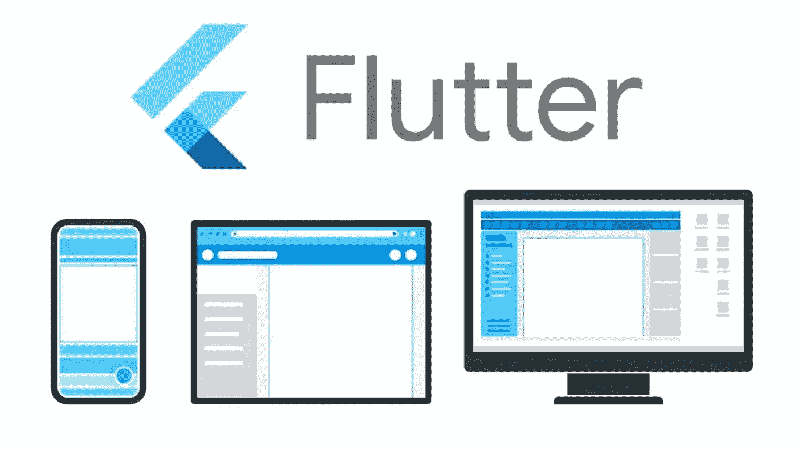

# 将特定于平台的 Dart 代码添加到您的 Flutter 应用程序中—一种简单的方法

> 原文：<https://medium.com/codex/adding-platform-specific-dart-code-to-your-flutter-app-an-easy-way-9ffe32a454ad?source=collection_archive---------7----------------------->



在开发多平台 Flutter 应用程序时，总会出现这样的情况:您需要集成一个库，但它并不支持您的应用程序所设计的所有平台。那是令人恼火的，不是吗？


比如考虑[颤振下载器](https://pub.dev/packages/flutter_downloader)包。它只支持 Android 和 iOS，但如果你的 Flutter 应用程序也是为 web 开发的，那么你根本不能使用这个包，必须为所有东西编写自定义代码。

让我们看看如何在 Android 和 iOS 平台上利用这个库，同时为 web 实现提供定制代码。

一种方法是使用 flutter foundation 库中的' **kIsWeb'** 常量并实现 Web 的逻辑，但在为任何其他平台构建时，您仍然会遇到编译时错误，因为特定于 web 的库，如' dart:html '和' dart:js '在这些平台上不可用。

所以，正确的方法应该是使用所谓的“有条件导入”，让我们来看看如何使用。

首先，让我们创建一个简单的 Flutter 应用程序，它有一个下载按钮，点击它我们需要下载我们的文件。

```
import 'package:flutter/material.dart';void main() {
  runApp(const MyApp());
}class MyApp extends StatelessWidget {
  const MyApp({Key? key}) : super(key: key);@override
  Widget build(BuildContext context) {
    return MaterialApp(
      title: 'Downloader',
      theme: ThemeData(
        primarySwatch: Colors.blue,
      ),
      home: const MyHomePage(title: 'Downloader'),
    );
  }
}class MyHomePage extends StatefulWidget {
  final String title;
  const MyHomePage({Key? key, required this.title}) : super(key: key);@override
  State<MyHomePage> createState() => _MyHomePageState();
}class _MyHomePageState extends State<MyHomePage> {@override
  void initState() {
    super.initState();
  }

  @override
  Widget build(BuildContext context) {
    return Scaffold(
      appBar: AppBar(
        title: Text(widget.title),
      ),
      body: Center(
        child: ElevatedButton(
          onPressed: () async {
            //TODO: Add download feature
          },
          child: const Text(
            'Download',
          ),
        ),
      ),
    );
  }@override
  void dispose() {
    super.dispose();
  }
}
```

现在，让我们创建一个抽象类来定义我们需要的方法。我们将把它命名为**文件下载者。**

```
abstract class **FileDownloader** {
  Future<void> **initialize**();
  void **downloadFile**({required String fileUrl, required String fileName});
  void **dispose**();
}
```

创建一个**file _ downloader _ stub . dart**文件并添加以下函数(为什么？我们稍后会看到):

```
FileDownloader getFileDownloader() {
  **throw** UnsupportedError(**"Platform not supported"**);
}
```

现在我们将创建一个类来扩展 **FileDownloader** 类，并使用 [Flutter Downloader](https://pub.dev/packages/flutter_downloader) 库实现在移动平台上下载的功能。

```
import 'dart:isolate';
import 'dart:ui';

import 'package:downloader_app/file_downloader.dart';
import 'package:flutter_downloader/flutter_downloader.dart';
import 'package:path_provider/path_provider.dart';

class **MobileFileDownloader** extends **FileDownloader** {
  @override
  Future<void> **initialize**() async {
    await FlutterDownloader.*initialize*(ignoreSsl: true);
    ReceivePort _port = ReceivePort();
    IsolateNameServer.*registerPortWithName*(
        _port.sendPort, 'downloader_send_port');
    _port.listen((dynamic data) {
      *//Do something with progress* });

    FlutterDownloader.*registerCallback*(*downloadCallback*);
  }

  @override
  void **downloadFile**({required String fileUrl, required String fileName}) async {
    FlutterDownloader.*enqueue*(
      url: fileUrl,
      savedDir: (await getApplicationDocumentsDirectory()).path,
      fileName: fileName,
      showNotification: true,
      saveInPublicStorage: true,
    );
  }

  @override
  void **dispose**() {
    IsolateNameServer.*removePortNameMapping*('downloader_send_port');
  }

  @pragma('vm:entry-point')
  static void ***downloadCallback***(
      String id, DownloadTaskStatus status, int progress) {
    final SendPort? send =
        IsolateNameServer.*lookupPortByName*('downloader_send_port');
    send?.send([id, status, progress]);
  }
}

*//Provides MobileFileDownloader* FileDownloader **getFileDownloader**() => MobileFileDownloader();
```

注意最后一行的' **getFileDownloader** '方法。为什么需要？我们一会儿就会谈到它。

类似地，我们将创建一个类来扩展 **FileDownloader** 类，并使用自定义实现来实现在 Web 上下载的功能。

```
import 'dart:html';

import 'package:downloader_app/file_downloader.dart';

class **WebFileDownloader** extends **FileDownloader** {
  @override
  Future<void> **initialize**() async {}

  @override
  void **downloadFile**({required String fileUrl, required String fileName}) {
    AnchorElement anchorElement = AnchorElement(href: fileUrl);
    anchorElement.download = fileName;
    anchorElement.click();
  }

  @override
  void **dispose**() {}
}

*//Provides WebFileDownloader* FileDownloader **getFileDownloader**() => WebFileDownloader();
```

终于到了最有趣也是最重要的部分:把所有的东西连接起来。为此，我们将向 **FileDownloader** 添加一个静态工厂方法，并使用条件导入的能力来返回特定于平台的 **FileDownloader** 实例。

```
**import 'package:downloader_app/file_downloader_stub.dart'
    if (dart.library.io) 'package:downloader_app/mobile_file_downloader.dart'
    if (dart.library.html) 'package:downloader_app/web_file_downloader.dart';**abstract class FileDownloader {
  Future<void> initialize();
  void downloadFile({required String fileUrl, required String fileName});
  void dispose();**static FileDownloader getFileDownloaderFactory() => getFileDownloader();**
}
```

记下顶部的导入语句。

*   当' **dart.library.io** '库可用时，它将导入 **MobileFileDownloader** 类，并从那里使用' **getFileDownloader** 方法。
*   当'**dart.library.html**'库可用时，它将导入 **WebFileDownloader** 类，并从那里使用' **getFileDownloader** 方法。
*   因为这两个库都将存在，所以我们不必担心陷入存根。

现在剩下的就是在我们的 app 中使用了。

```
**import 'package:downloader_app/file_downloader.dart';** import 'package:flutter/material.dart';void main() {
  runApp(const MyApp());
}class MyApp extends StatelessWidget {
  const MyApp({Key? key}) : super(key: key);@override
  Widget build(BuildContext context) {
    return MaterialApp(
      title: 'Downloader',
      theme: ThemeData(
        primarySwatch: Colors.blue,
      ),
      home: const MyHomePage(title: 'Downloader'),
    );
  }
}class MyHomePage extends StatefulWidget {
  final String title;
  const MyHomePage({Key? key, required this.title}) : super(key: key);@override
  State<MyHomePage> createState() => _MyHomePageState();
}class _MyHomePageState extends State<MyHomePage> {
 **FileDownloader fileDownloader = FileDownloader.getFileDownloaderFactory();**@override
  void initState() {
    **fileDownloader.initialize();**
    super.initState();
  }@override
  Widget build(BuildContext context) {
    return Scaffold(
      appBar: AppBar(
        title: Text(widget.title),
      ),
      body: Center(
        child: ElevatedButton(
          onPressed: () async {
            **fileDownloader.downloadFile(
              fileUrl: '<file-url>',
              fileName: '<file-name>',
            );**
          },
          child: const Text(
            'Download',
          ),
        ),
      ),
    );
  }@override
  void dispose() {
 **fileDownloader.dispose();**    super.dispose();
  }
}
```

唷，我们终于完成了！


你可能还会有一个问题:为什么在使用条件导入时它可以工作，而在我们使用' **kIsWeb** '时却不行？

答案很简单:导入条件是在编译时解决的(不像' **kIsWeb** '，它是在运行时解决的)，所以编译器已经知道哪个文件需要编译到最终的包中，哪个不需要，它只编译需要的文件，忽略不需要的文件。

仅此而已！谢谢你一直读到最后。