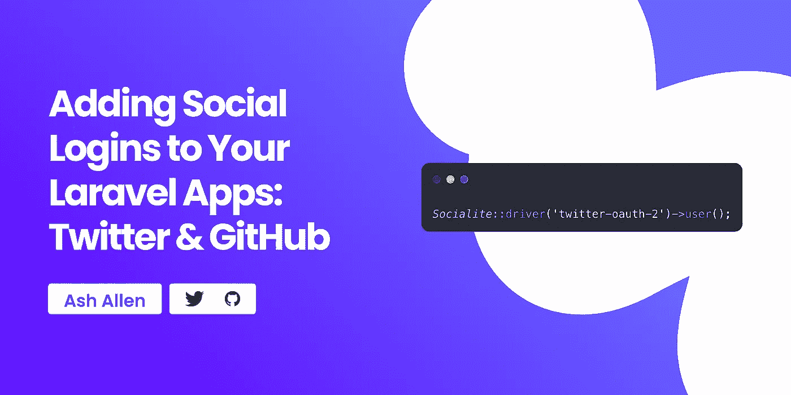

# 将社交登录添加到你的 Laravel 应用程序:Twitter 和 GitHub

> 原文：<https://medium.com/codex/adding-social-logins-to-your-laravel-apps-twitter-and-github-a59aeec46445?source=collection_archive---------21----------------------->

# 介绍

在 Laravel 应用程序中，通常会为用户提供使用传统的电子邮件和密码表单注册和登录的功能。但是，有时您可能希望允许用户使用 Twitter、GitHub 和 Google 等第三方服务登录您的应用程序。

在本指南中，我们将了解如何使用[Laravel socialist](https://laravel.com/docs/9.x/socialite)让用户使用 Twitter 登录 Laravel 应用的基本知识。

# OAuth 和交际花是什么？

在我们开始之前，有必要退一步，了解什么是 Laravel Socialite 以及它是如何工作的。Socialite 是由 Laravel 团队提供的第一方包，它允许您向 OAuth 提供者进行身份验证，例如:Twitter、GitHub、GitLab、BitBucket、脸书、LinkedIn 和 Google。

还有一个名为[社交名媛提供者](https://socialiteproviders.com/)的社区驱动网站，为更多 OAuth 提供者提供支持，如苹果、Instagram 和 Dribbble。

如果你以前没有听说过 OAuth，你应该仍然能够遵循这个指南，这要感谢社交名流为我们做了大部分繁重的工作。根据[维基百科](https://en.wikipedia.org/wiki/OAuth)的说法，OAuth(**O**pen**Auth**orization)本质上是一种“*开放的访问授权标准，通常用于互联网用户授权网站或应用程序访问他们在其他网站上的信息，但不需要给他们密码*”。如果你曾经见过任何网站写着“登录谷歌”、“登录推特”等等，那么你可能已经遵循了 OAuth 工作流程。

在本指南中，我们将使用更新的 OAuth 2.0 实现，而不是旧的 OAuth 1.0 实现。如果你有兴趣找出这两个版本之间的区别，你可以查看 OAuth 1 和 OAuth 2 的文章。

# 使用 Twitter 登录

# 在 Twitter 中创建应用程序

在我们接触 Laravel 项目中的任何代码之前，我们首先需要在 https://developer.twitter.com 设置一个新的 Twitter 应用程序。

如果您还没有注册，您需要注册，然后前往仪表板创建一个新项目。

创建新项目后，您需要创建一个新的 Twitter 应用程序，并为其启用 OAuth 2.0。为应用程序启用 OAuth 时，您可能希望将“应用程序类型”设置为“Web 应用程序”。当添加您的“回拨 URI /重定向 URL”时，您将需要输入您的用户在允许访问 Twitter 后应该被重定向到的确切 URL(我们将在下面更深入地讨论这一点)。在这个特别的教程中，我们将使用`http://localhost/auth/callback/twitter`作为我们的回调 URI。但是，您需要确保在这里也添加了您的 live 服务器的 URL，否则它只能在您的本地开发站点上工作。例如，如果你的站点托管在`https://my-awesome-app.com`，你需要添加本地主机 URL 和`[https://my-awesome-app.com/auth/callback/twitter](https://my-awesome-app.com/auth/callback/twitter.)` [。](https://my-awesome-app.com/auth/callback/twitter.)

关于如何在 Twitter 中设置项目和应用程序的更深入的指导，您可以查看 Twitter 上的[项目文档。](https://developer.twitter.com/en/docs/projects/overview)

同样值得注意的是，如果您想要访问用户的电子邮件地址(您可能会想要)，您需要为您的项目申请“提升访问权限”。没有额外的权限，您将无法查看您的用户的电子邮件地址。

# 安装社交名媛

要开始使用 Socialite，您需要使用以下命令安装`laravel/socialite`包:

然后，您需要将您的 Twitter 项目的凭证和我们的回调 URL 添加到您的`config/services.php`配置文件中，就像使用`twitter-oauth-2`字段一样，如下所示:

在您的`.env`文件中，您将能够添加字段:

重要的是要记住你的`OAUTH_CALLBACK_URL`字段必须是一个绝对 URL。例如，你需要使用`http://localhost/auth/callback/twitter`而不仅仅是`/auth/callback/twitter`。

# 准备数据库

既然我们已经在 Twitter 上设置了应用程序，并配置了社交网站，我们可以设置我们的数据库来处理社交网站。如果我们想代表用户发出 API 请求，我们需要跟踪用户是否使用 Socialite 注册，还可能需要跟踪他们的令牌。

出于本指南的目的，我将假设您的数据库中还没有一个`users`表，或者还没有创建该表的迁移。因此，我们将通过使用以下命令进行新的数据库迁移来创建该表:

这应该会在我们项目的`database/migrations`文件夹中为我们创建一个新的迁移。然后，我们将更新该迁移，如下所示:

然后，我们可以运行这个迁移，并使用以下命令将`users`表添加到我们的数据库中:

# 准备模型

既然数据库已经迁移，我们就可以创建我们的`User`模型了。我们将通过运行以下命令来实现这一点:

然后我们可以更新我们的模型，看起来像这样:

注意我们是如何定义`twitter_token`和`twitter_refresh_token`字段应该被加密的。我们将进一步研究其原因。

# 设置控制器和路线

现在我们已经正确地设置了数据库和模型，我们需要添加两条新的路由和一个控制器来处理这些路由。

这些路线将负责两项行动:

1.  将用户从我们的 Laravel 应用引导到 Twitter 的路径。这是用户允许通过 Twitter 在我们的应用程序中进行身份验证的地方。
2.  在 Twitter 中允许权限后，用户将在我们的应用程序中被重定向到的路线。

首先，让我们在`routes/web.php`文件中创建这些路线，如下所示:

然后我们可以创建我们的`OAuthController`，在我们的路线中使用。首先，我们将把我们的`redirect`方法添加到控制器中，将用户重定向到 Twitter:

如您所见，Socialite 正在为我们做繁重的工作，因此方法编写起来非常简单。同样值得注意的是，我们需要在这里传递`twitter-oauth-2`而不仅仅是`twitter`，因为我们想要使用 OAuth 2.0 实现而不是 OAuth 1.0 实现。

现在我们已经添加了将用户重定向到 Twitter 的 route 和 controller 方法，我们需要创建一个新的控制器方法来处理用户何时返回站点。出于这个示例的目的，并且为了保持所有代码都在一个地方以便于阅读，我将把所有代码放在控制器方法中。但是，您可以随意在自己的项目中拆分代码(类似于我的[清理 Laravel 控制器](https://ashallendesign.co.uk/blog/cleaning-up-laravel-controllers)文章中展示的方式),以符合您自己的偏好。

所以我们的新`callback`方法可能看起来像这样:

如你所见，交际花又做了很多繁重的工作。但是，让我们一步一步地了解代码在做什么来理解工作流。

我们从调用`Socialite::driver('twitter-oauth-2')->user()`开始。这是使用从 Twitter 返回的 URL 中的参数来解析用户的 Twitter 详细信息。成功解析用户后，我们可以在`$oAuthUser`字段上调用许多不同的方法，例如:

因为我们也使用 OAuth 2.0 提供者，所以我们也能够访问以下字段:

如果使用`user()`方法无法解析用户，将会抛出一个`Laravel\Socialite\Two\InvalidStateException`异常。这可能是由多种原因引发的，例如:

*   请求被重放(您只能访问 URL 一次)。
*   用户按下“取消”按钮，不允许通过 Twitter 登录。
*   部分(或全部)查询参数不正确。这可能是由于恶意试图找到注册和登录过程中的漏洞。

为了使本指南简单，我没有添加对这些情况的处理。但是，它可能是您想要添加到项目中的内容，而不仅仅是显示一个 500 错误页面。

值得注意的是，在这个特别的教程中，我们只讲述如何使用 Twitter 登录到您的 Laravel 应用程序，作为使用传统注册表单的替代方法。但是，如果您希望您的 Laravel 应用程序代表经过验证的用户进行 API 调用，您将能够使用`token`和`refreshToken`字段来进行这些请求。例如，如果您正在构建一个 Twitter 分析或日程安排应用程序(如 [ilo.so](https://ilo.so/?via=AshAllenDesign) )，并且希望代表用户发布推文，您可能会想要这样做。出于安全原因，记住不应该存储这些令牌，除非你不得不并且实际上要使用它们，这一点非常重要。您可能还想在存储前对它们进行加密，以获得最低限度的额外安全性。虽然如果你的应用服务器被入侵，用你的 Laravel 应用的`APP_KEY`加密这些令牌不会保护密钥不被入侵和解密，但如果只有你的数据库被入侵，它们至少会提供少量的保护。安全地存储密钥是您需要逐个项目地决定的事情，以便提出最适合您(和您的用户)的策略。

在我们的控制器中，在我们解析了 Twitter 用户之后，我们使用`User::updateOrCreate()`。这样做是为了让我们可以检查用户过去是否使用 Twitter 登录过我们的应用程序。如果他们有，我们将更新他们的详细信息，以确保我们有关于他们的最新信息(如他们的姓名、头像和令牌)。如果用户不存在，我们将在数据库中创建它们。之后，我们将对用户进行身份验证，并将他们重定向到我们应用程序的仪表板。

使用我们在这里使用的方法，您的数据库中可能有多个用户使用相同的电子邮件地址。例如，如果您允许传统注册，或者使用 Twitter 和 GitHub 注册，这可能会导致 3 个用户使用相同的电子邮件地址(每种注册方法一个)。因此，为了应对这种情况，我有时喜欢对我的控制器的`callback`方法和我的传统注册表单添加额外的检查，以防止用户使用多种方法注册同一个电子邮件地址。同样，您可能还想更新传统的登录表单，以防止 OAuth 用户试图登录。在本例中，我们创建了一个随机的 50 个字符的密码，因此用户不太可能能够登录。但是，仍然建议添加一个显式检查来防止 OAuth 注册用户登录。然而，这是您可能希望在您的项目中允许的，因此这是您可能希望在逐个项目的基础上进行更改的。

简单回顾一下，当我们完成控制器的创建时，它应该是这样的:

# 更进一步

# 模型助手方法

如果您的项目允许使用传统的表单和多个 OAuth 提供者登录，您可能希望向您的`User`模型添加一些有用的方法或访问器，以使您的代码更具可读性。如果您希望根据用户注册的位置执行不同类型的业务逻辑，这将非常有用。例如，假设您的项目支持使用 Twitter 和 GitHub 登录。您可以将以下方法添加到您的模型中:

这意味着在你的代码中，你现在可以像这样使用这些方法:`$user->isOAuthUser()`、`$user->isTwitterUser()`、`$user->isGithubUser()`。

# 错误报告

如果您正在使用第三方错误报告系统(如 [Flare](https://flareapp.io/) 、 [Bugsnag](https://www.bugsnag.com/) 、 [Honeybadger](https://www.honeybadger.io/) 等)，您将希望确保在错误报告期间不会提交任何与 OAuth 相关的密钥或凭证。例如，您需要确保用户的`twitter_token`和`twitter_refresh_token`没有被提交。大多数错误报告系统都提供了某种功能来编辑提交给它们的数据中的特定字段或数据，因此您需要确保阅读了必要的文档，以确保正确配置了它们。

# 多个提供商

根据您的项目，您可能希望为其他 OAuth 提供者提供用于登录的功能。例如，您可能希望允许用户使用 Twitter 或 GitHub 登录。如果是这种情况，我们可以从上面对我们现有的代码做一些小的修改。对于这一部分，我们假设你已经阅读了创建 GitHub 应用程序的设置指南，并在`config/services.php`文件中添加了必要的字段。

我们可以从使用 PHP 8.1s 枚举开始，并创建一个如下所示的枚举:

然后我们可以改变我们的路线来接受一个`{provider}`，而不是被硬编码为`twitter`:

然后，我们可以更新控制器的`redirect`方法，以利用 Laravel 提供的 enum 路由绑定:

现在，如果用户导航到`/auth/redirect/twitter`或`/auth/redirect/github`，那么`$provider->driver()`调用将返回必要的驱动程序名称(分别为`twitter-oauth-2`和`github`)。然而，如果用户导航到该路线并通过一个我们没有在`OAuthProvider` enum 中列出的提供者，用户将收到一个 404 响应。

然后我们可以像这样更新控制器的`callback`方法:

在这个方法中，我们删除了这里提到的所有 Twitter。相反，我们使用了四个新字段:`oauth_id`、`oauth_provider`、`oauth_token`和`oauth_refresh_token`。这些改变是基于这样的假设，即项目将只允许用户使用一个提供者登录。

为了让它工作，您需要更新您的模型，将`oauth_provider`转换成一个`OAuthProvider`枚举实例:

# 结论

希望这篇文章能让你了解如何在 Laravel 应用程序中使用 Socialite 来允许用户使用 Twitter 登录。它还应该给了您一些关于如何改进和扩展这个工作流以与多个 OAuth 2.0 提供者一起工作的想法。

如果你喜欢读这篇文章，我很乐意听听。同样，如果你有任何改进未来的反馈，我也很乐意听到。

如果你有兴趣在我每次发布新帖子时得到更新，请随意[注册我的简讯](https://ashallendesign.co.uk/blog)。

继续建造令人敬畏的东西！🚀

【https://ashallendesign.co.uk】最初发表于**。**