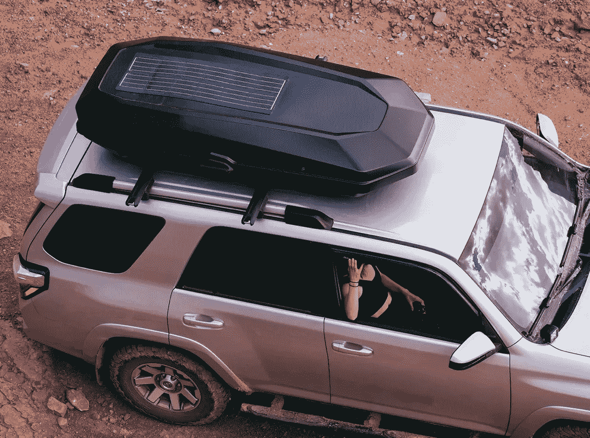

# 为屋顶储物添加太阳能功能

> 原文：<https://medium.com/codex/adding-solar-capabilities-to-roof-top-storage-9d28786efb09?source=collection_archive---------4----------------------->

## 介绍亚基马 CBX 16 太阳能货箱

[亚基马 CBX 太阳能屋顶盒(媒体由亚基马)](https://cdn.shopify.com/s/files/1/0266/3943/3776/products/8_938a43b1-c47e-4786-8ac5-3eb9dac43025_2048x.jpg?v=1620933213)

我们仍处于夏季，这意味着假期仍在如火如荼地进行。当我为为期一周的短途旅行打包汽车时，我不会说我喜欢的事情之一是车内存储空间的拥挤。这就是车顶货箱派上用场的地方，为了这篇文章…