# 用闪电和解毒来解决有毒的评论

> 原文：<https://medium.com/codex/addressing-toxic-comments-with-lightning-flash-and-detoxify-92996b9f9ca8?source=collection_archive---------8----------------------->


YeahIllustration Photo by[Pavel Danilyuk](https://www.pexels.com/@pavel-danilyuk?utm_content=attributionCopyText&utm_medium=referral&utm_source=pexels)来自 [Pexels](https://www.pexels.com/photo/wood-love-writing-winter-8294846/?utm_content=attributionCopyText&utm_medium=referral&utm_source=pexels)

## 展示创建了一个自然语言处理(NLP)模型，用于用闪电检测纯文本中的毒性。我们还提出了一个名为解毒的社区项目，它提供了经过 PytorchLightning 预训练的拥抱脸模型。

这篇文章介绍了两种方法来识别有毒评论，作为第四届[有毒评论严重程度排名](https://www.kaggle.com/c/jigsaw-toxic-severity-rating)比赛的一部分。第一种方法利用一个强大的 NLP 基线模型，该模型很容易用[闪光灯](https://github.com/PyTorchLightning/lightning-flash)训练，以对人类评论的毒性级别进行分类。第二部分展示了一个开源项目，解毒，基于[拥抱脸变形金刚](https://huggingface.co/transformers/)，但用 [PyTorch Lightning](https://pytorch-lightning.readthedocs.io/en/stable/) (PL)训练。此外，解毒提供使用他们已经训练好的模型保存为 PL 检查点。

> 有害评论被定义为粗鲁、不尊重他人或不合理的评论，可能会使其他用户离开讨论。情感分析的一个子任务是有害评论分类。[ [在线讨论中的有毒评论检测](https://hpi.de/fileadmin/user_upload/fachgebiete/naumann/publications/PDFs/2020_risch_toxic.pdf)

这种[竖锯率毒性评论的严重程度](https://www.kaggle.com/c/jigsaw-toxic-severity-rating)已经是关于这个话题的第四版了。以前的比赛是简单的分类，后来也是多语言多标签的任务。

[](https://www.kaggle.com/c/jigsaw-toxic-severity-rating) [## 拼图评级毒性评论的严重程度

### 在评论之间排列毒性的相对等级

www.kaggle.com](https://www.kaggle.com/c/jigsaw-toxic-severity-rating) 

今年的拼图挑战赛有所不同，因为组织者引入了新的评估系统。组织者注意到，对哪些评论是有毒的(高于某个可接受的阈值)进行二元分类是具有挑战性和主观性的。因此，当组织者提供验证数据集时，他们求助于一个排名系统——将两个评论并排放置，其中一个比另一个更有害。对于人类来说，更自然的是进行这样的排序，而不是在没有上下文的情况下预测每个样本的绝对分数。

# 闪电基线

[Lightning Flash](https://github.com/PyTorchLightning/lightning-flash) 是一个方便的人工智能工具箱，涵盖了表格数据、自然语言处理(NLP)、计算机视觉等重要领域。它提供了几个通用的任务——二进制和多标签分类以及特定领域的任务，例如 NLP 翻译或问答。

> 为了解决问题的简单性和紧密性，我们将把任务视为简单的文本分类，并使用过去比赛的数据集。值得一提的是，组织者甚至鼓励使用过去的数据集。

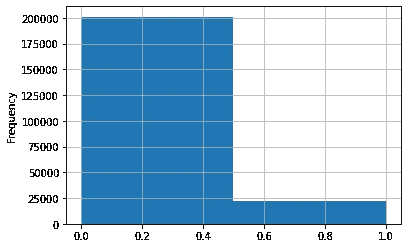

第二版数据集中任何毒性水平的标签分布。

上图显示，即使我们将所有子类:`toxic`、`severe_toxic`、`obscene`、`threat`、`insult`、`identity_hate`进行汇总，数据集仍严重失衡，偏向于无毒标签。当我们阅读一些被归类为无毒的评论时，我们可以感觉到一定程度的毒性，这反映了评估毒性是多么棘手和主观。

这篇文章基于 [Flash 示例](https://lightning-flash.readthedocs.io/en/stable/reference/text_classification.html)和我们最近公开的 Kaggle 内核:

[](https://www.kaggle.com/jirkaborovec/toxic-comments-with-lightning-flash) [## 🙊对 Lightning⚡Flash 的恶毒评论

### 使用 Kaggle 笔记本探索和运行机器学习代码|使用来自多个数据源的数据

www.kaggle.com](https://www.kaggle.com/jirkaborovec/toxic-comments-with-lightning-flash) 

要训练您的模型，您只需执行三个基本步骤，遵循任何通用的机器学习管道:(1)准备和加载数据集，(2)使用选择的主干创建模型，以及(3)训练它。为了便于说明，我们在下面几行中展示了这些步骤中的每一步，并附有代码截图。

## 1.构建数据模块

我们将在汇总所有毒性子类后使用单一语言二进制数据集——简单地说，在一个名为`“any”`的新列中。我们还需要指定稍后将使用哪个模型来确保相同的标记器。

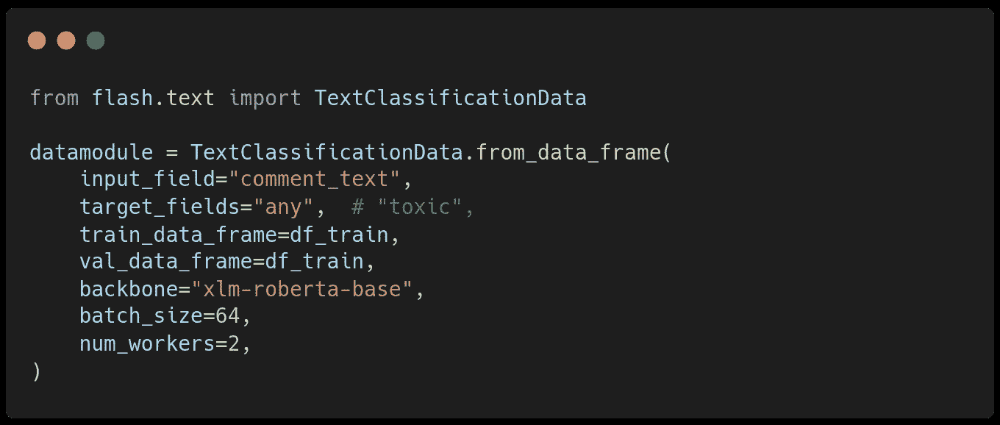

用于创建数据模块的代码快照。

Flash 直接与 HuggingFace 模型中心集成，因此您可以使用这个庞大集合中的任何模型。在这个基线中，我们使用`“xlm-roberta-base”`主干模型。

## 2.创建模型

模型的创建非常简单。我们从创建的数据模块中传递模型名称，并从提供的数据集中自动提取类的数量。

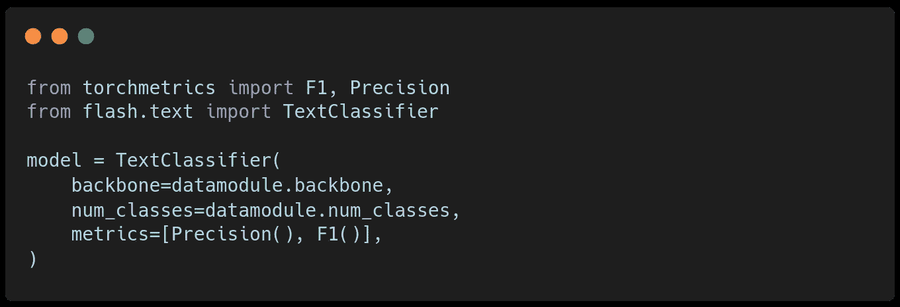

用数据模块创建模型的代码快照。

我们用来自 [TorchMetrics](https://torchmetrics.readthedocs.io/en/stable/) 的[精度](https://torchmetrics.readthedocs.io/en/stable/references/modules.html?highlight=Precision#id4)和 [F1](https://torchmetrics.readthedocs.io/en/stable/references/modules.html?highlight=f1#f1) 分数替换默认的精度指标，以更好地监控我们不平衡数据集的性能。

## 3.训练模型

有了实例化的数据模块和模型，我们就可以开始训练了。由于 Flash 建立在 PyTorch Lightning (PL)之上，您可以使用 [PL 训练器](https://pytorch-lightning.readthedocs.io/en/stable/common/trainer.html)的全部功能来训练您的模型。Flash 有一个内置的默认 Tenrboard 记录器，我们在演示中用 CSVLogger 替换了它，因为它更适合在笔记本上绘制结果。

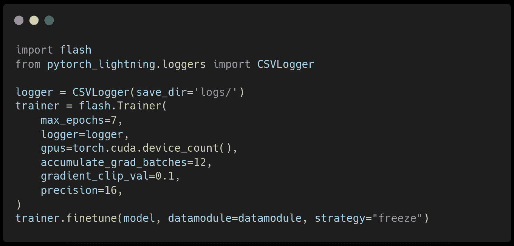

用于定型模型的代码快照。

当训练完成时，我们获取记录结果并绘制进度图。下图显示预训练模型表现良好，我们的微调正在缓慢地改进模型。在这种情况下，我们可以配置优化器、学习率和时间表来提高收敛性。

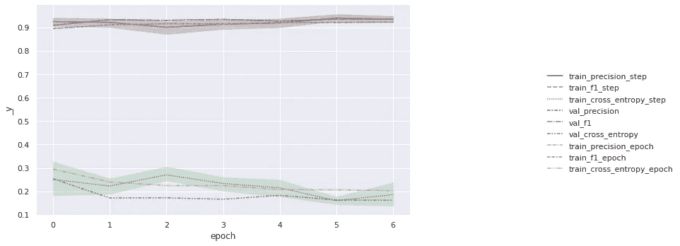

跟踪培训指标。

## 推理和预测

由于竞赛要求某种形式的排名，我们决定返回有毒的概率，而不是二进制标签，因为这将更好地捕捉给定任务的性质。

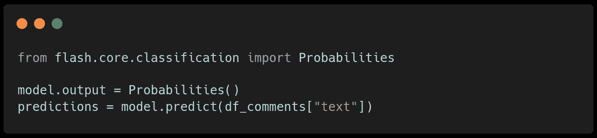

用于切换输出格式的代码快照。

Flash 使得改变预测的输出格式变得很容易。我们可以将输出更改为 Logits，这将在概率范围的两端提供更详细的描述——探索 sigmoid 的 tails squash。

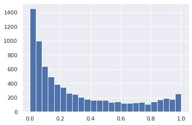

用 Flash 进行比赛预测的概率分布。

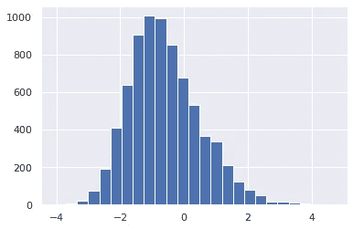

比赛预测的罗吉斯分布。

具有三种预测变量的排行榜上的基线分数为:
*二元:0.509
*概率:0.696
*对数:0.698

# 预训练开源保护解毒

如果您想使用现成的东西进行推理，您可以搜索 HuggingFase hub 并编写简单的推理代码来使用这个模型。为了比较我们基线的性能，我们将它与由 [unitary](https://www.unitary.ai/) 在[解毒](https://github.com/unitaryai/detoxify)项目中预先训练的模型进行了评估，该项目使用了与我们之前的 Flash 基线(`“xlm-roberta-base”`)相同的 HuggingFase Transformers 主干。

> 解毒:训练有素的模型和代码来预测所有 3 个拼图毒性评论挑战的毒性评论。使用 zap Pytorch 闪电和拥抱变形金刚建造。

根据第三届拼图大赛的[公共排行榜](https://github.com/unitaryai/detoxify#description)，该模型的表现与顶级 Kaggle 解决方案不相上下。我们的演示 Kaggle 笔记本第四版公开提供下载的检查点。

[](https://www.kaggle.com/jirkaborovec/score-toxic-comments-with-trained-detoxify) [## 得分🙊受过训练的有毒评论🤗⚡Detoxify

### 使用 Kaggle 笔记本探索和运行机器学习代码|使用来自多个数据源的数据

www.kaggle.com](https://www.kaggle.com/jirkaborovec/score-toxic-comments-with-trained-detoxify) 

在下面的一些章节中，我们将提到使用离线内核来安装包和下载检查点，我们在之前的[帖子](https://towardsdatascience.com/easy-kaggle-offline-submission-with-chaining-kernels-30bba5ea5c4d)中已经描述过了。

[](https://towardsdatascience.com/easy-kaggle-offline-submission-with-chaining-kernels-30bba5ea5c4d) [## 带链接内核的简单 Kaggle 离线提交

### 一个简单的指南，帮助您使用 Kaggle 提交受限互联网接入的比赛…

towardsdatascience.com](https://towardsdatascience.com/easy-kaggle-offline-submission-with-chaining-kernels-30bba5ea5c4d) 

> 为了解决离线加载问题，我使用我的个人叉子进行必要的修复:[https://github.com/Borda/detoxify](https://github.com/Borda/detoxify)

## 加载预训练模型

解毒模型可以通过绕过检查点名称或给出下载的检查点路径并链接 HuggingFace 存储模型和记号赋予器定义来实例化。

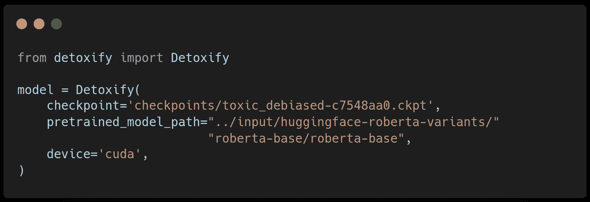

用于从检查点创建模型的代码快照。

## 推论:收集所有预测

该模型内置了对 GPU 推理的支持，并以单行命令的形式预测分数，与 pandas 进程映射相结合。

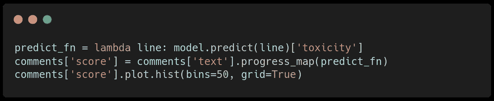

运行预测的代码快照。

与我们之前的 Flash 预测相比，我们可以看到这些分数有利于毒性分数。

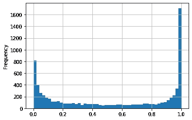

解毒竞争预测的概率分布。

## 对验证数据集进行比较

我们将在提供的验证数据集上演示性能。确认数据集包括相对有害的评论对，其中一个评论被认为比另一个更有害。

30k 个注释对包含 15k 个唯一的注释和简单的唯一性分析。我们只对每个独特的评论预测一次，以减少推理时间，从而对整个数据集产生 15k 个预测，而不是 60k 个预测(2 列* 30k 对)。

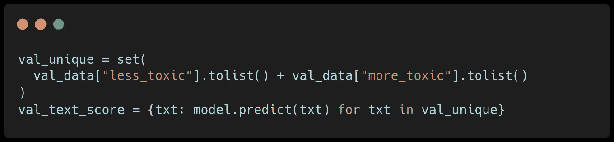

用于提取唯一注释的代码快照，

然后，我们将验证数据集中假设毒性较低和毒性较高的注释的毒性分数作为二元度量进行比较。此外，由于解毒预测所有七个毒性亚类的分数，我们评估他们每一个。

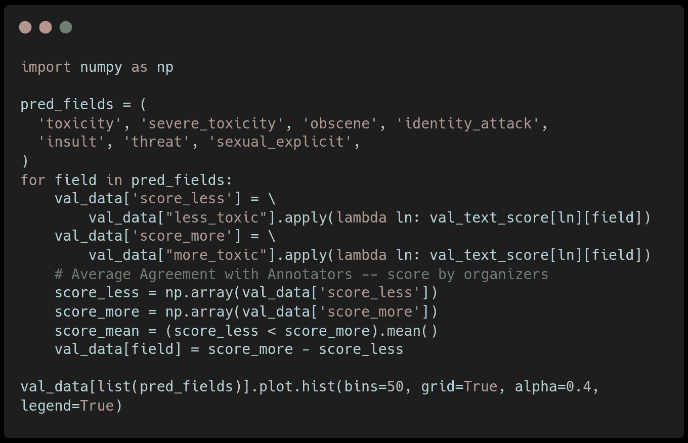

用于获取验证分数的代码快照。

子类别分数的分布非常接近，验证分数从 0.65 到 0.69

```
score for toxicity:             0.69356
score for severe_toxicity:      **0.69542**
score for obscene:              0.68111
score for identity_attack:      0.65862
score for insult:               0.68025
score for threat:               0.65082
score for sexual_explicit:      0.66334
```

下面，我们绘制了分数之间的差异，以便在更丰富的上下文中查看验证指标。如果两个评论分数之差为正，则排名正确，如果为负，则排名不正确。

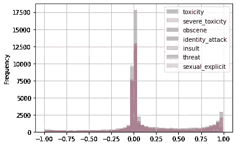

显示验证对中毒性分数的差异。正差异代表正确的陈述，负差异意味着其中一个评论被错误地评分。

与综合各种毒性的 Flash 基线相比，单独使用毒性的任何子类得到 0.698 分并没有改善。

# 关于可能改进的想法

让我们简单地总结一下我们鼓励读者尝试这个竞赛的一些后续步骤，它可以改进我们的基线，并且实现起来相对简单。

## 从验证数据集构造新的数据集

给定注释对的验证数据集，并且知道平均来说，它们中的每一个在数据集中出现大约三次，我们可以进行一些周排序，并将其缩放到范围(0，1)中，并将其用作具有软标签的新训练数据集。

## 超参数搜索

与任何机器学习模型一样，选择最佳超参数以从特定模型中获得最大收益至关重要。在 Flash 与 Transformers 集成的情况下，我们可以优化模型架构、优化器、调度器、学习率、标记器等等。 [Flash Zero CLI](https://lightning-flash.readthedocs.io/en/stable/general/flash_zero.html) 揭示了所有这些，并且可以使用云培训工具进行清理。

[](https://towardsdatascience.com/hyperparameter-optimization-with-grid-ai-and-no-code-change-b89218d4ff49) [## 使用 Grid.ai 进行超参数优化，无需更改代码

### 用 PyTorch 闪电和网格点实例在 Kaggle 上排名的最佳实践(第 4/5 部分)

towardsdatascience.com](https://towardsdatascience.com/hyperparameter-optimization-with-grid-ai-and-no-code-change-b89218d4ff49) 

***你对更酷的 PyTorch 闪电集成感兴趣吗？
关注我，加入我们神奇的***[***Slack***](https://join.slack.com/t/pytorch-lightning/shared_invite/zt-pw5v393p-qRaDgEk24~EjiZNBpSQFgQ)***社区！***

# 关于作者

[**吉尔卡·博罗维克**](/@jborovec) 拥有 CTU 的计算机视觉博士学位。他已经在几家 IT 创业公司和公司从事机器学习和数据科学工作几年了。他喜欢探索有趣的世界问题，用最先进的技术解决它们，并开发开源项目。