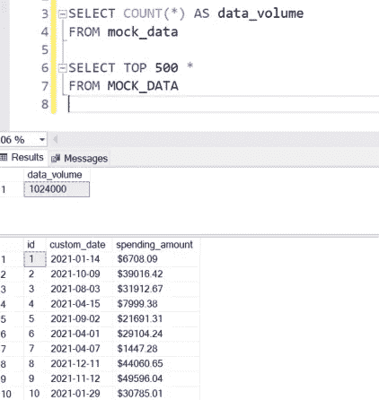
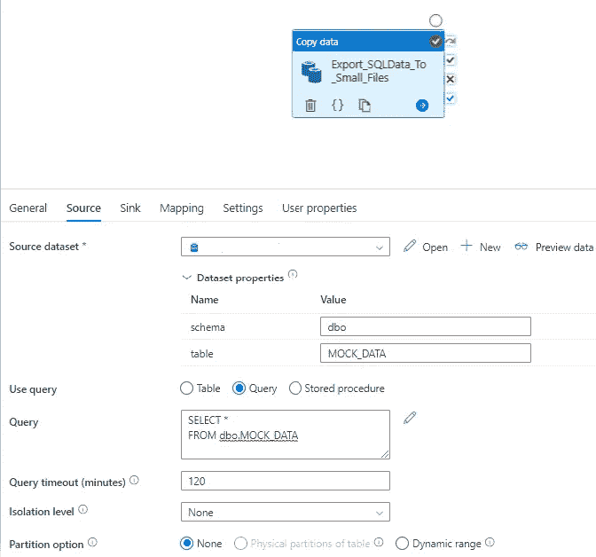
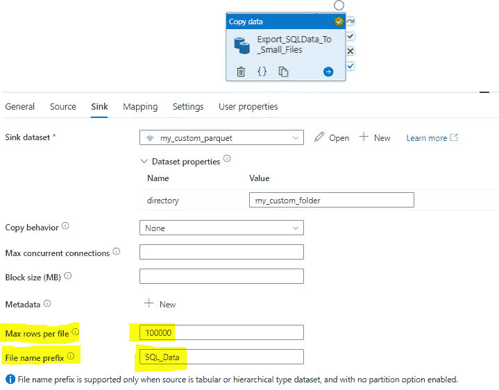
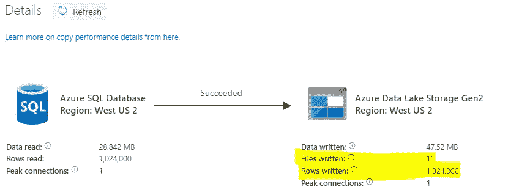
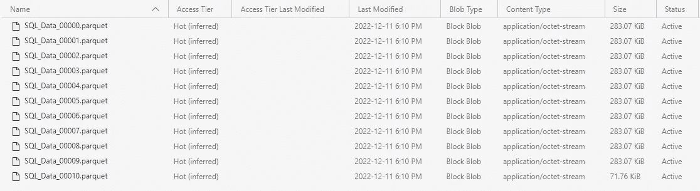
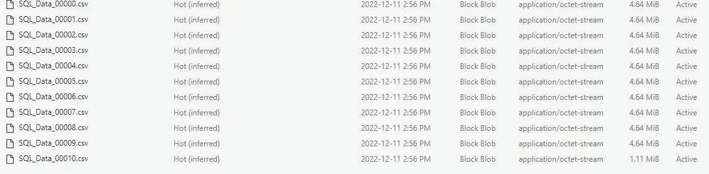

# ADF —您知道在复制过程中可以将一个大文件拆分成多个小文件吗？

> 原文：<https://medium.com/codex/adf-do-you-know-you-can-split-a-large-file-into-multiple-small-files-b423d518e54e?source=collection_archive---------7----------------------->

## 本文描述了如何使用 Azure Data Factory 的复制活动将数据导出到较小的数据文件中，而不是一个大文件中。

pic credit—[https://blogs . SAS . com/content/sgf/2020/07/23/splitting-a-dataset-into-smaller-dataset/](https://blogs.sas.com/content/sgf/2020/07/23/splitting-a-data-set-into-smaller-data-sets/)

# 介绍

Azure Data Factory 的复制活动有很多漂亮的特性，但有时会被忽略。在本文中，让我们使用其中的一个特性，我将演示如何在 ADF 中使用 *max rows per file* 属性。这允许用户将大数据集分割成小文件。

## 源系统

Azure SQL 数据库。我创建了一个名为 *mock_data* 的表，数据量为 1，024，000 行。为了练习，你可以去[https://generatedata.com/](https://generatedata.com/)为自己下载一份测试数据。我的数据看起来如下—

## 我需要做什么？

> 我需要将这个源系统的数据提取到一个文件中。由于 SQL 表包含 100 多万行数据，我想将大数据集分割成较小的块，并将这些小块导出到 ADLSG2 上一个文件夹中的单独文件中。

## 怎么做？

让我们创建一个 ADF 管道来完成这项工作。这将是一个简单的管道，只有一个用于演示目的的复制活动。

来源看起来如下—

(ADF 复印活动)

水槽的配置如图所示—

(每个文件的 ADF 最大行数)

需要记住的要点是—

👉我们可以配置每个文件可以存储的最大行数。在这种情况下，我告诉 ADF 在每个文件中最多分配 100，000 条记录。
👉使用*文件名前缀*，我们可以为通过这个过程创建的每个较小的文件分配一个前缀。在上面的例子中，我让 ADF 在开头用 SQL_Data 标记每个 parquet 文件名。

## 输出

我们最初的 SQL 表包含 1，024，000 行。我们要求每个文件最多有 100，000 行。由此，
`1024000 / 100000 = 10.24`

ADF 将在我们指定的位置创建 11 个较小的文件，每个文件最多可容纳 100，000 行。ADF 中的输出告诉我们同样的故事—

(ADF 每个文件复印的最大行数)

我们可以从 activity 输出中看到，在这个过程中，ADF 生成了 11 个新文件。

因为我们将 sink 数据集指定为一个 parquet 文件，所以在管道运行后，它们在我们的 ADLSG2 文件夹中是这样的——

正如我们所看到的，ADF 还为导出的每个文件分配了一个自动增量编号。

# 结尾部分

如我们所见，我们能够将 1，024，000 行的原始数据提取到 11 个单独的文件中。本例中的接收器是 parquet 文件，但是该属性也适用于 csv 文件。

到目前为止，我已经通过每个文件最多导出一百万行来测试了这个属性，它工作正常。