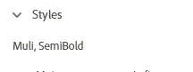
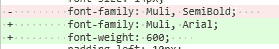
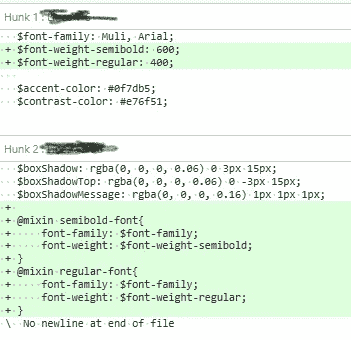
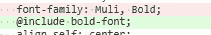

# Adobe Xd 驱动的错误，或者更重要的是，为什么保持干燥非常有用

> 原文：<https://medium.com/codex/adobe-xd-driven-error-or-more-importantly-why-keeping-dry-is-very-useful-512754dcbf76?source=collection_archive---------7----------------------->

干——不要重复自己。这是干净代码的基本原则。本周，我在我们的前端代码中发现了一个错误，这加强了坚持这一原则的必要性。它开始于不久前，当时我们的设计师创作了一些很棒的设计。我们的设计师使用 Adobe xd 将他们的设计传递给我们，开发团队，我们从字面上理解他们的风格。

布拉德利·邓恩在 [Unsplash](https://unsplash.com/s/photos/dry-code?utm_source=unsplash&utm_medium=referral&utm_content=creditCopyText) 上拍摄的照片

下面是 adobe 截图；

从 Adobe Xd 属性页面

对于上下文——我们正在移植到一个非常漂亮可爱的 React UI。非常基于组件。我们有过几次错误的开始，但是现在我们有了一个页面文件夹和一个可重用组件文件夹。每个组件都有自己的样式页面。我们使用语义 CSS (SCSS 驱动)。对于像我这样的人，以及其他 5 个开发人员，他们也犯了下面的两条错误。“半粗体”不是一种字体，它是一种[字体粗细](https://developer.mozilla.org/en-US/docs/Web/CSS/font-weight#meaning_of_relative_weights)。查看之前和之后的 git 变化。

拉德——那里有什么，格林——替代品

这个错误重复了 100 多次。我用手纠正了每一个该死的错误。我们非常擅长保持后端代码的干燥和稳定。使用 React 作为前端框架使得这项任务看起来更加困难。

然后我喝了杯咖啡。意识到我们在常规字体粗细上也犯了同样的错误。

决心不再重复花了一个小时修复的错误，我记得 Scss 允许[混音](https://sass-lang.com/documentation/at-rules/mixin)，它们有点酷。它们允许您将样式规则划分为可重用的代码。我们已经有了一个通用的基本 scss 样式页面，但是我为 semibold 字体添加了 mixins，然后搜索代码库，看看我们是否为其他字体粗细犯了同样的错误。

公共 Scss 页面

然后，我对常规字体和粗体字体重复这个过程。这也花了很长时间。然而，如果我们需要改变所有的字体，我不会再次被抓住。他们现在都在一个地方。-

## 摘要

adobe——请考虑为我们这些阅读 xd 规范的非设计师做点什么。可能是伪 CSS 输出。我们不需要完美，我们可以改变它。或者，清楚地表明 semibold 是一个权重。即使知道它是一个重量的开发者仍然把 semibold 作为一种字体。在制作 react 组件时，如果您重用像这样的常见东西，那么为每个组件使用一个样式表是一个巨大的错误。编写一次东西，然后引用它们，使用 mixin 机制使这个过程变得容易得多。

语义 CSS 标记很酷，但是可维护的代码更酷。