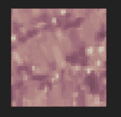

# 使用 Sentinel-2 卫星图像预测玉米作物产量的先进机器学习技术

> 原文：<https://medium.com/codex/advanced-deep-learning-techniques-for-predicting-maize-crop-yield-using-sentinel-2-satellite-1b63ac8b0789?source=collection_archive---------2----------------------->


# **简介**

对田间作物变异性的预测可以帮助农民在不同情况下做出正确的决策。当前在**遥感**和**高分辨率、高频率和免费的 Sentinel-2 图像**方面的进步改善了精准农业在更广泛农民中的实施。

这个故事的目的是创建一个模型，能够估计东非**田地的玉米产量。给定一个时间序列** [**【哨兵 2】图像**](https://scihub.copernicus.eu/dhus/#/home) 和**气候变量**。该模型将能够评估**玉米*玉蜀黍*粮食产量** **每英亩吨的空间变异性。** 本故事使用的数据来自[**津迪**](https://zindi.africa/competitions/cgiar-crop-yield-prediction-challenge/data) **。**

## **这个故事研究了植被指数(VIs)和先进的深度学习技术在预测玉米作物产量中的应用。**

# **为什么是哨兵？**

Sentinel-2 数据为区域和全球农业监测创造了新的机会，因为它能够以 10-20 米的空间分辨率在 12 个光谱带中观察地球，覆盖全球，重访频率为 5 天，并与当前和历史上的 Landsat 任务兼容。监测土壤性质和作物状况，以及绘制耕作活动图，有助于研究人员和农民评估土地使用情况，预测收成，监测季节变化，并协助实施可持续发展政策。随着可用的卫星数据源越来越多，其中许多可以免费使用，潜力是巨大的**(**[***Sentinel-hub，2021***](https://www.sentinel-hub.com/explore/industries-and-showcases/agriculture/)***)*。**


# **玉米作物产量预测的重要 Sentinel-2 波段**

在每个模型被训练并用于预测之后，计算用于预测的所有特征的特征重要性。发现对模型准确性贡献更大的重要 sentinel-2 波段主要是红边波段，尤其是**红边 3(波段 7)** 。此外，**短波红外(波段 10)** 也被称为**卷云**和**近红外窄波段(波段 8A)** 对预测模型有益。


# ***玉米作物产量预测的重要植被指标***

我使用了我在自定义脚本 的 [**Sentinel hub 库中发现的各种光谱植被指数(VI)。然而，在 40 个不同的 VI 中，我发现 25 个仅在预测玉米作物产量方面有意义。**](https://custom-scripts.sentinel-hub.com/custom-scripts/sentinel-2/indexdb/)

**下表 1** 列出了用于估算作物产量的候选 VI。这些植被指数的重要性在最近的研究中得到了确认，这些研究侧重于基于卫星的作物生产和产量估计。然而，我的综述表明，与作物产量有密切关系的植被指数通常包括红边波长，或者被设计成对冠层叶绿素含量敏感。注意到这一点，我决定在 Zindi CGIAR 作物产量预测挑战赛**的获胜者编写的脚本** 中使用 [**函数。**该函数从 Sentinel-2 图像的三个红边波段得出重要特征。**(注意:该函数存在于下面的代码中。)**](https://github.com/Az-Ks/CGIAR_Solution_Code_To_Get_4th_Place/blob/main/CGIAR_SOLUTION_4th_Place.ipynb)


表 1:预测玉米作物产量的重要植被指数


# **气候变量的重要性**

在提供的数据集中，气候变量来自 [**Terraclimate**](http://www.climatologylab.org/terraclimate.html) 。 **TerraClimate** 是 1958-2019 年全球陆地表面每月气候和气候水平衡的数据集。**地形气候**数据具有月时间分辨率和大约 4 千米(1/24 度)的空间分辨率。

地形气候变量是**最高温度、最低温度、水汽压、降水累积、向下地表短波辐射、风速、参考蒸散量(ASCE Penman-Montieth)、径流量、实际蒸散量、气候水分亏缺、土壤水分、雪水当量、帕尔默干旱严重指数、水汽压亏缺。**

除了 **SWE(雪水当量)之外，用于预测的地形气候变量由上面列出的变量组成。**

**注:**在所有用于预测的特征中，气候变量被证明更为重要。**如何？…影响模型准确性的前七(7)个重要特征是气候变量。**

## ***这是利用 5 Xgboost 算法 ***内置的*** 特性重要性实现的。***


表 2:前七(7)个重要气候变量


# **重要的土壤相关特征**

竞赛土壤数据来自 [**ISRIC 世界土壤信息**](https://www.isric.org/explore/soilgrids/) 。土壤网格数据的每个资产都是一幅包含 6 个波段的图像，每个波段对应一个深度(0–5 厘米、5–15 厘米、15–30 厘米、30–60 厘米、60–100 厘米、100–200 厘米)。然而，比赛的土壤数据只有 5 至 15 厘米深的条带。

有助于作物产量模型准确性的前四个重要土壤相关特征是**pH7 时的阳离子交换容量(cec_mean 或 cec)、淤泥(淤泥 _mean)、总氮(氮 _mean)和有机碳密度(ocd_mean)。**

# 建模

## **导入库**

```
import os
import random
import sklearn
import numpy as np
import pandas as pd
import seaborn as sns
import lightgbm as lgb
from lightgbm import LGBMRegressor
from matplotlib import pyplot as plt
from sklearn.model_selection import train_test_split
from sklearn.metrics import mean_squared_log_error
pd.set_option(‘display.max_columns’, None)
import math as Math
from sklearn.metrics import log_loss
from sklearn.model_selection import KFold
RANDOM_STATE = 42
```

## **减少内存使用的功能**

*注意:该函数通过将每一列的数据类型转换为最少的数据类型来减少内存使用，例如，将浮点 64 转换为浮点 16。这是因为较高的数据类型比较低的数据类型(如 float16)消耗更多的内存。*

```
def reduce_mem_usage(df, verbose=True):
    numerics = ['int16', 'int32', 'int64', 'float16', 'float32', 'float64']
    start_mem = df.memory_usage().sum() / 1024**2    
    for col in df.columns:
        col_type = df[col].dtypes
        if col_type in numerics:
            c_min = df[col].min()
            c_max = df[col].max()
            if str(col_type)[:3] == 'int':
                if c_min > np.iinfo(np.int8).min and c_max < np.iinfo(np.int8).max:
                    df[col] = df[col].astype(np.int8)
                elif c_min > np.iinfo(np.int16).min and c_max < np.iinfo(np.int16).max:
                    df[col] = df[col].astype(np.int16)
                elif c_min > np.iinfo(np.int32).min and c_max < np.iinfo(np.int32).max:
                    df[col] = df[col].astype(np.int32)
                elif c_min > np.iinfo(np.int64).min and c_max < np.iinfo(np.int64).max:
                    df[col] = df[col].astype(np.int64)  
            else:
                if c_min > np.finfo(np.float16).min and c_max < np.finfo(np.float16).max:
                    df[col] = df[col].astype(np.float16)
                elif c_min > np.finfo(np.float32).min and c_max < np.finfo(np.float32).max:
                    df[col] = df[col].astype(np.float32)
                else:
                    df[col] = df[col].astype(np.float64)    
    end_mem = df.memory_usage().sum() / 1024**2
    if verbose: print('Mem. usage decreased to {:5.2f} Mb ({:.1f}% reduction)'.format(end_mem, 100 * (start_mem - end_mem) / start_mem))
    return df
```

## **加载数据集**

```
#Path to Data Folder
link = 'C:/Crop Yield Prediction/'#Training dataframe
train_df = pd.read_csv(link + 'Train.csv')#years for the test fields
test_field_ids_years_df = pd.read_csv(link + 'test_field_ids_with_year.csv') #additional soil and climate information
add_info_df = pd.read_csv(link + 'fields_w_additional_info.csv') #Sample Submission File
ss = pd.read_csv(link + 'SampleSubmission.csv')
```

## **查看卫星图像**

```
train_folder =  'C:/Crop Yield Prediction/image_arrays_train/image_arrays_train/'fid = train_df['Field_ID'].sample().values[0]fn =  train_folder + fid + '.npy' 

print(f'Loading {fn} as an array')#Loading the data with numpy
arr = np.load(fn)#360 bands, images 40 or 41px a side
print('Array shape:', arr.shape)#Combine three bands for viewing
rgb_jan = np.stack([arr[4], arr[3], arr[2]], axis=-1)#Scale band values to (0, 1) for easy image display
rgb_jan = rgb_jan / np.max(rgb_jan)#View with matplotlib
plt.imshow(rgb_jan)
```



## **查看 12 个月的伪彩色图像**

```
fig, axs = plt.subplots(3, 4, figsize=(12, 8), facecolor='w', edgecolor='k')
fig.subplots_adjust(hspace = .5, wspace=.001)
axs = axs.ravel()
for i  in range(12):
  #False colour (band 8, 4 and 3)
  rgb = np.stack([arr[i*30 +8], arr[i*30 + 4], arr[i*30 + 3]], axis=-1)
  #Scaling consistently
  rgb = rgb / 4000 
  axs[i].imshow(rgb.clip(0, 1))
  axs[i].set_title(str(i+1))
```


## **查看图像波段名称**

```
band_names = [l.strip() for l in open(link + 'bandnames.txt', 'r').readlines()]
print(band_names)
```


# **特征工程提示**

```
**1\. Specify Bands of Interest and Average Center Points
2\. Average Climate Values Over 4 Years By Each Month in Maize Season in kenya for some Climate Variables
3\. Generate Statistics for vegetation indices covering a whole sentinel-2 imagery
4\. Use of Significant Vegetation Indices
5\. Generate Statistics from Vegetation Indices (Max, Min, Median)
6\. Generate Median Features From Red Bands** 
```

***注*** *:下面的 Python 函数是特征工程函数。*

## **指定感兴趣的波段和平均中心点**

```
# Center Point 20
def process_im_20(fid, folder='C:/Crop Yield Prediction/image_arrays_train/image_arrays_train/'):

  fn = f'{folder}/{fid}.npy'
  arr = np.load(fn)
  bands_of_interest = ['S2_B12', 'S2_B11', 'S2_B10', 'S2_B9', 'S2_B8', 'S2_B8A', 'S2_B7', 'S2_B6', 'S2_B5',
                       'S2_B4', 'S2_B3', 'S2_B2', 'S2_B1', 'CLIM_pr', 'CLIM_soil', 'CLIM_aet', 'CLIM_def', 
                       'CLIM_pdsi', 'CLIM_pet', 'CLIM_ro', 'CLIM_srad', 'CLIM_swe', 'CLIM_tmmn', 'CLIM_tmmx', 
                       'CLIM_vap', 'CLIM_vpd', 'CLIM_vs']
  values = {}
  for month in range(2, 9):
    bns = [str(month) + '_' + b for b in bands_of_interest] 
    idxs = np.where(np.isin(band_names, bns)) # Index of these bands
    vs = arr[idxs, 20, 20] # Sample the im at the center point
    for bn, v in zip(bns, vs[0]):
      values[bn] = v
  return values# Center point_30_10
def process_im_30_10(fid, folder='C:/Crop Yield Prediction/image_arrays_train/image_arrays_train/'):

  fn = f'{folder}/{fid}.npy'
  arr = np.load(fn)
  bands_of_interest = ['S2_B12', 'S2_B11', 'S2_B10', 'S2_B9', 'S2_B8', 'S2_B8A', 'S2_B7', 'S2_B6', 'S2_B5',
                       'S2_B4', 'S2_B3', 'S2_B2', 'S2_B1', 'CLIM_pr', 'CLIM_soil', 'CLIM_aet', 'CLIM_def', 
                       'CLIM_pdsi', 'CLIM_pet', 'CLIM_ro', 'CLIM_srad', 'CLIM_swe', 'CLIM_tmmn', 'CLIM_tmmx', 
                       'CLIM_vap', 'CLIM_vpd', 'CLIM_vs']
  values = {}
  for month in range(2, 9):
    bns = [str(month) + '_' + b for b in bands_of_interest] # Bands of interest for this month 
    idxs = np.where(np.isin(band_names, bns)) # Index of these bands
    vs = arr[idxs, 30, 10] # Sample the im at the center point
    for bn, v in zip(bns, vs[0]):
      values[bn] = v
  return values# Center point_10_30
def process_im_10_30(fid, folder='C:/Crop Yield Prediction/image_arrays_train/image_arrays_train/'):

  fn = f'{folder}/{fid}.npy'
  arr = np.load(fn)
  bands_of_interest = ['S2_B12', 'S2_B11', 'S2_B10', 'S2_B9', 'S2_B8', 'S2_B8A', 'S2_B7', 'S2_B6', 'S2_B5',
                       'S2_B4', 'S2_B3', 'S2_B2', 'S2_B1', 'CLIM_pr', 'CLIM_soil', 'CLIM_aet', 'CLIM_def', 
                       'CLIM_pdsi', 'CLIM_pet', 'CLIM_ro', 'CLIM_srad', 'CLIM_swe', 'CLIM_tmmn', 'CLIM_tmmx', 
                       'CLIM_vap', 'CLIM_vpd', 'CLIM_vs']
  values = {}
  for month in range(2, 9):
    bns = [str(month) + '_' + b for b in bands_of_interest] # Bands of interest for this month 
    idxs = np.where(np.isin(band_names, bns)) # Index of these bands
    vs = arr[idxs, 10, 30] # Sample the im at the center point
    for bn, v in zip(bns, vs[0]):
      values[bn] = v
  return values
```

## **肯尼亚四年来每个玉米季节月份的平均气候变量**

```
def average_variables(add_info_df, special_cols) : 

 additional_ = pd.DataFrame()
 climat = [‘pr’,’tmmn’,’tmmx’]for month in range(2, 9): 
 for climat_ in climat :
 features_ = []
 for year in [2016,2017,2018,2019] :
 features_.append(‘climate_’+str(year) + ‘_’ + str(month) + f’_{climat_}’ )
 additional_[f’Average_for_4_Years_Variables{month-1}_{climat_}’] = add_info_df[features_].mean(axis=1)

 # Soil Columns
 for col in special_cols : 
 additional_[col] = add_info_df[col]
 return additional_
```

## **覆盖整个 sentinel-2 影像的植被指数统计**

```
# SAVI
def get_SAVI_data(fid, folder=None) :
  fn = f'{folder}/{fid}.npy'
  arr = np.load(fn)
  bands_of_interest = ['S2_B4', 'S2_B8']
  L = 0.725
  values = {}

  for month in range(12): 
    bns = [str(month) + '_' + b for b in bands_of_interest] 
    idxs = np.where(np.isin(band_names, bns)) 
    B08 = arr[idxs][1].astype(int)
    B04 = arr[idxs][0].astype(int)

    SAVI_arr = (B08 - B04) / (B08 + B04 + L) * (1.0 + L)
    values['SAVI_Max_'+str(month)] = SAVI_arr.max()

  return values# EVI
def get_EVI_data(fid, folder=None) :
  fn = f'{folder}/{fid}.npy'
  arr = np.load(fn)
  bands_of_interest = ['S2_B4', 'S2_B8','S2_B2']
  values = {}

  for month in range(12): 
    bns = [str(month) + '_' + b for b in bands_of_interest] 
    idxs = np.where(np.isin(band_names, bns)) 
    B08 = arr[idxs][1].astype(int)
    B04 = arr[idxs][0].astype(int)
    B02 = arr[idxs][2].astype(int)

    EVI_arr = 2.5 * (B08 - B04) / ((B08 + 6.0 * B04 - 7.5 * B02) + 1.0)
    values['EVI_Median_'+str(month)] = np.median(EVI_arr)

  for month in range(12):
    bns = [str(month) + '_' + b for b in bands_of_interest] 
    idxs = np.where(np.isin(band_names, bns)) 
    B08 = arr[idxs][1].astype(int)
    B04 = arr[idxs][0].astype(int)
    B02 = arr[idxs][2].astype(int)

    EVI_arr = 2.5 * (B08 - B04) / ((B08 + 6.0 * B04 - 7.5 * B02) + 1.0)
    values['EVI_Max_'+str(month)] = EVI_arr.max()

  return values# NDVI
def get_NDVI_data(fid, folder=None) :
  fn = f'{folder}/{fid}.npy'
  arr = np.load(fn)
  bands_of_interest = ['S2_B4', 'S2_B8']
  values = {}

  for month in range(12): 
    bns = [str(month) + '_' + b for b in bands_of_interest] 
    idxs = np.where(np.isin(band_names, bns)) 

    NDVI_arr = (arr[idxs][1].astype(int)-arr[idxs][0].astype(int)) / (arr[idxs][1].astype(int)+arr[idxs][0].astype(int))
    values['NDVI_Median_'+str(month)] = np.median(NDVI_arr)

  for month in range(12): 
    bns = [str(month) + '_' + b for b in bands_of_interest] 
    idxs = np.where(np.isin(band_names, bns)) 

    NDVI_arr = (arr[idxs][1].astype(int)-arr[idxs][0].astype(int)) / (arr[idxs][1].astype(int)+arr[idxs][0].astype(int))
    values['NDVI_Min_'+str(month)] = NDVI_arr.min()
    values['NDVI_Max_'+str(month)] = NDVI_arr.max()

  return values# NDWI
def get_NDWI_data(fid, folder=None) :
  fn = f'{folder}/{fid}.npy'
  arr = np.load(fn)
  bands_of_interest = ['S2_B8', 'S2_B3']
  values = {}

  for month in range(12): 
    bns = [str(month) + '_' + b for b in bands_of_interest] 
    idxs = np.where(np.isin(band_names, bns)) 

    NDVI_arr = (arr[idxs][1].astype(int)-arr[idxs][0].astype(int)) / (arr[idxs][1].astype(int)+arr[idxs][0].astype(int))
    values['NDWI_Median_'+str(month)] = np.median(NDVI_arr)

  for month in range(12): 
    bns = [str(month) + '_' + b for b in bands_of_interest] 
    idxs = np.where(np.isin(band_names, bns)) 

    NDVI_arr = (arr[idxs][1].astype(int)-arr[idxs][0].astype(int)) / (arr[idxs][1].astype(int)+arr[idxs][0].astype(int))
    values['NDWI_Min_'+str(month)] = NDVI_arr.min()
    values['NDWI_Max_'+str(month)] = NDVI_arr.max()

  return values# NDMI
def get_NDMI_data(fid, folder=None) :
  fn = f'{folder}/{fid}.npy'
  arr = np.load(fn)
  bands_of_interest = ['S2_B11', 'S2_B8']
  values = {}

  for month in range(12): 
    bns = [str(month) + '_' + b for b in bands_of_interest] 
    idxs = np.where(np.isin(band_names, bns)) 

    NDVI_arr = (arr[idxs][1].astype(int)-arr[idxs][0].astype(int)) / (arr[idxs][1].astype(int)+arr[idxs][0].astype(int))
    values['NDMI_Median_'+str(month)] = np.median(NDVI_arr)

  for month in range(12): 
    bns = [str(month) + '_' + b for b in bands_of_interest] 
    idxs = np.where(np.isin(band_names, bns)) 

    NDVI_arr = (arr[idxs][1].astype(int)-arr[idxs][0].astype(int)) / (arr[idxs][1].astype(int)+arr[idxs][0].astype(int))
    values['NDMI_Min_'+str(month)] = NDVI_arr.min()
    values['NDMI_Max_'+str(month)] = NDVI_arr.max()

  return values
```

## **植被指数**

```
def vegetation_indices(train_sampled):

    # NDVI = NIR-Red/NIR+Red = Band8-Band4/Band8+Band4
    for i in range(2, 10):
        train_sampled['NDVI_Month_' + str(i)] = (train_sampled[str(i) + '_S2_B8'] - train_sampled[str(i) + '_S2_B4'])/(train_sampled[str(i) + '_S2_B8'] + train_sampled[str(i) + '_S2_B4']) # SAVI = ((NIR - RED)/ (NIR + RED + L))*(1 + L)
    for i in range(2, 10):
        train_sampled['SAVI_Month_' + str(i)] = ((train_sampled[str(i) + '_S2_B8']
                                                  - train_sampled[str(i) + '_S2_B4']) / (train_sampled[str(i) + '_S2_B8']
                                                 + train_sampled[str(i) + '_S2_B4'] + 1)) * (1 + 1) # ARVI = (NIR – (2 * Red) + Blue) / (NIR + (2 * Red) + Blue)
    for i in range(2, 10):
        train_sampled['ARVI_Month_' + str(i)] = (train_sampled[str(i) + '_S2_B8']
                                                 -(2*train_sampled[str(i) + '_S2_B4']) 
                                                 + train_sampled[str(i) + '_S2_B2']) / (train_sampled[str(i) + '_S2_B8']
                                                 +(2*train_sampled[str(i) + '_S2_B4']) 
                                                 + train_sampled[str(i) + '_S2_B2']) # GCI = (NIR) / (Green) – 1
    for i in range(2, 10):
        train_sampled['GCI_Month_' + str(i)] = (train_sampled[str(i) + '_S2_B8'])/(train_sampled[str(i) + '_S2_B3'])-1 # NDWI = (NIR-SWIR)/(NIR+SWIR)
    for i in range(2, 10):
        train_sampled['NDWI_Month_' + str(i)] = (train_sampled[str(i) + '_S2_B3']
                                                    - train_sampled[str(i) + '_S2_B8'])/(train_sampled[str(i) + '_S2_B3']
                                                                                         + train_sampled[str(i) + '_S2_B8']) # RVI = (NIR/RED)
    for i in range(2, 10):
         train_sampled['RVI_Month_' + str(i)] = (train_sampled[str(i) + '_S2_B8']) / (train_sampled[str(i) + '_S2_B4']) # OSAVI ((1.0 + 0.16) * (B08 - B04) / (B08 + B04 + 0.16))
    for i in range(2, 10):
         train_sampled['OSAVI_Month_' + str(i)] = ((1 + 0.16) * (train_sampled[str(i) + '_S2_B8'] - train_sampled[str(i) + '_S2_B4'])/
                                                  (train_sampled[str(i) + '_S2_B8'] + train_sampled[str(i) + '_S2_B4'] + 0.16)) # SLAVI = B08 / (B04 + B12)
    for i in range(2, 10):
         train_sampled['SLAVI_Month_' + str(i)] =  ((train_sampled[str(i) + '_S2_B8'])/ (train_sampled[str(i) + '_S2_B4'] +  train_sampled[str(i) + '_S2_B12'])) # NPCRI (b4-b2)/(b4 + b2)
    for i in range(2, 10):
         train_sampled['NPCRI_Month_' + str(i)] =  ((train_sampled[str(i) + '_S2_B4'] - train_sampled[str(i) + '_S2_B2'])/(train_sampled[str(i) + '_S2_B4'] + train_sampled[str(i) + '_S2_B2'])) # Soil Composition Index = (B11 - B08) / (B11 + B08)
    for i in range(2, 10):
         train_sampled['SCI_Month_' + str(i)] =  ((train_sampled[str(i) + '_S2_B11'] - train_sampled[str(i) + '_S2_B8']) / (train_sampled[str(i) + '_S2_B11'] + train_sampled[str(i) + '_S2_B8']))# SARVI (1.0 + L) * (B08 - (Rr - y * (RB - Rr))) / (B08 + -(Rr - y * (RB - Rr)) + L)     # y = 0.735; Rr = 0.740; L = 0.487; RB = 0.560;
    for i in range(2, 10):
         train_sampled['SARVI_Month_' + str(i)] =  (1.0 + 0.487) * (train_sampled[str(i) + '_S2_B8']- (0.740 - 0.735 * (0.560 - 0.740)))/  (train_sampled[str(i) + '_S2_B8'] + - (0.740 - 0.735 * (0.560 - 0.740)) + 0.487) # ndmi = (b8 - b11) / (b8 + b11)
    for i in range(2, 10):
        train_sampled['NDMI_Month_' + str(i)] = (train_sampled[str(i) + '_S2_B8'] - train_sampled[str(i) + '_S2_B11'])/ (train_sampled[str(i) + '_S2_B8'] + train_sampled[str(i) + '_S2_B11'])

    # EVI_2 = 2.5 (NIR - RED)/(NIR + C2 * Blue + l)
    for i in range(2, 9):
        train_sampled['EVI_2_Month_' + str(i)] = 2.5* ((train_sampled[str(i) + '_S2_B8'] 
                                                      - train_sampled[str(i) + '_S2_B4'])/((train_sampled[str(i) + '_S2_B8']) + (2.4 * train_sampled[str(i) + '_S2_B4'])+1))

    return train_sampled
```

## **植被指数统计**

```
def vegetation_index_statistics(train_sampled, spectral_indices = None):
    for i in spectral_indices:
        train_sampled[f'{i}_min'] = train_sampled.filter(regex = f'^{i}').min(axis = 1)
        train_sampled[f'{i}_max'] = train_sampled.filter(regex = f'^{i}').max(axis = 1)
        train_sampled[f'{i}_avg'] = train_sampled.filter(regex = f'^{i}').mean(axis = 1)
        train_sampled[f'{i}_median'] = train_sampled.filter(regex = f'^{i}').median(axis = 1)
    return train_sampled
```

## **红色条带的中值特征**

```
def get_features_from_Bands(fid, folder='C:/Crop Yield Prediction/image_arrays_train/image_arrays_train', bands=None, Band_Names=None) :

  fn = f'{folder}/{fid}.npy'
  arr = np.load(fn)

  final_values = {}
  for bands_idx in range(len(bands)) : 
    bands_of_interest = bands[bands_idx]
    Name = Band_Names[bands_idx]
    values = {}
    for month in range(12):
      bns = [str(month) + '_' + b for b in bands_of_interest] 
      idxs = np.where(np.isin(band_names, bns)) 
      Relation_arr = arr[idxs][1].astype(int) / arr[idxs][0].astype(int) 

      values[f'BANDS_FEATURES_Median_{Name}_'+str(month)] = np.median(Relation_arr)

    final_values.update(values)
  return final_values
```

# 处理和准备—数据和特征

```
1 Apply the **Specify** **Bands of Interest and Average Center Points** functions
2 Apply the **Reduce Memory Usage** function
3 Apply the **Average Climate Values Over 4 Years** function
4 Apply the **Statistics for indices covering a whole sentinel-2 imagery** function
5 Apply the **Vegetation indices** function
6 Apply the **Statistic from Vegetation Indices** function
7 Apply the **Median Features from Red Band** function
```

## 应用**指定** **感兴趣波段和平均中心点**功能

```
# Specify Bands of Interest and Center Point
train_sampled_10 = pd.DataFrame([process_im_10_30(fid) for fid in train_df['Field_ID'].values])
train_sampled_20 = pd.DataFrame([process_im_20(fid) for fid in train_df['Field_ID'].values])
train_sampled_30 = pd.DataFrame([process_im_30_10(fid) for fid in train_df['Field_ID'].values])# divide the three dataframes by each other
train_sampled = 0
train_sampled = (train_sampled_10 + train_sampled_20 + train_sampled_30)/ 3
```

## 应用**减少内存使用**功能

```
train_sampled = reduce_mem_usage(train_sampled)
```

## 应用**4 年平均气候值**功能

```
# Average some specific Climate Variables for Additional Data
special_cols = add_info_df.columns[:12] # define columns needed for averaging
averaging_df = average_variables(add_info_df, special_cols)train_sampled['Yield'] = train_df['Yield'].values # Add in the field ID and yield
train_sampled['Field_ID'] = train_df['Field_ID'].values
train_sampled = pd.merge(train_sampled,averaging_df,on='Field_ID',how='left') # merge together with train_sampled using "field_id"
```

## 对覆盖整个 sentinel-2 图像的指数应用**统计**功能

```
train_EVI = pd.DataFrame([get_EVI_data(train_df['Field_ID'].values[fid_idx], folder = 'C:/Crop Yield Prediction/image_arrays_train/image_arrays_train/') for fid_idx in tqdm(range(len(train_df['Field_ID'].values))) ])
train_EVI['Field_ID'] = train_df['Field_ID'].valuestrain_SAVI = pd.DataFrame([get_SAVI_data(train_df['Field_ID'].values[fid_idx], folder = 'C:/Crop Yield Prediction/image_arrays_train/image_arrays_train/') for fid_idx in tqdm(range(len(train_df['Field_ID'].values))) ])
train_SAVI['Field_ID'] = train_df['Field_ID'].valuestrain_NDVI = pd.DataFrame([get_NDVI_data(train_df['Field_ID'].values[fid_idx], folder = 'C:/Crop Yield Prediction/image_arrays_train/image_arrays_train/') for fid_idx in tqdm(range(len(train_df['Field_ID'].values))) ])
train_NDVI['Field_ID'] = train_df['Field_ID'].valuestrain_NDWI = pd.DataFrame([get_NDWI_data(train_df['Field_ID'].values[fid_idx], folder = 'C:/Crop Yield Prediction/image_arrays_train/image_arrays_train/') for fid_idx in tqdm(range(len(train_df['Field_ID'].values))) ])
train_NDWI['Field_ID'] = train_df['Field_ID'].valuestrain_NDMI = pd.DataFrame([get_NDMI_data(train_df['Field_ID'].values[fid_idx], folder = 'C:/Crop Yield Prediction/image_arrays_train/image_arrays_train/') for fid_idx in tqdm(range(len(train_df['Field_ID'].values))) ])
train_NDMI['Field_ID'] = train_df['Field_ID'].valuestrain_sampled = pd.merge(train_sampled,train_EVI,on='Field_ID',how='left') # merge train_f together with train_sampled using "field_id"
train_sampled = pd.merge(train_sampled,train_SAVI,on='Field_ID',how='left') # merge train_f together with train_sampled using "field_id"
train_sampled = pd.merge(train_sampled,train_NDVI,on='Field_ID',how='left') # merge train_f together with train_sampled using "field_id"
train_sampled = pd.merge(train_sampled,train_NDWI,on='Field_ID',how='left') # merge train_f together with train_sampled using "field_id"
train_sampled = pd.merge(train_sampled,train_NDMI,on='Field_ID',how='left') # merge train_f together with train_sampled using "field_id"
```

## 应用**植被指数**功能

```
train_sampled = vegetation_indices(train_sampled)
```

## 应用**植被指数统计**功能

```
indices = ['NDVI', 'SARVI', 'SAVI', 'GCI', 'SCI', 'ARVI', 'SLAVI', 'RVI','OSAVI', 'NPCRI', 'NDMI', 'NDWI', 'EVI_2']train_sampled = vegetation_index_statistics(train_sampled, spectral_indices= indices)
```

## 应用红带功能中的**中值特征**和

```
bands = [ [‘S2_B7’,’S2_B5'] ,[‘S2_B7’,’S2_B6']] 
names = [‘FEATURES_B7_B5’,’FEATURES_B7_B6'] 
train_f = pd.DataFrame([get_features_from_Bands(train_df[‘Field_ID’].values[fid_idx],bands=bands,Band_Names=names)
 for fid_idx in tqdm(range(len(train_df[‘Field_ID’].values))) ])
train_f[‘Field_ID’] = train_df[‘Field_ID’].values # add the field_id to the tain_f dataframe
train_sampled = pd.merge(train_sampled,train_f,on=’Field_ID’,how=’left’) # merge train_f together with train_sampled using “field_id”
```

****注:** *由于对数据进行数学运算，可能会出现缺失值。要发现数据中是否存在缺失值，请检查缺失值。***

****发现缺失值—** 如果存在缺失值，用每列中最常出现的缺失值填充。**

```
def missing_zero_values_table(df):
        zero_val = (df == 0.00).astype(int).sum(axis=0)
        mis_val = df.isnull().sum()
        mis_val_percent = 100 * df.isnull().sum() / len(df)
        mz_table = pd.concat([zero_val, mis_val, mis_val_percent], axis=1)
        mz_table = mz_table.rename(
        columns = {0 : 'Zero Values', 1 : 'Missing Values', 2 : '% of Total Values'})
        mz_table['Total Zero Missing Values'] = mz_table['Zero Values'] + mz_table['Missing Values']
        mz_table['% Total Zero Missing Values'] = 100 * mz_table['Total Zero Missing Values'] / len(df)
        mz_table['Data Type'] = df.dtypes
        mz_table = mz_table[
            mz_table.iloc[:,1] != 0].sort_values(
        '% of Total Values', ascending=False).round(1)
        print ("Your selected dataframe has " + str(df.shape[1]) + " columns and " + str(df.shape[0]) + " Rows.\n"      
            "There are " + str(mz_table.shape[0]) +
              " columns that have missing values.")
#         mz_table.to_excel('D:/sampledata/missing_and_zero_values.xlsx', freeze_panes=(1,0), index = False)
        return mz_tablemissing_zero_values_table(train_sampled)# Fill with the most occurent value in each column
train_sampled = train_sampled.fillna(train_sampled.mode().iloc[0])
```

# *****培训和测试—交叉验证*****

## *****实现了 XGBoost 算法。*****

# ****为什么是 XGBoost？****

1.  ***执行速度。***
2.  ***车型性能***

> **XGBoost 是一种算法，最近一直主导着应用机器学习和针对[](https://www.quora.com/What-is-structured-data-in-the-context-of-machine-learning)**结构化或表格化数据的[](https://www.kaggle.com/competitions)**。XGBoost 是梯度提升决策树的实现，旨在提高速度和性能。******

*   ******当讨论执行速度时，XGBoost 很快。与梯度增强的其他实现相比，速度非常快。******
*   ******XGBoost 在分类和回归预测建模问题上主导结构化或表格化数据集。证据是，它是 Kaggle 竞争数据科学平台上竞赛获胜者的首选算法。******

```
****from sklearn.model_selection import KFold
import xgboost as xgb
from sklearn.metrics import mean_squared_errorX, y  = train_sampled.drop(['Field_ID'],axis=1), train_df['Yield']kf = KFold(n_splits =5,shuffle=True,random_state=160)
feats = pd.DataFrame({'features': X.columns}) 
gbm_predictions = []
cv_score_ = 0
oof_preds = np.zeros((train_df.shape[0],))for i,(tr_index,test_index) in enumerate(kf.split(X,y)):
    print()
    print(f'######### FOLD {i+1} / {kf.n_splits} ')X_train,y_train = X.iloc[tr_index,:],y[tr_index]
    X_test,y_test = X.iloc[test_index,:],y[test_index]

    gbm = xgb.XGBRegressor(eval_metric = 'rmse',n_estimators = 2000,learning_rate = 0.001,seed=162,random_state = 162,colsample_bytree=0.65)gbm.fit(X_train,y_train,eval_set = [(X_test, y_test)],early_stopping_rounds = 200,verbose=100)cv_score_ += mean_squared_error(y_test, gbm.predict(X_test), squared=False) / kf.n_splits
    oof_preds[test_index] = gbm.predict(X_test)preds = gbm.predict(test_sampled[X_train.columns])
    gbm_predictions.append(preds)feats[f'Fold {i}'] = gbm.feature_importances_feats['Importances'] = feats.mean(axis=1)
print( ' CV RMSE : ',cv_score_)
preds_xgb = np.average(gbm_predictions, axis=0)
print(preds_xgb.shape)****
```

> ********注:** *其他梯度提升决策树如*[***light GBM***](https://lightgbm.readthedocs.io/en/latest/)*都可以实现。然而，为了进一步提高作物产量预测模型的准确性，需要做更多的技巧来生成更重要的特征，并且模型超参数调整也将增加模型的预测能力。*******

******非常感谢 [***津迪***](https://zindi.africa/competitions) *以及津迪 CGIAR 作物产量预测挑战赛的获胜者。*******

*********好好关注我，了解更多关于深度学习在 GIS 中的应用的更新故事。*********

> ********参考文献********

******[](https://www.frontiersin.org/articles/10.3389/fenvs.2020.00085/full) [## Sentinel-2 在小农农林景观中作物产量估算的潜力…

### 非洲国家缺乏实地范围的作物生产统计数据，这限制了对产量的潜在研究…

www.frontiersin.org](https://www.frontiersin.org/articles/10.3389/fenvs.2020.00085/full) 

[***第四名为辛迪加农作物产量预测挑战赛***](https://github.com/Az-Ks/CGIAR_Solution_Code_To_Get_4th_Place/blob/main/CGIAR_SOLUTION_4th_Place.ipynb) ***。*********