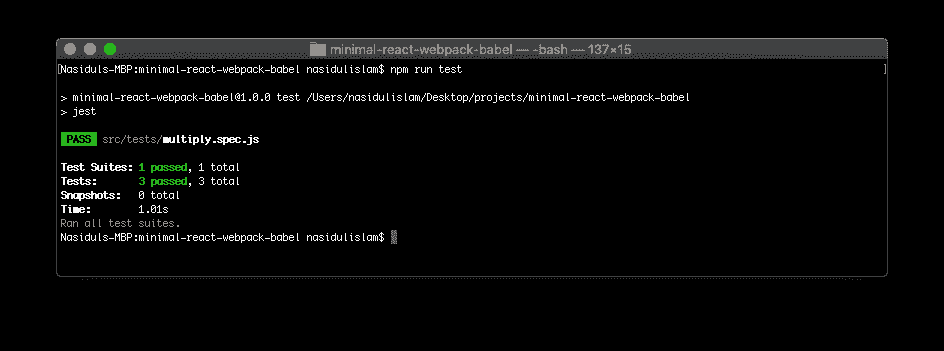
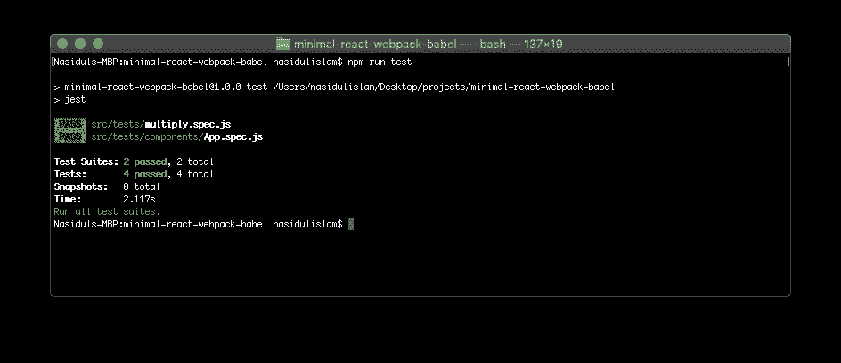

# 高级 React + Webpack 4 + Babel 7 Web 应用程序设置

> 原文：<https://medium.com/codex/advanced-react-webpack-4-babel-7-web-application-setup-698651f9f50f?source=collection_archive---------13----------------------->


构建用户界面的世界可能是一个复杂的导航场景。可供开发人员使用的工具数量之多令人应接不暇。在我的上一篇[教程](https://nasidul-islam.medium.com/beginners-guide-to-minimal-react-webpack-4-babel-7-project-setup-9d2c9921e7b6)中，我们讨论了其中的一些工具(React、Webpack 和 Babel ),并回顾了它们是什么以及如何工作的基础知识。此外，我们还学习了如何将它们缝合在一起，从头开始构建适合开发的应用程序代码库。

拼凑起来的应用程序只有最少的功能。它不允许我们测试我们正在编写的代码，当然也不适合部署到产品中。**在本指南**中，我们将在现有设置的基础上更进一步

*   学习开发+生产环境配置
*   添加测试框架
*   厚颜无耻
*   埃斯林特
*   静态资产(图像、SVG 图标、字体图标、字体系列)

*简介部分可以跳过。点击* [*此处*](https://nasidulislam.hashnode.dev/advanced-react-webpack-4-babel-7-web-application-setup?guid=none&deviceId=35dfb059-423f-4ff4-b206-b24d0ee035f1#step-1) *直接跳转到分步指南。*

# 环境配置

一个应用程序由特性组成，每个特性都有一个生命周期— —从它成为`developed`，然后经过`testing`，最后被部署到`production`，它存在于不同的环境中( *envs* )。环境服务于不同的目的，因此它们的需求也相应地不同。

例如，我们不关心 *dev* env 中的性能或优化，也不关心代码的缩减。通常，我们会启用 dev env 中的工具来帮助我们编写代码和调试代码，比如源代码映射、linters 等。另一方面，在 *prod* env 上，我们绝对关心应用程序性能和安全性、缓存等。在浏览本指南时，我们将使用的工具不会涉及我们在此讨论的所有项目，但是，我们将浏览环境配置如何工作以及它为什么有用的基础知识(以及更多内容)。

# 测试框架

测试框架为我们提供了一个平台和一套规则，允许我们测试我们正在编写的代码。任何打算为用户部署的应用程序都必须经过测试。原因如下:

*   **这有助于减少 bug**的数量— —如果我们为*出现的 bug*编写新的测试，我们就能极大地降低那个特定 bug 再次出现的可能性。
*   当我们试图重构代码时，它给了我们信心。失败的测试意味着重构的代码不能满足特定的场景。
*   **提高了代码质量**，因为开发人员必须编写可测试的代码，尽管编写好的测试本身是一种完全不同的(并且*非常*有价值的)技能
*   以上所有的原因**从长远来看降低了开发的整体成本**(更少的 bug，更好的代码质量，等等。)
*   写得好的测试本身就成为了为其编写测试的代码的一种文档形式。

框架有各种各样的风格--它们都有各自的优缺点。出于我们的目的，我们将使用两个更流行的框架， [Jest](https://jestjs.io/) 来测试功能性 JS，以及 [Enzyme](https://enzymejs.github.io/enzyme/) 来测试我们的 **React** 组件。

# 厚颜无耻

随着应用程序规模的增长，开发人员开始关注可维护性和可伸缩性。CSS 就是这样一个领域，代码会很快变得非常混乱。 [Sass](https://sass-lang.com/) 是在这方面帮助我们的工具:

*   **编译成 CSS** ，所以结果是熟悉的代码。
*   **允许嵌套选择器**。这使得开发人员能够编写更简洁、更少的代码行，并且为更易维护的样式表打开了大门。
*   它允许创建变量，混合，进一步提高可维护性。
*   **有条件的 CSS** ，刺激的玩意儿！
*   这是一个行业认可的社区支持。

没有理由不使用肯定会改进我们的开发工作流程的工具，对吗？

# 埃斯林特

随着代码库开始增长，另一个关注点是确保高标准的代码质量。当多个团队或开发人员在同一个代码库上工作时，这尤其重要。ESLint 在这里拯救了这一天— —它强制执行通用的编码标准，或*风格指南*，供所有开发人员遵循。有许多行业认可的风格指南，例如，[谷歌](https://google.github.io/styleguide/htmlcssguide.html)和 [Airbnb](https://github.com/airbnb/javascript) 。出于我们的目的，我们将使用 AirBnB 风格指南。

# 静态资产

这包括了应用程序中使用的所有漂亮的东西--自定义字体、字体图标、SVG 和图像。它们被放在一个`public`文件夹中，尽管可以为不同的设置进行争论。

**请注意:**本指南的其余部分建立在我写的最后一篇文章[的基础上。您可以在继续此处的操作之前遵循第一条*或*执行以下操作:](https://nasidulislam.hashnode.dev/beginners-guide-to-minimal-react-webpack-4-babel-7-project-setup-ck7m7erad00ec8ss1xzmfntqm)

1.  确保您的节点版本为 10.15.3 或更高版本。打开你的终端，输入`node -v`进行检查。如果版本不符合要求，请从[这里](https://nodejs.org/en/)获取最新版本。
2.  一旦你熟悉了上述内容，拿起[回购](https://github.com/all-things-javascript/minimal-react-webpack-babel)并按照`README`中的安装说明进行操作。
3.  使用`npm install`安装完依赖项后，运行`npm start`来编译代码并启动开发服务器。此时，您应该看到一个新的浏览器选项卡打开，呈现一个`hello world`组件。在尝试该命令之前，请确保您位于刚刚“git 克隆”的存储库目录中。

*在学习了我们将要使用的工具的基础知识并建立了我们的基础回购后，我们终于可以继续学习指南了。*

# 第一步

假设[回购](https://github.com/all-things-javascript/minimal-react-webpack-babel)已经成功下载，在你选择的文本编辑器中打开它。您应该会看到一个名为`webpack.config.js`的文件。这是 webpack 配置目前完整存在的地方。

为了将*生产*和*开发*构建分开，我们将创建单独的文件来托管它们的配置，另一个文件将包含它们之间的通用设置，以保持我们的代码干燥。

因为至少涉及到 3 个配置文件，所以它们需要在编译时互相`merge`来呈现应用程序。为此，我们需要安装一个名为`webpack-merge`的实用程序包到我们的开发依赖项中。

```
npm install webpack-merge --save-dev
```

然后把`webpack.config.js`改名为`webpack.common.js`。顾名思义，这将包含公共配置。我们将创建另外两个文件

*   `webpack.production.js` -包含生产环境设置
*   `webpack.development.js` -包含开发环境设置

当我们讨论配置 webpack 构建时，我们将借此机会安装几个 npm 包，它们将有助于我们的工具和优化我们的构建。

首先，我们将安装一个名为 [CleanWebpackPlugin](https://github.com/johnagan/clean-webpack-plugin) 的包。

```
npm install clean-webpack-plugin --save-dev
```

Webpack 将输出包和文件放在`/dist`文件夹中，因为这是我们为它配置的功能。随着时间的推移，这个文件夹往往会变得杂乱，因为我们每次(通过热重装)进行代码更改并保存时都会进行构建。Webpack 很难跟踪所有这些文件，所以在每次构建之前清理`/dist`文件夹*以确保使用正确的输出文件是一个好习惯。会处理好的。*

我们将安装另一个名为[路径](https://www.npmjs.com/package/path)的包。它将允许我们在 webpack 中以编程方式设置入口和输出路径。

```
npm install path --save
```

现在我们已经有了配置一个干净的、优化的 webpack 构建所需的包，让我们修改`webpack.common.js`来包含下面的代码，

```
const path = require('path');
const { CleanWebpackPlugin } = require('clean-webpack-plugin');
const HtmlWebPackPlugin = require("html-webpack-plugin");module.exports = {
    output: {
        filename: '[name].bundle.js',
        path: path.resolve(__dirname, 'dist')
    },
    module: {
        rules: [
            {
                test: /\.(js|jsx)$/,
                exclude: /node_modules/,
                use: {
                    loader: "babel-loader"
                }
            },
            {
                test: /\.html$/,
                use: [
                    {
                        loader: "html-loader"
                    }
                ]
            }
        ]
    },
    plugins: [
        new CleanWebpackPlugin(),
        new HtmlWebPackPlugin({
            template: "./src/index.html",
            filename: "./index.html",
        })
    ]
};
```

将以下几行添加到`webpack.development.js`

```
const merge = require('webpack-merge');
const common = require('./webpack.common');module.exports = merge(common, {
    mode: 'development',
    devtool: 'inline-source-map',
    devServer: {
        contentBase: './dist',
        hot: true
    }
});
```

…这几行到`webpack.production.js`

```
const merge = require('webpack-merge');
const common = require('./webpack.common');module.exports = merge(common, {
    mode: 'production'
});
```

与之前的版本相比，这里有一些需要解释的变化:

## **webpack.common.js**

*   注意，我们已经添加了一个`output`属性。它重命名包文件，并定义可以找到它的路径。
*   我们在这里不再有 dev 服务器定义。
*   我们正在利用`CleanWebpackPlugin`清理 *dist* 文件夹

## **webpack.development.js**

*   很自然，dev 服务器定义已经被移到了这个文件中
*   我们启用了`source maps`

## **webpack.production.js**

*   目前它只包含`mode`定义，但是为以后添加额外的修改打开了大门。

那是许多信息！我们朝着建立这个项目迈出了重要的一步。尽管我已经尽力解释了这些概念和代码的变化，但我还是建议对每一个主题进行额外的阅读以获得完整的理解。Webpack 是一个庞然大物--即使是最聪明的开发人员也很难在第一次通读中完全理解所有内容。让我们进入下一步。

# 第二步

在这一步中，我们将向我们的代码库添加测试框架！我们需要添加两个框架，一个测试功能性 JS，另一个测试 React 组件。它们分别叫做 Jest 和 Enzyme。一旦我们完成配置，我们将编写一个简单的小型 JS 模块和 React 组件来测试它们。我们将设置它们，并在不同的步骤中使用它们。我们开始吧！

我们将首先安装`Jest`,作为一个开发依赖项，因为它是一个测试框架，在产品包中没有用处。要安装，

```
npm install jest --save-dev
```

接下来，我们将添加一个名为`jest.config.js`的文件到我们代码库的根目录中，它将指示我们想要如何配置我们的测试。这是 Jest 的[官方文档](https://jestjs.io/docs/en/23.x/configuration)页面，包含了每一项配置的细节——值得一读。

我们不需要所有的部分，因此我浓缩了必要的部分来编写我们自己的自定义配置文件。它包含了对每一部分所做工作的详细评论。这是我们正在配置的项目的`jest.config.js`文件的样子

```
// For a detailed explanation regarding each configuration property, visit:
// [https://jestjs.io/docs/en/configuration.html](https://jestjs.io/docs/en/configuration.html)module.exports = {
    // All imported modules in your tests should be mocked automatically
    // automock: false,// Stop running tests after the first failure
    // bail: false,// Respect "browser" field in package.json when resolving modules
    // browser: false,// The directory where Jest should store its cached dependency information
    // cacheDirectory: "C:\\Users\\VenD\\AppData\\Local\\Temp\\jest",// Automatically clear mock calls and instances between every test
    clearMocks: true,// Indicates whether the coverage information should be collected while executing the test
    // collectCoverage: false,// An array of glob patterns indicating a set of files for which coverage information should be collected
    collectCoverageFrom: ['src/tests/*.test.js'],// The directory where Jest should output its coverage files
    coverageDirectory: 'src/tests/coverage',// An array of regexp pattern strings used to skip coverage collection
    coveragePathIgnorePatterns: [
      "\\\\node_modules\\\\"
    ],// A list of reporter names that Jest uses when writing coverage reports
    coverageReporters: [
      "json",
      "text",
      "lcov",
      "clover"
    ],// An object that configures minimum threshold enforcement for coverage results
    coverageThreshold: {
        "global": {
            "branches": 80,
            "functions": 80,
            "lines": 80
        }
    },// Make calling deprecated APIs throw helpful error messages
    errorOnDeprecated: false,// Force coverage collection from ignored files using an array of glob patterns
    // forceCoverageMatch: [],// A path to a module which exports an async function that is triggered once before all test suites
    // globalSetup: null,// A path to a module which exports an async function that is triggered once after all test suites
    // globalTeardown: null,// A set of global variables that need to be available in all test environments
    // globals: {},// An array of directory names to be searched recursively up from the requiring module's location
    // moduleDirectories: [
    //   "node_modules"
    // ],// An array of file extensions your modules use
    moduleFileExtensions: ['js', 'json', 'jsx'],// A map from regular expressions to module names that allow to stub out resources with a single module
    // moduleNameMapper: {},// An array of regexp pattern strings, matched against all module paths before considered 'visible' to the module loader
    // modulePathIgnorePatterns: [],// Activates notifications for test results
    // notify: false,// An enum that specifies notification mode. Requires { notify: true }
    // notifyMode: "always",// A preset that is used as a base for Jest's configuration
    // preset: null,// Run tests from one or more projects
    // projects: null,// Use this configuration option to add custom reporters to Jest
    // reporters: undefined,// Automatically reset mock state between every test
    resetMocks: false,// Reset the module registry before running each individual test
    // resetModules: false,// A path to a custom resolver
    // resolver: null,// Automatically restore mock state between every test
    restoreMocks: true,// The root directory that Jest should scan for tests and modules within
    // rootDir: null,// A list of paths to directories that Jest should use to search for files in
    // roots: [
    //   "<rootDir>"
    // ],// Allows you to use a custom runner instead of Jest's default test runner
    // runner: "jest-runner",// The paths to modules that run some code to configure or set up the testing environment before each test
    // setupFiles: ['<rootDir>/enzyme.config.js'],// The path to a module that runs some code to configure or set up the testing framework before each test
    // setupTestFrameworkScriptFile: '',// A list of paths to snapshot serializer modules Jest should use for snapshot testing
    // snapshotSerializers: [],// The test environment that will be used for testing
    testEnvironment: 'jsdom',// Options that will be passed to the testEnvironment
    // testEnvironmentOptions: {},// Adds a location field to test results
    // testLocationInResults: false,// The glob patterns Jest uses to detect test files
    testMatch: ['**/__tests__/**/*.js?(x)', '**/?(*.)+(spec|test).js?(x)'],// An array of regexp pattern strings that are matched against all test paths, matched tests are skipped
    testPathIgnorePatterns: ['\\\\node_modules\\\\'],// The regexp pattern Jest uses to detect test files
    // testRegex: "",// This option allows the use of a custom results processor
    // testResultsProcessor: null,// This option allows use of a custom test runner
    // testRunner: "jasmine2",// This option sets the URL for the jsdom environment. It is reflected in properties such as location.href
    testURL: '[http://localhost:3030'](http://localhost:3030'),// Setting this value to "fake" allows the use of fake timers for functions such as "setTimeout"
    // timers: "real",// A map from regular expressions to paths to transformers
    // transform: {},// An array of regexp pattern strings that are matched against all source file paths, matched files will skip transformation
    transformIgnorePatterns: ['<rootDir>/node_modules/'],// An array of regexp pattern strings that are matched against all modules before the module loader will automatically return a mock for them
    // unmockedModulePathPatterns: undefined,// Indicates whether each individual test should be reported during the run
    verbose: false,// An array of regexp patterns that are matched against all source file paths before re-running tests in watch mode
    // watchPathIgnorePatterns: [],// Whether to use watchman for file crawling
    watchman: true,
};
```

根据我们的配置，我们的测试应该位于`/src`中一个名为`tests`的目录中。让我们继续创建它——在我们讨论创建目录的主题时，让我们总共创建三个*目录，以便我们为指南的后续步骤做好准备*

*   `tests` -包含我们测试的目录
*   我们将把我们的功能性 JS 文件放在这里，比如 helper、utils、services 等。
*   `core/scss` -这将包含浏览器重置、全局变量声明。我们将在以后的文章中添加这些内容。

好的，我们正在进步！现在我们有了一个好的测试设置，让我们在`core/js`中创建一个简单的 JS 模块`multiply.js`

```
const multiply = (a, b) => {
    return a* b;
};export default multiply;
```

…并通过在`tests`目录中创建一个名为`multiply.spec.js`的文件来为它编写测试。

```
import multiply from '../core/js/multiply';describe('The Multiply module test suite', () => {
    it('is a public function', () => {
        expect(multiply).toBeDefined();
    });it('should correctly multiply two numbers', () => {
        const expected = 6;
        const actual1 = multiply(2, 3);
        const actual2 = multiply(1, 6);expect(actual1).toEqual(expected);
        expect(actual2).toEqual(expected);
    });it('should not multiply incorrectly', () => {
        const notExpected = 10;
        const actual = multiply(3, 5);expect(notExpected).not.toEqual(actual);
    });
});
```

最后一项配置是在我们的`package.json`中添加一个脚本，它将运行我们所有的测试。它将存在于`scripts`属性中

```
"scripts": {
    "test": "jest",
    "build": "webpack --config webpack.production.js",
    "start": "webpack-dev-server --open --config webpack.development.js"
  },
```

现在，如果我们在终端中运行`npm run test`(在项目的根目录中)，它将运行我们所有的测试并产生如下输出。



您可以继续以类似的方式添加更多的模块和测试套件。让我们进入下一步！

# 第三步

是时候安装酶并测试我们的 React 组件了！我们需要安装一个与我们正在使用的 React 版本相对应的酶版本，即 **16** 。要做到这一点，我们需要做以下事情，记住这个工具也将作为一个开发依赖项来安装，因为像 Jest 一样，测试框架不需要被编译成产品捆绑包

```
npm install enzyme enzyme-adapter-react-16 --save dev
```

接下来，我们将在项目的根目录下创建`enzyme.config.js`，类似于我们为 Jest 所做的。该文件应该是这样的

```
import { configure } from 'enzyme';
import Adapter from 'enzyme-adapter-react-16';configure({ adapter: new Adapter() });
```

现在，如果你去看一看第 119 行`jest.config.js`，你会发现我们已经为这一刻做好了准备，我们设置了酶来与 Jest 一起工作。所有需要做的就是取消第 119 行的注释，我们的设置就完成了！

让我们为`<App />`组件写一个测试，看看我们设置的是否有效。在`tests`中创建一个名为`components`的目录——它将保存您将在未来编写的组件的所有测试。创建了一个单独的目录来将功能测试和组件测试分开。这种分离可以以任何方式进行，只要所有的测试都在`src/tests`目录中。当应用程序开始增长时，这将有助于未来的发展。

在`src/tests/components`目录中，创建一个名为`App.spec.js`的文件，并添加以下几行

```
import React from 'react';
import { shallow} from 'enzyme';import App from '../../components/App';describe('The App component test suite', () => {
    it('should render component', () => {
        expect(shallow(<App />).contains(<div>Hello World</div>)).toBe(true);
    });
});
```

现在，如果我们在终端中运行我们的测试脚本，您将看到这个测试正在运行并通过！



**请注意:** *在步骤 2 和 3 中，我们已经简单地在我们的代码库中设置了 Jest 和 Enzyme 一起工作。为了证明设置正在工作，我们编写了两个过于简单的测试。写好测试的艺术是完全不同的，这些测试不应该被当作任何形式的指导。*

# 第四步

在指南的这一部分，我们将配置我们的代码库以提供`.scss`支持。然而，在我们学会跑之前，我们需要学会走——这意味着我们必须先加载 CSS。

我们去拿必要的 npm 包吧

```
npm install css-loader style-loader --save-dev
npm install node-sass sass-loader --save
```

*在下面的解释块中，您可以点击出现的工具名称来访问它们的官方文档。*

*   `css-loader`是一个 webpack 插件，它解释和解析类似于`@import`或`url()`的语法，这些语法用于在组件中包含`.scss`文件。
*   `[style-loader](https://webpack.js.org/loaders/style-loader/)`是一个 webpack 插件，将编译好的 CSS 文件注入 DOM。
*   `node-sass`是一个 Node.js 库，它绑定到一个流行的样式表预处理程序。它让我们可以在节点环境中将`.scss`文件编译成 CSS。
*   是一个 webpack 插件，允许我们在项目中使用 Sass。

既然我们已经安装了必要的 npm 包，我们需要告诉 webpack 使用它们。在`webpack.common.js`中，在`rules`数组中我们使用`babel-loader`和`html-loader`的地方添加以下行

```
{
    test: /\.s[ac]ss$/i,
    use: [
        // Creates `style` nodes from JS strings
        'style-loader',
        // Translates CSS into CommonJS
        'css-loader',
        // Compiles Sass to CSS
        'sass-loader',
    ]
}
```

设置完成了！让我们写一些 sass！在`src/components`目录中，创建一个名为`App.scss`的文件，并添加以下几行

```
#app-container {
    letter-spacing: 1px;
    padding-top: 40px;& > div {
        display: flex;
        font-size: 25px;
        font-weight: bold;
        justify-content: center;
        margin: 0 auto;
    }
}
```

*sass 语法的解释超出了本文的范围。这是一本优秀的* [*资源*](https://blog.teamtreehouse.com/the-absolute-beginners-guide-to-sass) *供初学者更深入的学习。*现在，保存文件并通过运行`npm run start`启动项目。应用程序应该加载我们刚刚编写的样式规则。

# 第五步

是时候安装 ESLint 了。与我们目前所做的类似，我们需要安装几个 npm 包，然后向我们的代码库添加一个配置文件。这是一个纯粹用于开发目的的工具，所以我们将把它作为一个开发依赖项来安装。我们开始吧！

```
npm install eslint eslint-config-airbnb-base eslint-plugin-jest --save-dev
```

*   `eslint-config-airbnb-base`是我们要求`eslint`应用于我们项目的 Airbnb 风格指南。
*   `eslint-plugin-jest`是用于`jest`测试框架的 eslint 插件。

Airbnb 风格指南也需要安装对等依赖项。你可以输入

```
npm info "eslint-config-airbnb@latest" peerDependencies
```

但是，要安装，请执行以下操作

```
npx install-peerdeps --dev eslint-config-airbnb
```

接下来，我们需要在项目的根目录下创建一个名为`.eslintrc.json`的文件(注意开头的`.`，表示它是一个隐藏文件)，类似于其他配置文件(webpack、jest、enzyme、babel)的添加方式，

…并添加这些行

```
{
    "extends": "airbnb",
    "plugins": ["jest"],
    "env": {
      "browser": true,
      "jest": true
    },
    "rules": {
      "arrow-body-style": [2, "always"],
      "react/jsx-filename-extension": [1, { "extensions": [".js", ".jsx"] }],
      "no-unused-expressions": "off",
      "max-len": "off",
      "import/no-extraneous-dependencies": "off",
      "react/destructuring-assignment": "off",
      "react/prop-types": "off"
    }
}
```

如果你想详细了解配置 ESLint 是如何工作的，那么官方文档是很好的读物。该文件中最相关的代码行是`rules`对象——这里我们基本上覆盖了*样式指南中的一些*规则，以适应我们项目的特定需求。这些都不是一成不变的，所以请随意使用它们来最大限度地满足您的需求，但是忽略太多的规则可能不是一个好主意——这首先就违背了使用风格指南的目的。

让我们给`package.json`添加一个脚本，将 Airbnb 风格指南应用到我们的代码库中。我们需要告诉 Eslint 我们希望它扫描哪些文件和/或目录——所以我们会告诉它扫描所有的 JS 文件

```
"lint": "eslint '**/*.js' --ignore-pattern node_modules"
```

现在，如果你在终端上运行`npm run lint`，eslint 将扫描脚本中指定的文件类型和模式，并显示一个问题列表。公平的警告，这个项目将会有相当多的错误，但是如果你使用流行的代码编辑器，比如 IDEA products，Visual Studio Code，Sublime 等，它们提供了开箱即用的支持来快速修复这些问题。

*如果大量错误阻碍了您的学习，请运行* `*npm uninstall eslint eslint-config-airbnb-base eslint-plugin-jest --save-dev*`卸载 ESLint

# 第六步

我们几乎完成了我们的项目设置--终点线就在我们眼前！在最后一步中，我们将配置我们的项目，以利用各种静态资产，如图像、SVG、图标和定制字体。

## **自定义字体**

任何可信的前端设置都应该使用不同的字体在页面上显示信息。字体的粗细和大小是所显示文本的上下文的指示器— —例如，页面或章节的标题往往是*大*和*粗*，而帮助文本通常是*小*、*亮*，甚至可能是*斜体*。

有多种方法可以将自定义字体引入应用程序。大型企业代码库通常购买字体许可证，并将它们的静态资产作为托管应用程序的服务器的一部分。这样做的过程有点复杂--我们需要一个专门的部分来完成它。

使用自定义字体最方便的方式是使用公共领域库，该库拥有大量收藏并托管在 CDN(内容交付网络)上，如 [Google Fonts](https://fonts.google.com/) 。这很方便，因为我们需要做的就是，选择一些我们喜欢的字体，然后简单地将它们嵌入到我们的静态标记中

…我们准备好了！所以让我们开始吧。出于我们的目的，我们将使用`Roboto Mono`字体系列。

打开`index.html`，将下面的样式表`link`粘贴到`head`中

```
<link rel="stylesheet" href="[https://fonts.googleapis.com/css?family=Roboto+Mono](https://fonts.googleapis.com/css?family=Roboto+Mono)">
```

我们完了。现在我们可以在任何一个`.scss`文件中使用`font-family: 'Roboto Mono'`。我们可以用这种方式使用任意数量的字体。

## **图像**

像字体一样，图像是前端设置的重要组成部分。为了使我们的项目能够利用应用程序中的图像，我们需要为 webpack 安装一个加载器。这一步与我们在本指南中多次做的是一样的— —安装加载程序，并在 webpack 配置中添加几行代码来使用它

```
npm install url-loader --save-dev
```

…然后将以下几行添加到`webpack.common.js`中的`rules`数组

```
...
{
  test: /\.(jpg|png)$/,
  use: {
    loader: 'url-loader',
  },
},
...
```

项目现在可以使用类型为`.jpg`和`.png`的图像了。为了进行演示，在项目的根目录下创建一个`public/images`文件夹。然后在子目录`images`中添加*一张*图片。出于我们的目的，我从 Unsplash 下载了一个免费图像，并将其命名为`coffee.png`

接下来，我们将在`src/components`中创建一个名为 Image 的目录——然后创建`Image`组件。

`Image.js`

```
import React from 'react';const Image = (props) => {
  return (
    
  );
};export default Image;
```

然后，在`App.js`中导入`Image`组件和实际图像`coffee.png`。在这一点上，我们将不得不对`App.js`做一些小的编辑来使用这张图片

```
import React from 'react';
import './App.scss';// component imports
import Image from './Image/Image';// other imports
import coffee from '../../public/images/coffee.png';const App = () => {
  return (
    <div>
      <span>Hello World</span>
      <Image
        src={coffee}
        alt="hero"
        height="400"
        width="400"
      />
    </div>
  );
};export default App;
```

现在，如果您启动应用程序，您将看到图像正在页面上加载。

# 结论

这就结束了我们从头开始建立一个现代 React 项目的逐步指南。这里有很多信息需要消化，但是仔细想想，我们已经从之前的最小设置走了很长一段路。我希望该指南帮助我了解了现代前端安装工具领域的一些关键概念。我为这个系列计划的未来作品是

*   学习容器化的基础知识，以及如何在容器中部署这个项目。
*   为我们的项目增加额外的功能，比如 JS 文档，全面的测试运行输出(有颜色和覆盖率！)，更多的`package.json`脚本，以及像重置和变量这样的全局 scss 样式表。

请随时留下评论，分享给你的朋友。下一部再见！*回购高级设置可以在* *这里找到* [*。*](https://github.com/all-things-javascript/advanced-react-webpack-babel)

## 参考

1.  [Webpack 环境变量和配置](https://webpack.js.org/guides/production/)
2.  [Webpack 输出管理](https://webpack.js.org/guides/output-management/)
3.  [Sass-loader](https://webpack.js.org/loaders/sass-loader/)
4.  [Sass 绝对初学者指南](https://blog.teamtreehouse.com/the-absolute-beginners-guide-to-sass)
5.  [ESLint 配置](https://eslint.org/docs/user-guide/configuring#top)
6.  [谷歌网络字体—开始使用](https://developers.google.com/fonts/docs/getting_started)

这篇文章最初发表在我的[博客](https://nasidulislam.hashnode.dev/)上。它有语法高亮！

*原载于*[*https://nasidulislam . hashnode . dev*](https://nasidulislam.hashnode.dev/advanced-react-webpack-4-babel-7-web-application-setup)*。*