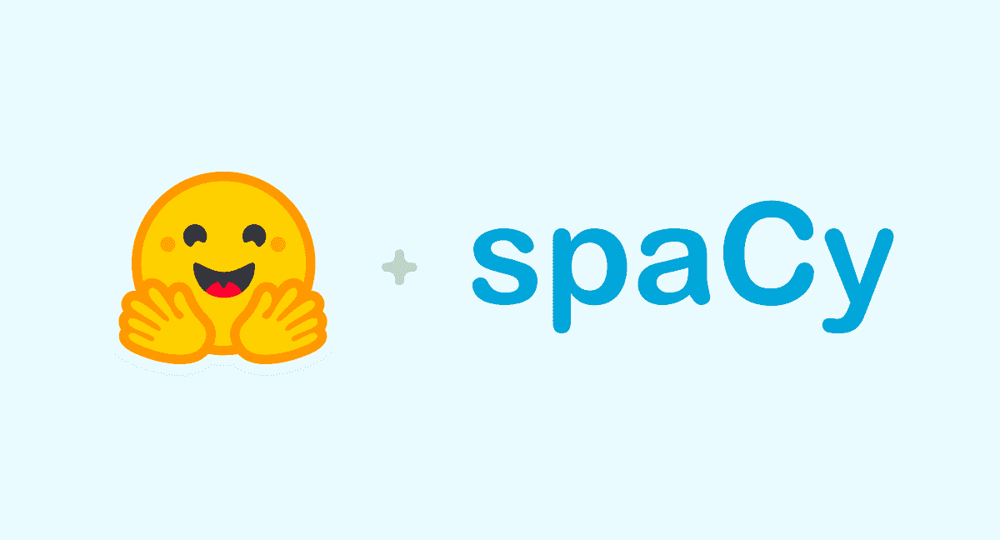

# 针对预训练模型训练自定义 NER 的优势

> 原文：<https://medium.com/codex/advantages-of-training-a-custom-ner-against-pre-trained-models-1d32bd70883d?source=collection_archive---------4----------------------->

## 为什么在处理特定于主题的数据时，自定义 NER 可能是最佳选择，因为它在性能和效率之间进行了权衡

## 目录

*   ***简介***
*   ***数据采集***
*   ***型号选择***
*   ***模特培训***
*   ***车型性能***
*   ***计算成本***

# 介绍

命名实体识别，也称为标记分类，是属于自然语言处理的一个子任务，它试图定位非结构化文本中提到的命名实体并将其分类为预定义的类别，如组织、位置、人名、时间表达式、数量、货币价值等。它有许多应用和用例，如内容分类、自动摘要、推荐系统改进或搜索引擎算法优化。

NER 模型是分类器，它将文本编码到一个 n 维空间中(其中相似的单词将彼此靠近出现)，然后应用分类层将每个编码的单词与其类别匹配。目前有许多预训练的 NER 模型，具有不同的编码步骤架构，如 [word2vec](https://en.wikipedia.org/wiki/Word2vec) 、 [tok2vec](https://spacy.io/api/tok2vec) 或 [transformer](https://towardsdatascience.com/transformers-89034557de14) 。预训练模型易于使用的界面的两个例子是 SpaCy 和🤗拥抱脸。然而，大多数模型都是用从网络上提取的通用语料库(例如维基百科)进行训练的，这意味着如果你处理特定主题的数据，这些模型可能会表现不佳。此外，随着模型复杂性的增加，会出现新的限制，例如对 GPU 等计算资源的需求。

图像:空间和🤗拥抱脸

在 Clarity AI 中，我们每天处理超过 10 万条商业新闻和公司报告，以便从中提取有意义的数据，并将其映射到我们影响力投资技术平台中的 3 万多家不同公司。为了做到这一点，我们利用 NER 模型来识别新闻中的公司，并将它们映射到 Clarity 的投资组合中。

开始时，我们使用 SpaCy 预训练模型，如“en_core_web_{size}”来完成这些任务，但我们意识到，由于我们的数据相对于训练语料库的复杂性，它们没有达到预期的性能。其中一个主要问题是，在预测一些实体时，非常依赖于大写字母，比如那些与人名或位置混淆的组织。例如:

图:使用“en_core_web_sm”模型的组织预测

图:具有自定义 NER 的组织预测

为此，我们决定训练我们自己的 NER 模型，下面我会告诉你为什么这是值得的。

# **数据收集**

数据集由我们的 DS 团队使用来自 AWS 的[增强人工智能](https://aws.amazon.com/augmented-ai/)手动标记的 1k 商业新闻组成:

图像:A2I 数据注释工具

还有其他好的注释工具，如 Prodigy、LightTag 等。这也是一个很好的选择。

为了测量模型的性能，标签被转换成 IOB2 格式(其他有效的格式是罗比或 IOB)。IOB2 格式是 inside-outside-beginning 的缩写，如果实体是第一个令牌，则在实体前添加前缀“B-”,如果不是实体的第一个令牌，则添加前缀“I-”,如果没有实体，则添加“0”。以下是原始数据的一个示例:

表格:原始数据示例

最后，数据集被随机分为训练(80%)、验证(10%)和测试(10%)。

# **型号选择**

由于本文的目的是证明训练一个定制的 NER 优于预训练的模型，我将从头开始采用一个 SpaCy tok2vec + NER 架构，并用我们标记的数据训练它。然后，我会将它的性能与作为零射击学习者的 [SpaCy 预训练模型](https://spacy.io/models/en)以及变形金刚 BERT 和 RoBERTa 进行比较。

根据其架构，这些模型可分为两类:

**Tok2Vec + NER**

*   空间的核心网页(13 MB)
*   空间的 en_core_web_md (45 MB)
*   SpaCy 的 en_core_web_lg (774 MB)
*   自定义 NER (831 MB)

**变压器+ NER**

*   空间的 en_core_web_trf (460 MB)
*   伯特(450 兆字节)
*   罗伯塔(470 兆字节)

目前，还有其他更接近 SOTA 的 NER 模型，如 XLM-罗伯塔，但由于缺乏计算资源而被丢弃(众所周知，随着你越来越接近 SOTA，模型越来越大)。

# **模特培训**

使用 SpaCy v3 对模型进行训练，这使得用不到 5 行代码训练/微调 NER 模型，并从[导入模型🤗拥抱 Face Hub](https://huggingface.co/models?pipeline_tag=token-classification&sort=downloads) 在这里可以找到最新的 NLP 架构。下面是做这件事的步骤:

1.  **将训练数据转换成 SpaCy 的二进制格式(。空间)**

这种新格式由一个序列化的 [DocBin](https://spacy.io/api/docbin) 对象组成。它在存储方面效率极高，尤其是在将多个文档打包在一起时。

为了转换数据，SpaCy v3 有[转换](https://spacy.io/api/cli)功能，让我们从 SpaCy v2 json 获得二进制格式。iob 或者。conllu 格式(点击此[链接](https://github.com/explosion/spaCy/tree/master/extra/example_data/ner_example_data)了解更多信息):

代码:将数据转换为空间二进制格式的 CLI 命令

2.**在 config.cfg 文件中定义所有设置和超参数**

要创建它，可以从[https://spacy.io/usage/training](https://spacy.io/usage/training)下载一个模板，在那里你可以选择训练数据的语言、管道的组件、你的硬件(CPU | GPU)和优化目标。

图:创建 config.cfg 模板的用户界面

请注意，如果您选择 CPU，NER 任务的默认管道将是 tok2vec + NER，如果您选择 GPU，tok2vec 将被替换为 transformer 架构。这里的主要区别是 transformer 模型已经预先训练好了(默认情况下会加载一个 RoBERTa 模型),作为一个零起点的学习者，它会有很好的表现。然而，tok2vec 需要经过训练才能达到良好的效果。

该模板下载名为 base_config.cfg 的配置文件的简化版本，其中包含基本设置。一旦您用适合您的任务的值覆盖了它，您就可以通过这个命令用默认的高级设置完成该文件:

代码:将 base_config.cfg 转换为 config.cfg 的 CLI 命令

3.**从 CLI 启动培训**

这里是魔法出现的地方。使用 train 命令，只需指定 config.cfg 位置和输出路径，我们就可以训练/微调任何模型:

代码:使用 CLI 微调 RoBERTa 模型的示例

在这篇文章中，你可以一步一步地找到如何达到目标。

# 模型性能

由于 NER 任务是分类问题，我们可以使用与定量模型中相同的度量标准。然而，精度和召回的定义有一点变化:

*   **精度**:预测好的实体的比率。
*   **召回**:预测的真实实体比率。

例如，如果我们有 80 个真实实体，并且我们的模型总共预测了 60 个实体，其中 40 个被很好地预测，我们的精度将是 66% (40/60)，我们的召回率是 50% (40/80)。

为了测量模型的性能，我选择了包 [*seqeval*](https://github.com/chakki-works/seqeval) ，因为它比较完整的实体，而不是单独的令牌。此外，它允许不同的数据格式，如 IOB，IOB2 或罗比。下一个例子展示了它的工作原理:

代码:seqeval 包的示例

尽管 MISC 和 DATE 实体的预测对于某些令牌是正确的，但是由于完整的实体不一致，因此它得到的分数是 0。

以下是获得的结果:

图表:每个型号的精确度与召回率

从图表中可以看出，采用 tok2vec 架构的 SpaCy 预训练模型远没有良好的性能。它们的召回率和准确率都没有超过 50%。然而，定制 NER，尽管也有 tok2vec 架构，也达到了与变压器模型相似的性能。表现最好的是精确的 BERT 和回忆的 RoBERTa。

此时此刻，你可能会猜测:如果我已经预先训练好的变形金刚表现超过了它的效果，我为什么还要训练一个定制的 NER 呢？嗯，答案是计算资源和计算成本。像 BERT 或 RoBERTa 这样的变压器模型需要一个 GPU 来微调它们或进行预测。此外，随着模型复杂性和性能的提高，它们的执行时间也会增加。

# **计算成本**

除了分类分数之外，执行时间在衡量模型性能时也有重要作用。由于我们要处理大量的文档，因此有必要选择一个计算成本低的模型。

下面显示了测量预测我们的标记数据所花费的执行时间的结果:

图表:每个模型的执行时间

这张图表阐明了复杂性和计算成本之间的关系。尽管具有非常好的性能，transformer 架构在预测实体上花费的时间比 tok2vec 架构多 2.5 倍。

图表:召回与每个型号的执行时间

由于这个原因，当我们处理大量数据时，使用自定义 NER 而不是更复杂的架构是很有趣的，因为它在性能和计算成本之间有最佳的权衡。

# **结论**

如果你面临一个 NER 的任务，你必须问自己你的模型是否如它应该的那样运行。由于大多数预训练模型是用从网络(如维基百科)中提取的一般语料库训练的，如果你处理特定主题的数据，你的 NER 可能表现不佳。因此，培养自己的 NER 是解决之道。

在本文中，我将展示自定义 NER 如何超越 SpaCy 的预训练模型，以及当您处理大量数据时，为什么它是一个很好的选择，因为与 BERT 或 RoBERTa 等复杂模型相比，它的计算成本较低。

我希望你喜欢这篇文章，如果你有任何意见或建议，请随时与我联系。