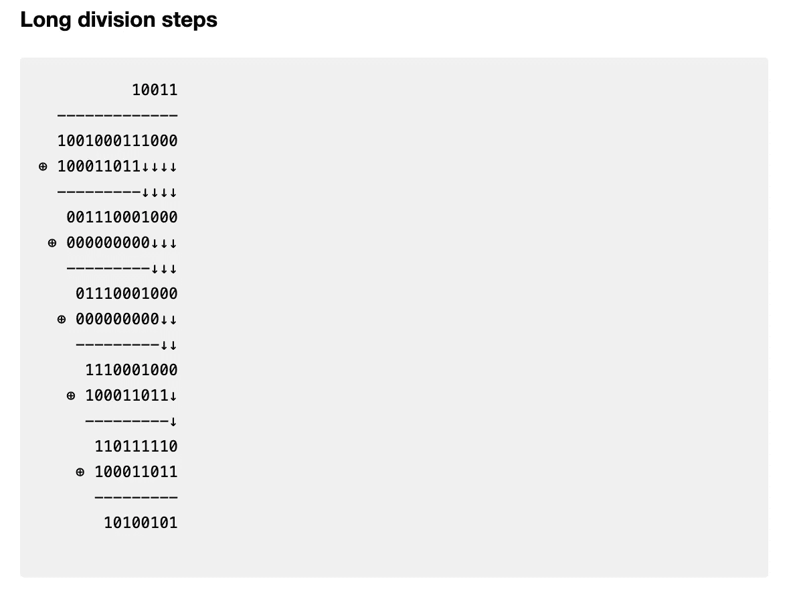

# AES:最先进的加密技术实际上是如何工作的

> 原文：<https://medium.com/codex/aes-how-the-most-advanced-encryption-actually-works-b6341c44edb9?source=collection_archive---------2----------------------->


图片来源:[https://www . vena fi . com/blog/what-is-best-use-cases-symmetric-vs-asymmetric-encryption](https://www.venafi.com/blog/what-are-best-use-cases-symmetric-vs-asymmetric-encryption)

政府、军队、银行和企业都依赖它。它负责保护您的大部分(如果不是全部)个人和财务数据。它有专门的 CPU 指令。这是美国国家安全局唯一批准的加密算法。

我们当然在谈论高级加密标准(AES)，这是迄今为止开发的最普通、最安全的对称加密算法。

这将是我们目前写的最长的一篇文章😊。我们将深入研究这个算法是如何工作的。现代密码算法绝不是微不足道的；他们使用高等数学中的概念来实现高级别的安全性。但我们不指望你成为数学家。

虽然有许多关于 AES 的文章，但大多数文章要么太专业，要么遗漏了重要信息。通过这篇文章，我们希望在全面性和可访问性之间达到完美的平衡。然而，我们必须承认，这篇文章需要一定程度的数学知识，因为这里引入了数学概念。

必须说明的是，你不应该试图在一个生产应用中自己实现 AES，或者冒一个[侧信道攻击](https://en.wikipedia.org/wiki/Side-channel_attack)的风险。使用许多免费的[密码库](https://en.wikipedia.org/wiki/Comparison_of_cryptography_libraries)，它们提供你需要的任何算法的测试实现。

# 基础知识

首先，简要回顾一下什么是 AES。

AES 并不是算法本身的名字，而是国家标准与技术研究所(NIST)授予他们认为是加密事实标准的算法的称号。该算法的实际名称是 *Rijndael* ，它是由 NIST 在一系列算法中选择的，以取代以前的标准，即 DES(数据加密标准)。Rijndael 于 2001 年获得 NIST 批准，并于 2002 年被美国政府采用。它仍然是美国政府和世界各地机构使用的标准密码。

AES 是一种*对称密码*，也就是说使用单个密钥来加密*和*解密相同的数据。AES 可以使用以下密钥大小执行: **128 位、196 位和 256 位**。通常，增加密钥大小也会提高安全级别。Rijndael 适用于任何 32 位倍数的密钥大小，但 NIST 选择了平衡性能和安全性的特定大小(和其他参数)。

也是一种*分组密码*，意思是数据在加密前被分成块。AES 将明文分成 16 字节(128 位)的块。

# 算法概述

AES 的要点是:我们将每个明文块排列成一个 4x4 的矩阵，并对其重复执行一组操作。我们称每次迭代为*轮*，根据密钥长度(这是 NIST 选择的另一个参数)，我们执行 **10、12 或 14 轮**:

*   128 位密钥 10 轮
*   196 位密钥 12 轮
*   256 位密钥 14 轮

对于每一轮，我们使用 *Rijndael 密钥表*从主密钥生成一个*轮密钥*。

我们将定义 4x4 矩阵的四种运算:

*   子字节()
*   shiftRows()
*   混合列()
*   addRoundKey()

不是每一轮操作都是一样的；对于第一轮，我们只添加了 round 键，对于最后一轮，我们省略了 mixColumns()步骤。因此，AES 算法的伪代码可能如下所示:

```
function AESencrypt(plaintext, key) {

  blocks := divideIntoBlocks(plaintext);
  roundKeys = getRoundKeys(key) for (block in blocks) { //first round
    addRoundKey(roundKeys[0], block); //intermediate rounds
    for (8, 10 or 12 rounds) {
      subBytes(block);
      shiftRows(block);
      mixColumns(block);
      addRoundKey(roundKeys[..], block);
    } //last round
    subBytes(block);
    shiftRows(block);
    addRoundKey(roundKeys[numRounds - 1], block); } ciphertext := reassemble(blocks);
  return ciphertext;}
```

# 数学背景

这一节可能显得相当深奥。我们告诉过你我们会详细解释 AES，我们没有说谎。幸运的是，我们认为只有高中水平的数学和基本编程经验才能理解本节中的概念。不要让华丽的词藻把你搞糊涂了！

让我们引入抽象代数中的一个概念，叫做*伽罗瓦域*或*有限域*。一个*字段*是一个集合(意味着一个对象的集合),其操作作用于该集合，其行为类似于加、减、乘、除。换句话说，这些运算满足许多性质，这些性质也适用于有理数上的加法/减法/乘法/除法。实际上，具有这四种运算的有理数和实数都有资格作为一个域。*有限*限定符仅仅意味着集合有有限数量的元素。

我们不会深入研究字段的具体定义。就把它想象成一组加减乘除被重新定义的数字。

AES 使用特定的伽罗瓦域，我们称之为 *Rijndael 的有限域*，来执行许多基本运算。特别是用了不可约多项式*x*⁸+*x*⁴+*x*+*x*+1 的 GF(2⁸。你过一会儿就会明白这意味着什么。

伽罗瓦域 GF( *pⁿ* )，其中 *p* 是素数 *n* 是正整数，表示具有 *pⁿ* 元素*的域。*例如，字段 GF(8)(或 GF(2))包含从 0 到 7 的所有整数。伽罗瓦域的一个重要性质是域 GF( *pⁿ* )的元素**都是小于 n 次的非负系数多项式，求值点为 p** *。p* 称为该字段的*特征*。

让我们再来看看 GF(8)，或者 GF(2)。GF(2)包含{0，1，2，3，4，5，6，7}，可以等价地表示为{0，1，2，2 + 1，2，2 + 1，2 + 2，2 + 2，2 + 1}，或者{0，1， *x* ， *x* + 1， *x* ， *x* + 1， *x* + *x*

有了这个符号，我们现在可以解释加/减/乘/除如何与伽罗瓦域一起工作。

## **加法/减法**

假设我们要添加 GF 的元素 *a* 和*b*(*pⁿ*)。先把它们转换成多项式形式，也就是写成 *p* 的幂和。然后我们将多项式相加在一起，但有一个警告:对于 *a(p)* 中的每个系数 *a_k* 、 *b(p)* 中的每个系数 *b_k* ，得到的系数 *c_k* 等于*a _ k*+*b _ k*mod*p*。做减法，公式是*c _ k*=*a _ k*—*b _ k*mod*p*。

对于 Medium 不支持数学表达式，我们深表歉意。这是乳胶中的配方:


“mod”当然代表模，在大多数编程语言中写为“%”。让我们看一个例子:

GF(3⁴的 74+26)=(2 * 3+2 * 3+2 * 1)+(2 * 3+2 * 3+2 * 1)

=(2 * 3+4 * 3+2 * 3+4 * 1)=(2 * 3+3+6+1)=**70**

请注意，由于系数上的模运算，4 * 3 变成了 3，4 * 1 变成了 1。

Rijndael 字段 GF(2⁸)以及所有具有特征 2 的字段都有一个共同的属性，这使得它们非常适合于计算机:**加法和减法相当于按位异或(XOR/⊕)运算。这是可行的，因为多项式中的每一项都代表一位。**这里有另一个例子来证明这一事实:

GF(2⁴的 15+12)=(2+2+2+1)+(2+2)

=(2 * 2+2 * 2+2+1)=(2+1)=**3**

15⊕12 = 0b 1111⊕0b 1100 = 0b 0011 =**3**

伽罗瓦域中的加法通常被称为“无进位加法”我们独立地将每组数字以模 *p* 相加。注意，在上面的例子中，第一组数字加起来是 2 mod 2 = 0，而第二组数字加起来是 7 mod 2 = 3。

## **乘法**

为了将 GF( *pⁿ* )中的两个多项式 *a(p)* 和 *b(p)* 相乘，我们需要选择第三个多项式 *m(p)* ，该多项式*不能被*分解，并且次数至少为 *n* 。我们称 m(p)为不可约多项式。

为了将 GF( *pⁿ* )中的 *a(p)* 和 *b(p)相乘，我们执行以下步骤:*

*   像正常一样将 *a(p)* 和 *b(p)* 相乘
*   减少生成的多项式的系数模 p。
*   减少整个多项式 mod *m(p)。这就是为什么我们的最终答案不到 pⁿ.*

最后一步可以使用多项式长除法来执行。**不过，这可不是普通的师*。我们在这个过程中执行的每一个算术运算都必须是有限域的版本。在 GF(2⁸的例子中，每次我们执行“减法”时，我们实际上执行的是“异或”运算。将多项式表示为二进制字符串将有助于这一步。***

让我们在 GF(2⁸表演 193 * 56)并用*m(p)*=*x*⁸+*x*⁴+*x*+*x*+1(Rijndael 的场):



如果有限域的乘法看起来很复杂，不用担心！利用 Rijndael 的场，乘法算法可以大大优化，超出上述内容。下面是一个伪代码实现:

```
function gmul(a : byte, b : byte) { p : byte = 0x00;

  for (8 rounds) { //if low bit of b is set
    if ((b & 1) != 0) {
      p = p ⊕ a;
    }

    //true if the high bit of a is set
    h : bool = (a & 0x80) != 0; a = a << 1; //shift left

    if (h) {
      a = a ⊕ 0x1B; //value of the polynomial m(p) (0x11B) with the high bit removed
    } b = b >> 1; //right shift return p; }  
}
```

## 乘法逆/除法

多项式 a(p)的乘法逆是多项式 b(p)，使得 a(p) * b(p) mod m(p) = 1。通过应用上述算法的逆运算，可以找到乘法逆运算。除法就是将第一个操作数乘以第二个操作数的倒数。

## **有什么意义？**

AES 为什么借用有限域理论的概念？主要原因是性能。请记住，GF(2⁸中的“加法”与“异或”运算相同。还要考虑没有必要担心上溢/下溢，因为操作的输入和输出被限制在数字 0–255。

乘法没有看起来那么复杂。为了客观地看待问题，考虑计算机如何在最底层执行正常的乘法:通过重复的位移和加法(当然，我们没有特殊的电路来执行 GF(2⁸算法)。最后，2 和 3 相乘非常容易优化。这在以后会变得很重要。

```
//multiply by 2 in GF(2^8)
function gmul2(a : byte) { h : byte = a & 0x80; //high bit b : byte = a << 1; if (h == 0x80) b = b ⊕ 0x1b; return b; }//multiply by 3 in GF(2^8)
function gmul3(a : byte) { return a ⊕ gmul2(a);}
```

# 密钥扩展

背景介绍完了！现在是时候研究 AES 实际上做什么的本质了。

在进行任何加密之前，必须为每一轮生成单独的 128 位密钥。Rijndael 使用特定的算法来生成轮密钥。

Rijndael 密钥计划执行许多操作:

**rotate():** 将一个 32 位(4 字节)字向左旋转 8 位。举个例子:rotate(0xab157c9e) = 0x157c9eab。

**rcon():** 在 Rijndael 的有限域中对 2 取幂(重复相乘)到指定值。这个操作可以用下面的伪代码来描述。然而，我们将只需要使用最多 11 个 rcon()值，因此一个查找表就足够了。

```
function rcon(value : unsigned int) { c : byte = 1;

  if (value == 0) return 0;
  while (value != 1) {
    c = gmul(c, 2);
    value--;
  } return c;}
```

我们还没有解释幂运算如何适用于有限域。简而言之，它与普通数学非常相似。如果好奇的读者想了解更多，我们鼓励他们自己做研究。

**sbox():**Rijndael 字段中的另一个操作，通常用下面的查找表实现:


数学上，sbox()是一个两部分操作。首先，我们取输入的乘法逆运算。结果表示为一个八元素向量(每位一个)，并经过以下转换:


整个过程是用 Rijndael 的有限域算法进行的。例如，在最后，字节 0b11000110 没有被相加，而是与矩阵向量乘积进行了“异或”运算。这种转换更简洁地表示为一系列 xor 和左位旋转，如下所示:


sbox()操作在整体上极大地提高了 AES 的安全性。它对**线性密码分析**有抵抗力，因为它很难用线性变换来近似。它还能抵抗**差分密码分析**，因为在输入如何变化和输出如何变化之间似乎没有相关性。最后，sbox()的特殊之处在于没有**固定点**，即不存在输入等于输出的情况。

密钥扩展算法主要作用于 32 位字，而不是字节。以后我们将**子字()**定义为 sbox()在一个字的每个字节上的应用。

## 密钥扩展算法

真正的密钥生成算法。在了解这些步骤之前，让我们先定义一些常数:

*   让 K[0]到 K[N-1]代表原始密钥的 32 位字。
*   设 N 等于 32 位字中原始密钥的长度**(128、192 或 256 位密钥分别为 4、6 或 8)。**
*   设 R 等于轮数**(128、192 或 256 位密钥分别为 10、12 或 15)。**
*   设 W[0]到 W[4R-1]代表包含所有轮密钥的 32 位字。我们称之为扩展键。

密钥扩展算法遍历所有 32 位字 W[0]到 W[4R-1]。当我们想要一个特定的轮密钥时，我们组合对应于该轮的扩展密钥的四个字(128 位)。例如，第 3 轮密钥由 W[8]到 W[11]组成。

算法是这样的:

```
for (i from 0 to 4R - 1) { //The first words (W[0] thru W[N-1]) are equal to the words of the original key.
  //For a 128-bit key, this means that the first round key is equal to the original key.
  if (0 < i < N) W[i] = K[i]; //Perform operations on the last word of each N-length cycle before XOR-ing.
  else if (i >= N and i == 0 mod N)
    W[i] = W[i-N] **⊕** subWord(rotate(W[i-1])) **⊕** rcon(i/N); //For a 256-bit key length only.
  else if (i >= N and N == 8 and i == 4 mod N)
    W[i] = W[i-N] **⊕** subWord(W[i-1])**;** //Typical case
  else W[i] = W[i-N] **⊕** W[i-1];}
```

该算法的要点是这样的:通常，每个单词是前一个单词与其后 N 个位置的单词进行异或运算。但是每 n 个字，在异或发生之前，我们对后面 n 个位置的字执行各种 GF(2⁸运算。

# AES 回合，循序渐进

在本节中，我们将带您完成整个 AES 回合。记住第一轮只包含 addRoundKey()步骤。我们将检查每一步，所以想象第一轮已经过去，我们现在在第二轮。

假设我们想要加密以下消息:

> 那只敏捷的棕色狐狸跳过了那只懒狗

我们将只看第一个块是如何加密的，包含“快速布朗”。重新排列成 4x4 矩阵后，该块看起来像这样:


这里又是十六进制的:


## 子字节()

这是 AES 回合的第一步。我们对矩阵中的每个字节执行 sbox()操作(详情参见“密钥扩展”部分)。


## shiftRows()

对于这一步，我们将每一行向左旋转一定数量的与行号对应的空格。第一行移动 0 个空格，第二行移动 1 个空格，依此类推。


## 混合列()

现在，我们使用 GF(2⁸算法(gmul()和 XOR，而不是普通的加法和乘法)将每列乘以下面的矩阵:


整个转换如下所示:


请注意，这种转换涉及许多乘以 2 和乘以 3 的操作。这就是“数学背景”一节末尾提到的优化发挥作用的地方。

在我们的示例中，对每一列应用转换如下所示:


shiftRows()和 mixColumns()步骤都将**扩散**添加到密码中，因为它们允许明文中的微小变化影响整个密文。

## addRoundKey()

这是最简单的一步。我们将块中的每个字节与轮密钥中相应的字节进行异或运算。我们假设这一轮的轮密钥是:

> abcdefghijklmnop

在十六进制中，这是:

> 61 62 63 64 65 66 67 68 69 6a 6b 6c 6d 6e 6f 70

请记住，这是一个非常不现实的场景。与加密密钥一样，轮密钥应该是伪随机的。

在我们的示例中，addRoundKey()的结果如下所示:


转换回 ASCII，单个 AES 回合的结果如下所示:

> 1sfò%èm P

如您所见，原始消息已经被荒谬地打乱了。把这个放大 14 倍，确保密钥是随机的，你就有了一个即使是最好的计算机也无法破解的安全级别。

# [通信]解密

所以我们有了加密信息。如何逆转 AES 漫长而复杂的过程？AES 的一大优点是*每一个动作都有它的反面。*

解密是这样工作的:我们使用相同的过程生成轮密钥。然后，我们使用各种运算的逆运算在*逆*中执行加密算法。

addKeys()步骤是它自己的逆步骤。将字符串 *A* 与字符串 *B* 进行两次异或运算，结果是 *A* 。我们只需要记住使用最终的加密轮密钥作为第一个解密轮密钥，倒数第二个作为第二个，以此类推。

对于 mixColums()步骤，我们将上述矩阵的*逆*应用于所有列。转换如下所示:


对于 shiftRows()步骤，我们简单地以相反的方向旋转行。或者可选地，在相同方向上将每一行旋转不同数量的空间。如果一个字节在第二行，它将在加密期间向左旋转 1 个空格，在解密期间向右旋转 1 个空格/向左旋转 3 个空格。

最后，对于 subBytes()步骤，我们应用 sbox()操作的*逆*。记住，我们通常使用 sbox()的查找表。我们还可以使用一个查找表来求逆，如下所示:


最后一件事:我们需要记住，不是所有的回合都是一样的。因为我们在第一轮加密中只执行 addRoundKey()，所以我们在最后一轮解密中也执行同样的操作。因为我们在最后一轮加密中省略了 mixColumns()，所以我们必须在第一轮解密中这样做。

整个解密过程的伪代码如下所示:

```
function AESdecrypt(ciphertext, key) {

  blocks := divideIntoBlocks(ciphertext);
  roundKeys = getRoundKeys(key) for (block in blocks) { //first round
    addRoundKey(roundKeys[numRounds - 1], block);
    shiftRowsInv(block);
    subBytesInv(block); //intermediate rounds
    for (8, 10 or 12 rounds) {
      addRoundKey(roundKeys[..], block);
      mixColumnsInv(block);
      shiftRowsInv(block);
      subBytesInv(block);
    } //last round
    addRoundKey(roundKeys[0], block);} plaintext := reassemble(blocks);
  return plaintext;}
```

# 安全屋

我们完了！我们已经解释了基本上所有的事情。有了这些知识，你应该能够自己实现 AES，尽管我们强烈反对这样做。

我们安全屋相信网络安全是每个人的，所以我们很高兴以一种容易理解的方式展示这样的信息。网络安全行业忽视了小企业，我们想表明立场。

如果你觉得你读到的内容很有价值，可以考虑去 https://safehouse.dev/[看看我们。](https://safehouse.dev/)