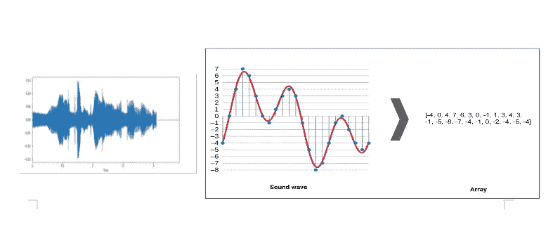
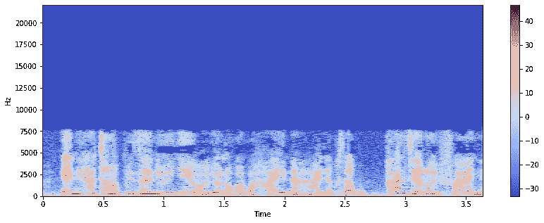
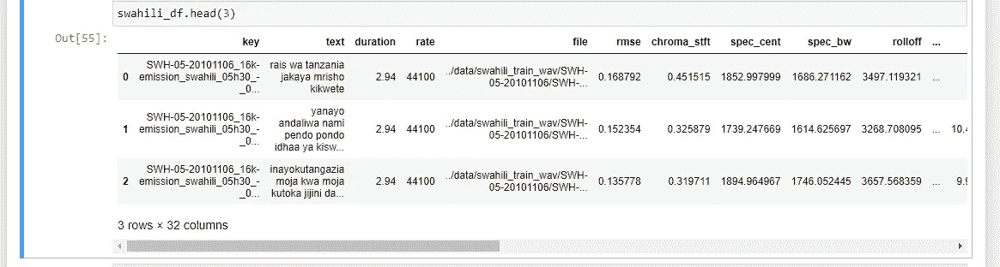
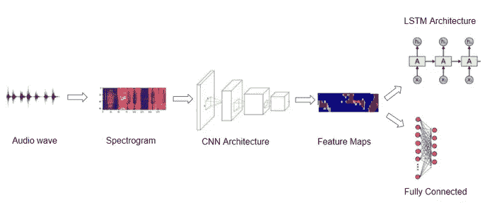
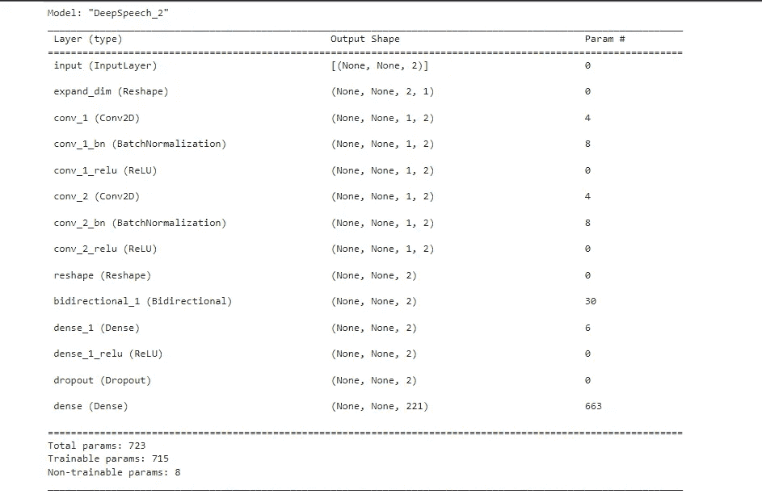

# 非洲语言语音识别

> 原文：<https://medium.com/codex/african-language-speech-recognition-f6b7b16e5457?source=collection_archive---------14----------------------->

如果你想到与你周围的人交流的最简单的方法，自然而然的就是**说话**！！随着通信方式的发展，世界每天都在发展，因为在这个过程中，**机器**是最好的工具..

Aautomatic**S**peech**R**ecognition "**ASR**是一种允许人类使用他们的声音与计算机接口说话的技术，其方式类似于正常的人类对话，目前开发的 ASR 技术的最先进版本被称为**N**natural**L**language**P**processing "**NLP**。尽管有许多成熟的语音识别系统可用，如谷歌助手，亚马逊 Alexa。然而，所有这些语音助手都只支持有限的语言！

现在，世界粮食计划署希望部署一种智能表格，收集非洲两个不同国家市场上买卖的食物的营养信息，这两个国家是**埃塞尔比亚**和**肯亚**，这需要被选中的人在他们的手机上安装一个应用程序，每当他们购买食物时，他们用他们的声音激活应用程序，用他们自己的语言登记他们刚刚购买的物品清单。应用程序中的智能系统有望实时转录语音到文本。

> 在这个博客中，我们将学习如何构建一个深度学习模型，能够将阿姆哈拉语和斯瓦希里语的语音转换成文本。

对于这个项目，我们将使用音频和文本文件，但在我们开始查看数据之前，让我们首先刷新一些关于声音的基本概念，并看看我们如何对这些数据实施深度学习模型。

Sd**ound**是通过空气的振动产生的。我们听到的所有声音都是我们经常在波形中表示的高低压组合，在这个图像中我们可以看到如何通过采样将波形转换为数组，因此我们可以实现深度学习！



# 数据

*   阿姆哈拉语:[语音识别 ASR 格式(~20 小时训练和~ 2 小时测试)](http://Speech Recognition ASR format (~20hr training and ~2hrs test))
*   斯瓦希里语:[语音识别 ASR 格式(~ 10 小时训练和~ 1.8 小时测试)](http://Speech Recognition ASR format (~10hr training and ~1.8hrs test))

# 使用 Python 进行数据预处理的步骤

**加载音频**为了在 Python 中对音频数据进行预处理，我们使用了名为 [librosa](https://librosa.org/doc/latest/index.html) 的包，它允许我们将音频作为 numpy 数组加载到我们的笔记本中进行分析和操作，然后我们能够**加载从斯瓦希里语和阿姆哈拉语数据集给出的转录**，对于阿姆哈拉语，大多数转录都是单个字符，实际上是单词的一部分。对于斯瓦希里语文本，我们注意到停用词构成了数据的主要部分，这意味着我们需要进行更多的清理，例如，这是阿姆哈拉语文本清理后的样子:

```
['የተለያዩ የትግራይ አውራጃ ተወላጆች ገንዘባቸውን አዋጥተው የልማት ተቋማትን እንዲመሰርቱ ትልማ አይፈቅድም',
 'የጠመንጃ ተኩስ ተከፈተና አራት የኤርትራ ወታደሮች ተገደሉ',
 'ላነሷቸው ጥያቄዎች የሰጡትን መልስ አቅርበነዋል',
 'እብዱ አስፋልቱ ላይ የኰለኰለው ድንጋይ መኪና አላሳልፍ አለ',
 'ጠጁን ኰመኰመ ኰመኰመና ሚስቱን ሲያሰቃያት አደረ',
 'ድንቹ በደንብ ስለተኰተኰተ በጥሩ ሁኔታ ኰረተ',
 'በድህነቱ ላይ ይህ ክፉ በሽታ ስለያዘው ሰውነቱ በጣም ኰሰሰ',
 'በሩን እንዲህ በሀይል አታንኳኲ ብዬ አልነበረም እንዴ',
 'በለጠች የበየነ የበኩር ልጅ ነች',
 'የቆላ ቁስልና ቁርጥማት በጣም አሰቃቂ በሽታዎች ናቸው']
```

采样语音数据在一个由一系列数字组成的数组中表示，每个数字表示特定时刻声音的强度或振幅。相似测量的数量由**采样率**决定，采样率定义了每秒从连续信号获取的样本数量，以形成离散信号。我们选择 44，100Hz 的标准采样速率。

然后我们必须**转换频道**，一些声音文件是单声道的，而大多数是立体声的。由于神经网络模型期望所有项目具有相同的维度，因此我们使用名为 convert_channels 的函数将单声道文件转换为立体声，其中我们将音频数据在数组中向左移动，形成原始数据的副本，并保存它。

**数据扩充**有助于从现有数据中生成更多数据，我们使用 numpy 的滚动函数来生成时间偏移。这有助于我们模型推广到更广泛的输入。

# **特征提取:**

直接输入神经网络结构的常用特征是频谱图和梅尔频率倒谱系数(MFCCs)。

**频谱图**是音频信号随时间变化的频谱的直观图示。因此，它包括信号的时间和频率两个方面，并且通过对信号应用短时傅立叶变换(STFT)来获得。它通常被描绘成热图。在此图像中，垂直轴显示频率，水平轴显示剪辑的时间。



光谱图

**信号的梅尔倒谱系数 MFCC** 是一小组特征(通常约 10-20)，它们简明地描述了频谱包络的整体形状。它模拟了人类声音的特征。

**声学建模**在 ASR 中用于表示[音频信号](https://en.wikipedia.org/wiki/Audio_signal)和[音素](https://en.wikipedia.org/wiki/Phonemes)或其他组成语音的语言单位之间的关系。该模型试图将音频信号映射到语音的基本单元，例如音素。在我们的例子中，我们使用存储音频特征功能来执行我们的声学建模，并且我们开发的并且将转化为我们的学习模型的主要基本结构是 chroma_stft、spec_cent、spec_bw、rolloff、zcr，当然还有 mfcc 特征。例如这个斯瓦希里语



# 模型架构

现在音频输入数据和相应的标签都是数组格式，应用 NLP 技术就更容易了。我们可以使用标签编码将音频文件标签转换成整数，以便机器学习。标记的数据集将帮助我们在神经网络模型输出层预测结果。这些有助于将数据集训练和验证到 nD 阵列中。

在这一阶段，我们应用其他预处理技术，如删除列、规范化等。总结我们最后的训练数据来建立模型。下一步是将数据集分为训练、测试和验证，这也是我们对其他模型所做的。我们可以利用有线电视新闻网、RNN、LSTM、反恐中心等。深度神经算法来构建和训练语音应用(如语音识别)的模型。用转换成具有各自标签的 n 维阵列的标准大小几秒音频块训练的模型将导致预测测试音频输入的输出标签。由于输出标签会在二进制之外变化，我们正在讨论建立一个多类标签分类方法。

> **深度学习**可以定义为一种机器学习技术，通过提供输入和期望的输出，并让计算机找到解决方案，使用神经网络来解决问题。我们希望建立一个深度学习模型，将语音转换为文本。



深度学习架构-CNN -RNN-LSTM & CTC



**评估***

**模型空间探索***

**记录&预测***

**指标—单词错误率 WER***

**结论**

对于这个项目，我们比较了不同的神经网络模型。我们得到的最佳预测来自 CNN

***** 未来的工作将是再次查看评估和损失函数，比较模型并找到最佳预测。

参考资料:

[https://github.com/rafaesam/nlp_swahili_amharic.git](https://github.com/rafaesam/nlp_swahili_amharic.git)

[https://heart beat . comet . ml/the-3-deep-learning-framework-for-end-to-end-speech-recognition-the-power-your-devices-37b 891 DDC 380](https://heartbeat.comet.ml/the-3-deep-learning-frameworks-for-end-to-end-speech-recognition-that-power-your-devices-37b891ddc380)

[《深度学习 PyTorch 编程》，作者伊恩·指针(O'Reilly)。版权所有 2019 伊恩指针，978–1–492–04535–9。”](http://programming pytorch for deep learning reference “Programming PyTorch for Deep Learning by Ian Pointer (O’Reilly). Copyright 2019 Ian Pointer, 978-1-492-04535-9.”)

[](https://usabilitygeek.com/automatic-speech-recognition-asr-software-an-introduction/) [## 自动语音识别(ASR)软件-简介-可用性极客

### 就技术发展而言，我们可能还需要至少几十年的时间才能……

usabilitygeek.com](https://usabilitygeek.com/automatic-speech-recognition-asr-software-an-introduction/) 

【https://www.youtube.com/watch?v=RX_ptt44mq4 