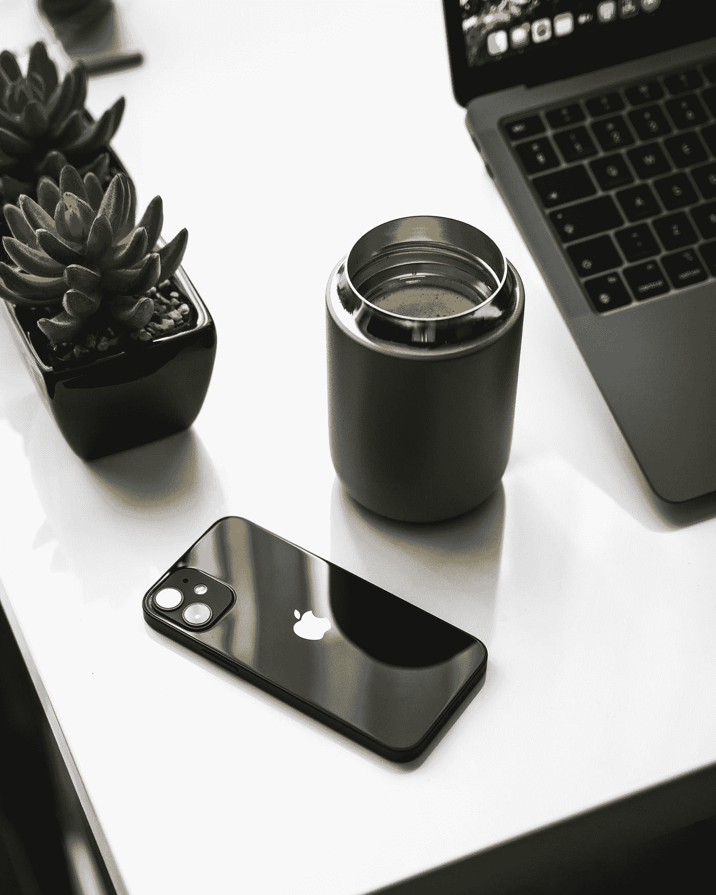

# 使用 M1 MacBook Air 两个月后，我会后悔吗？

> 原文：<https://medium.com/codex/after-2-months-using-the-m1-macbook-air-do-i-have-buyers-remorse-b80dd070cbb0?source=collection_archive---------0----------------------->

## 苹果

## M1 大学的 MBA 有没有辜负人们的期望？

塞巴斯蒂安·贝德纳雷克在 [Unsplash](https://unsplash.com?utm_source=medium&utm_medium=referral) 上的照片

我是苹果芯片和 M1 SOC 设备世界的后来者。直到 2021 年 10 月，我才冒险购买了 M1 MBA (8Gb，8 个图形核心，512Gb 固态硬盘。)我最初的印象非常好。