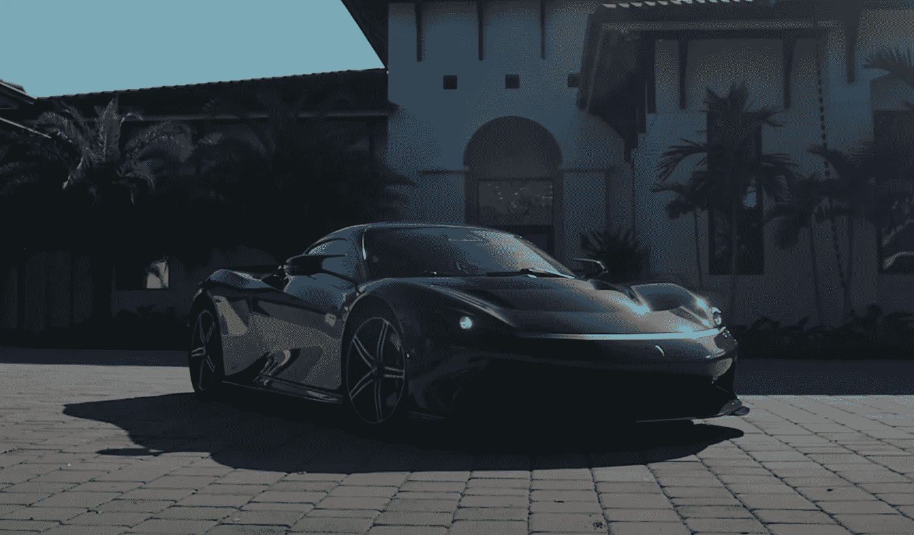

# 近 100 年后，宾尼法利纳终于推出了他们自己的电动汽车

> 原文：<https://medium.com/codex/after-nearly-100-years-pininfarina-finally-unveils-their-own-electric-car-b08feeae3766?source=collection_archive---------12----------------------->

## 不幸的是，只有不到 1%的人买得起

[宾尼法利纳·巴蒂斯塔(Top Gear 媒体)](https://youtu.be/ZfnFL-wp-dg)

1930 年，bat tista“Pinin”Farina 成立了 Carrozzeria Pinin Farina 客车制造公司。该公司为近一个世纪以来最具标志性的汽车设计了车身。仅去年一年，他们就…