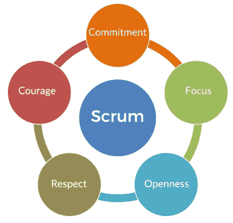
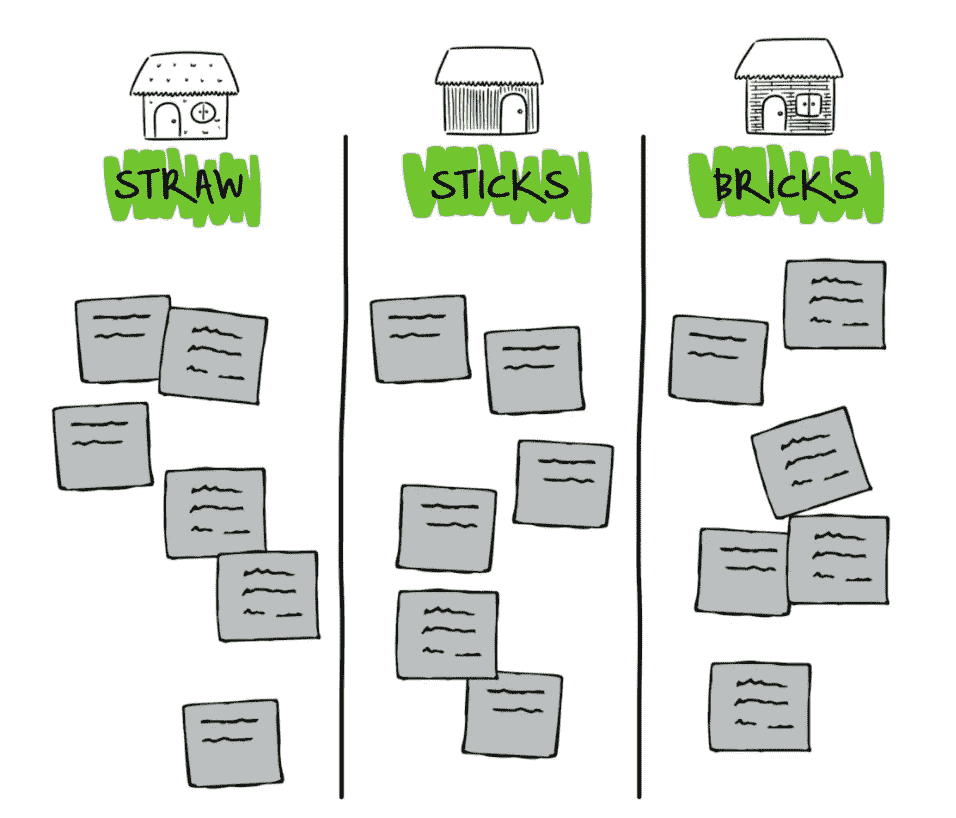

# 敏捷回顾让你的 scrum 团队参与进来

> 原文：<https://medium.com/codex/agile-retrospectives-to-engage-your-scrum-team-a67a681e6a19?source=collection_archive---------4----------------------->

凯利·西克玛在 [Unsplash](https://unsplash.com?utm_source=medium&utm_medium=referral) 上的照片

在疫情之前，大多数在他们的领域中使用某种敏捷框架的组织会主持 sprint 回顾会议，以评估 sprint 的进展情况。敏捷/scrum 环境中的回顾通常与 scrum 团队在一个房间里举行。你可以让 scrum 大师与产品负责人和开发团队一起讨论三个主要问题:

> 1.什么进展顺利？
> 
> 2.什么不顺利？
> 
> 3.有哪些可以改进的地方(在下一次冲刺，或者未来)？

对于那些新接触敏捷框架的人来说，sprint [回顾的目的是为未来的 sprint 增加质量和效率。作为一名 scrum 大师，我会听开发团队告诉我他们觉得 sprint 的哪些方面是好的，哪些方面可能会改变或调整，或者谈论任何已经发生的挫折或担忧。回顾是为了给 scrum 团队提供一个安全的空间，让他们合作并使用 scrum 价值观为将来的发布做得更好。](https://www.scrum.org/resources/what-is-a-sprint-retrospective)

scrum 的五个价值观:承诺、专注、勇气、尊重和开放

作为一名 scrum 大师，我的主要目标是检查*(分析我的 scrum 团队的当前情况，我们完成的 sprint，等等。)*和适应*(为以后的冲刺做积极有影响的改变)*。

我记得我选择的方法是在白板前进行回顾，并向团队分发便签，填写他们的答案，以获得更多的个人参与。

一旦疫情大获成功，scrum masters 必须要有创造性才能充分利用回顾会议。在此期间，我们失去了回顾的物理方面，但通过以不同的方式与团队合作来填补空白并不太难。虽然我们没有笔记卡让团队写下他们的答案，但我们有在回顾之前收集的电子邮件和笔记，以便作为一个团队进行讨论。

有时，我们在回顾之前收集反馈，有时，我们尝试使用(3)个问题开始公开对话，我会在对话过程中做笔记，以捕捉和评估提供的信息。

为了让回顾会成功，他们需要融入团队。如果你没有得到足够的反馈来使回顾变得有意义，那么主持一个回顾会是一个挑战。这是我喜欢加入“复古游戏”来适应短跑的地方。回顾性游戏从典型的“3 个标准问题会议”中去除了一些沉闷的因素，使它变得更有趣，并使团队更多地跳出框框思考。

我最喜欢的冲刺回顾游戏叫[“三只小猪”。](https://www.funretrospectives.com/three-little-pigs/)链接包括完整的游戏和如何举办以上。

https://www.funretrospectives.com/three-little-pigs/

概括来说，你会有三列，每一列都标有:稻草、木棒和砖块。

这些“房子”中的每一个都像三个标准问题，但有一点扭曲。从有趣的回顾网站，这是每个专栏的描述:

> ***稻草屋**:我们做了什么事情，让它们紧紧连在一起，却随时可能倒塌？
> ***棍棒之家**:我们做了哪些相当扎实但还可以改进的事情？
> ***砖房**:我们做什么才是坚如磐石？

我喜欢这种回归的原因是，它让 scrum 团队更加努力地思考与冲刺和整体团队合作相关的细节。最后，我们希望我们的房子是砖造的，这样狼就不会把它吹倒了。所以，我们会从稻草屋和木棍屋那里得到反馈，想办法让他们像砖头一样学习。

这个游戏可以远程完成，这是一个巨大的优势，考虑到疫情如何改变了我们在团队环境中的合作方式。使用正确的工具，它可以像用便利贴在墙上一样吸引人。

我第二喜欢的只做过一次的游戏是[《汽车品牌演习》](https://luis-goncalves.com/car-brand-exercise-retrospective/)。

这种复古的前提是要有创意，如果你是我这样的汽车呆子也有帮助。

> 问题问团队:“如果你把这次冲刺想成一辆品牌车，你会选哪辆？”

这项活动是有时间限制的。你会给每个人大约 5-10 分钟的时间拿出他们的车和答案。作为一名 scrum 大师，我会在房间里找到每个开发人员，给出他们的答案。你不仅要描述你的 sprint 作为一辆车的感受，还可以加上你希望如何改进它，或者在他们看来，sprint 应该是什么样的“理想汽车”。你可以说它感觉像一辆特斯拉，在推向市场之前需要更多的改进，或者像一辆吉普一样坚固，等等。

这款复古游戏创意无穷。

这种类型的活动挑战开发团队创造性地思考，跳出框框去识别潜在的问题和解决方案。

随着许多团队保持远程，添加有趣的回顾游戏和想法有助于促进团队内部的创造力和创新。整合一个安全的空间，并使用回顾性游戏进行建设性的对话，将会带来更多成功的冲刺。