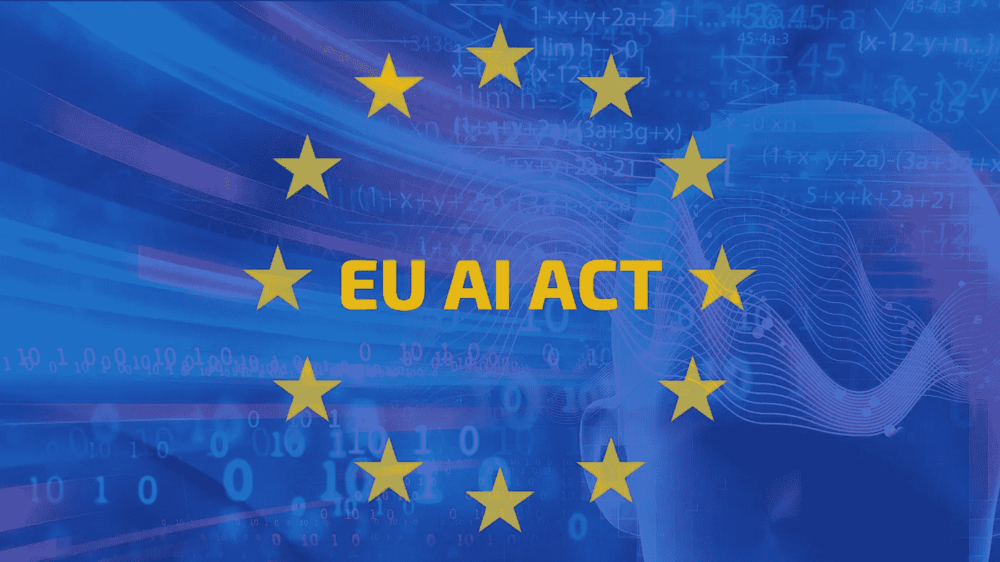
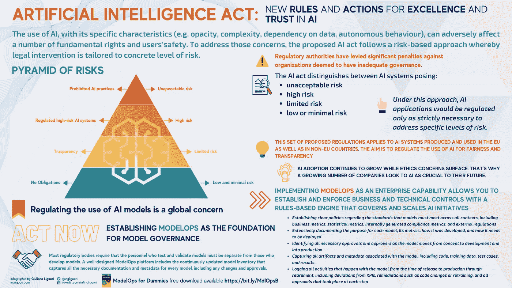
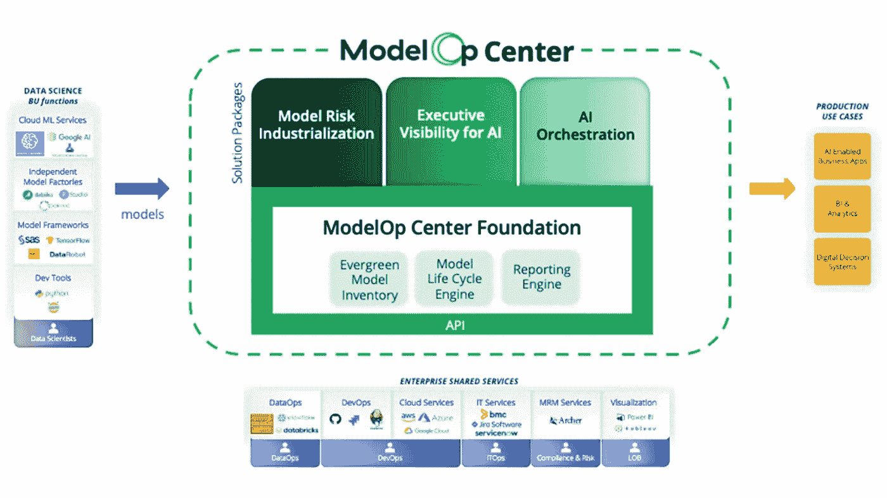

# 人工智能法案:基于风险的人工智能政策方法

> 原文：<https://medium.com/codex/ai-act-a-risk-based-policy-approach-for-excellence-and-trust-in-ai-d29ce0d54e2?source=collection_archive---------5----------------------->

## 欧盟人工智能法案是有史以来第一次全面尝试监管这一新兴技术的使用和风险

作者创造的形象

## 介绍

*   什么是欧盟 AI 法案？
*   制定政策来规范人工智能应用的重要性
*   欧盟 AI 法案是如何运作的？
*   建立人工智能治理模型的重要性
*   结论:关于欧盟 AI 法案你应该做的事情！

# **简介**

人工智能是一项很有前途的技术。预计它将为包括医疗保健、金融、交通和家庭事务在内的广泛领域带来各种经济和社会效益。强大的机器和算法已经能够诊断疾病、进行手术和驾驶自动驾驶汽车，这些技术为我们提供了新的工具，也颠覆了我们的工作方式。人工智能正在以无数方式推动人类进步，包括改善医疗保健、改善服务交付、管理能源消耗和改善公共安全。此外，企业使用基于人工智能的应用程序来优化他们的运营。

可以理解的是，我们对这些新技术寄予了很大的信任，特别是在医疗保健和决策方面。然而，人工智能带来了好处和风险，也提出了合理的伦理和法律问题。

我们这一代人将面临非常复杂的挑战，在某些情况下，这些挑战关系到全球人类的生存。人工智能领域的技术专家、专家和思想领袖被召集来阐明这项技术的作用，以及我们如何克服这些挑战，他们如何帮助机构、政府和企业实现他们最好的基本目标，当然，我们如何通过利用人工智能使他们能够实现更多目标。

谁也说不准人工智能会给社会带来什么影响。

> 你可能也想阅读安全可靠的人工智能的[模型操作](/codex/model-operations-for-secure-and-reliable-ai-2cf0ced9945b?source=user_profile---------2-------------------------------)

# **什么是欧盟人工智能法案？**

欧盟委员会最近提出了一项名为*人工智能法案*的新法规，目的是规范人工智能在欧洲的开发和使用。

人工智能法案将是未来几年欧洲和世界上最重要的监管决策之一，这一过程的成败将影响与人工智能领域投资相关的重要问题，如智能自动化的研发、创新和商业，以及创建更强大和更具竞争力的企业框架，以支持组织在全球范围内扩展业务。

然而，直接影响这些技术对个人健康和生活的影响的许多其他方面将受到这些法规的影响，例如对个人和集体权利的尊重和保护，以及教育卫生保健的发展。

许多专家认为，有必要对人工智能的功能将如何影响我们日常生活中的许多重要问题进行伦理和基本权利影响评估。他们认为《人工智能法案》不仅仅是一个追求的机会，而是我们负有直接责任的事情。

欧盟委员会负责数字时代的执行副主席 Margrethe Vestager 表示，主要目标是为欧盟人工智能产品和服务的开发、营销和使用定义一个共同的法律框架。欧盟的目标是让欧洲成为安全、可靠和以人为中心的人工智能发展的世界领导者，当然，还有它的使用。该法规解决了与人工智能的特定用途相关的人类和社会风险，这有助于建立信任，另一方面，欧盟协调计划概述了成员国应采取的必要措施，以刺激投资和创新，所有这些都是为了确保和加强人工智能在欧洲的采用。

> 你可能也喜欢阅读[不要让工具和管理方法扼杀你的人工智能创新](https://towardsdatascience.com/dont-let-tooling-and-management-approaches-stifle-your-ai-innovation-5fcee5ec8b2f?source=user_profile---------4-------------------------------)

# **制定政策规范人工智能应用的重要性**

欧盟关于人工智能新法规的倡议具有根本的重要性，因为通常当欧盟为一些新的技术法规铺平道路时，所有其他国家只能从中获得灵感，正如 GDPR 发生的那样，人工智能法案肯定也会发生。

所以，让我们开始吧。首先，为什么我们需要人工智能法案？为什么我们需要监管人工智能？

人工智能正开始用于许多不同的部门和应用，但在某些情况下，已经出现了影响人权的问题。一个例子是人工智能在美国医疗保健中的应用，它有能力根据观察病人如何走路来确定病人需要多次测试的可能性。不幸的是，由于人工智能模型算法的扭曲，有色人种受到了系统性的歧视。另一个案例发生在招聘领域，一家著名的世界级公司生产了一个人工智能模型，该模型在课程评估过程中歧视候选人的性别。事实证明，该模型总是优先考虑男性候选人，而不是女性。为了继续这个主题，让我们考虑面部识别，并因此使用人工智能的这种能力来识别或预测求职面试中候选人的情绪状态。

另一个例子可以是在社交媒体平台上调节内容的人工智能模型。有偏见的模式会不公平地限制言论自由，影响公共辩论。正如我们在之前的[文章](/codex/why-modelops-is-an-enterprise-level-capability-under-the-cios-accountability-e9c5aa981934)中看到的，在整个模型生命周期(MLC)中使用的数据集，可以是机器学习模型或人工智能模型，对于这些模型将做出的决策或预测来说是非常重要的。事实上，所有这些技术都是基于从数据中学习，如果数据有偏差，让我们假设我们的数据中只有黑手党与意大利人有关的例子，我们希望建立一个模型来预测一个人是否是黑手党。如果我们的模型刚刚看到了与所有意大利裔黑手党成员相关的数据，它将试图进行归纳，它将试图认为所有意大利人都是黑手党。

有偏见的数据会产生歧视性的、对人类有害的模型。问题是，该算法将把它从有偏见的数据中获得的知识复制给每个人，这意味着风险是在全球范围内分发和应用它，然后突然发现一个有偏见的模型已经部署，当然，这是一个歧视意大利人的种族主义模型。

然而，尽管我们通常使用与种族主义、性别歧视和所有这些社会问题相关的偏见这一术语，但在数据科学领域，偏见只不过是一个数学概念，这意味着基本上歪曲了分布。它被定义为基于训练数据的模型预测和目标值之间的差异，也称为“由于平方偏差引起的误差”。当假设被简化以使函数更容易逼近时，就会出现偏差误差。问题是我们倾向于一概而论。如果我们倾向于认为我们接触到的一个小群体代表了整个分布。这可能是一个大问题，因为，当然，它渗透到我们的文化、我们的决策以及我们的人工智能模型中。

这些只是一些例子和概念，支持制定一项政策来规范人工智能应用的重要性。有必要为人工智能制定全球标准，以确保每个人都必须遵守某些道德规则，确保我们不会使用武装的人工智能来反对人类。AI 必须以任何方式补充而不是取代人类。

> 你可能也想阅读[用 ModelOps](https://towardsdatascience.com/unlocking-the-value-of-artificial-intelligence-in-business-applications-with-modelops-92379965f87c?source=user_profile---------3-------------------------------) 释放人工智能在商业应用中的价值

# **欧盟人工智能法案是如何运作的？**

《欧盟人工免疫法》引入了一套复杂的“产品安全制度”,围绕 4 个风险类别构建。它通过强制性 ce 标志程序对高风险人工智能系统的市场准入和认证提出了要求。这种上市前一致性制度也适用于机器学习培训、测试和验证数据集。

提议的人工智能法案将基于危险度金字塔的基于风险的方法与现代多级执行机制相结合。这意味着随着风险的增加，适用更严格的规则。具有不可接受风险的应用程序被系统地禁止进入欧盟市场，因为它们会带来不可接受的风险。违反规则的罚款最高可达公司全球营业额的 6%。

这些要求从附有行为准则的非约束性自我监管影响评估，到贯穿整个人工智能应用生命周期的严格的外部审计合规性要求。

作者提供的信息图

《人工智能法案》区分了以下人工智能系统:

*   不可接受的风险
*   高危
*   有限风险
*   低风险或最小风险

在这种方法下，人工智能应用将只在处理特定级别的风险时受到严格必要的监管。让我们看一些例子。

*   人工智能系统将被授权进行商业化和使用，但必须遵守一系列要求和义务，特别是在合规风险管理测试数据使用透明度、人工监督和网络安全方面。
*   *只存在有限风险的人工智能系统，如聊天机器人或生物识别分类系统，只需遵守基本的透明度义务。*
*   *只有低风险或极低风险的人工智能系统可以在欧盟开发和使用，而无需承担额外的法律义务*

根据用途不同，类似的技术可能会归入不同的类别。例如，面部识别系统越来越多地用于识别人，对于确保公共安全和安保非常有用，但它们也可能是侵入性的，模型有偏见和出错的风险很高，因此，使用这种技术可能会影响公民的基本权利，导致歧视和侵犯隐私权，甚至导致大规模监控，这就是为什么委员会关于人工智能的法律希望根据其使用的高风险或低风险来区分这些系统。

> 你可能也想阅读【ModelOps 如何帮助你执行你的人工智能策略

# **为人工智能建立模型治理的重要性**

正如我们在上文中广泛解释的那样，人工智能的使用及其具体特征(例如，不透明性、复杂性、数据依赖性、自主行为)会对用户的一些基本权利和安全产生负面影响。为了解决这些问题，拟议的《人工授精法》遵循一种基于风险的方法，根据具体的风险水平进行法律干预。

人工智能模型使用的监管成为全球关注的问题，因此必须实施 ModelOps 这样的业务能力，以通过对模型风险和性能的持续新见解降低业务风险，并避免偏差错误。ModelOps 可以让公司建立和应用技术、业务和最重要的监管合规性控制，并标准化模型验证流程，这要归功于基于管理大规模人工智能计划的规则的引擎。

规范人工智能模型的使用是一个全球性的问题，通过使用企业 ModelOps 平台来管理和扩展人工智能计划，公司可以:

*   建立关于模型在所有环境中必须满足的标准的明确策略，包括业务指标、统计指标、内部生成的合规性指标和外部法规
*   广泛记录每个模型的目的、度量标准、开发方式以及部署方式
*   在模型从概念到开发再到生产的过程中，确定所有必要的批准和批准者
*   捕获与模型相关的所有工件和元数据，包括代码、训练数据、测试用例以及结果
*   记录模型从发布到生产再到报废期间发生的所有活动，包括与 KPI 的偏差、修正(如代码更改或重新培训)以及每个步骤中发生的所有批准

源模型

企业 ModelOps 平台的框图示例

大多数监管机构要求测试和验证模型的人员必须与开发模型的人员分开。一个设计良好的 ModelOps 平台包括持续更新的模型库存，该库存捕获每个模型的所有必要的文档和元数据，包括任何变更和批准。

# **结论:关于欧盟 AI 法案你应该做的事情！**

作为人工智能模型的第一个法规，欧盟人工智能法案为负责任和负责任地使用人工智能建立了明确的框架。它将适用于所有业务以任何方式依赖人工智能的公司。

随着欧盟人工智能法规的生效，制定计划非常重要。

这就是为什么必须开发一种合规性方法，以确保安全的数据保护，并通过为各种类型的模型测试建立自动化验证流程来降低偏差错误的风险，这些测试需要在您决定将产品投放市场之前执行。ModelOps 可以为您的组织提供公正的模型测试能力控制，确保您符合这些新的法规和标准。此外，它可以优化您的模型，以反映最新的技术和法律要求。

**关注我的每日技术和创新更新**

【https://bit.ly/m/ingliguori 

# 参考

*   [假人模型操作](https://bit.ly/MdlOpsB)
*   Modelop 的[网站](http://www.modelop.com/)
*   [欧洲议会和理事会制定人工智能协调规则(人工智能法案)和修订某些欧盟法案的提案 COM/2021/206 fina](https://eur-lex.europa.eu/legal-content/EN/TXT/?uri=CELEX%3A52021PC0206) l
*   [AI Act【播客】](https://youtu.be/pYJqit9MhgY)