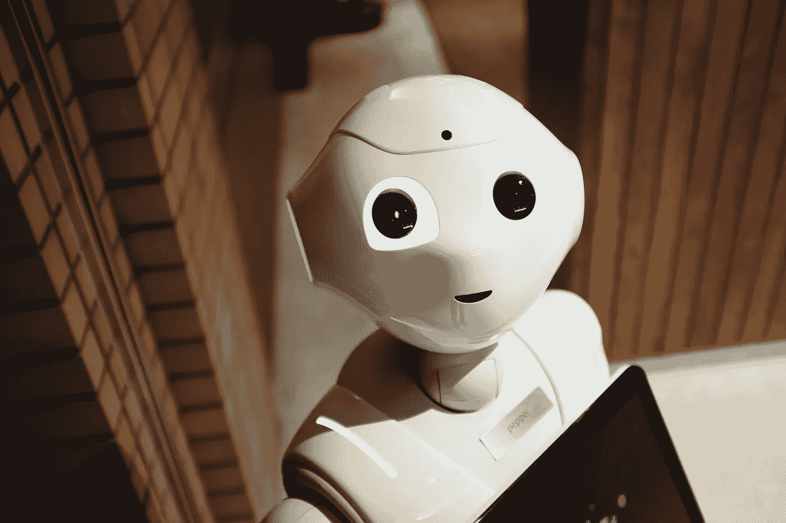

# 人工智能和领导力？

> 原文：<https://medium.com/codex/ai-and-leadership-quo-vadis-a30db50f180?source=collection_archive---------14----------------------->

**人工智能** (AI)影响着组织构建工作和协作的方式。然而，还不清楚在塑造**数字化转型**的过程中，领导力必须扮演什么角色。在本文中，我们主张将广泛的跨学科对话作为在工作场所有效整合**人工智能和领导力**的选择手段。为此，对**应用机器学习日会议** (EPFL，CH)的赛道 **AI &领导层**的中心发现进行了总结和批判性讨论。这些发现旨在作为一个指导方针，在此基础上，关于公司技术实施设计的跨学科对话可以有益地继续下去。

与位置无关的云技术领域的最新发展，即所谓的无处不在的计算或自我开发的算法，为持久改变 21 世纪的工作提供了巨大的潜力，包括其固有的(社会)结构(见 Cascio & Montealegre，2016)。例如，人工智能(AI)和机器学习承诺提供对员工的精确控制，这似乎甚至不尊重他们最个人的生活领域(Schafheitle et al .，2020)。一些人谈到了人们期待已久的对企业卓越的祝福，或建立高绩效团队的自动防故障手册，而批评者则担心出现全国性的老大哥或算法至上。

智能技术对组织构建工作和协作方式的影响是不可否认的。然而，目前还不清楚这些技术如何融入工作场所，以及领导力发挥了什么作用。算法作为新队友，甚至完全自动化的领导，正如亚马逊的**通过算法**解雇实践(Lecher，2019 年)所表明的那样，是一些提出紧迫问题的例子:机器人是否可以成为好老板或同事，如果是的话，如何做到？非人性化工作的极限在哪里？如何防止福柯意义上的技术全景监狱？

答案是困难的，至少有两个原因。首先，关于人工智能和领导力之间关系的系统而可靠的知识仍处于发展过程中。其中一个原因是**怀疑作为一个基本的科学原理**与装配线上的知识生产相矛盾。第二，回答这些问题需要从不同角度进行跨学科对话。这似乎特别困难，同时在不断增长的人工智能回音室(加强自己观点的空间)和科学与实践之间的差距的背景下也是必要的(另见 Fisher，2020)。

我们想为回答**停止还是继续的问题做出贡献？！**人工智能与领导力。为此，我们在 2020 年应用人工智能日的背景下总结了赛道人工智能&领导力的核心发现(Tschopp 等人，2019)。之后，我们希望通过讨论这些发现来激发关于人工智能和领导力的辩论，并指出寻找答案可能值得去做的事情。

# 科学和实践的视角

该轨道的目的是汇集研究和实践的观点，并促成跨学科对话。介绍了当前在技术和信任、创新和领导力以及人形机器人领域的研究，丰富了商业伦理的实践视角，并以金融和技术行业的具体案例研究加以说明。

Simon Schafheitle(圣加仑大学，CH)介绍了 SNF-NFP75 研究项目的研究结果，内容涉及人工智能/人工智能算法如何影响工作场所人力资源管理的流程和实践。因此，他提出了一个由 11 个(社会)技术设计选项组成的框架，借助于该框架，基于算法的人事管理不仅可以进行分类，还可以针对雇员和雇主之间的重要信任关系进行设计。总之:(1)当正确设计和管理时，算法劳动力管理和员工信任可以齐头并进。(2)在员工生命周期的许多领域，领导力已经自动化,( 3)在人工智能的背景下，领导力将需要在复杂的决策情况下不断权衡，并需要一定的技术理解，以打破工作场所中技术的**主导地位。**

Stephanie kau dela-Baum(CH 卢塞恩应用科学与艺术大学)讨论了算法作为参与式领导决策过程中的新参与者的作用。她强调了**实践领导力**的观点，并讨论了当算法不仅能够准备决策，还能够做出决策时，日常管理中由此产生的责任困境。总之:(1)算法改变了参与式管理风格的既定决策模式。比如什么时候，在哪个管理任务中，是人负责，还是算法负责？(2)我们需要就算法的局限性进行持续的批判性对话,( 3)在这种利益混合的情况下，谁有权做出最终决定。

Jamie Gloor(苏黎世大学)专注于领导自动化的进展。特别是，是否，如果是，如何领导可以自动化作为一种社会影响的行为。她以一个具有编程幽默的人形机器人为例，展示了这在原则上是可能的:不仅经常引用的日常活动可以自动化，而且社会影响也可以通过编程的软技能自动化。综上所述:(1)通过使机器人人性化，以前专属于人类的任务可以自动化。(2)这对教育和培训产生了影响:当机器理论上也能振奋精神或激励员工时，经理和机器人经理有什么不同？

John Havens (IEEE，美国)提出了三重底线的概念，以将人工智能和领导力之间的紧张关系与人类福祉、环境和商业成功的三要素**联系起来。他提出了伦理一致的设计框架，这是人工智能开发和部署的认证和监管的标准工作。简而言之:(1)没有灵丹妙药，尽管伦理上一致的设计框架可以作为人工智能伦理方法的护栏，(2)为以人为中心的设计确定具体的基准，(3)防止经理陷入算法的盲目指令。**

Pascal str Lin(UBS，CH)介绍了 Trudi 试点项目的经验，在该项目中，内部员工报告通过语音识别实现自动化。核心论点是，Trudi 给经理们带来了新的挑战，因为将实际利益、无错误操作和定期反馈可能性结合起来是一项挑战。总结:用户最初的怀疑可以通过(1)公开交流和(2)系统地记录“算法可以做什么？就领导力而言，重要的是(3)界定人机合作的界限，例如当涉及到工作质量的评估时

阿夫克·斯豪滕(人工智能顾问，首席顾问)介绍了咨询实践的发现，并讨论了管理人员缺乏人工智能素养可能会导致人工智能项目中的过高期望。总结:(1)成功的人工智能项目管理需要具有技术技能和道德困境意识的领导者。(2)人工智能增加了管理任务的复杂性，因此**技术专家也应该投资于商业素养**，即理解复杂的商业相互关系。

Benedikt Ramsauer(瑞士统计设计与创新中心)介绍了一个项目管理工具，在决策自动化进程中，该工具应有助于在不同利益攸关方的参与下确定目标和里程碑。总结:(1)管理者应该**抑制对技术**的过度期望，相反(2)增加他们对技术蓝图的知识，以便(3)人工智能融入企业文化能够成功。

Ulli Waltinger(西门子人工智能实验室，德国)描述了人工智能如何为经理们带来挑战，例如通过商业模式的转变或通过能够精确分析目标群体的可能性。因此，他提出了西门子责任人工智能框架，该框架强调数据安全和价值编码。总之:(1)管理者应该在**试错过程**中不断扩展他们对人工智能工具的经验，以便(2)将人工智能融入企业文化，(3)保护员工的隐私不受侵犯。

# 人工智能与领导力——是停还是走？

人工智能和领导力——孰优孰劣？它将走向何方？还有哪些其他可能的方向，无论是左还是右，是支持还是反对:人工智能和领导力到底合不合适？文章指出:确实如此！它为一场**争论做出了贡献，这场争论似乎陷入了诺查丹玛斯追随者宣称世界末日和科技福音传道者承诺拯救之间的极端。停还是走？停下来，但是为什么？去吧，但是有多快？这些发现至少提供了两个将讨论集中在一起的起点。**

首先，跨学科的方法是值得的，因为它有助于管理者处理日益复杂的领导任务和技术固有的视觉管理。否则，经理们将冒失败的风险——可以说是被停止。这种方法促进了经理们经常被要求的谦虚，以及不能知道所有事情并提前计划的坦白。最后但同样重要的是:跨学科创造信任，没有信任，人工智能和领导力的整合就无法成功(见 Schafheitle et al .，2020)。员工对雇主、同事、上司以及技术的信任。

其次，这篇文章对一些问题进行了细致入微的分析，例如**经理的哪些能力将在未来发挥作用**，如何应对工作场所日益增加的复杂性，或者人员分析如何与至关重要的信任文化携手并进。外部道德证书值得吗？管理者的 AI 素养如何？考虑到人工智能发展的动态，多少关于人工智能的知识是可取的？

# 结论

我们已经指出了人工智能和领导力成功整合的各种途径。然而，**微调**到底是什么样子，会让未来的研究和实践忙碌一段时间。包含不同方法论、思想流派和经验的跨学科方法肯定大有可为，这不仅仅是为了认识到除了走走停停之外还有其他驱动指令等待我们去发现。**没有理想的方法来整合人工智能和领导力**。这些发现适合作为指导方针，在此基础上，可以就公司技术实施的设计进行跨学科对话。视频可以从 [**会议主页**](https://www.scip.ch/en/www.appliedmldays.org) 下载。我们希望这一贡献将支持围绕人工智能和领导力的成功跨学科的发展，并希望不要将工作场所中的实际技术领域留给一个理应崇高的视角。

# 引用

这是 Marisa Tschopp 和 Simon Schafheitle 在 sonder band Zukunft der Arbeit 共同撰写的同行评审出版物。引用:

Tschopp，m .和 Schafheitle，S. (2020 年)。今天，Morgen Hott。在 J. Nachtwei 和 A. Sureth (Hrsg。)，Sonderband Zukunft der Arbeit(人力资源咨询评论，Bd。第 12 章，第 420-423 节)。VQP。

> *最初将她发布在 scip 实验室:*https://www.scip.ch/en/?实验室 20210218

# 参考

Cascio，W. F .，& Montealegre，R. (2016 年)。技术如何改变工作和组织？组织心理学和组织行为年度评论，3349–375 页。[https://doi.org/10.1146/annurev-orgpsych-041015-062352](https://doi.org/10.1146/annurev-orgpsych-041015-062352)

费希尔，G. (2020)。为什么每个商科教授都应该写以从业者为中心的文章。商业视野，63(4)，417–419 页。[https://doi.org/10.1016/j.bushor.2020.03.004](https://doi.org/10.1016/j.bushor.2020.03.004)

勒彻，C. (2019，25。四月)。亚马逊如何为了‘生产力’自动跟踪和解雇仓库工人。边缘。[https://www . the verge . com/2019/4/25/18516004/亚马逊-仓库-履行-中心-生产力-解雇-终止](https://www.theverge.com/2019/4/25/18516004/amazon-warehouse-fulfillment-centers-productivity-firing-terminations)

Schafheitle，S. D .，Weibel，a .，Ebert，I. L .，Kasper，g .，Schank，c .，& Leicht-Deobald，U. (2020 年)。不遗余力吗？数据化技术对组织控制的影响框架。管理发现学会。[https://doi.org/10.5465/amd.2019.0002](https://doi.org/10.5465/amd.2019.0002)

Tschopp，m .，Weibel，a .，Schmidlin，d .，和 Schafheitle，S. (2019 年)。AI 与领导力【会议提案】。应用机器学习日，瑞士洛桑。[https://www . researchgate . net/publication/337424480 _ Conference _ Proposal _ AI _ Leadership _ Submission _ for _ Applied _ Machine _ Learning _ Days _ EPFL _ accepted _ 2019 _ date _ of _ Conference _ 2020](https://www.researchgate.net/publication/337424480_Conference_Proposal_AI_Leadership_Submission_for_Applied_Machine_Learning_Days_EPFL_accepted_2019_date_of_conference_2020)