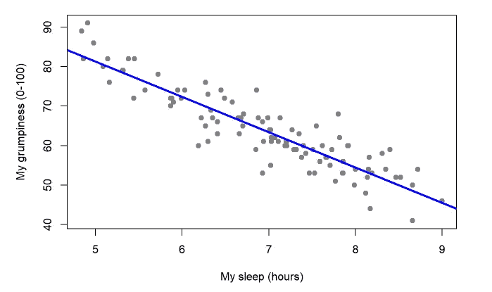
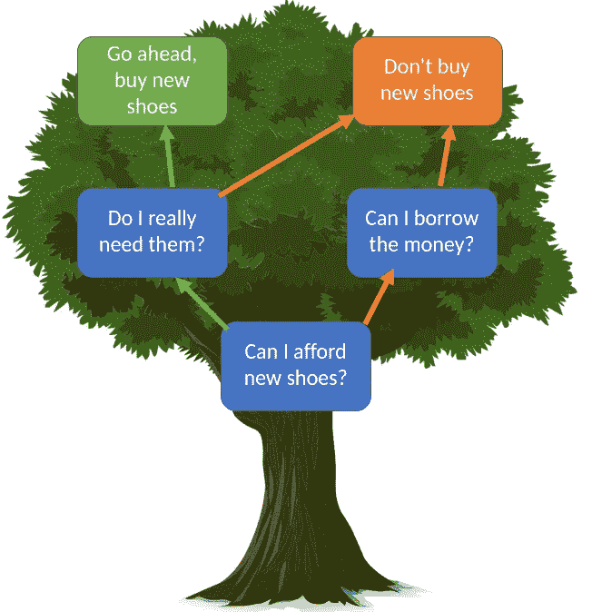
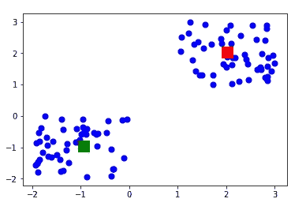

# 简而言之，人工智能和机器学习

> 原文：<https://medium.com/codex/ai-and-machine-learning-in-a-nutshell-e97252fe67d8?source=collection_archive---------13----------------------->

## -比你想象的要容易破解！

人工智能，AI，近年来已经成为一个时髦词。这在媒体和公司内部都是一个常见的概念。许多人想投资人工智能，这对 IT 公司和人工智能顾问来说是好时机。那么，这个流行词是什么意思呢？智能这个词很容易让人联想到类似人类的智能计算机，它们有自己的意志和议程。

在文献中，经常在强 AI 和弱 AI 之间进行区分。强 AI 接近于上面描述的思维模式:一个与人类思维方式相同的系统。另一方面，弱人工智能假设系统以人类推理方法作为模型工作。因此，系统根据学习到的模板工作，但不会在模板范围之外发展自己。原则上，目前所有的人工智能活动都在弱人工智能范围内，许多人认为我们永远不会达到强人工智能成为现实的阶段。

# 什么是机器学习？

机器学习是人工智能的一个分支。机器学习的定义是基于经验/学习自动改进其结果的计算机算法。与根据规则工作的系统相反，例如，根据规则“如果动物在地上爬行并且看起来像手杖，不要触摸它！”实现机器学习的系统通过从它以前经历的事情中得出结论来工作。

如果系统曾经经历过被蛇咬过，它会为下一次记忆它，并且它接收到的关于蛇的信息，例如，1 米长，黑色，在地上爬行，发出嘶嘶声。每次向系统提供附加信息时，系统都会更新。如果它遇到了 10 条蛇，其中只有一条咬过，它会认为第 11 条蛇没有前一条危险。当系统看到第一条咬人的蛇时，1/1 =它所看到的所有蛇都咬人。看到第十分之一后，只有 1/10 = 10%的人咬过。基于规则构建的系统在呈现新的事实后不会更新蛇的“风险状态”。

# 算法和机器学习

为了让系统能够学习，它使用算法。这个词听起来像是在描述过于复杂的东西，但事实是算法只是指令的同义词。在蛇的例子中，我们已经提到了一些指示(测量动物，看它的颜色…)可以用来确定动物是否可能咬人。当付诸实践时，指令以编程语言中的(主要)数学表达式的形式给出。机器学习中用到的一些算法，即使数学不是那么强的人也能理解，而另一些算法则需要大量的数学知识。

算法也用在没有实现机器学习的系统中，其中一些算法甚至对于没有数学或程序员背景的人来说也是非常直观的。如果我们回到蛇的例子，算法“如果长度是 1 米，颜色是黑色，认为动物是危险的”是为基于规则的系统编写的。在编程语言 python 中，该算法如下所示:

Python 编程语言示例

# 不同类型的机器学习

机器学习分为子群监督学习、无监督学习、半监督学习和强化学习。

**监督学习**

当机器学习模型被监督时，算法被给予训练数据集，其中，除了解释变量(例如，1 米长、黑色和爬行)之外，数据还包括因变量或正确标签(例如，“危险”)。然后对算法进行训练，以识别解释变量如何影响训练集中的因变量。获得的逻辑用于标记新数据(或者在示例情况下，新动物)。

监督学习中的一种常见算法是线性回归，这是一种许多大学生都熟悉的模型。另一种常见的算法是决策树。可以使用监督学习的一个例子是预测申请信用卡的人的信用度。根据此人的职位、性别和年收入，他/她有支付困难的可能性有多大？

**线性回归**是一种基于一个或多个解释变量与因变量具有线性关系的假设的方法。该模型计算解释变量和因变量之间的直线。画这条线是为了使从这条线到观察点的总偏差尽可能小。下面是一个例子，描述性变量(x 轴)睡眠小时数解释了第二天的情绪(y 轴)。这些点是观察值，它们之间画的线是回归线。

线性回归线的例子借用了 https://learningstatisticswithr.com/book/regression.html[的](https://learningstatisticswithr.com/book/regression.html)

**决策树**的基本结构很容易理解。你问一个问题，例如，一个人是什么性别，基于这个答案问一个新的问题，最后，得到一个结果(团体关系或一个数字)。下面是一个决策树的例子，用来回答一个人是否应该买新鞋的问题。

决策树示例。来自 open clip art-pix abay 的矢量树图片

# 无监督学习

使用无监督学习的模型不会根据历史变量和结果预测特定的结果，但算法的任务是在数据中找到模式。算法的一个例子是 k 均值聚类。例如，该方法可用于将客户划分为不同的客户群，以便您可以向他们发送定制的简讯。

最简单类型的 k 均值聚类用于二维数据。一个很好的例子是看一个城市的学校数量。它们可以画在二维地图上，每个学校的位置都标有坐标。如果我们想知道这些学校是否可以根据它们的位置进行分组，我们需要从指出我们正在寻找多少个组开始。让我们说两个。

该算法现在将在坐标画布上随机放置两个中点/中心。之后，它会计算每个学校到两个中点的距离，然后根据哪个中心最近将学校分成两组。当这样做时，中心被移动到属于该中心的学校的中心，并且到学校的距离被重新计算，基于结果改变组划分，并且中心被再次移动到属于该中心的学校的中心。

借用[的 K-means 聚类示例 https://towards data science . com/understanding-k-means-clustering-in-machine-learning-6a6e 67336 aa 1](https://towardsdatascience.com/understanding-k-means-clustering-in-machine-learning-6a6e67336aa1)

这种情况一直持续到再也无法行动为止。我们现在已经将学校分成两组，这样学校和组中心之间的平均距离已经最小化。上图显示了如何标记两个组的中间。

在上面的案例中，如果没有机器学习的帮助，查看地图并找出这两个群体是很容易的。然而，一旦我们同时关注两个以上的因素(例如，在客户数据集中:性别、年龄、邮政编码和职业)，对人来说就变得更加棘手了。

# 半监督学习和强化学习

在半监督学习中，具有预定义标签的数据与没有标签的数据相结合。换句话说，它是监督学习和非监督学习的中间形式。

强化学习是给算法一个目标，但不是说如何实现目标。在训练自动驾驶汽车时，强化学习和其他方法一起使用。

# 尝试

人们可能很容易产生这样的印象，即机器学习只是大型 It 公司的数学天才的工作，但事实是，任何拥有计算机和互联网连接的人都可以测试机器学习。

一种开始的方法是在 Kaggle 上上一些简短的入门课程(例如，[https://www.kaggle.com/learn/python](https://www.kaggle.com/learn/python)和[https://www.kaggle.com/learn/intro-to-machine-learning](https://www.kaggle.com/learn/intro-to-machine-learning)等分别是 5h 和 3h)，下载编程语言 python([https://www.python.org/downloads/](https://www.python.org/downloads/))，然后用自己的数据和一个简单的模型(例如决策树)进行测试。

如果一个人陷入困境，很容易在谷歌上找到帮助和提示，或者在 YouTube 和 Medium 上查看不同的教程。