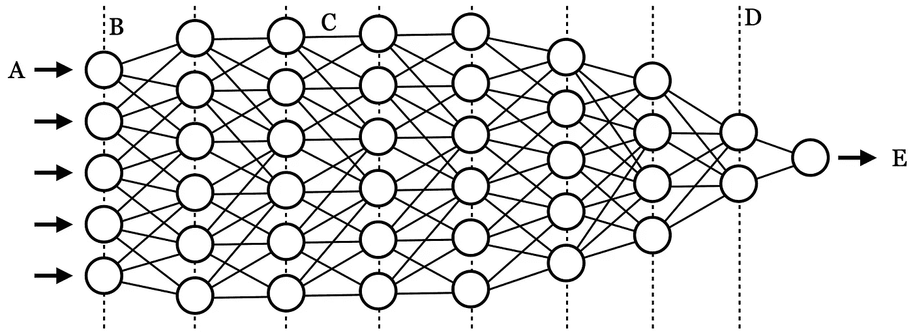
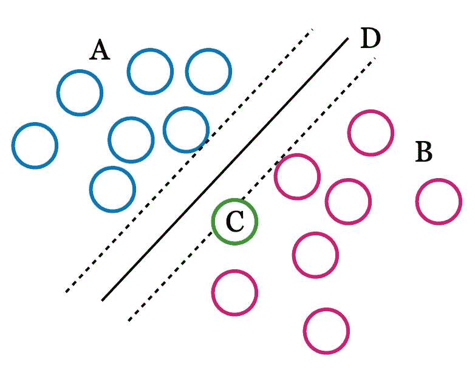

# 面向开发者的人工智能概念

> 原文：<https://medium.com/codex/ai-concepts-for-developers-76b5a1a29fed?source=collection_archive---------15----------------------->

本指南的目的是让普通开发人员对人工智能概念有一个粗略的了解，这是开始使用各种框架、库或源代码开发应用程序所必需的。我已经跨越了人工智能开发的软件工程和学术研究两个方向，我理解这两种方法是多么的微妙，尤其是当内存和性能的移动限制被加入进来的时候。

图一。神经网络的图示

以下概念应该可以帮助你更好地理解与 AI 相关的 SDK 和 API 的教程或文档，而不需要任何额外的背景阅读。

## 人工智能、深度学习和机器学习的区别

关于这些概念之间的细微差别，可以写一整篇文章。然而，简单地说，AI 是一个通用术语，用于描述由计算机完成的类似人类的问题解决，而深度学习和机器学习是指用于执行 AI 的特定实现。具体来说，机器学习通常使用较少的独特特征来建立对所见事物的统计理解，而深度学习使用许多特征。

例如，图 2 显示了 A 组和 B 组如何通过边缘根据叶片长度和高度(超过 2 个维度， *x* 和 *y* )进行区分，并且未知植物可以根据其落在该边缘两侧的位置被分类为 A 组或 B 组。

另一方面，深度学习需要许多独特的功能，更接近于人类大脑学习和理解的方式。例如，图 1 显示了照片中的许多特征是如何输入到 A 中的，沿着 B 中的许多不同层，直到它作为 e 输出。

机器学习*可以*作为一个通用术语，涵盖更具体的深度学习算法，但越来越多地用于描述更传统的方法，如 SVM、kNN 和其他低维学习方法。

图二。支持向量机(SVM)边际图

## *有哪些特点*

在机器学习中，特征是正在学习的事物的许多测量属性，例如，在图 2 中被视为点的 *x* 和 *y* 轴的植物的叶子颜色和大小，或者在图 1 中被视为 A 的许多输入特征。可能有许多特征，也可能只有几个，但随着特征的增加，用机器学习进行预测变得更加困难。深度学习解决这一限制的一种方法是通过卷积神经网络，其中像图像这样的东西被分层到其各种边缘、颜色和其他图形扰动中。当 CNN 观察和跟踪这些不同的扰动时，它了解了同名图片之间的差异和相似之处。这与图 2 所示的支持向量机等机器学习算法明显不同，在图 2 中，较小的特征集以统计方式分组为由边距 D 分隔的聚类。在图 2 中，接触超平面 D 的向量是定义边距的支持向量，该边距将超平面 D 两侧的点分类为 A 组或 b 组。

## 类别和标签的区别

假设您有一个不同茎长、叶色和高度的植物数据列表。每种植物都有一个与之相关的名字，通常被称为标签或类名。现在让我们假设你在野外测量一株植物，你想预测它是什么，你可以输入它的茎长、叶色和高度，得到一个类名作为预测。这就是所谓的*分类*。然而，如果列表中的植物都没有标签，并且您想要查看您的神秘植物是否类似于您的数据集中的一簇未标记的神秘植物，该怎么办？在这种情况下，您将获得一个带编号的集群 id 作为标签，但它不是一个类，因为没有发生分类。类和标签之间的区别并不总是强制的，但这是一个细微的区别，在我们处理下一个概念时值得理解。

## 监督和非监督学习

在前面的例子中，我们看到了如何给植物茎长、叶色和高度的数据集指定一个名称作为标签。当训练我们的机器学习算法时，它可以采用新的未知茎长、叶子颜色和高度来预测或*分类*它。然而，如果我们有数据，但没有标签呢？例如，在图 2 中，可以通过*自动*找到边距吗？我们能让算法预测我们的数据集中有多少不同类型的植物吗？对，这叫无监督学习。在这种情况下，该算法返回一个唯一的 id，该 id 属于彼此共享最多共同属性的每个分类。算法中的参数可以使聚类更具包容性或排他性，有时需要进行大量的调整和解释，以防止无监督标签过多或过少。

## 什么是张量

你可能听说过谷歌的 Tensorflow。张量是一种数学结构，用于描述计算中使用的输入。你可能听说过的其他结构包括标量、矩阵和向量。张量在很多深度学习算法中被“隐藏”使用，并不仅仅用于人工智能。

## 迁移学习

基本上，迁移学习采用以前创建的模型，并在其中添加新的培训和标签。但这比听起来更复杂。一个典型的深度学习模型，如图 1 所示，包含许多层(D)，其中一些层需要在迁移学习时删除、附加和重新训练。通常，工程师会选择一个经过训练的模型，用于识别带有一般标签的一般对象，然后使用迁移学习来训练模型识别特定的东西，例如脑肿瘤。

## 班级模型和培训

到目前为止，您已经理解了什么是类和特性，这两者对于理解模型都是必要的。模型是一个与类名关联的特征库，在深度学习算法进行预测时用作参考。训练是将输入(例如图像)输入到人工智能算法中的过程，因此它可以将独特的区分特征分成属于特定类别的箱。模型是在训练过程中构建的，例如，用作深度学习算法输入的猫的图像被逐层分解，图像的特征被保存到整体模型中，用于将猫的特征与模型中的狗、灯塔、汽车和其他类别分开。

## 回旋

卷积描述了当两个或多个动作产生一个结果时，*如何产生*和*产生什么*。例如，如果您选取一个形状并拉伸和旋转它，卷积将既是拉伸和旋转的图像，也是描述其变换的数学几何。在这个例子中，我们可以使用一个矩阵来描述仿射变换，但我们也可以使用张量来描述层间的卷积，如图 2 中的 D 虚线所示的神经网络。事实上，这是对卷积神经网络(CNN)在训练过程中如何处理输入的基本描述。

## 激活功能

在卷积层之间，即图 2 中的虚线 D，神经网络是权重和偏差，如图 C 所示，其改变一层对另一层的影响。这些被称为激活函数，用于调整各层如何将它们的转换传递给彼此。这些激活功能可以静音、倾斜、打开或关闭，或者稍微改变层之间的输入特征，以便放大或衰减。有时这个术语与术语*转换功能*互换使用，尽管通常转换功能包括激活和输出功能。这里要理解的关键是激活函数通过某种转换过滤器定义输入的输出。

当我从朋友、同事和其他对人工智能概念有疑问的人那里得到反馈时，我会加入这个列表。这些定义肯定不足以作为课堂环境下的学术描述。但希望它们能让你对伴随 AI 框架、库和源代码的文档中的术语和概念有一个总体的理解。