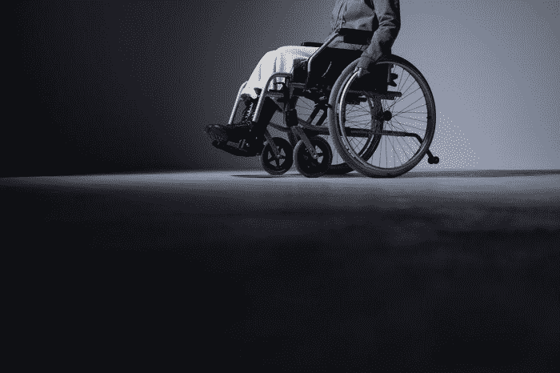

# 人工智能创造疼痛管理的平等

> 原文：<https://medium.com/codex/ai-creates-equality-in-pain-management-e0b964a6ba8d?source=collection_archive---------11----------------------->

## [法典](http://medium.com/codex)

## *人工智能有助于消除评估 X 射线的隐含偏见*

照片由 [Pixabay](https://www.pexels.com/@pixabay?utm_content=attributionCopyText&utm_medium=referral&utm_source=pexels) 从[像素](https://www.pexels.com/photo/abstract-bubble-clean-clear-221189/?utm_content=attributionCopyText&utm_medium=referral&utm_source=pexels)拍摄

某些人群对疼痛的感受更强烈。研究表明，总体而言，由于压力，来自少数民族和弱势群体的个人往往比普通人群经历更多的身体疼痛