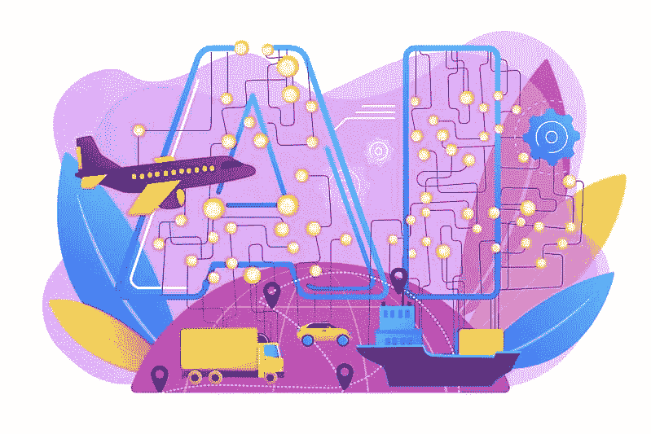

# 人工智能驱动的推荐引擎:它们是什么以及如何工作

> 原文：<https://medium.com/codex/ai-driven-recommendation-engines-what-they-are-and-how-they-work-49688338620c?source=collection_archive---------12----------------------->

# 了解推荐引擎

推荐引擎使用算法来预测用户的选择，然后向用户提供建议，帮助他们找到他们最感兴趣的东西。因此，这些建议有助于优化用户体验，让他们更快地获得想要的东西。讨论推荐引擎如何在消费者环境中工作，可以让我们更好地理解它的应用。

在我们的日常网络生活中，我们可以看到许多推荐引擎的例子。例如，网飞推荐就是推荐引擎的一个很好的例子。不同新闻应用中的推荐文章以及哪些朋友首先出现在我们的社交媒体订阅中也是如此。这些是推荐引擎的例子，展示了我们最有可能与之互动的内容。

从 B2B 世界的商业角度来看，许多组织寻求改进他们的知识和工作流管理。推荐引擎可以帮助你做到这一点。

# 人工智能驱动的推荐引擎正在发挥作用

*图片经由* [*土坯库存*](https://stock.adobe.com/images/artificial-intelligence-in-logistics-and-distribution-ai-in-travel-and-transportation-ai-travel-recommendations-ai-smart-booking-concept-bright-vibrant-violet-vector-isolated-illustration/277375764) *授权给埃琳·皮尔森*

想象一下，使用一个基于人工智能的推荐引擎来管理提案请求(RFP)，这是销售组织最机械但又最重要的任务之一。Evalueserve 团队创建了一个人工智能平台，通过将 RFP 分成微观部分并进行分析来帮助团队，然后引擎会为每个部分推荐一个响应。

从那里，人工智能平台帮助公司创建一个零草案，简化一个更大项目的开始。曾经需要人来处理整个文档的工作现在可以由机器来管理，这使得公司的工作效率更高，响应团队的工作也更愉快。

团队可以使用推荐引擎来提高准确性并帮助通知他们的响应，而不是必须正确处理每个部分。像这样的人工智能驱动的产品和平台使公司能够优化决策，并推动可持续和可操作的结果。

随着这种人工智能引擎的不断发展，曾经只有人类才能做到的事情现在变得更快、更有效、更准确。这只是人工智能能为你做什么的一个例子。

许多企业高管和专业人士对人工智能的前景感到兴奋，他们应该如此——可能性是无限的。然而，处于创新的最前沿可能会导致一些困惑，因此，我收到了许多关于人工智能和推荐引擎的问题。在下一节中，我将回答一些最常见的问题。

# 常见问题:

**问题:**什么是推荐引擎？

**答:**推荐引擎是基于用户行为的人工智能工具，有时它们也会参考用户档案向客户推荐最相关的商品。

**问:**你能详细说明一下什么是用户资料吗？

**答:**因此，在 B2B 领域，当我们谈论用户档案时，它们可以更具体。例如，我们有一些客户使用我们的数字平台。我们所指的用户配置文件可以是用户的职务、部门、业务单位以及角色。

他们对某些东西最感兴趣。当然，B2C 领域更具活力。更多的内容可以被认为是用户简档的一部分

**问:**如何让 AI 推荐引擎保持在正轨上？

**答:**有两部分。从用户的角度来看，当用户点击平台上的任何项目，在页面上停留一定时间，或者喜欢或不喜欢内容时，就会创建数据。诸如此类的动作和行为反馈到系统中，帮助推荐引擎学习和改进。

另一方面，在业务领域中，用户行为和文档或内容本身可能不会提供最佳结果。可能存在偏见。拥有一个合适的架构来利用背景或领域知识将会很有帮助。在商业环境中，专业知识有助于使发动机性能更好。

在 Evalueserve，我们的平台也有机制和可配置的参数，允许我们定期检查模型的性能，并改善推荐结果。因此，人工智能引擎将随着时间的推移不断改进。

*图片经由*[*Adobe Stock*](https://stock.adobe.com/images/silicon-wafer/325415166)*授权给 Erin Pearson*

问:你会如何向不完全理解人工智能的人解释它？

答:想想人类吧。人类有眼睛，所以我们能看见和做像阅读文本这样的事情。我们可以看视频，看图片。人类有耳朵，所以我们能听到声音。我们有嘴，所以我们能说话。在所有这些生物交流过程中，我们接受原始数据点，用我们的大脑处理它们，分析它们以获得有用的信息，并决定行动。

我们现在可以使用机器学习和深度学习技术来处理更多的原材料，获得洞察力，然后采取行动，而不是使用人脑。我们称之为 AI，或者人工智能。

在你用人工智能处理文本的情况下，我们称这项技术为自然语言处理或 NLP。如果你在处理视频或图像，那就是计算机视觉，图像识别。如果你处理声音和语音，那就是音频处理。等等等等。

问:推荐引擎在哪些方面对企业有用？

**答:**推荐引擎可以向用户的查询推荐最相关的答案，帮助他们快速找到他们想要的东西，无论是产品还是问题的答案。推荐引擎可以帮助企业决定他们的哪些服务或解决方案会引起特定客户的兴趣。

推荐引擎还帮助组织充分利用他们的数据资产，是任何知识管理门户网站的一个很好的附加组件。

**问:**展望未来，你如何看待这项技术的继续发展？你认为推荐引擎继续需要人工监督还是更加独立地运行？

**答:**这是一个市场认可度很高的领域。在 B2C 领域，它仍然是一个不断发展的解决方案，我们也看到了 B2B 领域的趋势。越来越多的应用程序开始采用推荐引擎。也许有一天，它会从一个好东西演变成企业必须拥有的东西。

当然，提高性能也是一个挑战。需要做许多事情来改进推荐引擎，例如对抗深度偏见、优化计算成本、个性化等等，等等。解决这些问题对于这些应用程序在 B2B 领域的起飞至关重要。

关于人为监督，如果你指的是反馈回路，是的。人类干预或人类参与将一直持续下去。人类需要在那里，因为推荐系统是一个双向系统。如果你说的是专家知识，把知识融入到系统中是很好的。

最后，是的，运营会更加独立。AI 引擎将更加独立地运行。随着它变得越来越复杂，算法越来越成熟，这种情况已经发生了。

[这篇博文的一个版本最初分两期发表在 Evalueserve 的网站上](https://hubs.ly/Q01c0pTp0) [。](https://hubs.ly/Q01c0qk30)