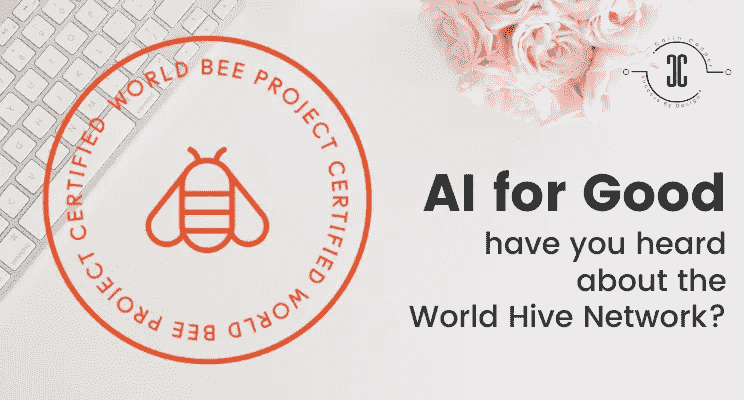
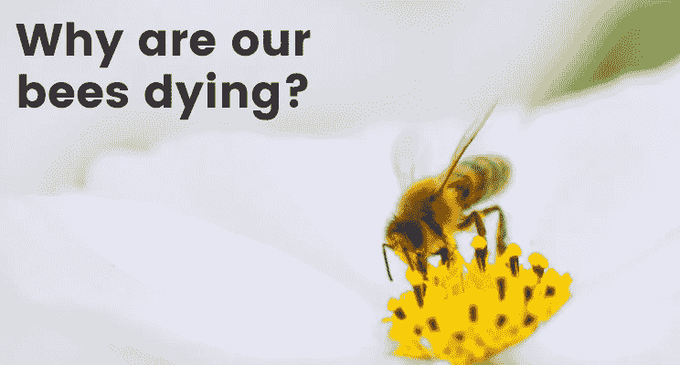
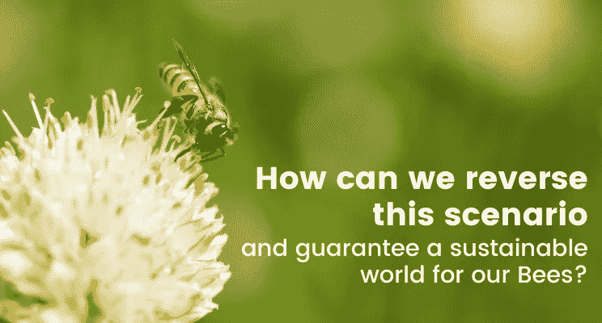
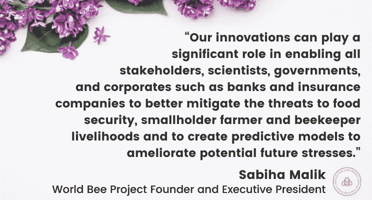

# 永远的人工智能——你听说过世界蜂巢网络吗？

> 原文：<https://medium.com/codex/ai-for-good-have-you-heard-about-the-world-hive-network-cad4fada88e8?source=collection_archive---------10----------------------->

随着蜜蜂被赶向灭绝，农业世界正处于危险之中。但是有了 AI 技术，“世界蜜蜂计划”可以扭转这种趋势！看看吧！

农业陷入困境已经不是什么秘密了。我们的整个生态系统都依赖蜜蜂，包括我们吃的食物和呼吸的空气——但根据世界蜜蜂项目组织创始人兼执行主席 Sabiha Rumani Malik 的说法，这些授粉者正在迅速消失。

幸运的是，人工智能技术可以帮助扭转这一趋势——并拯救我们地球的未来！

传粉者濒临灭绝的原因有很多——你知道蜜蜂以及蝴蝶等其他传粉者让植物繁殖并产生种子吗？

基本上，我们认为授粉过程是理所当然的，许多人甚至没有意识到它的发生。发生的情况是，花粉在昆虫(如蜜蜂或蝴蝶)的帮助下从一株植物转移到另一株植物，在物种间传播繁殖能力，以生产一系列食物。

没有这些生物，这种微妙的平衡将会失去——不仅会导致食物供应的可怕后果，也会影响我们自己的生态系统！

蜜蜂死亡的原因很多，而人类是蜜蜂数量减少的主要原因。各种因素正在影响它们，包括杀虫剂、干旱、生境破坏、营养不足和空气污染；这四个因素已被确定为主要原因，并且都可以归因于人类活动。

世界各地的城市发展和集约农业实践已经破坏了许多适合蜜蜂生活的授粉栖息地。某些类型的新烟碱类杀虫剂——一种对蜜蜂等昆虫致命的杀虫剂——导致了蜜蜂的死亡，因为它们以谷物等花粉为食，然后死亡。

花朵是确保蜜蜂成功的关键，同时也是蜜蜂舒适筑巢的各种栖息地的关键。因此，随着蜜蜂数量的减少，我们将会失去咖啡、鳄梨、柠檬、酸橙、橙子以及许多由蜜蜂授粉的不同水果和蔬菜。

然而，虽然这些商品不会完全消失，但它们的巨大产量将是不可持续的，它们的价格将失去控制。

为了更好地了解不同环境下世界蜜蜂种群的健康状况，必须提供数据。然而，迄今为止，还没有人努力在世界不同地区远程监控蜜蜂，以研究传粉者危机和全球传粉危机。

世界蜜蜂项目是第一个发起并致力于监测全球蜜蜂数量的私人全球协调组织。自 2014 年以来，他们一直鼓励来自世界各地的科学家对这一问题进行研究，因为这一问题对各行各业的人们的生计有着巨大的影响。他们的目标不仅是提供关于什么导致“蜜蜂衰退”的见解，而且要确保所有利益相关者都参与进来，共同寻找解决方案，这样我们才能给蜜蜂的后代最好的生存机会！

他们的工作使人们能够更好地了解全球范围内的蜜蜂健康状况，同时也提供了对当地情况的详细了解，因此农民和养蜂人可以改善他们蜜蜂的健康状况，提高他们的作物和蜂蜜产量，而不管农场的规模和位置如何。

就像技术应用于其他创新项目一样，它可以帮助拯救蜜蜂。来自蜜蜂和蜂巢的数据可以通过使用物联网传感器来收集，例如可以检测和记录入侵捕食者的麦克风和相机。

在无线技术、机器人和计算机视觉的帮助下，发现和解决方案是可以实现的。

衡量蜂巢健康状况的一个关键指标是它发出的声音，因此监听蜂巢对于确定蜂群的健康状况、强度和行为以及收集温度、湿度、蜂房天气条件和蜂巢重量至关重要。

一旦数据被输入 Oracle 云，人工智能(AI)算法就开始对其进行分析。人工智能将使用蜂巢的行为模式来确定蜂群是否即将到来。

然后，这些见解会与养蜂人和自然资源保护者分享，这样他们就能在灾难发生之前知道他们的蜜蜂何时需要帮助！

通过分析算法和研究，可以使用蜂巢网络研究和分析来自世界各地蜂群的数据。hive 还允许学生、研究人员，甚至感兴趣的公民通过开放的 API 与这些信息进行交互。

所有这些都为改善农民和养蜂人的生计以及促进城市复兴提供了可持续的、创新的当地解决方案。

到目前为止，先进的监测基础设施只适用于大型商业农场，但现在发展中经济体的小农可以受益于同样的技术。

这项技术可以确保授粉质量，同时保持蜜蜂的福利，并且已经看到作物产量增加了 30%以上，蜜蜂死亡率平均降低了 20-25%。

该技术可用于城市再生项目，跟踪蜜蜂健康和花蜜流量，以确定生态系统的状况以及需要采取哪些措施进行恢复。

世界蜜蜂项目汇集了蜜蜂健康研究领域最聪明的头脑和高性能计算领域的最新进展。机器学习和人工智能也将使解决方案和智能能够直接交付给小农和养蜂人——还有开发移动和语音技术应用程序来添加到蜂巢传感器中。

Malik 分享了技术帮助他们实现拯救世界蜜蜂种群的使命——“世界蜜蜂项目蜂巢网络扩大了我们在全球的影响，使行动更加快速有效。”

蜜蜂就是这样一种对地球上的人类生活有巨大好处的生物！让我们一起努力保护他们(和我们的未来)！