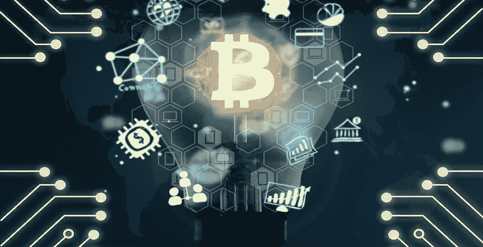

# 区块链中的人工智能

> 原文：<https://medium.com/codex/ai-in-blockchain-26cf68bbf9ed?source=collection_archive---------20----------------------->

资料来源:Emerj

> 据统计，全球在区块链解决方案上的支出预计将从 2020 年的 45 亿美元增长到 2024 年的 190 亿美元。

# 什么是区块链？

区块链是一种分布式的、分散的、不可撤销的分类帐，用于存储加密数据。

虽然任何传统的数据库都可以保存这种类型的数据，但区块链的特殊之处在于它是完全分散的。集中式管理员将区块链数据库的大量精确副本保存在网络中的多台计算机上，而不是保存在一个位置。这些独立的计算机被称为节点。

另一方面，人工智能是一种机制或“大脑”，它将基于获得的数据进行分析和战略思考。

# 区块链是如何工作的？？

来源:CBInsights

区块链由三个重要概念组成:区块、节点、矿工。

## 区块:

*   块中的**数据**。
*   一个 32 位的整数被称为一个**随机数。**随机数在创建块时随机生成，然后生成块头哈希。
*   **哈希**是一个 256 位的数字，与随机数绑定在一起。它必须以大量的零开始。

当产生链的第一个块时，nonce 创建加密哈希。除非被挖掘，否则链中的内容被认为是签名的，并且永远链接到 nonce 和 hash。

## 矿工:

矿工通过称为采矿的过程在链条上创造新的区块。

当一个块被成功提取时，该变化被网络的所有对等体确认，并且矿工得到金钱上的补偿。

## 节点:

节点可以是维护区块链副本并保持网络运行的任何类型的电子设备。

每个节点都有自己的区块链副本，网络必须通过算法批准任何新挖掘的块，以便链得到更新、信任和验证。

# 区块链和人工智能:完美匹配与否？

人工智能与区块链的结合产生了可能是世界上最可靠的由技术支持的决策机制，这种机制几乎在潜逃，并提供可靠的观察和选择。

改进的业务数据模型
全球化的验证系统
创新的审计和合规系统
更智能的财务
透明的治理
智能零售
智能预测分析
数字知识产权

**通过在区块链中使用人工智能，我们可以实现一些技术增强，如安全、效率、信任、更好的管理、隐私和新市场，以及存储。**

# **现实生活应用:**

## **完成:**

Finalze 是一种技术基础设施，利用区块链和机器学习来创建旨在改善民用基础设施的应用程序。该公司的产品简化并加速了建筑行业的工作流程、管理和确认程序，其技术还可以与可穿戴设备交互以满足安全要求。

Finalze 承诺提高关键运营的效率，同时优化企业的投资回报率，预计到 2028 年其销售额将达到 15.5 万亿美元。

## **黑盒 AI:**

Blackbox AI 是一家为新的创新创造人工智能解决方案的公司。该公司的工程师设计了一个个性化的信息架构，支持从机器学习和自然语言处理到区块链技术的一切。

除了创建区块链基础设施，该公司还提供咨询服务，重点是他们的解决方案如何改善区块链的表现。

Blackbox 人工智能专家来自一些世界顶级的技术公司(特别是苹果、英特尔、英伟达和麻省理工)，他们已经为从增强世界到自然语言处理的任何事情创建了基于人工智能的解决方案。

> *比特币是一项技术杰作。——比尔·盖茨*