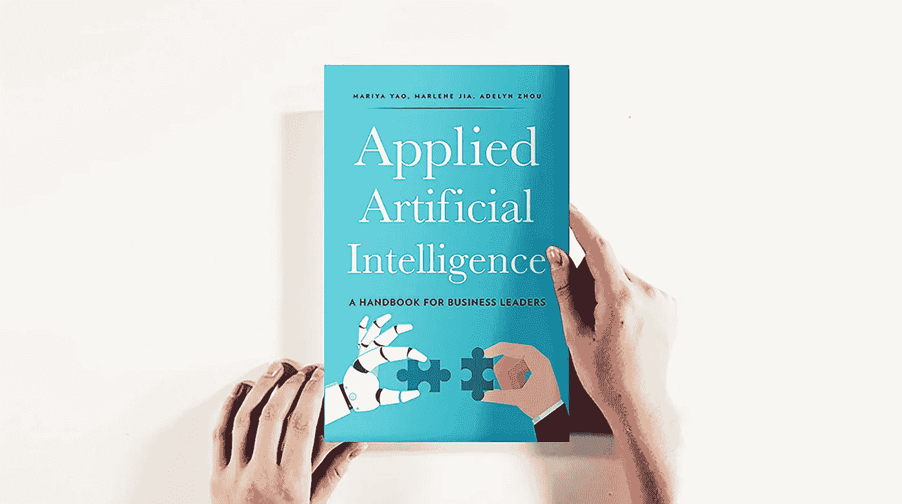
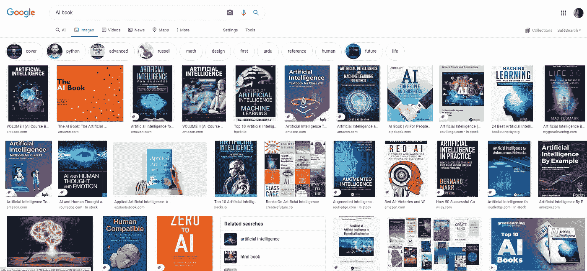
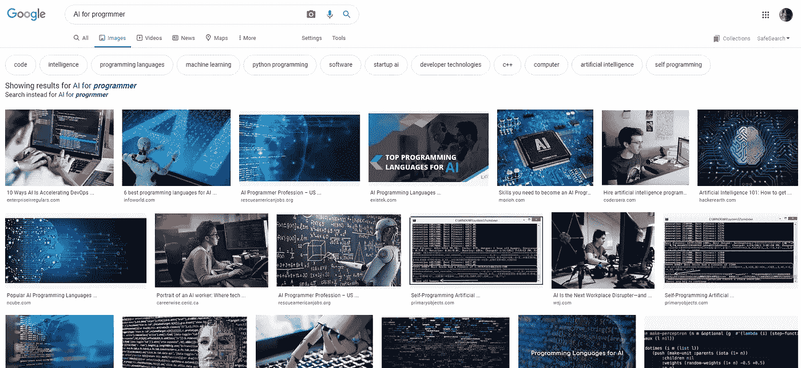

# 书籍写作和软件编码中的人工智能

> 原文：<https://medium.com/codex/ai-in-book-writing-and-software-coding-4a429298e44d?source=collection_archive---------29----------------------->

## [法典](http://medium.com/codex)

书籍和软件的人工智能

当你用你最喜欢的 IDE 编写这个软件的时候，这个人工智能驱动的开发者简单而聪明地分析你的代码库，找到你将要面对的预期错误和技术问题。它不仅使用你的代码库，还使用你的软件所依赖的所有这些模块的代码库。除了找到预期的 bug 和技术问题，这个开发者还在你需要它们之前找到所有的文档、链接和这些 bug 和技术问题的解决方案。

如果你对书籍而不是软件感兴趣。你可以在上面的段落中用单词 book 替换单词 software，然后你就可以让合著者跟随你的写书之旅，分析你所有的写作，并找到你应该阅读的相关内容，以使你的书更加丰富，但它不仅如此，它还会给你带来例子来说明你的观点和数据来证明你正在谈论的事实，比如即时提供你正在谈论的这家初创公司或公司的收入和增长图表。你可以建立所有这些想法，但你需要明确你的受众，不要试图让每个人都知道。变得具体有助于成就非凡的公司和创业公司。

阅读[这本书](https://appliedaibook.com/)会对这些想法有所帮助

**去建造它们**

谷歌搜索人工智能书

面向程序员的人工智能谷歌搜索