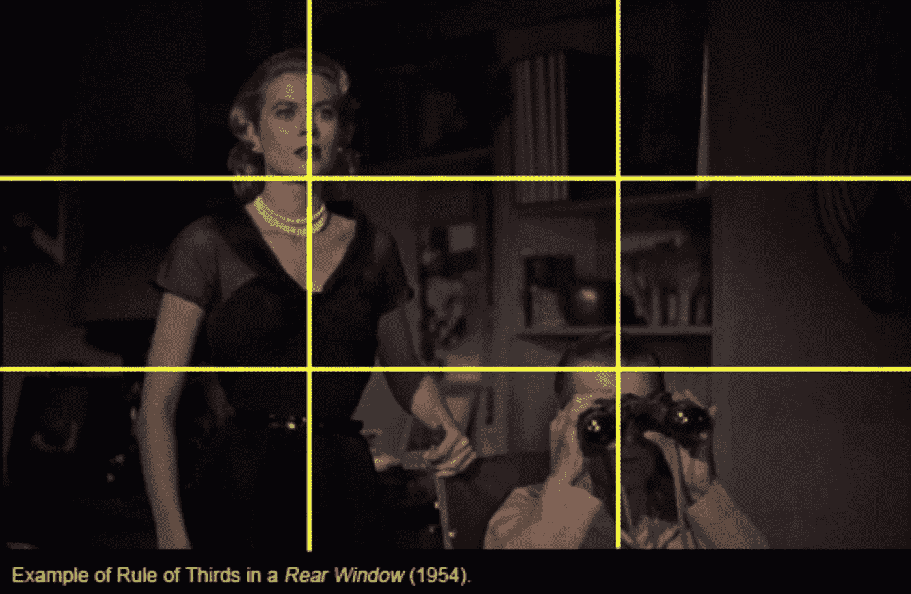
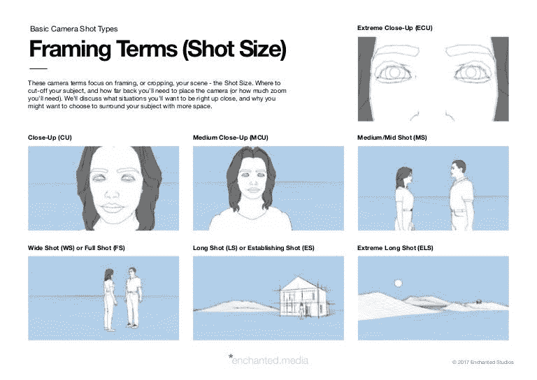
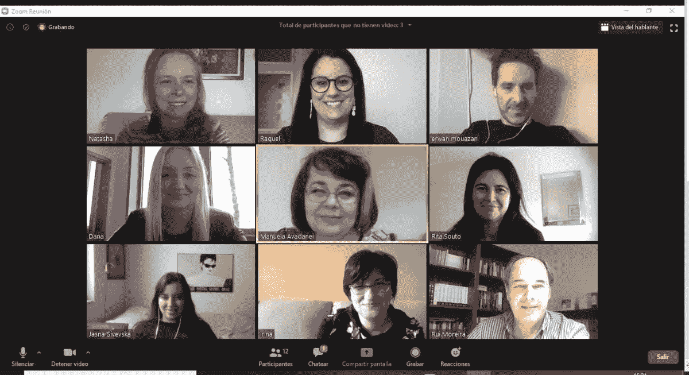

# 视频发布平台中的人工智能

> 原文：<https://medium.com/codex/ai-in-video-publishing-platform-177a1b8d8003?source=collection_archive---------9----------------------->

如果你可以建立人工智能算法来检测这种类型的图片，你将有一个系统可以过滤掉两个人谈话的视频。

面部检测将提取他们每个人的面部，通过这些面部图片，您将能够使用谷歌人来了解他们的姓名，或者使用另一种迂回的方式来获取他们的信息，用于您正在构建的和我们已经构建的关系图。

你可以进一步使用不同类型的其他种类的视频

例如，如果它是取自好莱坞电影或通过国家地理的电影类型。有专业摄影师拍摄电影，有专业导演执导。他们都使用约定来框定他们的镜头，所以你可以像这样利用镜头框

通过了解镜头是如何构成的，你将能够优化你的面部检测算法，并使其更快，因为你将知道演员的头部更可能出现在照片的哪个区域。

如果你愿意的话，你也可以开发一个分类器，它可以告诉你一部电影中每一个镜头的名称。电影制作中使用的一些镜头取景类型如下。

手头有了这些信息，你认为你有可能建立一个可以进行主成分分析的人工智能系统，以便发现拥有相同拍摄风格的导演或专业摄影师吗？

一旦你的算法检测到两个人在讨论的视频，你可以改进它，使它能够检测到几个人像这样说话的视频。

视频平台有机会只发布人们讨论的视频，而不是自私的视频或商业视频，这将有助于拥有这些类型的人工智能系统。

去造吧，因为我已经造了。