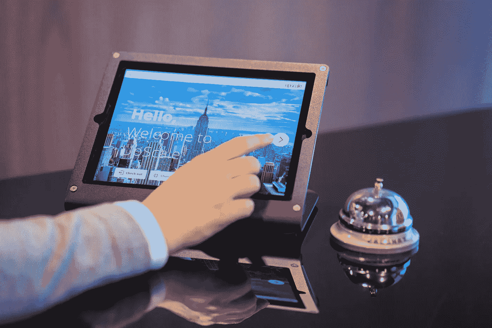

# 人工智能遇上好客:科技帮助酒店经营者在人群中闪耀的 6 种方式

> 原文：<https://medium.com/codex/ai-meets-hospitality-6-ways-the-technology-is-helping-hoteliers-shine-in-the-crowd-102a5b11a780?source=collection_archive---------33----------------------->

图片来源:[procyclick 访客管理系统](https://unsplash.com/@proxyclick?utm_source=unsplash&utm_medium=referral&utm_content=creditCopyText)上 [Unsplash](https://unsplash.com/photos/VnACB-m22es)

想象一下:你拥有一家酒店。在一天的任何时候，前台都有几件事情在同时进行。一个典型的例子是，等待入住的客人，电话铃声，以及客户在网上提出的问题。在处理这些任务时，你的员工必须面带微笑地欢迎和服务客人，仔细检查他们的文件，专心致志，并及时回应询问。

旅行者总是在搜索航班、住宿、租赁服务和出租车。即使您在每个时区都有一名员工，他/她仍然只能一次为一位客人服务。更别说人类不是一心多用的人。那么，确保以上所有事情高效、同步发生的最佳方式是什么呢？答案是人工智能(AI)。

人工智能正在从根本上改变酒店业的业务模式。一方面，领先的技术正在帮助酒店经营者为客人提供无摩擦的住宿体验。另一方面，企业通过依靠基于人工智能的解决方案赚了大钱并推动了他们的增长。

这里有一个统计数据:在这十年里，通过在线预订(网站和应用程序)进行的旅行将在 5X 周围 [**激增。通过以数据收集、聊天框和持续工作人员的形式用人工智能武装你的数字存在，你可以从这块馅饼中分得一杯羹。**](https://www.alliedmarketresearch.com/online-travel-market)

向下滚动以了解人工智能在哪里以及如何颠倒事物。

# **更快地响应客户查询**

图片来源:[穆罕默德·哈桑](https://pixabay.com/users/mohamed_hassan-5229782/?utm_source=link-attribution&utm_medium=referral&utm_campaign=image&utm_content=3936760)来自 [Pixabay](https://pixabay.com/illustrations/chatbot-chat-robot-instant-3936760/)

通过直接消息应用程序进行聊天回复的长时间(TAT)一直让客户感到烦恼。在社交媒体占主导地位的世界，保持任何运营干扰在包装下，避免负面口碑是很难的。多亏了人工智能聊天机器人，它已经存在了一段时间，这个障碍现在已经成为过去。

有了聊天机器人或对话式人工智能，你可以一周七天、一天 24 小时在瞬间回应客户的关切和询问。这是非常有益的，因为在人与人的交互中保持这样的响应时间几乎是不可能的。现在，旅行者可以快速搜索信息，酒店经营者可以减少回答重复问题的时间。

与此同时，通过聊天机器人提供的客户支持让用户解决他们的投诉，人工智能会自动对这些投诉进行优先排序和分类，以提高处理效率。因此，他们不再需要向不相关的员工提出问题。只需使用机器人请求任何形式的帮助。此外，你可以关注问题并相应地解决它们，从而减轻员工的压力。

人工智能聊天机器人的诸多好处吸引了酒店业主的极大关注，他们很可能在 2022 年前将聊天机器人的实施增加 53%。对独立酒店的兴趣甚至更高，聊天机器人的使用率将增长 64%。

# **从客人数据中梳理出更好的价值**

图片来源: [Freepik](https://www.freepik.com/free-vector/data-report-illustration-concept_6195527.htm#query=customer%20information&position=37&from_view=search)

“数据是新的石油”——这句格言已经在几个行业引发了头脑风暴。酒店也乐于效仿。您知道吗，一次交易会产生大量数据？这包括目前有多少客人在餐厅用餐，他们点了什么菜，他们点了多少，以及他们如何支付整餐的费用。

在这种情况下，你可以使用人工智能快速筛选海量数据，并得出关于潜在或现有客户的关键结论。有了这些见解，你可以根据客人的预算、房间偏好和便利设施来细分客人名单。此外，数据分析对于评估各种调查和客人反馈也至关重要。这是通过做出明智决策来微调营销策略和酒店运营的完美方式。

在前技术时代，总经理会输入并检查所有簿记和库存管理操作的数据。手动将数据记录在纸上或电子表格中会耗费大量的时间和精力。人工智能工具有效地简化了这些任务，让你有更多的时间专注于你最擅长的事情——住宿、食物和体验。

# **个性化按等级提升**

图片来源: [Sonu Sharma](/walmartglobaltech/personalization-for-search-cd4ecc68db8c)

几乎每个顾客都有这样的烦恼:他们去一家他们之前住过十几次的酒店，接待员问的第一件事就是，“你以前在我们酒店预定过房间吗？”

人工智能使你能够在更深的层次上提供个性化，你可以在许多方面看到它。一个恰当的例子是，添加到 Instagram 手柄的机器人可以回答客人的查询，并将这些信息添加到你的数据库中。然后，您可以利用这些信息来定制与客人的进一步互动，如询问他们的住宿体验或他们是否会向其他人推荐您的酒店。此外，您可以定期提供符合他们独特需求的特别优惠，如折扣券、全包住宿、儿童友好型客房或附近地区的演出或活动门票。

然而，个性化并没有就此结束。AI 让你修改客人入住的每一个元素。提供独特的服务和设施，满足他们的需求，从前台提出合理的建议，等等。

# **超动态更新客房价格**

图片来源: [Freepik](https://www.freepik.com/free-vector/various-badges-set-hot-news-special-price-last-offer-book-now-isolated-white-background-realistic-vector-illustration_26764424.htm#query=prices%20in%20hotels&position=0&from_view=search)

在酒店业，当谈到收入管理时，定价占据了首位。自从人工智能及其子集机器学习(ML)抓住了这一块，它就成为了所有定价相关痛点的救命稻草。

季节和活动是酒店业提高入住率和决定客房价格的最佳时机。预订引擎与 ML 算法相结合，根据客户数据、从社交媒体收集的关于潜在游客的见解以及实时市场情报自动更新价格，从而提高您的利润。

人工智能驱动的预测分析使您能够利用市场趋势，以友好的价格维持每间可用房间的收入(RevPAR)水平。如果部署得当，您可以拥有定期商务旅客的数据、您所在地区的预期游客数量以及每年跨季节的活动，所有这些数据都在您的盘子里。有了这些组织良好、切实可行的见解，你就能创造出诱人的交易和套餐，很好地服务于你的目标群体。

作为一个甜味剂，这些人工智能/人工智能驱动的系统将继续学习，优化和适应久而久之。换句话说，他们只会越来越好。

# **客人入住率的接近现场预测**

图片来源: [Freepik](https://www.freepik.com/free-vector/people-analyzing-growth-charts_12643932.htm#query=predictive%20analytics&position=3&from_view=search)

想象一下:你所有的酒店房间在一年中的每晚都被预订了。同样，每天晚上，你餐馆的每把椅子上都坐满了人，还有更多人在外面等着。听起来像乌托邦？基于人工智能的解决方案将帮助您的酒店业务逐步接近这一理想状态。它们不仅提供事实和数字，还强调趋势。这样，你的前台经理就能准确了解客房入住率何时会下降。这些信息使你更容易决定何时做广告或改变你的费率结构。

当然，在这个行业服务了几年后，人们知道他们的业务什么时候会享受高峰时间，什么时候不会。但是，从分析的数据量和分析的速度来看，科技化的预测比人脑更聪明。怎么会？基于数据分析的建议源自当地和区域趋势、竞争对手的定价分析以及其他因素。你将在几分钟内看到结果，而不是几小时或几天，就像让一个人做同样的任务一样。

其结果将是提高入住率，从而增加收入。

# **打破你的企业和你的客人之间的沟通障碍**

图片来源: [Freepik](https://www.freepik.com/free-vector/translator-concept-illustration_14200805.htm#query=multilingual%20translation&position=12&from_view=search)

如果你想让你的业务走向全球，你需要尊重客户的母语。毕竟语言是沟通的桥梁，而不是壁垒。所以，如果你认为有英文网站内容就足够了，请三思。尽管英语是一种全球语言，大多数人都能流利地使用，但许多人仍然不习惯说英语。请记住，对于成千上万的潜在客人来说，英语是一门外语。

也就是说，拥有多语言的网站内容只是迈出了第一步。另一个同样重要的因素是在你的商业网站上安装一个多语言聊天机器人。由于人工智能、自然语言处理(文本)和语音识别(语音)的不断进步，智能聊天机器人能够像人类一样说话并理解游客。

聊天机器人现在可以用几十种语言与数百名外国游客同时交流。即使是你最好的通晓多国语言的礼宾员也做不到这一点。为多语种人群提供服务将使你的酒店业务成为吸引客人的磁石，并增加游客向你预订的几率。

# **拼接圆点**

图片来源: [Freepik](https://www.freepik.com/free-vector/family-traveller-summer-costume-room-scene_16508226.htm#query=technology%20in%20hotels&position=8&from_view=search)

酒店业是一个 24/7/365 的行业，它与人工智能的融合不再是白日梦。可能性是巨大的，各种领先品牌已经加入了这股潮流。

AI 将游客的完整档案联系在一起，以增强登记时的个性化，并提供有关旅行延误、到达等的关键数据。新冠肺炎危机加剧了对酒店运营自动化的需求，当前的人工智能/人工智能技术为企业确保难忘的客户住宿铺平了道路。

随着越来越多的客人开始返回酒店，他们会期待更高程度的便利、舒适和客户服务以及新的体验。旅行者的期望就像上涨的潮水，酒店部门就是这艘船。因此，将人工智能整合到你的酒店业务中，看看你的转化率和收入。