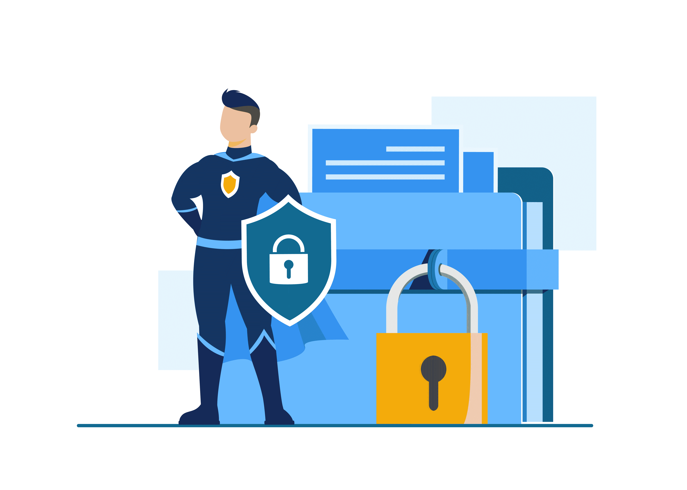
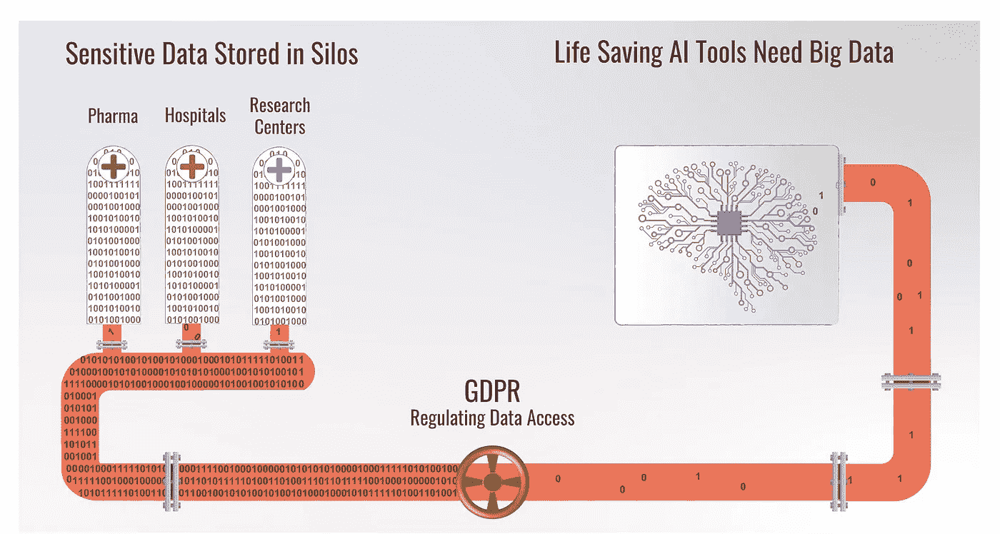
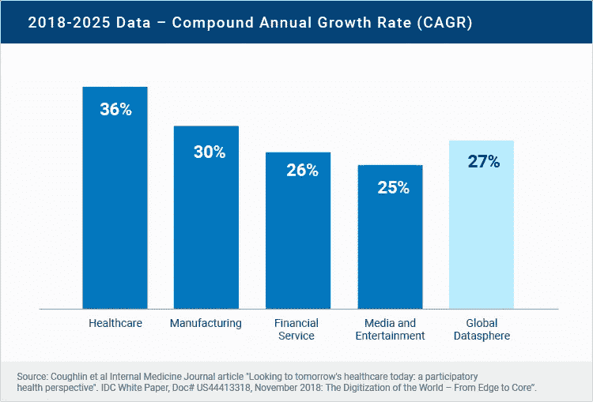
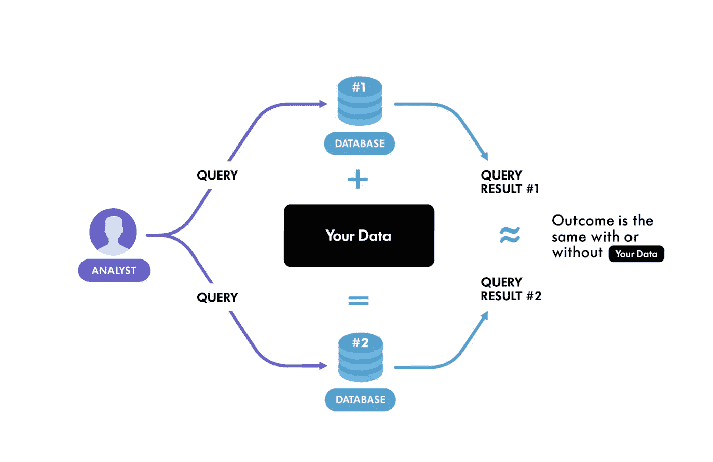

# 隐私增强技术及其对医疗保健创新的重要性

> 原文：<https://medium.com/codex/ai-privacy-and-why-you-should-care-1ef503a789b6?source=collection_archive---------3----------------------->

## 数据是人工智能驱动的研究的生命线。但在医疗保健领域，数据访问问题正在扼杀急需的创新。一套新兴的隐私增强技术(“宠物”)是一种聪明的解决方案，它使人工智能研究人员和初创公司能够访问一些世界上最大问题的数据。

图片由 freepik.com 拍摄

新冠肺炎疫情扩大了全球医疗保健行业已经在努力解决的问题的范围。当疫情到来时，医疗保健组织往往难以找到他们需要应对的基本信息，无论是疾病和死亡率，还是医院床位和关键物资的可用性。在其他问题中，疫情强调了医疗保健领域对协作数据分析的迫切需求。

正如麦肯锡观察到的那样，医疗保健的数字壁垒(T2)通常明显与技术无关(T3)。这项技术已经存在(或正在快速发展)——2020 年 10 月，[辉瑞和 IBM](https://venturebeat.com/2020/10/22/ibm-and-pfizer-claim-ai-can-predict-alzheimers-onset-with-71-accuracy/) 的研究人员宣布，他们开发出了一种机器学习技术，可以在症状出现前几年预测阿尔茨海默病。IBM、Salesforce 和谷歌等公司开发了人工智能工具来预测糖尿病、糖尿病视网膜病变、乳腺癌、精神分裂症等疾病的发病。AWS 在 2020 年 12 月推出了 [Amazon HealthLake](https://www.businesswire.com/news/home/20210715005761/en/AWS-Announces-General-Availability-of-Amazon-HealthLake) ，这是一个符合 HIPPA 的工具，使用户能够聚集、搜索和分析数据，以对他们的患者和人群的健康做出更精确的预测。仅在过去的一年里，[超过 138 亿美元](https://fortune.com/2021/03/03/artificial-intelligence-ai-index-venture-capital-startup-funding/)被投入到公司和项目中，以将机器学习的力量引入药物发现。

**数据访问难题**

据麦肯锡称，[文化和思维方式、组织结构和治理](https://www.mckinsey.com/industries/pharmaceuticals-and-medical-products/our-insights/barriers-to-digital-at-scale-shifting-the-focus-from-tech-to-culture)是医疗保健行业采用数字技术的常见障碍。**再深入一点，你会发现今天阻碍医疗保健进步和减缓创新的最大障碍之一是** [**私人数据访问问题**](https://www.forbes.com/sites/forbestechcouncil/2021/04/15/healthcare-innovation-through-the-lens-of-interoperability-and-privacy/?sh=5c8abb216656) **。**

来源:[https://owkin . com/federated-learning/data-privacy-health care/](https://owkin.com/federated-learning/data-privacy-healthcare/)

**互操作性问题**

数据访问问题的一半被称为“互操作性问题”。简而言之，[数据是人工智能研究的生命线](https://www.wired.co.uk/article/future-health-trends#intcid=_wired-uk-bottom-recirc_702ce24b-e5f1-4b4b-b2df-369fa67a1835_text2vec1)。算法的好坏取决于我们用来训练它们的数据。高质量数据的可访问性和可用性是创新的第一步。最大的人工智能突破要归功于*大型开放数据集*(例如 [ImageNet](https://en.wikipedia.org/wiki/ImageNet) 、 [AlphaGo](https://ai.googleblog.com/2016/01/alphago-mastering-ancient-game-of-go.html) 和[深蓝](https://en.wikipedia.org/wiki/Deep_Blue_(chess_computer)))。

> **数据的存在本身不是问题。在医疗保健领域，医疗数据非常丰富。今天，** [**世界上 30%的数据量是由医疗保健行业产生的**](https://www.rbccm.com/en/gib/healthcare/episode/the_healthcare_data_explosion) **，预计到 2025 年将每年增长 36%。世界经济论坛估计** [**医院每年产生 50 的数据**](https://www.weforum.org/agenda/2019/12/four-ways-data-is-improving-healthcare/) **。然而，医院每年产生的全球数据中有 97%没有得到利用。**

原因？数据通常极其孤立且受到高度监管，互联医疗服务缺乏通用标准。互操作性可以将来自一系列系统的患者记录整合在一起，并提供对不同来源的数据的访问，从而实现更大的可见性、研究和创新。

互操作性标准(如全球快速医疗保健互操作性资源(FHIR)，美国医学数字成像和通信(DICOM)和整合健康企业(IHE))已经存在了几十年，其他标准目前正在开发中(如在[澳大利亚](https://www.healthcareit.com.au/article/adha-works-towards-interoperability-standards-consensus))。但是市场仍然是分散的。因此，医疗数据交换和集成仍然困难、耗时且成本高昂。

**人工智能隐私问题**

数据访问问题的第二部分源于数据保管人出于法律、隐私和安全考虑而不愿共享数据。

为了做出准确、可靠和有用的预测，ML 算法在*的大量*数据上进行训练，并更新它们的参数以编码数据中的关系和模式。在零售、银行、政府和医疗保健等许多行业，数据包括*敏感和个人身份信息*(“PII”)(例如姓名、地址、年龄、性别、生物特征数据、基因数据、财务记录、税务数据等)。

理想情况下，我们希望 ML 模型对来自数据的*一般模式*进行编码(例如，“吸烟的患者更有可能患有心脏病”)，而不是对基础数据集中特定训练记录的事实进行编码(例如，“John Smith 患有心脏病”)。不幸的是， *ML 算法没有学会默认忽略这些细节。* 如果我们开放一个 ML 模型的源代码，让它对医疗团体或公众开放，我们可能会不小心泄露关于训练集细节的信息。然后，恶意攻击者可能能够对模型进行逆向工程，并使用常见的数据挖掘技术了解数据集中个人的私人信息。

**宠物的承诺**

进入隐私增强技术(“PETs”)，这是一套解决隐私问题的新兴机器学习技术。宠物因其最小化个人数据使用、最大化数据安全以及授权开发者在他们的模型中建立隐私的能力而受到欢迎。 [Gartner](https://www.r3.com/gartner-2021-privacy-enhancing-computation/?_bt=517606947829&_bk=privacy%20enhancing%20technology&_bm=b&_bn=g&_bg=121776548112&gclid=Cj0KCQjwsZKJBhC0ARIsAJ96n3Ul11XOfo1oen_NowP7KpDdKEUaE8hoFGiC2kqAPM1HIebhcF-k8b0aApLkEALw_wcB) 将隐私增强计算列为 2021 年的顶级战略技术趋势之一，并预测到 2025 年，50%的大型组织将采用 pet 来处理不可信环境和多方数据分析用例中的数据。

谷歌近年来一直领先于 [RAPPOR](https://www.chromium.org/developers/design-documents/rappor) (随机可聚合隐私保护顺序响应)以及 LinkedIn 的[preparl](https://engineering.linkedin.com/blog/2019/04/privacy-preserving-analytics-and-reporting-at-linkedin)框架(隐私保护分析和报告)和[苹果](https://techcrunch.com/2016/06/14/differential-privacy/?guccounter=1&guce_referrer=aHR0cHM6Ly93d3cuZ29vZ2xlLmNvbS8&guce_referrer_sig=AQAAALlqJc-KRSrYpMQQ3OO-XpRmGphbVhT1s_pIiJotDvW3PHr4rUvvuUZFIBGiOUfDeZcLdV5x9mmsxKeiNiLQCZzkXunEroTR_p3XwGELFe_i2eap25XuyRFgTux4hKsttnkeof-DJd2vTbCt4FhIXY1O47qwZN2LtR-Nvc3juGVj)和[微软](https://www.microsoft.com/en-us/research/blog/collecting-telemetry-data-privately/)的差异化隐私部署。

英国政府数据伦理和创新中心最近发布了一份针对宠物的[采用指南](https://cdeiuk.github.io/pets-adoption-guide/)，旨在帮助组织考虑宠物如何开启数据驱动创新的机会，同时保护敏感数据的隐私和机密性。

如今，许多[公司和政府在各种行业和环境中使用宠物](https://cdeiuk.github.io/pets-adoption-guide/repository),不仅保护敏感信息，还巩固更好的隐私实践，增强市场中的数字信任。 [Orange](https://hellofuture.orange.com/en/advocating-for-ethical-and-responsible-ai-by-design/) 、 [SalesForce](https://www.zdnet.com/article/ai-ethics-how-salesforce-is-helping-developers-build-products-with-ethical-use-and-privacy-in-mind/) 和 [NVIDIA](https://developer.nvidia.com/blog/first-privacy-preserving-federated-learning-system/) 是真实世界的例子，展示了如何利用宠物来保护客户、患者和机构数据，同时打造突破性产品。

宠物涵盖了一系列技术，从相对简单的广告拦截浏览器扩展到用于匿名通信的 Tor 网络，分为两个主要类别:传统和新兴。

**传统 PETs** 是成熟的隐私技术，如保护传输中和静态信息的加密方案，以及去标识/匿名技术，如令牌化和 k-匿名。匿名化的问题在于，通过将数据与其他数据集联系起来、从代理变量中推断信息，或者通过应用先进的数据挖掘技术，数据总会存在被重新识别的残余风险。虽然传统的隐私技术可能感觉很熟悉并且“足够好”，但它们经常贬低数据的价值，并且无法保护隐私。网飞数据的去匿名化就是一个很好的例子。

**新兴宠物，**另一方面，是一组为现代数据驱动系统中的隐私挑战提供新颖解决方案的技术。它们实现了相似的隐私目标，但能够从数据中获取更高的价值。这一类别主要指五种技术:(HE)[可信执行环境](https://en.wikipedia.org/wiki/Secure_multi-party_computation)[安全多方计算](https://en.wikipedia.org/wiki/Differential_privacy)[联邦数据处理](https://www.sciencedirect.com/topics/computer-science/data-federation)。

同态加密通过允许在不暴露与底层数据的交互的情况下执行操作(搜索或分析),帮助组织跨辖区或内部/外部数据仓库安全、私密地共享数据。

各实体可以以分散/分布式方式安全协作，无需在辖区之间复制或移动数据，同时优先考虑数据隐私。这节省了大量时间和资源，并降低了与敏感或受监管数据的可能误操作相关的运营风险。

**什么是差分隐私？**

差分隐私是一种新兴的宠物，正在获得势头。它允许在不损害数据隐私的情况下进行统计分析。

[谷歌](https://developers.googleblog.com/2021/01/how-were-helping-developers-with-differential-privacy.html)长期以来一直倡导差分隐私作为一种工具，为其开发者和客户提供更多的数据和见解，同时保持人们的个人信息隐私和安全(这现在是开源的，正如 [Tensorflow Privacy](/tensorflow/introducing-tensorflow-privacy-learning-with-differential-privacy-for-training-data-b143c5e801b6) 、 [Tensorflow Federated](/tensorflow/introducing-tensorflow-federated-a4147aa20041) 、 [Private Join and Compute](https://security.googleblog.com/2019/06/helping-organizations-do-more-without-collecting-more-data.html) )。差分隐私是 7 年前在 Chrome 浏览器中部署的，目前已经在谷歌地图、Assistant 和 Google Play 中使用。

> **差分隐私的前提是你可以查询一个数据库，同时对数据库中包含的隐私做一定的保证。这是通过一种数学思想实现的，这种思想被称为对算法行为的一部分进行随机化(或添加“噪声”)。**

将随机性引入到 ML 算法的基本原理是使其难以区分由学习参数定义的模型的哪些行为方面来自随机性，哪些来自原始训练数据。

差分隐私要求，如果我们改变训练集中的单个训练示例(即，如果在一个训练示例中添加、删除或更改值不影响算法的输出)，从给定数据集*学习任何特定参数集的*概率*大致保持不变*。直观地说，如果从数据集中删除一条记录后，函数的输出保持不变，那么该输出就不受该记录的私有数据的影响，并且隐私得到了尊重。

来源:[https://www . Winton . com/research/using-differential-privacy-to-protect-personal-data](https://www.winton.com/research/using-differential-privacy-to-protect-personal-data)

当对手不能区分由基于部分改变的数据集的随机化算法产生的答案和由基于全部原始数据集的相同算法返回的答案时，实现了差分隐私。

差分隐私的基本权衡是这样的:**可以向数据集添加多少噪声/随机性，以提供最大的隐私量，同时仍然提供准确的结果。**

问题是我们[在使用人工智能隐私技术](https://www.youtube.com/watch?v=4zrU54VIK6k&ab_channel=LexFridman)的同时是否还能回答重要的问题。换句话说，私人 AI 模型还能准确、有效、有用吗？

微分隐私现在已经被专家们认可为[一个能够解决 ML 从业者普遍遇到的一些问题的规则制定者](http://www.cleverhans.io/privacy/2018/04/29/privacy-and-machine-learning.html)——即使在隐私不是必要条件的环境中，包括在处理过度拟合时，以创建通用的 ML 模型。毕竟，ML 是关于在数据集中的多个记录中搜索潜在的模式或趋势，而不是识别一次性的事件。因此，差分隐私被认为与 ML 挖掘数据洞察力的一般方法兼容，并有助于提高模型准确性以及保护隐私。

**人工智能隐私的未来**

如今，隐私是一个大行业——Crunchbase 估计，仅在 2019 年，隐私科技行业就积累了超过**100 亿**美元的投资。[联合学习](https://www.businesswire.com/news/home/20210419005484/en/The-Worldwide-Federated-Learning-Solutions-Industry-is-Projected-to-Grow-to-201-Million-by-2028---ResearchAndMarkets.com)(另一种宠物类型)的全球市场预计到 2028 年将增长到**2.01 亿美元**(CAGR 为 11.4%)，其驱动力是在设备上保存数据的同时协作利用共享 ML 模型的潜力，以及在智能设备上启用预测功能而不影响用户体验和泄露私人信息的能力。

在监管和合规要求(GDPR 和世界各地的其他类似法规)不断增加的推动下，诸如“[隐私优先](https://www.gartner.com/smarterwithgartner/gartner-predicts-for-the-future-of-privacy-2020/)”、“[数字信任](https://www.pwc.com/us/en/services/consulting/cybersecurity-privacy-forensics/library/global-digital-trust-insights.html)”和“[负责任的人工智能](https://www.pwc.com/us/en/tech-effect/ai-analytics/ai-predictions.html)”等概念正在成为所有行业的主流；消费者对更好的隐私做法的认识和需求增加；和隐私设计成为产品开发最佳实践不可或缺的一部分。

> **随着隐私增强技术变得越来越普遍、成熟，并被整合到良好的数据工程实践中，它们可以帮助实现人工智能解决人类一些最大问题的潜力，并被用于现实世界的场景中(美国人口普查局在 2020 年的人口普查中使用了差分隐私******)。然而，PETs 并不是灵丹妙药，应该与数据保护最佳实践、充分的数据安全性和强大的数据治理一起使用。****

**医疗保健等领域的许多重要问题都需要大量的个人数据来回答。毫无疑问，隐私技术将在未来的创新中发挥关键作用。重要的是，我们继续鼓励数据托管人、政府和人工智能社区之间的合作，并建立安全可靠的数据隐私基础设施，以便更容易获得关于世界上最大问题的信息。**

******有关差分隐私机制的更多技术细节:******

*   ****[隐私保护 AI(open mined 的 Andrew Trask](https://www.youtube.com/watch?v=4zrU54VIK6k&ab_channel=LexFridman) 演讲)——麻省理工深度学习系列****
*   ****[OpenMined](https://www.openmined.org/) 的博客和 YouTube 频道——一个开源社区，其目标是通过降低私人人工智能技术的准入门槛，让世界变得更加隐私保护。****
*   ****一种被称为[教师群体的私人聚集(PATE)](http://www.cleverhans.io/privacy/2018/04/29/privacy-and-machine-learning.html)****
*   ****如何使用[cn-protect python module from crypnumerics](https://arturo102964.medium.com/differential-privacy-with-python-35ea710facd6)实现匿名算法，这是一家专注于数据隐私解决方案的出色公司。****
*   ****[差分隐私的算法基础](https://www.cis.upenn.edu/~aaroth/Papers/privacybook.pdf)Cynthia Dwork(微软研究院)& Aaron Roth(宾夕法尼亚大学)。****