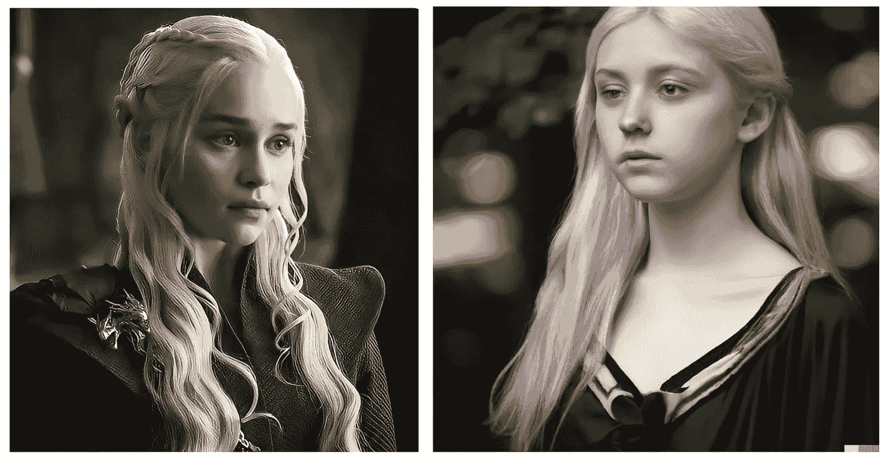

# 人工智能根据书籍描述重新想象《权力的游戏》中的角色

> 原文：<https://medium.com/codex/ai-reimagines-game-of-thrones-characters-based-on-book-descriptions-e64f478f2dd4?source=collection_archive---------0----------------------->

系列中的丹妮莉丝与 Dall-e2 的对比

我已经做了两周的 [**人工智能根据书籍描述重新诠释电影/电视节目角色**](https://jimclydemonge.medium.com/list/ai-vs-book-series-a57710b66bec) 系列。这些故事似乎引起了人们的共鸣，我收到的反馈有好有坏，但大多是积极的。

所以今天，我带着另一个回来了。这一次，我想拍一部我最喜欢的电视剧——《T4——权力的游戏》。