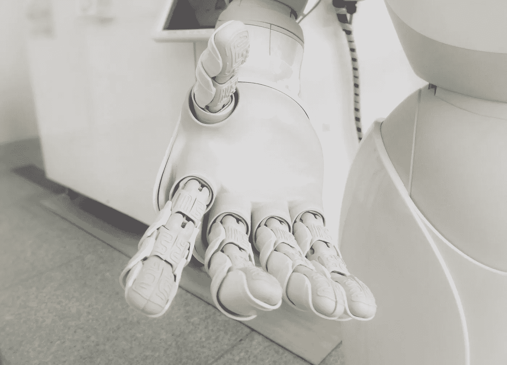

# 艾:有用还是结束的开始？

> 原文：<https://medium.com/codex/ai-useful-or-the-beginning-of-the-end-5aa6fd0ac329?source=collection_archive---------12----------------------->

过去四十年来，人工智能(AI)一直潜伏在技术世界中，不断寻找新的方法来自动化公共和私人领域的流程。它在用例中的稳步上升使它成为最吸引人的讨论话题之一，但该领域的研究人员经常发现自己处于有争议的位置。它目前的状态和它在人类控制范围之外成长的潜力使许多人质疑它对我们这个世界的伦理影响。这一想法包括围绕隐私的前所未有的问题，无论是在线还是物理公共空间，到机器人在不同行业变得越来越普遍，到自动驾驶汽车，最后到人工智能奇点的反乌托邦概念。

这种最先进的出现意味着围绕其研究和使用没有多少相关的预先存在的法律，大多数个人甚至无法理解人工智能，甚至无法信任它(Leetaru)。然而，每个人都必须警惕潜在的危险和人工智能能够提供的力量，以确保它用于改善人类，而不是其最终的陷阱。政府有责任与领先的人工智能研究人员和公司合作，教育公众，鼓励更多个人理解和学习人工智能。科学家和研究人员本身有自己的道德义务，即勤奋工作；他们必须意识到他们工作的潜在影响和副作用。

在这一点上，我们必须首先定义当前围绕人工智能及其应用的伦理和法律问题。随着努力程度和金融投资的增加，它继续扰乱我们的社会，立法者已经开始猜测它的法律和道德问题在哪里。2016 年，英国下议院发表了关于机器人和人工智能的报告，指出了个人和组织与人工智能互动的重要性，既有道德目的，又意识到即使出于善意，使用人工智能也可能造成无意的伤害(科学和技术委员会)。例如，用于筛选公司空缺职位的某些候选人的算法可能并非天生对女性有偏见，但由于对输入的训练数据集缺乏关注，不幸的是，这种情况可能会发生。在英国下议院报告发布的三年内，加拿大财政委员会秘书处也发布了一项关于自动化决策的指令，以确保 AI 决策“符合透明度、问责制、合法性和程序公平性等核心行政法原则”(秘书处 1)。政府自然希望这项技术不会伤害他们的公民，但问题是如何制定法规来应对人工智能。需要理解的是，有些人可能更喜欢实施新的法律，但其他人可能更喜欢将现有的法律应用于创新带来的新情况(伯克 2)。另一方面，许多人质疑人工智能相关应用的伦理问题。这包括隐私、偏见和就业方面有争议的讨论，所有这些都影响经济(穆勒 1)。

# 技术的当前状态

就目前情况而言，人工智能已经是技术领域的一个主导领域，每年都在呈指数增长，因为研究人员继续收集数据并为其创新新的应用。IBM 对人工智能的定义是，从本质上讲，任何由计算机、机器人或其他机器展示的类似人类的智能(IBM 1)。早期投资该技术的组织主要倾向于将其用于自动化重复任务，如数据输入，但其他应用在于其在自然语言处理中的使用，以从人类语言中生成意义(Insights 1)。它还被用于自动驾驶汽车，作为申请人筛选工具，甚至在医疗保健行业作为疾病图谱。计算机需要大量的数据来“研究”行为，以便能够模仿它，甚至在看不见的情况下做出自主决定。

本质上，人工智能有多“好”完全取决于训练数据集有多彻底。这是该领域的关键限制之一；人工智能不可能完美，因为我们作为人类，继续提供不完美的数据集供它研究。本文的一部分将重点讨论这些限制如何导致隐私和监控问题，以及操纵行为和偏见。围绕人工智能的现状如何影响就业、行业以及我们离人工智能奇点还有多远，也存在伦理讨论。未能解决这些问题可能会将人类带入一个坟墓和一个反乌托邦的道路，在那里人工智能的生活和思考不受我们的控制。然而，我们离实现这一目标还有很长的路要走。

# 道德和社会关注的领域

伦理和社会关注的第一个领域是人工智能目前在物理公共空间和在线使用的程度。通过照相机和多媒体，人们的互动、面孔、行为和趋势的数据不断被收集。然而，这往往会导致有偏见的人工智能，因为输入的训练数据本身可能是有偏见的。例如，考虑一个人工智能学习者可能如何接收将黑人比白人更受监禁相关联的数据。这发生在佛罗里达州，一个刑事司法算法将黑人被告误标为白人被告的两倍“高风险”(Manyika 1)。这是我们社会中存在的系统性种族主义的直接后果，它潜入了这些需要极度敏感的算法中。由于在提供与社会公平、性别、种族、性取向甚至过度和不足代表的群体相关的数据时缺乏关注，我们留给人工智能的是和我们一样的歧视，甚至可能更糟，因为人工智能经常被用于处理大规模的事情(Manyika 1)。

这也可以在医学院和工作申请中看到，无能的人工智能从各种群体那里夺走了机会，这些群体可能在某种程度上受到了人工智能训练数据的歧视。1988 年，英国种族平等委员会发现一家英国医疗机构使用的算法对女性和非欧洲名字的人有偏见(Lowry 657)，这一限制就是例证。尽管这可能是一项抽象和具有挑战性的任务，但在决策中利用人工智能模型的组织有责任找到衡量和理解公平的方法。

与此同时，随着越来越多的公司检查我们的在线行为，更多的人工智能训练数据被收集起来，主要集中在广告和建议上。世界上大多数人使用互联网，访问网站并与各种服务器进行交互。然而，通过嵌入网站的 cookies 和其他分析软件，用户的行为可以被记录下来，供网站所有者随心所欲地使用。例如，这种方法通常由负责确定他们的哪个功能最常用的人使用。它扩展到他们能够找出用户向下滚动页面或按下按钮的次数。这有可能失控，脸书和谷歌等公司此前被指控非法收集用户的私人信息，并将其出售给各种分析和广告公司。不幸的是，这往往导致这些强大的公司利用现有的少量法规来保护用户数据，因为这些数据被不道德地使用和出售。通过人工智能，他们控制你被呈现的东西。这可能最初看起来不严重，但这可能意味着他们可能会通过了解用户的个人信息来歧视用户。例如，两位东北大学的研究人员发现脸书的广告服务算法对某些人口统计数据有歧视[阿里 12]。他们意识到，当向人们介绍工作时，幼儿园老师和秘书的工作给了更多的女性，而不是男性，出租车司机和看门人的工作给了更多的少数民族。这并不是说像脸书这样的公司正在试图变得有歧视性，这只是强调了提供平衡和深思熟虑的训练数据集的重要性。

# 自动化和就业呢？

已经有一些工作和行业被人工智能打乱了，比如厨师、旅行社、股票经纪人和工作申请阅读者等等。然而，牛津大学经济学家卡尔·贝内迪克特·弗雷和迈克尔·奥斯本估计，在未来二十年内，47%的美国工作岗位面临着相当大的自动化风险。这种趋势也将出现在使用人工智能的自动驾驶汽车上，使司机不再需要，从根本上扼杀了出租车行业。更糟糕的是，某些工作受影响的风险要高得多，比如通常由秘书做的文书工作，这是一个女性占主导地位的领域。这使得大约 4000 万到 16000 万妇女面临失业的风险(Madgavkar 8)，这个数字的最接近的竞争对手是制造业雇员和居住在贫困的美国农村地区的美国人(Oxford 1)。随着时间的推移，这个问题可能会恶化，甚至对于那些认为自己的工作不可触及的人，如工程师、医生和律师。然而，对企业来说，更高的社会失业率不一定是坏消息。将人工智能集成到他们的“劳动力”中使他们能够降低成本，因为他们现在需要更少的员工来实现相同的产出(斯坦福 10)，从而提高他们的效率并带来更高的利润率。我们已经可以注意到人工智能为像[特斯拉汽车](https://medium.com/u/24413768aadb?source=post_page-----5aa6fd0ac329--------------------------------)这样的公司提供的好处，这些公司一直处于将人工智能和机器人技术集成到电动汽车(ev)的前沿。这对社会尤其重要，因为这些“智能”车辆有助于减少对天然气的需求，这是减缓地球气候变化的重要一步。

# 奇点

这些创新引出了一个问题:人工智能和机器人技术的未来会延伸到哪里？也许人工智能这种指数级进步最可怕的后果是人机奇点的出现。人工智能奇点意味着人工智能可以匹配人类的智力，甚至通过自我改进超越我们，暗示着机器人不再受人类控制的反乌托邦未来。好莱坞电影描绘了如果发生这种情况，事情会变得多么糟糕。目前，由于硬件和软件的限制，我们还没有接近那个水平。还存在另一种可能性，即人工智能不会成为独立的生命形式，而是人类和技术整合在一起，创造出超人。这听起来可能很有趣，但拥有制造超级士兵技术的政府存在着危险，这些超级士兵可以造成比普通人更大的破坏。

进行了一项调查，以估计人工智能研究人员和思想领袖何时认为人工智能奇点成为现实。结果表明，大多数人认为这是未来四五十年内的一种可能性(Bostrom)，这对于当前的研究人员和政府来说是足够遥远的，但同时也是重要的，以便在我们实际存在之前理解奇点的含义。就目前情况来看，不同国家对如何处理人工智能监管有不同的想法。加拿大就是一个例子，该国目前并不太专注于监管和治理人工智能，而是专注于资助更多的人工智能研究，许多人认为这种方法在监管方面“滞后”。它只分配了少数政策制定者作为其治理和公共政策团队，负责人工智能治理(Aaronson)。像美国这样的其他国家主要专注于人工智能所有用途的一个子集:自动驾驶或自动驾驶车辆(Douglas Shinkle，2020)。诚然，这是目前与社会最相关的，因为像[特斯拉汽车](https://medium.com/u/24413768aadb?source=post_page-----5aa6fd0ac329--------------------------------)和[图森未来](https://medium.com/u/c34f1834f503?source=post_page-----5aa6fd0ac329--------------------------------)这样的公司正在推进人工智能控制的自动驾驶汽车的边界。这也延续到了州一级，内华达州和加利福尼亚州等州已经迅速签署立法，有效禁止不需要人工控制的自动驾驶汽车。当一辆自动驾驶汽车在 2018 年导致一起致命事故时，亚利桑那州很快跟进。

正如英国和加拿大政府(科学技术委员会，秘书处)所强调的，每个直接或间接与人工智能互动的人都必须理解他们的作品的后果。对于工程师和研究人员来说，这意味着要意识到这样一个事实，即使他们打算进行的创新不是为了造成伤害，让机器拥有自己独立的大脑仍然可能是一个滑坡。一些人可能很容易迷失在对人工智能创新的热情中，而没有对提出的伦理问题给予足够的关注。对于私营企业而言，伦理问题有了更多的空间，因为人工智能可以扩大其资本主义野心，因为它提供了新的盈利方式。像脸书这样的科技巨头已经证明了他们在获取更多利润的计划中缺乏道德，认为这种有组织的人类贪婪可以通过内疚羞愧来控制可能是天真的。因此，采取行动并控制人工智能在这些公司中的使用是在政府的手中，即使这些公司试图游说以获得他们自己的方式。随着越来越多的工作被人工智能取代，政府也必须介入，以缓解其经济将不可避免地面临的失业负担。政府不应该反对采用可能导致许多人失业的改进方法，而是必须投资于援助那些工作受到人工智能影响的人的计划，以培训他们的技能，使他们能够重新进入劳动力市场。它也可以更早开始:为什么不通过学校教育开始教育孩子什么是人工智能以及如何使用它？它不仅可以在孩子们的脑海中播下一颗种子，鼓励那些对该话题表现出最大兴趣的人追求计算机科学并进入人工智能领域，还可以创造出更多有意识的成年人，他们对周围的技术世界更加了解。我们不能扼杀人工智能的创新，人工智能能够提高我们经济的生产力和创造力；纵观历史，我们可以发现类似的趋势，创新让某些群体下岗，但也让我们的社会变得更好。

人工智能的兴起在不同群体中造成了恐慌，怀疑它最终可能被怀有恶意的人所利用。此外，当人工智能的训练数据不够全面时，它是一种间接有害的工具。这已经被证明是其最大的挑战之一。向人工智能学习算法输入数据的研究人员必须使用意识到社会公平、性别、种族、性取向的数据集，并且他们必须确保他们没有过度或不足地代表某些群体，因为这也可能导致人工智能偏见。隐私是围绕人工智能的多维问题的另一个方面，私营公司和政府在从人们那里收集数据时，在使用技术时必须符合道德。通过自动化，一些工作可能会失去，但历史一再表明，随着旧职业的消亡，需要新技能的新职业会诞生。政府的工作是与教育机构合作，让公众掌握新技能，使他们在被自己的职业解雇后能够找到新的工作。尽管人工智能奇点听起来可能很怪异，但人工智能在我们生活的不同领域变得越来越普遍，这不应成为一个恐惧因素。相反，我们必须接受它的不可避免性，同时意识到它的潜在危险，无论这是与自动化和就业等实际社会问题有关，还是甚至与奇点等威胁全人类的概念有关。尽管如此，这种矛盾心理是健康的，也是意料之中的，通过公共学习和与人工智能及其子集的更多互动，我们将能够管理人工智能发展过程中不断出现的障碍，并最终实现计算机在人类控制下提高生活质量和安全的现实。

# 引文

1.  Aaronson，s .，Hirsh，j .，Mazzolin，r .，Owen，j .，Owen，t .，More，a .。。Vihul，L. (2018 年 1 月 11 日)。加拿大人工智能背后的政策赤字。检索于 2021 年 1 月 29 日，来自[https://www . cigionline . org/articles/policy-deficit-behind-Canadian-artificial-intelligence](https://www.cigionline.org/articles/policy-deficit-behind-canadian-artificial-intelligence)
2.  透过最佳化的歧视:脸书的广告投放如何导致扭曲的结果 ArXiv.org，2019 年 9 月 12 日，arxiv.org/abs/1904.02095.
3.  *尼克·博斯特罗姆和文森特·c·米勒，《人工智能的未来进展:专家意见调查》牛津大学，2014 年。*
4.  *伯克，托德 j，和斯嘉丽·特拉索。“人工智能驱动的世界中出现的法律问题。”Lexology，2019 年 7 月 17 日，【www.lexology.com/library/detail.aspx? g = 4284727 f-3 bec-43e 5-b230-fad 2742 DD 4 FB。*
5.  *孔，爱德华和詹姆斯兰伯特。“机器人如何改变世界——自动化对工作、生产力和地区真正意味着什么。”牛津经济，www . Oxford Economics . com/recent-releases/how-robots-change-the-world。*
6.  *[https://www . ncsl . org/research/transportation/autonomous-vehicles-自驾-车辆-颁布-立法. aspx](https://www.ncsl.org/research/transportation/autonomous-vehicles-self-driving-vehicles-enacted-legislation.aspx)*
7.  *弗雷、卡尔·贝内迪克特和迈克尔·奥斯本。"就业的未来:工作对计算机化有多敏感？"牛津马丁学院，2013 年 9 月 1 日，[www . Oxford Martin . ox . AC . uk/publications/the-future-of-employment/。](http://www.oxfordmartin.ox.ac.uk/publications/the-future-of-employment/.)*
8.  *IBM 云教育。“什么是人工智能(AI)？”IBM，IBM，2020 年 6 月 3 日，[www.ibm.com/cloud/learn/what-is-artificial-intelligence.](http://www.ibm.com/cloud/learn/what-is-artificial-intelligence.)*
9.  *洞察，麻省理工技术评论。《人工智能的状态》麻省理工科技评论，麻省理工科技评论，2020 年 5 月 4 日，[www . Technology Review . com/2019/01/08/137912/the-state-of-artificial-intelligence/。](http://www.technologyreview.com/2019/01/08/137912/the-state-of-artificial-intelligence/.)*
10.  *利塔鲁，卡列夫。"在我们信任的机器中:算法变得太复杂而难以理解."福布斯，福布斯杂志，2016 年 1 月 4 日，[www . Forbes . com/sites/kalevleetaru/2016/01/04/in-machines-we-trust-algorithms-is-getting-too-complex-to-understand/？sh=56a24fba33a5。](http://www.forbes.com/sites/kalevleetaru/2016/01/04/in-machines-we-trust-algorithms-are-getting-too-complex-to-understand/?sh=56a24fba33a5.)*
11.  *劳里，S .和 G .麦克弗森。"职业上的一个污点。"英国医学杂志(临床研究版。)，美国国家医学图书馆，1988 年 3 月 5 日，[www.ncbi.nlm.nih.gov/pmc/articles/PMC2545288/?page=1.](http://www.ncbi.nlm.nih.gov/pmc/articles/PMC2545288/?page=1.)*
12.  *工作中女性的未来:自动化时代的转变。麦肯锡&公司，麦肯锡&公司，2020 年 2 月 28 日，[www . McKinsey . com/featured-insights/gender-equality/the-future-of-women-in-work-transitions-in-the-age-of-automation。](http://www.mckinsey.com/featured-insights/gender-equality/the-future-of-women-at-work-transitions-in-the-age-of-automation.)*
13.  *《我们该如何处理人工智能中的偏见》哈佛大学哈佛商业评论，2019 年 10 月 25 日，hbr.org/2019/10/what-do-we-do-about-the-biases-in-ai.*
14.  *文森特·c·米勒，《人工智能和机器人伦理》斯坦福大学哲学百科全书，2020 年 4 月 30 日，plato.stanford.edu/entries/ethics-ai/#OpacAISyst.*
15.  *英国下议院科技委员会。“机器人和人工智能。”英国下议院 2016-17 年度第五次特别报告，2016 年 9 月 13 日，publications . parliament . uk/pa/cm 201617/CMS select/CMS ctech/145/145 . pdf。*
16.  *加拿大国库委员会秘书处。"自动化决策指令."加拿大，2017 年 8 月 24 日，[www.tbs-sct.gc.ca/pol/doc-eng.aspx?id=32592.](http://www.tbs-sct.gc.ca/pol/doc-eng.aspx?id=32592.)*
17.  *达维·科佩纳瓦·亚诺马米。“技术奇点。”1998 年 3 月 30 日，frc.ri.cmu.edu/~hpm/book98/com.ch1/vinge.singularity.html.，卡耐基梅隆大学，*野外机器人中心**