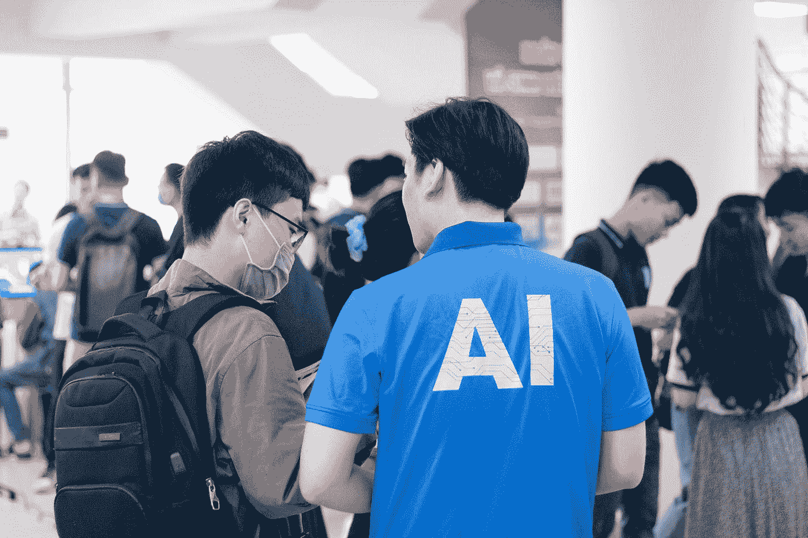

# 人工智能将在未来六年推动 3603.6 亿美元的全球市场。

> 原文：<https://medium.com/codex/ai-will-drive-a-global-market-of-usd-360-36-billion-in-the-next-six-years-6ba3a072794f?source=collection_archive---------16----------------------->

Nguyen Dang Hoang Nhu 在 [Unsplash](https://unsplash.com?utm_source=medium&utm_medium=referral) 上拍摄的照片

## 超个性化被认为是市场增长的主要驱动力。

人工智能(AI)越来越受欢迎，世界各地的行业都在迅速将其融入到他们的流程中，以改善业务运营和客户体验。