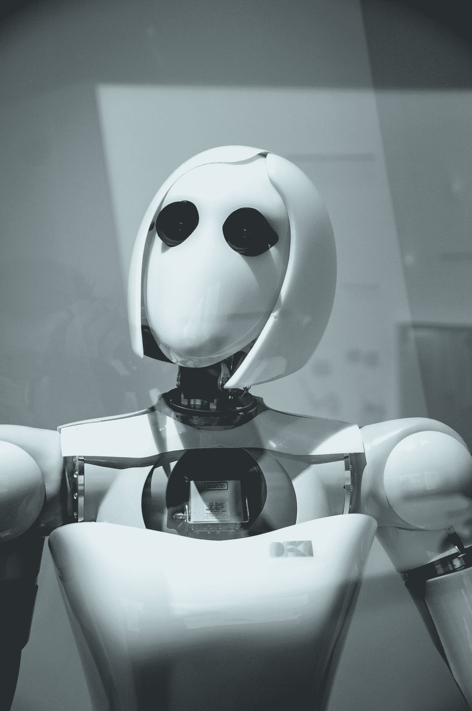

# 艾·温特:现实是怎样的？

> 原文：<https://medium.com/codex/ai-winter-what-was-the-reality-62c2df13c99d?source=collection_archive---------9----------------------->

在 [Unsplash](https://unsplash.com?utm_source=medium&utm_medium=referral) 上 [NeONBRAND](https://unsplash.com/@neonbrand?utm_source=medium&utm_medium=referral) 拍摄的照片

自诞生以来，人工智能已经成为几次 **AI Winters** 的受害者。

> 一个 AI 冬天，是人们减少对人工智能研究兴趣和资金的时期。

AI Winter 这个术语来源于核冬天的概念，在核冬天里，人们会经历核战争带来的气候影响。实际上，人工智能已经遇到了几次炒作，在这些炒作中，人们开始对人工智能进行思考，而这在当时是不可能的。

# 首届人工智能冬季赛

从今天开始，两个 AI 冬天过去了。第一次是在 20 世纪 70 年代，人工智能一词被创造出来十多年后。在该领域工作的科学家向人们承诺，超高效的人工智能将改变他们的生活方式。人们开始认为，很快，人工智能将使他们的日常生活自动化，到处都有智能机器在工作，但不幸的是，几十年来这些承诺都没有兑现。当科学家由于缺乏技术而无法实现这一目标时，人们开始降低对该领域的兴趣，最终投资者停止了投资。这是导致第一次 AI 寒冬的主要原因。

照片由[最大焦点](https://unsplash.com/@maximalfocus?utm_source=medium&utm_medium=referral)在[不飞溅](https://unsplash.com?utm_source=medium&utm_medium=referral)上拍摄

你能想象吗，科学家们承诺那些我们今天正在取得的人工智能成就？他们都是在 20 世纪 70 年代这么说的，当时创建软件的形式是基于规则的编程，在这种编程中，开发人员必须明确指定定义其行为的程序的所有规则。今天，这被称为“老式人工智能”或简称为“GOFAI”

幸运的是，随着专家系统的繁荣，人工智能在 20 世纪 80 年代再次出现。他们通过专注于解决特定领域的问题而不是一般问题，将人工智能引向了某种正确的方向。慢慢地，他们开始吸引公众的兴趣，人们再次开始为人工智能投资和筹集资金。

那个时候，就连科技公司也开始实施专家系统。日本在科技领域处于领先地位，人们受到了日本快速增长的科技领域的威胁。但不幸的是，专家系统也无法实现他们的承诺，并开始失败，导致日本经济崩溃，他们再也无法主宰科技行业。

# 第二届 AI 冬季

在 1984 年的、[和**中，人工智能的先驱和第一次人工智能冬天的幸存者马文·明斯基**警告了该领域的第二次萧条，仅仅三年后，随着市场上专家系统的崩溃，第二次人工智能冬天的迹象开始变得明显。](https://en.wikipedia.org/wiki/Marvin_Minsky)

在 20 世纪 90 年代，第二个人工智能冬天开始了，专家系统被认为是浪费金钱和时间。人们认为人工智能是浪费投资的同义词，这个领域似乎被永远埋葬了。

# 2000 年代末发生了什么？

随着**机器学习**和**深度学习**在该领域的进步，人工智能的新繁荣在 2000 年代末和 2010 年初引发。已经存在了几十年的神经网络的想法变成了现实。这一领域再次复活，并再次令人惊讶地吸引了人们的注意力，并在市场上大肆宣传。

人工智能复兴的唯一原因是我们今天拥有足够的数据和计算资源。大公司开始在他们的产品中实现神经网络的想法。人们开始为开源人工智能项目做出贡献，科学家开始对人工智能进行新的研究，人工智能再次获得了权力，但这一次不缺乏技术和数据。

随着**人工神经网络的发展，**我们可以轻松解决分类、回归、检测和预测问题。人们开始通过构建自己的项目对人工智能表现出极大的兴趣。像**特斯拉、苹果**和**谷歌**这样的公司开始在其工具中实现人工智能。

# **AI 要面临另一个 AI 冬天了吗？**

今天我们生活在最先进的时代。看看艾未未取得的成就，人们不能说艾未未是否会面临另一个冬天。今天，我们有更多的知识，更强大的技术，和更多的激情。人工智能可以让我们的未来超级自动化。

在这一领域还有很多工作要做。只有当人们和公司不断开发新工具，进行新研究，投资者不断投资该领域时，这种情况才会发生。我们将使这个世界自动化、智能化和机器人化的日子不远了。

关于艾冬，你有什么看法？

AI 会面临另一个冬天吗？

**别忘了喜欢、关注、分享，并在下面的评论区给出你的观点。**

**我会在下一个故事里遇见你。在那之前，再见！**