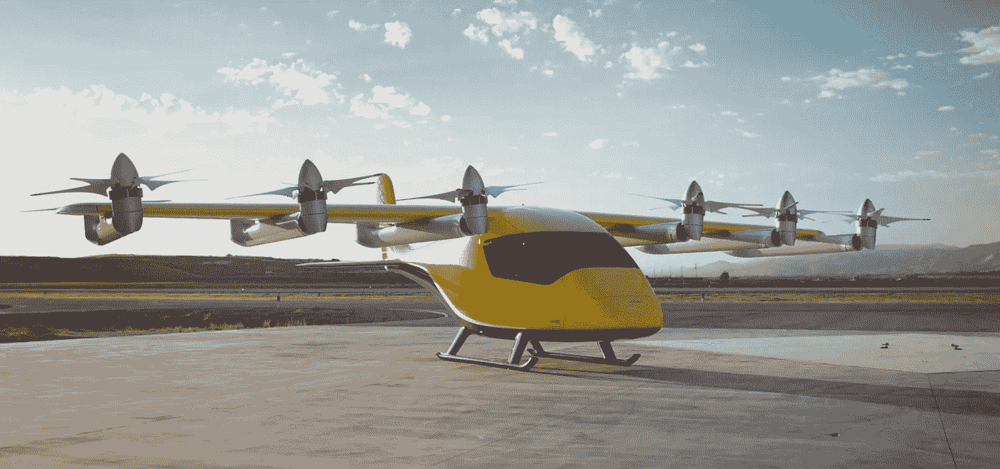

# 空中出租车初创公司 Wisk Aero 推出其乘客就绪型飞机

> 原文：<https://medium.com/codex/air-taxi-startup-wisk-aero-unveils-its-passenger-ready-aircraft-e96d38aef717?source=collection_archive---------1----------------------->

## 拥挤市场中的另一个入口

[第六代(Wisk 媒体)](https://youtu.be/RLmeMgXbF9Q)

在创造商业上可行的空中出租车服务的竞赛中，让我清楚地表明这是一场竞赛，波音支持的初创公司 [Wisk Aero](https://wisk.aero/) 展示了其最新的电动垂直起降(电动垂直起飞或着陆)飞机。Wisk 提供的这款全电动四座车是他们的第六款…