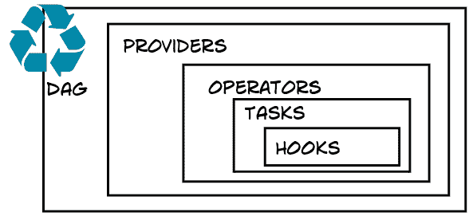
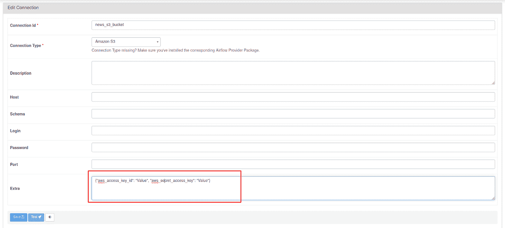

# Airflow 和 Cassandra:从 Airflow 向 Cassandra 数据库写入数据

> 原文：<https://medium.com/codex/airflow-and-cassandra-writing-data-to-cassandra-database-from-airflow-e3ea2b1874c0?source=collection_archive---------3----------------------->

## 通过 ETL 管道将数据插入 Apache Cassandra 数据库，以 Airflow 作为编排器


道格·基翁在 Unsplash 上拍摄的照片

在这篇文章中，我们将看看如何使用 Airflow 作为编排引擎将数据写入 Cassandra 数据库。我们将编写与实时公共数据 API 连接的 Airflow DAG，提取数据，并将数据保存到单节点 Cassandra 数据库中，还将数据保存到亚马逊 Web 服务(AWS) S3 存储桶中。我们将在气流上协调这条管道。

在这篇文章中，我们将简要介绍 Apache Airflow 及其架构，然后我们将使用 Docker 映像来设置 Apache Airflow。随着 Airflow 的启动和运行，我们将设计一个 Airflow DAG，它从免费的[media stack](https://mediastack.com/)live news REST API 中提取数据，然后将数据发送到 S3 桶，最后将直播新闻数据插入到 Cassandra 中。

如果您已经知道 Airflow 是如何工作的，那么在编写 Cassandra 数据库时，您可以直接进入 ETL 实现。随意从[这里](https://github.com/yTek01/example-cassandra-and-apache-airflow)获取这篇文章的实现代码。


要实现的 ETL 管道(图片由作者提供)

# 1.阿帕奇气流简介

Apache Airflow 是一个流行的工作流管理编排工具，任何具有 Python 技能的个人都将能够编写 Airflow DAGs，并开始使用编排工具解决问题。有趣的是，您可以引入现有的 Python 代码，并设计 Airflow 来帮助根据您的调度计划安排工作流。目前，在数据世界中有不同的工作流编排引擎可用，其中的一些例子是 Luigi、Argo 和 Prefect。

但是，如果您想要一个功能齐全、成熟的工具，那么您应该选择 Apache Airflow。气流绝对值得花时间。这篇博文的最终目标是从实时新闻数据中提取、处理这些数据，并将这些数据加载到 Apache Cassandra 数据库中。我们已经使用 Apache Airflow-Cassandra 提供程序将数据写入 Cassandra 数据库，在我们开始实现 ETL 管道之前，让我们快速了解一下 Airflow 的架构。

# 2.阿帕奇气流的架构

首先，我们将了解气流的架构，并设计一个单节点部署。这种类型的部署将在生产中按预期工作，直到您的业务增长。单节点架构意味着您的 Airflow 服务器、工作器、Airflow 调度器和元数据数据库等都位于同一台机器上。因此，我们必须确保为我们的部署分配足够的资源。在 Docker 容器上提供这个过程非常容易，这就是我们在博客中所做的。您也可以针对您的生产部署对此进行调整，但要确保您注意了安全性。非常重要的是，这篇博文的重点是写 Cassandra 数据库，所以我不会展示如何在分布式环境中设置气流。随着业务的增长，您需要将资源转移到分布式环境中，这意味着您需要为您的部署建立一个具有容错性、可伸缩性和高性能的分布式系统。


Apache Airflow 单节点架构(图片由作者提供)

# 3.实现 ETL 管道

介绍气流的核心概念及其重要组成部分。我们将使用 Docker 容器设置 Apache Airflow，幸运的是 Apache Airflow 是可定制的，我们将通过安装额外的 Python 包来扩展 Airflow 的功能。例如，Cassandra provider 没有标准的 Airflow 设置，因此在我们与 Cassandra 数据库通信之前，我们必须安装 Apache Cassandra provider，这是由 Airflow 社区[Apache-Airflow-providers-Apache-Cassandra](https://airflow.apache.org/docs/apache-airflow-providers-apache-cassandra/2.1.3/_api/airflow/providers/apache/cassandra/index.html)提供的。



气流 Dag、提供商、运营商、任务和挂钩关系(图片由作者提供)

大多数时候，我们通常需要定制我们的 Airflow 实例来适应我们的部署，所以我们将安装所需的 Python 库。

## **#1 使用 Docker** 安装气流

根据气流文档，出于在生产中部署的目的，建议我们使用 Docker 设置气流。在我们的例子中，我们将从 Github 获取最新的 airflow docker-compose.yaml 文件，然后我们将为这个的[添加更多的功能。以下是实现这一目标的步骤。](https://airflow.apache.org/docs/docker-stack/index.html)

**提取 docker-compose.yaml 并设置您的环境变量:**

如果您想坚持使用 Airflow 的特性，继续只使用安装包和提供程序，只需在您的终端上键入以下命令，然后按 enter 键。：

```
docker-compose up -d
```

在我们的例子中，我们需要用更多的包和定制来扩展 Airflow，所以我们将包含一个 docker 文件，并将 docker-compose.yaml 文件指向 airflow 映像名称，以向我们的部署添加额外的功能。在 docker-compose.yaml 文件中，将图像更改为“您的气流图像名称”，而不是$ { air flow _ IMAGE _ NAME:-Apache/air flow:2 . 2 . 5 }:

现在创建您的 docker 文件，并在 docker 文件中包含以下行。您可以在 Dockerfile 文件中添加您的文件依赖项，以及您希望包含在部署中的所有库。在我们的例子中，我们只包括了几个将在我们的工作流中使用的提供者。docker 文件看起来像下面的代码:

**构建映像，并使用下面的命令启动所有容器:**

**现在使用下面的命令启动并运行容器:**

## **#2 打造你的气流 DAG**

因此，在这个阶段，我们将实现我们的 DAG，我们将遵循我们在这篇文章的介绍部分显示的 ETL 管道。以下是我们实现这一目标的步骤:

## **步骤 1:从实时 API 数据中提取数据**

我们在本文中使用的 API 是[https://mediastack.com/](https://mediastack.com/)。新闻 API 包含关于世界各地正在发生的事情的最新信息。您可以按照本文档[https://mediastack.com/documentation](https://mediastack.com/documentation)设置一个帐户来访问 API。

## **第二步:将 JSON 数据发送到 S3 桶**

在 AWS 上创建您的 S3 时段，并确保为 S3 时段设置必要的安全组。此外，请确保您在 Airflow UI 上正确设置了 S3 连接。有了这个，我们就可以走了。气流 S3 连接配置如下所示:



气流 S3 连接配置(图片由作者提供)

帮助将数据发送到 S3 存储桶的代码如下所示:

## **第三步:定义任务的依赖关系**

在这个阶段，我们所有的任务都设置好了，我们现在可以定义我们希望任务如何运行的顺序。此外，我还附上了气流图的截图。


气流实施图表视图(图片由作者提供)

## **第四步:将数据插入 Cassandra**

在这里，我们将创建 Cassandra 数据库密钥空间，以及新闻直播数据表。我们使用的是单节点 Cassandra 数据库，Cassandra 数据库 docker YAML 文件在这里[可用](https://github.com/yTek01/example-cassandra-and-apache-airflow/blob/main/docker-compose.Cassandra.yaml)。

1.  进入 Cassandra 容器，创建您的密钥空间，并创建您的表:

2.在 Airflow UI 上设置与 Cassandra 的连接。在我们的例子中，我们使用了 localhost，但是请使用您的节点 IP 地址，并且在集群中有多个节点的情况下，您应该用“，”分隔 IP 地址。以下屏幕截图显示了 Airflow UI 上的连接配置:


阿帕奇卡桑德拉气流连接配置(图片由作者提供)

以下代码帮助我们连接到 Cassandra news 表，并将我们的数据插入数据库:

下面的截图显示了 Cassandra 数据库中的新闻数据:


Cassandra 数据库中插入数据的结果(图片由作者提供)

就这样，我们完成了一项出色的工作，从 REST API 中提取免费的实时新闻数据，转换并将数据写入 Cassandra 数据库。我们更进一步，将我们的数据上传到 AWS S3 桶。

# 结论

Apache Airflow 是一个强大的工具，允许您编排您的工作流，真正的 Airflow 正在杀死它。但是非常重要的是，确保 Apache Cassandra 数据库和 Apache Airflow 都运行在同一个网络上，或者它们可以相互通信。这一点非常重要。此外，请确保在气流 UI 中设置卡珊德拉和 S3 桶连接。有了这个，你就可以开始从 Airflow 开始写你的 Cassandra 数据库了。这篇文章的完整代码可以在[这里](https://github.com/yTek01/example-cassandra-and-apache-airflow)找到。

**参考文献**

[1] [阿帕奇气流—维基百科](https://en.wikipedia.org/wiki/Apache_Airflow)

[2][Apache air flow 的 Docker 图像— Apache Airflow](https://airflow.apache.org/docs/docker-stack/index.html)

[3] [开始使用 Apache Cassandra—Apache Cassandra](https://cassandra.apache.org/_/quickstart.html)

感谢您的阅读。我很乐意回答任何问题，并听取任何意见。另外，不要走开，因为我打算很快发布更多的 ETL 设计实践。