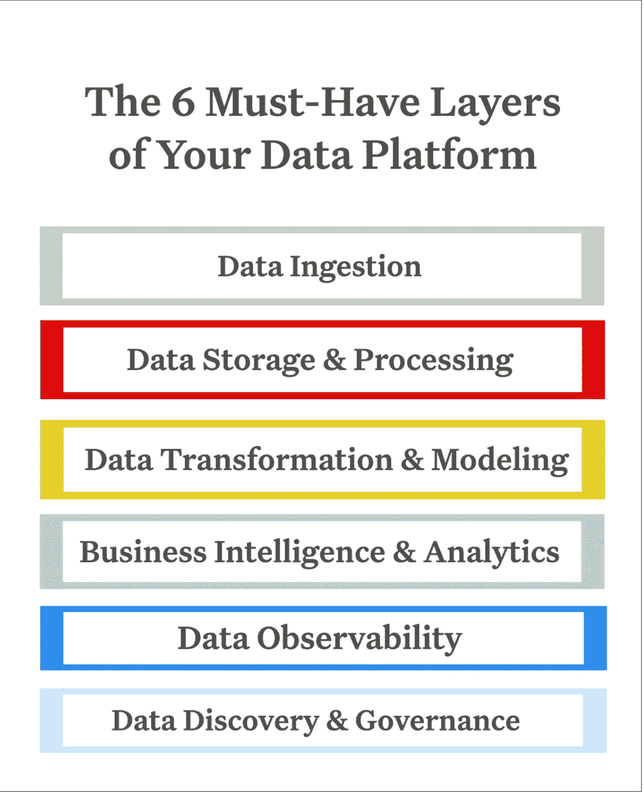

# 气流峰会第 1 天要点

> 原文：<https://medium.com/codex/airflow-summit-day-1-takeaways-d68b2ba72d4?source=collection_archive---------3----------------------->

大声喊出来蒙特卡洛的图像。这是我的新咒语

# 介绍

我参加了本周的气流峰会，并期望在周末发布一个总结博客，涵盖最重要的话题/要点。不过，在昨天参加完之后，我很快发现这种情况会持续很长时间。以下是我从第一天学到的最喜欢的课程。

# 数据可观察性

蒙特卡洛[演讲](https://www.crowdcast.io/e/airflowsummit2022/2)中关于建立像产品一样的数据平台的 Rose Barr 将继续参加本周我最喜欢的气流峰会演讲。讨论的主题包括数据可观察性，即全面了解系统中数据的健康和状态的能力，最终目标是减少数据停机时间。在某种程度上，它是数据质量的超集，主要关注以下方面:

*   新鲜
*   分配
*   卷
*   (计划或理论的)纲要
*   血统

蒙特卡洛也发布了他们的[书](https://www.montecarlodata.com/oreilly-data-quality-fundamentals-early-release/)中关于数据质量基础的一些章节，我推荐每个人都去看看。这通常是团队事后的想法，而不是一个基本的概念。

# 大规模气流

Shopify 组织了一次非常好的[讨论](https://www.crowdcast.io/e/airflowsummit2022/6)，讨论他们如何从端到端处理整个气流基础设施。他们为每个部分所做的所有测试给我留下了深刻的印象(Dag 的单元测试，操作的冒烟测试，以及整个基础设施的集成测试)。dag_policy 的概念是在加载时拒绝所有不符合特定规范的 dag，这在适当的代码审查之上实现了额外的防护。

Shopify 团队还创建了一个他们自己的博客[帖子](https://shopify.engineering/lessons-learned-apache-airflow-scale)，涵盖了其中的一些要点，绝对值得一读。对于组织中的大规模气流实施来说，这无疑是一个很好的模板，说明应该如何正确地实施。

# 数据谱系

在我关于数据工程未来的[帖子](/@matt_weingarten/the-future-of-data-engineering-1742e9629dad)中，有人指出我忽略了数据血统，我们需要更多地将数据视为服务/关键价值。是的，完全正确。天文学家团队组织了一场精彩的[演讲](https://www.crowdcast.io/e/airflowsummit2022/7)，讨论数据谱系到底是什么，现在如何实现，以及它的未来。他们还一致认为，随着时间的推移，数据谱系将变得更加集中。

# 结论

所有的气流峰会都很有价值。Ash 关于动态 DAGs 的[演讲](https://www.crowdcast.io/e/airflowsummit2022/1)非常有趣，动态 DAGs 是气流 2.3 最受欢迎的特性之一。来自不同公司的使用 Airflow 的演示也总是很有趣，因为有许多不同的方式来利用 Airflow，并且看到其他人如何涵盖大规模实施中可能出现的许多常见场景也很有趣。

如果你不参加气流峰会，我只能问为什么？考虑到它是免费的，你错过了一些非常有用的数据工程概念。我将继续回顾其他日子发生的事情，并在该说的都说了，该做的都做了之后分享我的笔记。快乐学习！