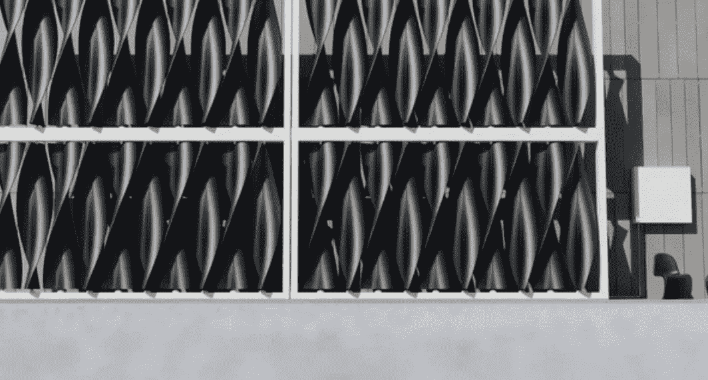

# Airiva:有目的的风力涡轮机墙

> 原文：<https://medium.com/codex/airiva-a-wind-turbine-wall-with-a-purpose-d505b9a39981?source=collection_archive---------8----------------------->

## 不仅仅是为了产生风能

[风力涡轮机墙(媒体由乔·杜塞特报道)](https://images.squarespace-cdn.com/content/v1/51ad0ab7e4b05aa5c1427e2c/1635503422731-CG9UWB3OQXS8KR4NS1YW/WIND_TURBINE_WALL-DOUCET-V6-STACK.gif?format=1500w)

我们都熟悉传统的风力涡轮机。它们经常出现在偏远地区光秃秃的山脊上或海岸附近，那里的风力一直很强。企业家 Joe Doucet 开发了一种令人难以置信的“风力涡轮机墙”,可以在城市环境中创造奇迹。