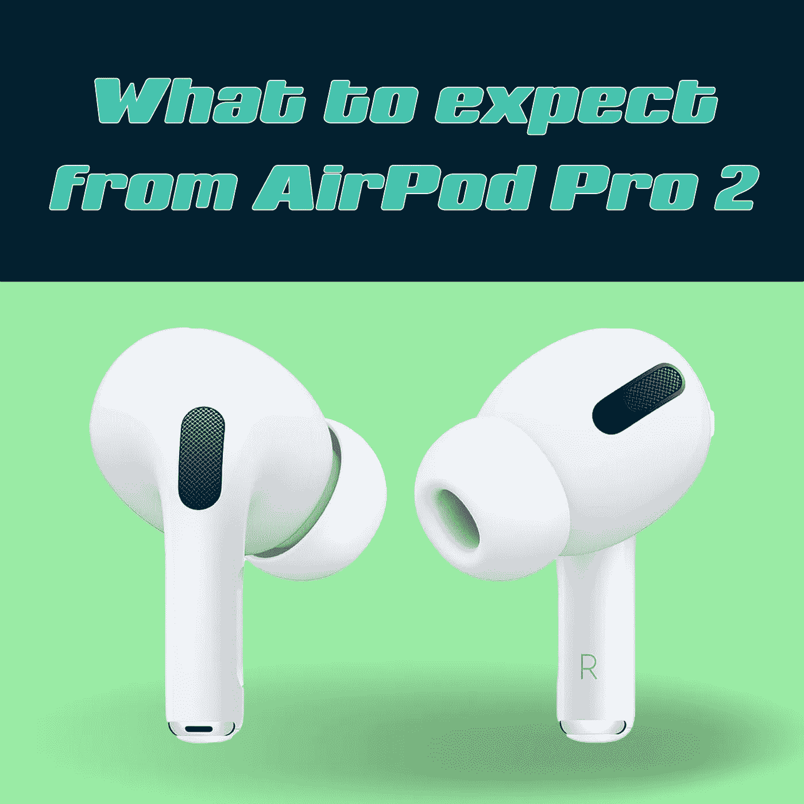
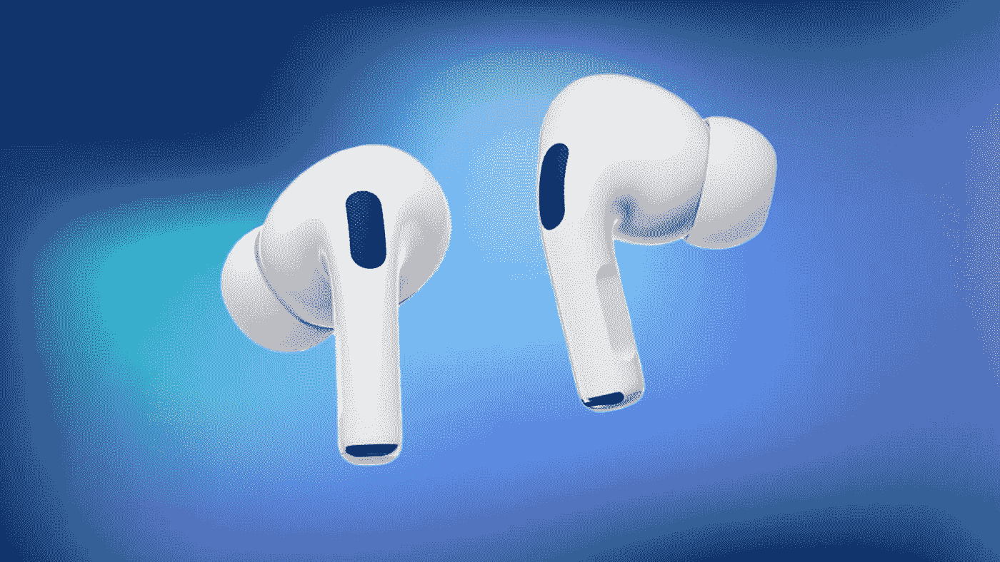
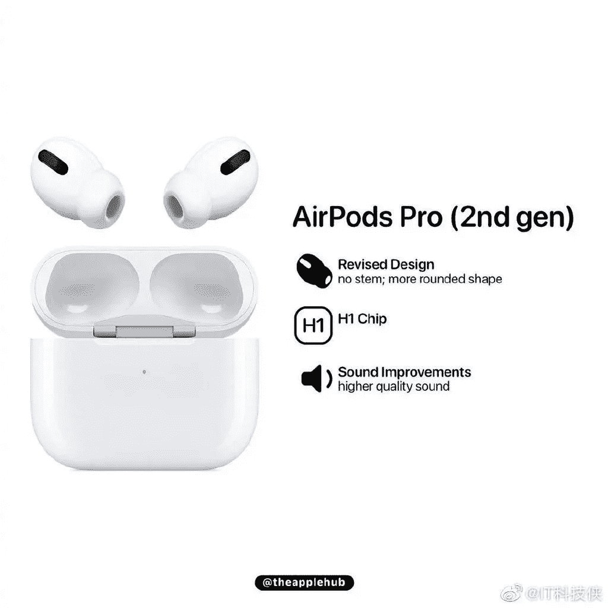
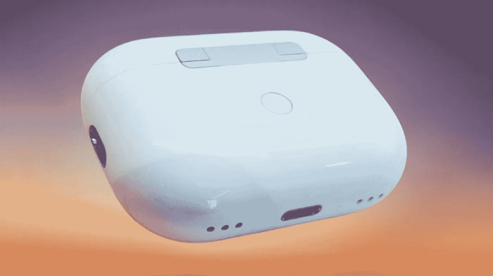
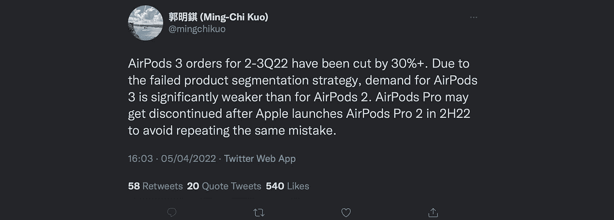

# AirPod Pro 2 来了

> 原文：<https://medium.com/codex/airpod-pro-2-are-coming-c93d56f371e2?source=collection_archive---------6----------------------->

## 我们能从他们那里期待什么？

下一代 AirPod Pro 将为我们带来什么？

你还记得那些美好的日子吗？我们过去常常在购买新的 iPhones 时获得一副免费的耳机。这似乎不是很久以前的事，但事实上，自从我们有了免费的耳机，已经有五年多了。当时，有正常的抱怨和呻吟，但和以往一样，我们接受了苹果给我们的东西，继续前进。不仅如此，正如我们即将发现的那样，它们已经成为苹果业务中非常重要的一部分。

 [## iPhone 14 泄露& CADS、有机发光二极管为 iPad 屏幕& WWDC 新闻

### 苹果视图综述

medium.com](/codex/iphone-14-leaks-cads-oled-screens-for-ipad-wwdc-news-5f05a6fc4ced) 

## 数字

苹果似乎永远是科技行业的巨人。成为第一家同时达到 1 万亿美元和 2 万亿美元市值里程碑的公司。该公司目前的市值超过了所有富时 100 指数成份股公司的总和。令人惊讶的事实是，*仅 AirPods* 现在就创造了 230.5 亿美元的收入！如果把 Twitter、Spotify ***和*** Square 的收入加在一起，AirPods 轻而易举地胜出！事实上，它甚至给了网飞一个非常好的机会。基于收入，仅苹果业务的 AirPod 方面*就价值惊人的 2400 亿美元。*

**

*优秀的，当前的 AirPod Pro*

## *这一切是从哪里开始的？*

*本质上，我们今天佩戴的 AirPods 与早期的有线 ai rpods 并没有什么不同。当然，一个主要的区别是 AirPods 是无线的，蓝牙耳机，由苹果公司设计。它们于 2016 年 9 月 7 日与 iPhone7 一起首次发布。它们迅速成为苹果最畅销、最受欢迎的配件。AirPods 现在是三种型号阵容中的入门级型号，包括 AirPod Pro ( *更多，稍后*)和 AirPod Max。2019 年见证了 AirPods 的第一次升级，第二代采用了 *H1* 芯片和更好的 *Siri* 集成。去年，我们对长期受欢迎的产品进行了另一项改进，现在有了更短的杆和 MagSafe 充电功能。*

* [## 我讨厌正确！

### 让我们把六月的 WWDC 看得更远一点

medium.com](/codex/i-hate-being-right-49073d66cb)* **

*AirPod Pro 2 看起来可能会非常不同*

## *赞成者*

*2019 年推出的 *H1 芯片*、*主动降噪* (ANC)和*透明模式*立即获得成功。对标准 AirPods 的改进使其成为一个有价值的交易。许多第一代，甚至第二代和第三代 AirPods 的所有者认为额外的功能值得花费。最新的改进包括*自适应均衡器*和*空间音频*。因此，随着 AirPod Pro 仍然吸引着良好的销售，该公司决定进行翻新和翻新。与去年不同，随着第二代和第三代 AirPods 并列销售，当 AirPod Pro 2 在今年晚些时候上市时，它们将是唯一可用的*版本。我们怀疑新的 [AirPod Pros](https://www.apple.com/uk/airpods-pro/) 会为我们带来什么？这就是我要调查的。**

**

*来源 [@theapplehub](http://twitter.com/theapplehub)*

## *新型设计*

*当然，AirPod Pro 很容易从基本型号中识别出来，因为它的杆要小得多。根据彭博的说法，新的版本可能会更紧凑，可能根本没有阀杆。苹果正在测试一个更圆、更像 bud 的设计，可能会让人想起 Google Pixel Buds(T21)。也就是说，要实现理想的设计绝非易事，事实证明这是一项挑战。提供给 MAC rumors 的最近泄露的图像清楚地显示出茎仍然在原处。*

**

*谷歌像素芽*

## *改进的音频*

*苹果泄密者[郭明志](https://twitter.com/mingchikuo)认为 AirPod Pro 2 将采用无损音频。然而，没有人完全确定他们将如何实现这一目标。AirPods 通过蓝牙播放音乐。目前，蓝牙仅限于 AAC 编解码器。简单来说，没有足够的数据可以通过蓝牙推送，以提供无损音频。不过，该公司似乎正在研究一个解决方案，这样苹果无损音频文件就可以被流式传输，以某种方式绕过现有的蓝牙技术。*

**

*苹果 AirPod Pro 2 与更好地找到我的集成*

## *找到我的*

*AirPod 最大的一个问题也是他们的实力。*他们很小*。这使得它们超级便携、轻便、使用舒适，但也很容易放错地方。我们可以预计下一代将会有更好的【T2 找到我的集成，这允许他们发出声音，所以在今年晚些时候找到丢失的 AirPods 应该会变得更容易一些。最近泄露的图片也印证了这个想法。这种情况下似乎有扬声器孔，我们认为，这是为*找到我的*功能。这种情况下，似乎也有空间，你可以附加一个挂绳。*为什么你会想，这是一个完全不同的问题！**

## *其他亮点*

*对苹果来说，健身已经变得非常重要，因此，预计今年秋天 AirPod Pro 2 将进一步整合健身功能，这似乎是合乎逻辑的。可以通过内置的运动传感器添加某种健身跟踪。当然，除此之外，它们还将拥有所有当前可用的功能，如*空间音频*、 *ANC* 和*透明模式*，以及改进的设备切换和更快的设备配对。*

**

*郭明志*

## *发布时间表*

*还不确定，但是小郭暗示今年下半年。9 月或 10 月的事件似乎是展示这些的自然事件，随后会立即发布。同样，价格也有待确认。*

*减去 16 播客嘉宾特拉维斯 MCP*

## *他们值得吗？*

*我的时机不能再糟糕了，但我在上个月刚刚升级到 AirPod Pro。如果你还在使用基本型号的 AirPods，那么相信我，改进的音频和功能使花费非常值得。也就是说，如果我还有时间，我可能会多等几个月。所以，现在，我建议用你目前的 AirPods 凑合着用，并在今年秋天期待 AirPod Pro 2。*

**你是 AirPod 佩戴者吗？AirPod Pro 2 有哪些看点？**

## *在你走之前*

*我只是高端博客网站 Medium 的众多作者之一。这是如此好的价值，你可以在这里加入[https://medium.com/membership](https://medium.com/membership)*

*加入我的幕后邮件列表[https://www.talkingtechandaudio.com](https://www.talkingtechandaudio.com)*

**原载于 2022 年 4 月 11 日*[*https://www.talkingtechandaudio.com/blog*](https://www.talkingtechandaudio.com/blog)*。**