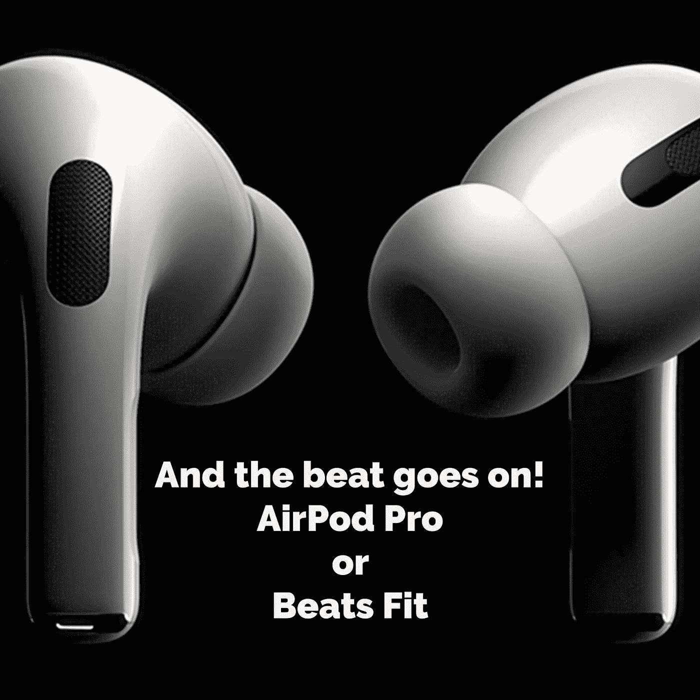
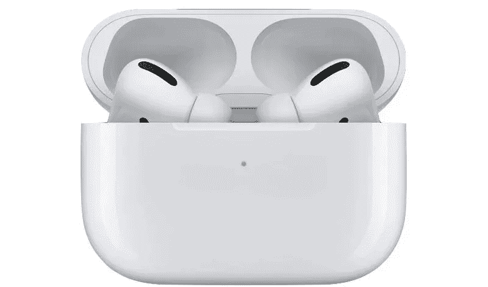
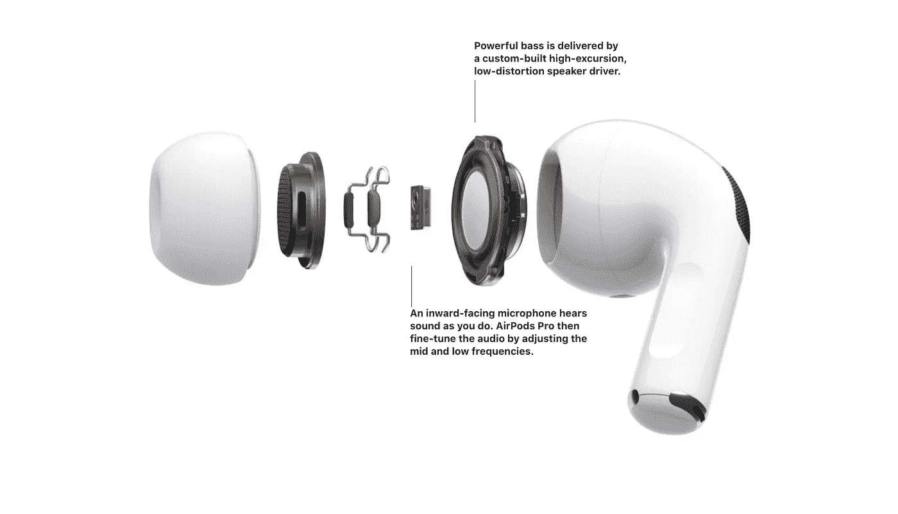
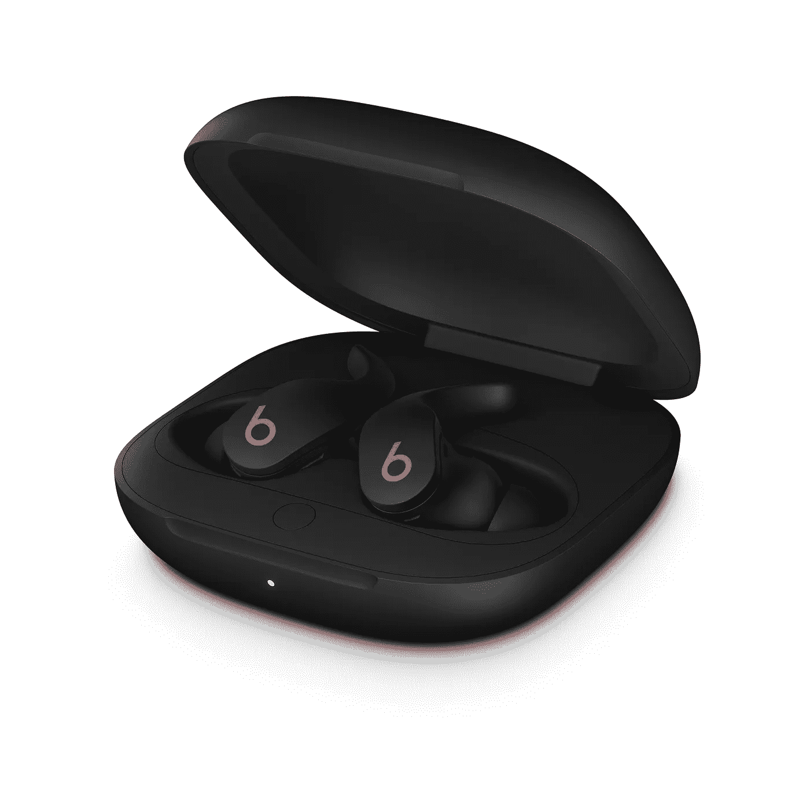
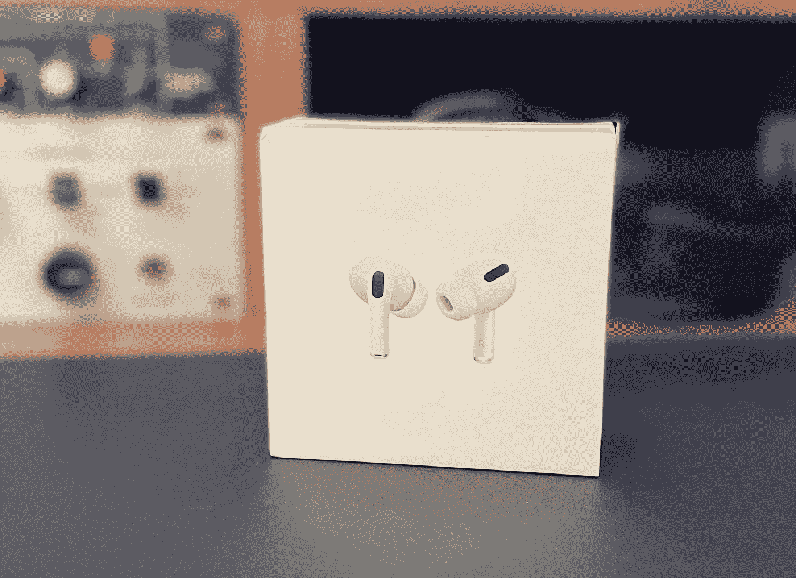

# AirPods Pro vs Beats Fit

> 原文：<https://medium.com/codex/airpods-pro-vs-beats-fit-88a994d27634?source=collection_archive---------14----------------------->

## 我刚买了一双 AirPods Pro。我做了正确的选择吗？

AirPod Pro 还是 Beats Fit？

在过去的两年里，我使用了一对 AirPods。我实际上是在给我女儿买 MacBook Air 的时候路过的。它们是免费的，是大学捆绑包的一部分。她已经有一双了，所以，这是我在正确的时间出现在正确的地方(*仅此一次！*)。从那以后，即使我的录音室里放着大量的耳机，它们仍然是我的首选，几乎每天都是。方便、小巧且设计合理，让它们很容易拿取。

***升级到 AirPods Pro 后，我希望得到什么，有没有我应该考虑的其他选择？***

 [## 我们看到了最后一台大型 iMac 了吗？

### 这些伟大的机器现在已经成为历史了吗？

medium.com](/codex/have-we-seen-the-last-of-the-big-imacs-5d63bb4bf839) 

## AirPods 的转变

AirPods Pro 和外壳

所以，正如我刚才所说，我将在今天晚些时候从我两年前的第一代 AirPods 升级到最新版本的 AirPod Pro。我即将经历的事情有很多方面让我着迷。如果你看过我在 YouTube 上的一些内容，你就会知道我是一个耳机迷。多年来，我一直戴着录音室耳机进行广播工作和音频编辑。显然，这些经历是非常不同的。对于这些类型的耳机，良好的情商、长期舒适性和声场至关重要。在录音棚环境中，你会了解你的耳机。我知道这听起来很愚蠢，但是你几乎和他们建立了关系。

在转向黑暗面，并定期佩戴 AirPods 的过程中，我需要调整并重新评估我对它们的期望。首先，我可以证明，在苹果的生态系统中意味着 AirPods 是一种享受。有时，实际上，几乎*太*好。配对后，它们会寻找你附近的苹果设备，无论是 Mac、iPad 还是 iPhone，然后无缝配对。我碰巧足够幸运，大部分时间身边都有三四个设备，我必须承认，AirPods 确实发现自己变得非常困惑。理论上，他们应该寻找任何有现场音频播放的设备，并把它捡起来。我发现，有时他们会试图搜索一台没有播放任何内容的 Mac 电脑，或者关掉我正在听内容的设备。这种情况并不经常发生，但经常会令人痛苦，所以我关闭了*自动配对*功能。除此之外，所有的经历都是积极的。

入耳式耳机对我来说一点也不重要，因为它非常合身和舒适。我的耳朵必须针对 AirPods 进行优化，因为我从未遇到过任何不合适的问题，或者像许多人报告的那样从耳朵上掉下来。情商听起来还算中性，在消费级耳机上比较合我意。我并不热衷于在如此小的耳机上播放过均衡的低音，高音也很舒服。我听了大量的口语播客，它们传递出均衡、平淡的声音，使得对话易于理解。所以，AirPods 的体验到目前为止对我来说是完美的。但是，我对这些新的职业选手有什么期望呢？

 [## 它已经准备好了——苹果的全新外部显示器

### 甚至有可能在本周宣布！

medium.com](/codex/and-it-could-even-be-announced-this-week-fb801693a773) 

## AirPod Pro 的和我所期待的

AirPod Pro 上的降噪功能

排名第一的是*主动噪音消除*，苹果称之为*“身临其境的体验”*。我以前学校的音频主管告诉我，通过入耳式 AirPods 消除噪音肯定是一个很大的要求，但是，我已经听到足够的积极反馈，我准备给它一个公平的审判。我想，部分效果是因为 AirPod Pro 配备了三种不同的硅耳塞，从而提供了更紧密、更安全的贴合。我相信这会有帮助的。显然，根据苹果公司的说法，*它们不断适应你耳朵的几何形状。*然后，通过面朝外的麦克风，AirPods 可以检测外部声音，并通过抗噪声功能进行抵消，在您听到外部不需要的声音之前就将其消除。似乎这还不够，一个面向内的麦克风在你的耳朵里听任何不想要的声音，并处理它。

此外，AirPod Pro 还有一个叫做 *Adaptive EQ* 的东西，这是我很高兴听到的另一种音频体验。希望以我的背景，我的耳朵能听出这些细微的差别。我知道这些最新版本的 AirPod，有 H1 芯片，还有*空间音频*，这也是我从未体验过的。事实上，他们是抗汗的是一个额外的奖励。我目前使用的这副眼镜的电池寿命从来都不是问题，所以我认为没有问题。

 [## 苹果工作室是个东西！

### 苹果再次做到了这一点，并一直致力于一个全新的品牌线的 Mac Pro

medium.com](/codex/apple-studio-is-a-thing-82848e4db458) 

## 为什么不是 Beats？

Beats Fit Pro

当我知道自己想买一副新的入耳式降噪耳塞时，我确实考虑过更换品牌，走 Beats 路线。它们也带有可互换的齿尖，并且可以消除噪音。他们有相同的 H1 芯片，我知道我有偏见，但我更喜欢苹果的设计。我并不热衷于 Beats 的无茎外观，我过去使用 Beats 的经验是，它们感觉不那么好。我担心他们不会毫不费力地融入我的苹果工作流程。我想我也会更喜欢 AirPods 的用户界面。

不过，最重要的是，Beats 标志性的声音让我反感。我以前听过 Beats，它们似乎总是带有非常重的低音情商。我了解他们所针对的市场，也明白为什么他们制造了具有这种声音特征的产品，但它不适合我。当我发现我的听力变得越来越口语化时，我想要一副能反映这一点的耳塞。在对话中，重低音是一种混乱、杂乱、不舒服的体验。

## 结束的

我的 AirPods Pro 来得正是时候

所以，当我写这篇文章的时候，我仍然急切地从工作室的窗户往外看，看着追踪记录，看看我的包裹是否已经到达。我很激动，我不会否认。在过去的两年里，我对我的两个孩子非常满意，迁移到他们的哥哥那里应该是一个很大的进步。想到所有的用户体验，我最期待的是 ACN(主动降噪)功能。你可以打赌，今晚晚些时候我会尝试一下。我会在以后的博客中让你知道我对它们的看法，以及它们是否得到了我的认可。

我仍然认为这次购买是一次便宜的脱身之计。我差一点就拿到 AirPods Max 了，你不会相信的！幸运的是，理智占了上风。我有很多供室内或录音室使用的耳机，价格几乎是专业人士的两倍，这真的很难证明是合理的。还有，我不知道我是否有资格在公共场合穿这些衣服！

***你拥有哪些 AirPods？你对 AirPod Pro 满意吗？一定要让我知道。***

**PS——他们刚刚到达！**

## ***出发前***

我只是高端博客网站 Medium 的众多作者之一。这是如此好的价值，你可以加入这里[https://medium.com/membership](https://medium.com/membership)

***加入我的幕后邮件列表***([https://www.talkingtechandaudio.com](https://www.talkingtechandaudio.com))

最初发表于 2022 年 3 月 30 日[(https://www.talkingtechandaudio.com/blog)](https://www.talkingtechandaudio.com/blog)。