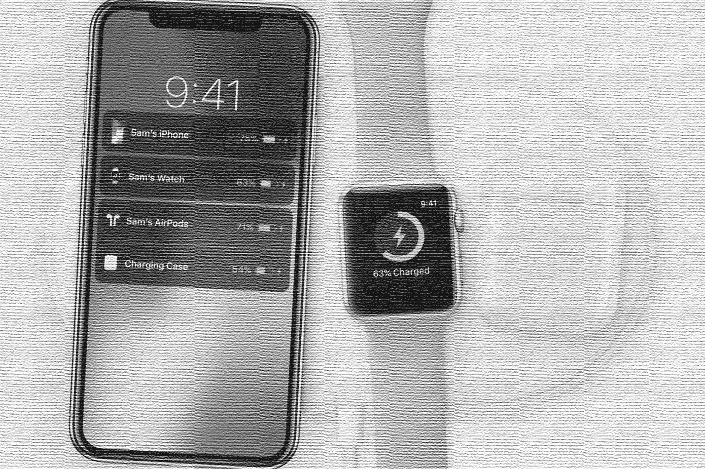

# 空中力量是一个雄心勃勃的项目，展示了技术不会走哪条路

> 原文：<https://medium.com/codex/airpower-is-the-ambitious-project-that-showed-which-way-technology-wont-go-cdc2b8306713?source=collection_archive---------3----------------------->

## 一扇通向过去的窗户。自从引进空中力量以来，已经过去了将近 5 年。为什么充电器不会如此受欢迎？

图片由作者提供

苹果有一个美好的愿景——无线世界。它始于 2015 年的无线充电苹果手表，并延续到…